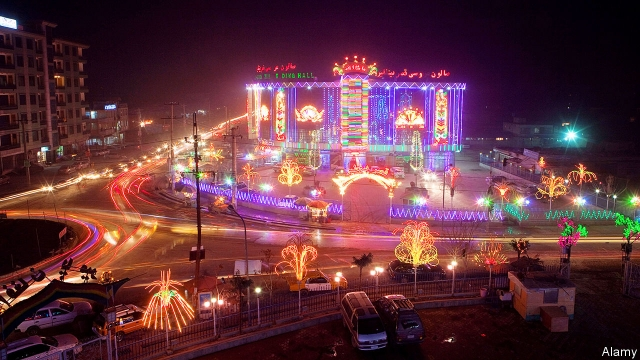

###### Hall change

# The sad decline of spectacular Afghan weddings 

 

> print-edition iconPrint edition | Asia | Jul 20th 2019 

THE ISTEQLAL wedding hall in Kabul, Afghanistan’s mountain-fringed capital, is quite a sight, at least at night. The red hangar-like structure is lit up by thousands of multi-coloured lights, which make the building glow like a casino. Inside, chandeliers and silk drapes hang from the ceiling, which is lit with blue and pink lights. The floors are all marble. 

Such opulence is necessary if you want people to get married in your hall, explains Ahmad Fawal Sharifi, the manager, from behind a thick wooden desk on which sits a large green globe. “The most important thing is the looks and the lights,” he says. After that comes the size of the car park. Isteqlal’s can hold 5,000 cars. Inside, there is space for 8,000 guests, with enough separate chambers to conduct five simultaneous weddings, each with segregated sections for men and women. 

Kabul has dozens of wedding halls, mainly clustered along the road from the airport. Most have a similar style to the Isteqlal. In addition to dramatic lighting, plastic-clad turrets and tree-shaped fountains are popular. Some American soldiers, only seeing the road from helicopters, have been known to compare it to the Las Vegas Strip, though Elvis is unlikely to officiate at an Afghan wedding. From April to September the halls host weddings every day. 

Wedding halls in Afghanistan date back at least a century, but the modern neon-and-crystal sort is a recent invention: before 2001 the puritanical Taliban regime banned such excess. The business boomed under Hamid Karzai, Afghanistan’s president from 2004 to 2014. But as the number of NATO troops in the country has fallen from 130,000 to 17,000 in recent years, the amount of money sloshing around has plunged, since fewer troops need fewer kebabs, laundry services and supply roads. Cash-strapped Afghans are now cutting back on ostentatious weddings. 

“When we opened, we enjoyed great business,” says Mr Sharifi. But now it is not always as easy to fill up every hall. And costs, like the lights, remain undimmed. Running generators can burn over 1,000 litres of diesel a night. Hundreds of staff are involved: not just caterers and musicians, but dozens of armed security guards, since wedding halls are vulnerable to attacks by jihadis. In November a suicide-bomber killed 50 people at a gathering of clerics hosted at a wedding hall. That does rather put people off, admits Ahmad Azimie, the manager of the Arg wedding hall. 

A typical ceremony, with perhaps 1,000 guests, plentiful food and at least two cans of Red Bull per person, might set a groom’s family back $9,000, in a country where annual GDP per person is around $520. Many Afghans complain about being asked to defray distant relatives’ wedding costs. Grooms’ families complain about being expected to host thousands of guests. Many families are taking on debt. “It is sad for me, but as a businessman, this is where my profits come from,” says Mr Sharifi. 

Competition is fierce for the remaining customers. Many are from the diaspora. At the Arg, Azhar, a young Afghan-Canadian who drives forklift trucks for a living halfway around the world, is examining halls with his mother. At his wedding, he insists, “Everything must be perfect. I don’t care about money, I am looking to my future.” Such bravura—and deep pockets—are in dwindling supply.■ 
<<<<<<< HEAD

-- 

 单词注释:

1.spectacular[spek'tækjulә]:a. 公开展示的, 惊人的, 壮观的 n. 奇观, 惊人之举, 展览物 

2.Afghan['æfgæn]:a. 阿富汗的, 阿富汗人的 n. 阿富汗人, 阿富汗语, 阿富汗毛毯 

3.Jul[]:七月 

4.Kabul['kɑ:bәl]:n. 喀布尔(阿富汗首都) 

5.casino[kә'si:nәu]:n. 卡西诺赌场, 卡西诺牌戏 

6.chandelier[,ʃændi'liә]:n. 枝形吊灯 

7.drape[dreip]:n. 布帘, 褶皱 vt. 用布帘覆盖, 披上 vi. 成褶皱状 

8.opulence['ɒpjulәns]:n. 富裕, 丰富, 大量 

9.ahmad[]:n. 阿哈默德（穆罕默德在《古兰经》中的名称） 

10.sharifi[]:[网络] 沙里菲；谢瑞法 

11.simultaneous[.simәl'teinjәs]:a. 同时的, 同时发生的 [计] 同时的 

12.segregate['segrigeit]:a. 分离的, 被隔离的 vi. 分离, 隔离, 分凝 vt. 使分离, 使隔离 

13.cluster['klʌstә]:n. 串, 丛, 群, 簇 vi. 成串, 丛生 vt. 使聚集 [计] 簇 

14.turret['tʌrit]:n. 塔楼, 角楼, 攻城用仰冲车 [机] 转塔, 多角刀架 

15.La[lɔ:, lɑ:]:[医] 镧(57号元素) 

16.vega['vi:^ә]:n. [天]织女星 

17.elvis[]:n. 埃尔维斯（男子名） 

18.officiate[ә'fiʃieit]:vt. 执行, 司仪, 担任(体育比赛)裁判 vi. 主持宗教仪式, 行使职务 

19.Afghanistan[æf'gænistæn]:n. 阿富汗 

20.puritanical[,pjuәri'tænikәl]:a. 清教徒的, 清教主义的, 宗教上极端拘谨的, 道德上极端拘谨的 

21.Taliban[]:塔利班 

22.regime[rei'ʒi:m]:n. 政权, 当权期间, 政体, 社会制度, 体制, 情态 [医] 制度, 生活制度 

23.Hamid[]:n. 哈米德（人名） 

24.Karzai[]:卡尔扎伊（人名） 

25.NATO['neitәj]:北大西洋公约组织, 北约组织 [经] 北大西洋公约组织 

26.slosh[slɒʃ]:n. 泥泞, 溅泼声 v. 走泥泞路, 液体晃动, 溅, 泼 

27.kebab[kә'bɑ:b]:n. 烤肉串配蔬菜 

28.Afghan['æfgæn]:a. 阿富汗的, 阿富汗人的 n. 阿富汗人, 阿富汗语, 阿富汗毛毯 

29.ostentatious[.ɒsten'teiʃәs]:a. 装饰表面的, 铺张的, 夸示的, 华美的, 显眼的 

30.alway['ɔ:lwei]:adv. 永远；总是（等于always） 

31.undimmed[,ʌn'dimd]:a. 不暗淡的,不模糊的,清楚的,明亮的 

32.diesel['di:zәl]:n. 内燃机, 柴油机, 柴油 

33.caterer['keitәrә]:n. 备办食物者, 备办宴席者 

34.vulnerable['vʌlnәrәbl]:a. 易受伤害的, 有弱点的, 易受影响的, 脆弱的, 成局的 [医] 易损的 

35.jihadi[]: 圣战分子;  圣战的; 跟圣战有关的 

36.cleric['klerik]:a. 牧师的, 教士的 

37.Arg[]:[化] 精氨酸 [医] 银(47号元素) 

38.defray[di'frei]:vt. 支付, 支出 [经] 支付或准备支付 

39.Diaspora[dai'æspәrә]:n. 犹太人的离散, 离散的犹太人 

40.azhar[]:n. (Azhar)人名；(阿拉伯、巴基)爱资哈尔 

41.forklift['fɔ:klift]:n. 铲车, 叉式升降机 

42.halfway['hɑ:f'wei]:a. 中途的, 不彻底的, 部分的 adv. 半路地, 在中途, 在半途 

43.dwindle['dwindl]:vi. 减少, 缩小, 衰落 vt. 使缩小 
=======
>>>>>>> 50f1fbac684ef65c788c2c3b1cb359dd2a904378

