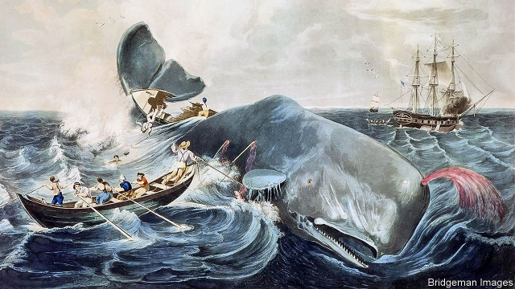
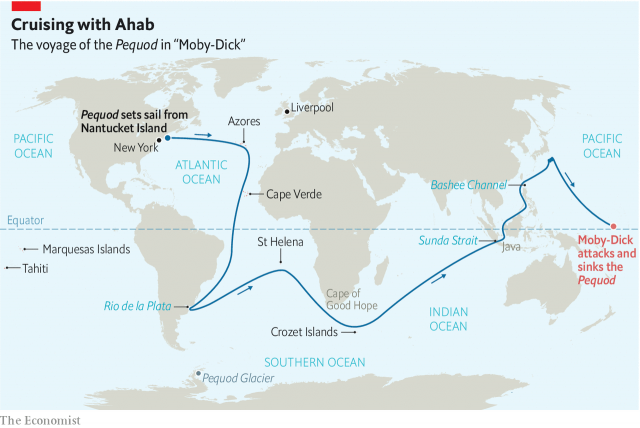

###### Call him Ishmael

# Born 200 years ago, Herman Melville was globalisation’s first great bard 

 

> print-edition iconPrint edition | Books and arts | Jul 20th 2019 

STRIKING MATCHES on their rope-roughened palms, the burly whalers who chase Moby Dick seem unlikely avatars for modernity. But in an important, even prophetic way, that is what they are. The crew of the Pequod are a wondrous deputation “from all the isles of the sea, and all the ends of the earth”. Sailors of at least 13 nationalities are “federated along one keel” with Captain Ahab: Chinese and Tahitian, Icelandic and Portuguese. Their creator, Herman Melville—who was born 200 years ago, on August 1st 1819—was the first great writer of the age of globalisation. 

The 19th century witnessed an unprecedented international circulation of people, goods and ideas. Sailors were at the forefront of this exchange, crossing and re-crossing oceans in a “devious zig-zag world-circle”, as Melville put it, constantly exposed to exotic lands and strange customs. A shortage of manpower and the dangers of the sea meant captains often cared little who shipped with them, provided they were able mariners. This was a cosmopolitanism of necessity rather than ideology, a grassroots phenomenon largely overlooked by contemporary authors. 

But not by Melville. As a Jack-Tar of 19, he sailed the New York-to-Liverpool circuit in 1839, an experience he recalled ten years later in his novel “Redburn”. He saw the awful conditions endured by Irish immigrants below decks and the hostility they encountered upon arrival in America. “If they can get here,” Melville thought, “they have God’s right to come.” The docking of an Indian vessel in Liverpool was an opportunity to swap stories with a Lascar sailor. “It is a God-send to fall in with a fellow like this,” Melville later wrote. “His experiences are like a man from the moon—wholly strange, a new revelation.” 

He took his education on the ground—and on the water—having been withdrawn from formal schooling at 12 on the death of his bankrupt father. In January 1841 he shipped from New Bedford as a whaler; over the next four years he was briefly imprisoned in Tahiti for taking part in a mutiny and hitched across the Pacific. He worked as a farmhand and as a pin-setter in a Hawaiian bowling alley. This journey, too, became material for his stories. 

 

In them, rigid land-based axioms give way to social and moral fluidity. In the “watery part of the world”, categories of class, nation and race dissolve; the company includes “renegades, and castaways, and cannibals”. In “Moby Dick”, the masterpiece Melville published in 1851, Queequeg, an expert harpooner (and reputed man-eater) from the South Seas, earns more than Ishmael, the inexperienced white narrator. In his early book “Omoo” (1847), a workhouse foundling becomes a Pacific warlord. The late novella “Billy Budd” mentions African-Americans fighting under the British flag at the Battle of Trafalgar. 

Travel led Melville to question the concepts of “savagery” and “civilisation”. “I call a savage a something highly desirable to be civilised off the face of the earth,” said his more parochial contemporary, Charles Dickens. For his part, Melville jumped ship at Nuku Hiva, in the Marquesas Islands, and spent a month with a tribe untouched by Western influence. That led to the radical defence of cannibalism in “Typee” (1846), his first book, as a form of justice no more barbaric than Britain’s erstwhile habit of displaying hung, drawn and quartered bodies. 

Since everyone saw the world through the prism of their own culture, Melville believed, no society could claim moral superiority over another. In “White-Jacket” (1850), a Polynesian aboard an American frigate bound for New England has never before ventured beyond his home. “His tastes were our abominations: ours his,” the narrator observes. “Our creed he rejected: his we.” The upshot is that “neither was wrong, but both right.” In lectures the author gave about his experiences, he advocated travel as a way to dispel bigotry. The racist, he said, “finds several hundred millions of people of all shades of colour…And learns to give up his foolish prejudice.” 

If differences are respected in Melville’s globalised world, commonalities emerge, too. Sailors learn each other’s languages and develop hybrid dialects. In moments of leisure, the crew of the Pequod lie in the forecastle swapping tales of women and wandering, singing shanties and dancing jigs. Prejudice and nationalism are too ingrained to vanish entirely; but, through mutual dependence on the high seas, interracial bonds are forged. “You sink your clan; down goes your nation; you speak a world’s language, jovially jabbering in the Lingua-Franca of the forecastle.” 

After “Moby Dick”, a succession of Melville’s novels failed. Many contemporaries were surprised to learn he had died in 1891: they assumed he was dead already. But since its rediscovery in the early 20th century, the tale of Ahab’s hubristic vendetta against the whale has become an all-purpose political fable. In the 1950s C.L.R. James, a Trinidadian writer, described the book as “the biography of the last days of Adolf Hitler.” It has been deployed to decry the Vietnam war, George W. Bush’s crusade against the “axis of evil”, Osama bin Laden’s jihad against the West, Vladimir Putin’s hatred of NATO, Donald Trump’s pursuit of a border wall and Theresa May’s quest for a Brexit withdrawal agreement. 

Today the white whale spouts across the globe. In Arabic the famous first line is “Call me Isma’il”; in Japanese it is “Call me Ishumeeru”. Melville’s leviathan has become a mirror for preoccupations everywhere. Iranian scholars debate the book’s Zoroastrian and Islamic elements; Melville, some argue, believed fate trumped morality as the ancient Sasanians did. During the Cultural Revolution Chinese pedagogues claimed Melville was a rare anti-capitalist American author. Germans note the influence of Goethe; Japanese academics think Ahab’s harpooner, the mysterious Fedallah, is one of their own. On the Antarctic Peninsula, meanwhile, huddle Mount Ahab, Tashtego Point and a glacier named Pequod. Two centuries after his birth, Melville continues to federate the world along one keel. ■ 

