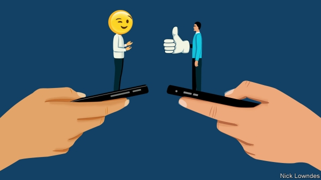

###### Johnson

# The internet is changing language less than curmudgeons fear 

 

> print-edition iconPrint edition | Books and arts | Jul 20th 2019 

WHAT IS TECHNOLOGY doing to language? Many assume the answer is simple: ruining it. Kids can no longer write except in text-speak. Grammar is going to the dogs. The ability to compose thoughts longer than a tweet is waning. 

Language experts tend to resist that gloom, noting that there is little proof that speech is really degenerating: kids may say “LOL” out loud sometimes, but this is a marginal phenomenon. Nor is formal writing falling apart. Sentences like “OMG WTF William teh Conqueror pwned Harold at Hastings in 1066!” tend to be written by middle-aged columnists trying to imitate children’s supposed habits. A study by Cambridge Assessment, a British exam-setter, found almost no evidence for text-speak in students’ writing. 

Fortunately, the story of language and the internet has attracted more serious analysts, too. Now Gretchen McCulloch, a prolific language blogger and journalist—and herself of the generation that grew up with the internet—joins them with a new book, “Because Internet”. Rather than obsessing about what the internet is doing to language, it largely focuses on what can be learned about language from the internet. Biologists grow bacteria in a Petri dish partly because of those organisms’ short lifespans: they are born and reproduce so quickly that studies over many generations can be done in a reasonably short period. Studying language online is a bit like that: trends appear and disappear, platforms rise and fall, and these let linguists observe dynamics that would otherwise take too much time. 

For example, why do languages change? A thousand years ago, early versions of English and Icelandic were closely related, possibly even mutually intelligible. English has since evolved hugely, and Icelandic, far less. Linguists have studied the relative effects of strong ties (friends, family) and weaker acquaintanceships in such patterns, hypothesising that small communities would host more stable languages. A computer simulation proved that a mix of strong and weak ties—close-knit groups existing in a larger sea—allowed language-change “leaders” to disseminate updates to the wider population. Twitter combines strong and weak ties—and sure enough, drives more language change than Facebook, which is more dominated by strong ties. That, in turn, helps explain the conservatism of Icelandic (more like Facebook) and the mutability of English (more like Twitter). 

Emoji, odd as they may look, also reflect something universal. They are not a language (try telling a complex story in emoji to someone who doesn’t know it already). They are, Ms McCulloch argues, the digital equivalent of gestures. Those come in two types. “Emblems”, like a thumbs-up or a wink, have a fixed meaning and form. But “co-speech” gestures—wincing, gesticulating, pointing—are spontaneous and more variable. And emoji come in these same flavours. People randomly combine many co-speech-style emoji, but are more restrained in mixing emblems. Just as it would make no sense to give someone the finger while shaking your head to negate it, emblematic emoji often stand alone rather than in expressive chains. 

Other online “innovations” are not really new, either. Philosophers have previously tried to invent a marker for irony—a backwards question-mark or an upside-down exclamation point, for example—before online types succeeded with the sarcastic ~tilde~. The first use of OMG long preceded computers. Those who worry about teens speaking “hashtag” aloud (“Good for you—hashtag sarcasm!”) might consider the last time they punctuated an utterance by saying “full stop” or “period”. 

In the end, Ms McCulloch’s book is about the birth of a new medium rather than a new language. For millennia, speech was all there was. For most of “recorded” history, nearly everyone was illiterate. Then, in the age of the printing press and mass literacy, writing acquired a kind of primacy, seen as prestigious, a standard to be learned and imitated (often even in speech). 

Future historians may regard that epoch of reverence as unusual. Mass reading has now been joined by mass writing: frequent, error-filled and evanescent—like speech. Little surprise that internet users have created tools to give their writing the gesture, playfulness and even meaninglessness of chitchat. Mistaking it for the downfall of “real” writing is a category error. Anything that helps people enjoy each other’s company can only be a good thing. 

