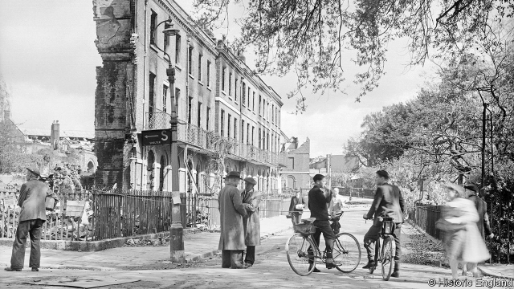

###### Dust to dust

# The vandalism of modern warfare 

 

> print-edition iconPrint edition | Books and arts | Jul 20th 2019 

“I WENT TO Exmouth,” wrote Margaret Tomlinson in February 1942, “and found they had dropped their eight bombs along the back of the one good Georgian terrace.” Tomlinson was part of the National Buildings Record (NBR), a small team of investigator-photographers hurriedly assembled during the Blitz to memorialise Britain’s bombed-out buildings. Today her negatives—often the only records of crumbled landmarks—repose in the archive of Historic England, a heritage agency. 

The story of the NBR is told at a new exhibition at the Imperial War Museum in London. “What Remains”, put on with Historic England, explores the targeting of cultural treasures in war. The NBR, it explains, was a reaction to a brutal new trend in conflict. Aerial bombing had expanded the parameters of the battlefield; techniques had been developed to target civilian architecture, along with theories that made such bombardments seem morally permissible, and militarily desirable. 

Giulio Douhet, an Italian general, had argued in 1921 that bombing distant civilian settlements could swiftly ruin a country’s morale. Hugh Trenchard, head of Britain’s nascent Royal Air Force, likewise maintained that aerial bombing could be the key to winning entire wars. He put these conjectures into practice in Iraq, where villages that rebelled against colonial rule were bombed by RAF aircraft. “Within 45 minutes”, observed a squadron leader called Arthur Harris in 1924, “a full sized village…can be practically wiped out.” As head of RAF Bomber Command, Harris oversaw devastating raids on Hamburg and Dresden during the second world war. 

As the exhibition shows, however, such carnage provokes defiance as often as it wrecks morale. “What Remains” includes displays and propaganda videos depicting the ravages inflicted by Islamic State (IS) in Mosul and Palmyra. In the end the videos rallied opposition to IS; several projects are now restoring what was lost. In 1942 Joseph Goebbels scrambled to present the Baedeker raids, in which Nazi planes attacked historic British towns, as legitimate retaliation rather than gratuitous vandalism. 

When historic buildings are destroyed, says Eyal Weizman of Forensic Architecture, a group that has documented Yazidi towns and villages that IS tried to raze, “you also destroy the culture—you destroy the communities.” Gruesome as they are, the theories that led to the creation of the NBR continue to have adherents: war is still in part an architectural endeavour. ■ 

