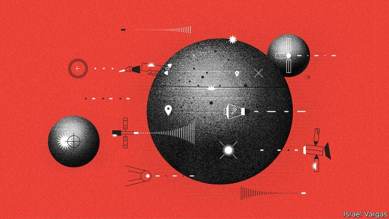
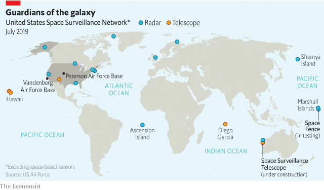
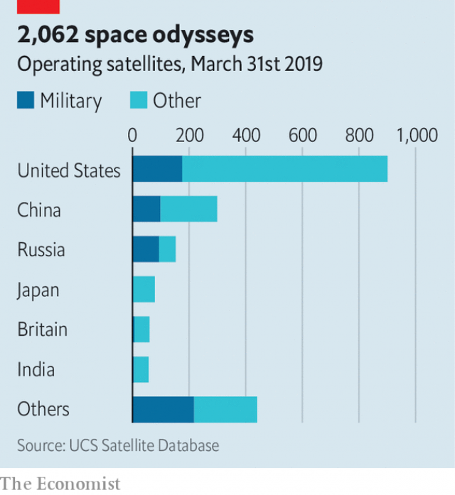

###### Using the force

# Attacking satellites is increasingly attractive—and dangerous 

 

> print-edition iconPrint edition | Briefing | Jul 18th 2019 

DEEP WITHIN Vandenberg Air Force Base, a rugged 50km stretch of America’s Pacific coast which is home to rolling fogs, sporadic wildfires, the odd mountain lion and the 30th Space Wing of the US Air Force, sits the Combined Space Operations Centre (CSpOC), a windowless area the size of a couple of tennis courts that could be mistaken for an unusually tidy newsroom. The men and women in it, mostly Air Force but some from allied countries, guard the highest of high grounds: space. 

In one corner sits the 18th Space Control Squadron, tasked with “space situational awareness”. Using a worldwide network of radars, telescopes and satellites (see map), it tracks the 2,000 satellites, American and otherwise, that are currently at work in orbit, and a larger number that are defunct, derelict and partially destroyed. All told it tracks some 23,000 objects down to the size of a softball moving at enormous speed and predicts when they will come close to something valuable. In 2013 CSpOC sent satellite operators 1m “conjunction data messages”—warnings that something else was going to pass nearby. In each case, the risk of an actual collision is minute; only very occasionally will the orbit of something valuable be tweaked to keep things completely safe. But as time goes on, space fills up. Last year CSpOC sent out 4m messages. Photographs of the three astronauts aboard the International Space Station hang on the wall, as a reminder of the human stakes. 

 

Cosmic fender-benders, though, are not CSpOC’s only interests. This is, as a sign on another wall declares, the place “where space superiority begins”. Those standing watch look not only for accidental collisions, but also for threatening manoeuvres. “I came into the Air Force 27 years ago as a satellite operator,” says Colonel Jean Eisenhut, who leads the development and deployment of defensive and offensive space systems for Air Force Space Command. “If there was a problem with our system or our satellites, we would think something on the satellite broke, that space weather was probably the actor that caused it. We did not think at all that something might be caused by some other actor in space.” Today, “the mindset that we are inculcating into our space warfighters is dramatically different.” 

The people in the converted Titan rocket facility that houses CSpOC are not the only ones concerned with such matters. China and Russia established new units for managing war in space four years ago. On July 13th President Emmanuel Macron said that he too had approved the creation of a new space command within the French air force. In 2007 China tested an anti-satellite missile; earlier this year India did the same. “Space is no longer a sanctuary,” Patrick Shanahan, then America’s acting secretary of defence, told a space-industry audience in Colorado Springs in April. “It is now a warfighting domain.” 

The idea of war in space is hardly new. As soon as German V-2 rockets started travelling through space on the way to Belgium and Britain in 1944, military minds turned to what could be done with weapons that tarried there. To date, though, most military operations in orbit have not been geared to war in space; they use tools in space to help them fight wars on Earth. 

Satellites enable modern war in three ways. One is to spot things below, in order to answer strategic questions. What forces does the enemy possess? And tactical ones. Twelve missiles just launched! Spy satellites also eavesdrop on communications and radar emissions. 

The second is to tell troops, and bombs, exactly where they are. This is where America’s 24-satellite Global Positioning System (GPS) and some of its lesser competitors—China’s BeiDou, Europe’s Galileo, India’s NAVIC, Japan’s QVSS and Russia’s GLONASS—come in. From a rarity 30 years ago, precision-guided bombs have become, for America, the norm. 

The third role is to get information into and out of desolate warzones. Getting data from a single Global Hawk drone like the one shot down by Iran on June 20th requires at least 500 megabits a second of satellite bandwidth—five times the rate at which all America’s armed forces used satellite communications during the 1991 Gulf war. The Pentagon’s bandwidth consumption rises by around a third every year. 

America outspends the rest of the world on military space capabilities by a ratio of three to one. This makes its satellites attractive targets. Knocking some of them out is the surest way to blind, deafen and disorient America’s armed forces when they are far from home. 

Perhaps the simplest way to attack a satellite is to hit it with a missile from Earth. This is what China did in 2007, taking out one of its own weather satellites, and what India did this March. Such attacks are easier to do when the target is in a low orbit. But China has tested missiles apparently capable of getting all the way to geostationary orbit—the altitude where satellites take 24 hours to get round the Earth, and thus seem to stay above the same place all the time. These orbits are popular with satellite broadcasters. They are also vital for early-warning systems, since they allow an eye to be kept on a whole continent in the search for missile launches. 

One problem with this approach is shrapnel. Just as nukes produce fallout, anti-satellite weapons which explode, or simply hit their target at orbital speed, produce large amounts of debris. An anti-satellite campaign waged with Earth-launched interceptors could leave huge swathes of space unusable for generations. Deniability is another problem. A country with satellites will probably be able to spot a satellite-killing missile’s launch site. 

 

An alternative is to pit satellite against satellite. Recent years have seen a surge of interest in “rendezvous and proximity operations”—getting one satellite close to another. Such operations are necessary if satellites are to be repaired or refuelled. But the delicate orbital shimmies and robotic arms that allow one satellite to help another could also be used without consent or goodwill. It might also offer ways to kill them with the equivalent of a shiv, rather than a blunderbuss, thus limiting the debris problem. 

America, Russia and China all have satellites that carry out manoeuvres close to other people’s spacecraft. America’s GSSAP satellites have conducted hundreds of manoeuvres in geostationary orbit since 2014, many close to Russian and Chinese satellites. The Secure World Foundation (SWF), an American think-tank, says that some of these encounters have been timed to occur in the Earth’s shadow to prevent telescopes on the ground from getting a good look at what was going on. 

This is probably simply snooping, rather than rehearsal for skulduggery. Brian Weeden, a former American Air Force space officer now at SWF, says he is not convinced that satellite-on-satellite violence is a good basis for a weapons programme. Targets in low orbits would have hours of warning; those in higher orbits, days. And unless satellites get stealthier, it would probably be possible to tell whose hand was behind any dirty deed. But the fact that a neat idea may also be a bad one does not always stop military planners. Recent studies by SWF and the Centre for Strategic and International Studies, another think-tank, suggest that some of Russia’s proximity operations are connected to an orbital-weapons programme code-named Burevestnik. 

Regardless of whether administered from another satellite or from Earth, violence in space does not need to be a matter of physical force. Spy satellites can be blinded with lasers. If the lasers are powerful enough, they can do damage to the rest of the spacecraft, too, as might microwave beams. Signals can also be jammed. In June Israeli pilots lost GPS signals around Ben-Gurion airport for three weeks. Last November NATO forces on exercises lost their GPS signals in northern Norway and Finland. Both incidents were almost certainly a result of Russian electronic warfare. 

Satellites are also vulnerable to hacking. Many commercial satellites are “riddled with security vulnerabilities”, says Gregory Falco, an expert at MIT. In 1998 Russian hackers reportedly took control of an American-German satellite and pointed it at the Sun, thus destroying its instruments. 

One way to respond to all this is deterrence: you destroy my satellite, I destroy yours. But at present no one knows what a given sally would earn by way of riposte, which makes deterrence disturbingly destabilising. Is hitting a satellite like bumping into a frigate, or bumping off a city? 

A better option is to avoid taking blows in the first place. But this raises problems of its own. Colonel Devin Pepper, commander of the 460th Space Wing at Buckley Air Force Base in Denver, says that the necessary tactics and techniques remain a work in progress. “What does the right of self-defence look like in space?” he asks. “What do chaff and flares look like in space?” Matthew Donovan, the acting secretary of the Air Force, draws a comparison to the position air-power advocates found themselves in after the first world war. They hankered for new tactics to match their new capabilities; they wanted a dedicated service free of the Army and Navy to foster such innovations. Similar arguments are sometimes used by proponents of creating a new Space Force inside the Pentagon, as President Donald Trump has suggested. 

If actual space combat were called for, it would be handled by the 265-strong National Space Defence Centre at Schriever Air Force Base, in nearby Colorado Springs. Having begun round-the-clock operations a year and half ago, its operators are sharpening their skills in novel ways. Instead of relying on simulators, its airmen treat friendly satellite manoeuvres as hostile and practice responses. Thrice-yearly “Space Flag” exercises, begun in 2017, will include allies for the first time in August. 

To make such exercises—and, if need be, eventual operations—run better, situational awareness needs to be improved. The airmen at CSpOC currently have to make do with something more like a series of snapshots than a live feed. Low orbits may be mapped out a few times every day. Higher up, maybe just once in three days. “Things can happen between those looks,” says Major-General Stephen Whiting, who commands most of the Air Force’s space units. Space Fence, an especially powerful radar on Kwajalein Atoll in the Marshall Islands, will help to keep an eye out. It should be able to track more than 60,000 objects down to the size of a marble once it enters service later this year. 

Learning to fight is one thing. Limiting your losses is another. For some purposes America uses small numbers of eye-wateringly expensive satellites that take over a decade to develop. Mr Donovan points to the importance of designing resilient systems instead. “It’s really efficient to put one giant satellite in space. The problem is that it’s the equivalent of putting all your eggs in one basket.” At Buckley Air Force Base, Colonel Bobby Hutt points to the ceiling, where a scale model of one of the SBIRS satellites is hanging. The chronically delayed project cost $19bn. “The Chinese love our acquisitions cycle,” he says. 

Like the private sector, the Air Force is moving towards “mega-constellations” of smaller, cheaper and more numerous satellites in low orbits that can ping information securely to one another. To degrade such a system’s performance an enemy would have to knock out a significant part of the whole fleet, rather than just one target. The Blackjack programme, which is run by the Pentagon’s far-out research shop, DARPA, envisages putting military sensors onto commercial satellites that cost less than $6m each. 

As well as resilience, there is replacement. Losing a satellite is a lot less worrying if you can quickly pop a substitute up into orbit. The development of a more capable and responsive commercial-launch industry has already improved matters. But the Pentagon wants to push things further. Next year three companies will participate in a DARPA competition to launch two small satellites into orbit from two locations with a few weeks. The site will be revealed just weeks ahead of launch, and the payload itself within days. 

Better response, more resilience and faster resupply are all good ways for America to make itself less vulnerable to anti-satellite attacks—and thus to make such attacks less appealing to adversaries. There are also multilateral approaches to consider. At the moment, there are neither laws nor norms specific to space warfare. The 1967 Outer Space Treaty bans weapons of mass destruction in outer space but is silent on conventional arms. And if two satellites get menacingly close there are no agreed appropriate responses. 

In 2008 the European Union proposed a voluntary code of conduct to promote “responsible behaviour” in such matters. The same year, China and Russia suggested a binding treaty to ban weapons in space. The two ideas were to some extent in opposition to each other; they both foundered. 

 

The treaty was aimed not so much at anti-satellite weapons as at anti-missile weapons based in space—weapons which could be used to destroy ICBMs when they popped out of the atmosphere. America has an interest in such things dating back to the Star Wars programme of the 1980s. It was silent on weapons launched from Earth—such as the one the Chinese had tested the year before. It also failed to establish how states would tell good spacecraft from bad, says Bleddyn Bowen of the University of Leicester. America was having none of it. 

Opposition to the code, though egged on by Russia and China, came mostly from countries in Latin America and Africa. They liked the idea of a demilitarised space that the treaty sought to champion. They disliked the code’s acknowledgment that countries with assets in space had a right to use force to defend them. 

Both technology and politics mean that there is unlikely to be much progress in the near future. The line between conventional and space weapons is blurred: when America struck its own satellite in 2008, it used an SM-3 interceptor developed for use against incoming missiles. India’s anti-satellite test was also, it said, a missile-interceptor test. Then there is the issue of trust. America and Russia are busy trashing earthly arms-control deals; they are unlikely to find common ground for a new one. Nor does America show much willingness to try. “We’re basically saying no to everything, and we don’t have a better alternative,” Mr Weeden complains. 

But even if there can be no deals, there should at least be dialogue. During the cold war, America and the Soviet Union appreciated that risk reduction and escalation control required a sound understanding of the other side’s nuclear thinking. Yet America and China do not appear to have held talks on space security for three years. Just as the two sides have agreements on encounters between warships at sea, they could flesh out norms for safe distances for proximity operations. That could include requirements to use transponders on all civilian satellites and to provide prior notice of any planned inspections. Many military space operators would be keen on this. If more civilian satellites broadcast their location and behaved predictably, suspicious behaviour would be easier to pick out. 

Finally, the fact that there is no law of space war does not mean that the customary laws of war do not apply in space. They apply there as surely as they do on the high seas. How they do so—how to balance humanity and military necessity in a domain without humans—is unclear. But such challenges have been met before. The Tallinn Manual did a comparable job for cyberspace in 2013. The Woomera Manual, spearheaded by four universities in Australia, America and Britain, and the MILAMOS project, led by one in Canada, hope to do the same for space. 

The act that established NASA in 1958 declared loftily that “it is the policy of the United States that activities in space should be devoted to peaceful purposes for the benefit of all mankind.” Even then, that was a half-truth. But space has since become a sinew of terrestrial military power in ways that were unimaginable even when Apollo 11 touched down in 1969. The point is not that the next war will be fought in space, as though it is a battlefield unto itself; it is that the next war may not spare it. ■ 

-- 

 单词注释:

1.Jul[]:七月 

2.Vandenberg['vændәnbә:^]:范登堡(姓氏) 

3.rugged['rʌgid]:a. 高低不平的, 崎岖的, 粗糙的 

4.sporadic[spәu'rædik]:a. 偶尔发生的, 零星发生的, 分散的 [医] 散在的, 散发的 

5.wildfire['waildfaiә]:n. (古时战争时所用的)燃料剂, 磷火, 鬼火, 野火 

6.windowless[]:a. 无窗的 

7.newsroom['nju:zru:m]:n. 新闻编辑部, 报刊阅览室, 售报处 

8.ally['ælai. ә'lai]:n. 同盟者, 同盟国, 助手 vt. 使联盟, 使联合, 使有关系 vi. 结盟 

9.squadron['skwɒdrәn]:n. 骑兵营, 分遣队, 小舰队 

10.situational[sitju'eiʃәnәl. -tʃu-]:a. 环境形成的；情形的 

11.awareness[ә'weәnis]:n. 意识, 认识 [计] 识别, 议定, 明白 

12.currently['kʌrәntli]:adv. 现在, 当前, 一般, 普通 [计] 当前 

13.defunct[di'fʌŋkt]:a. 死的, 不能使用的 n. 死者 

14.derelict['derilikt]:a. 被抛弃了的, 无主的, 玩忽职守的 n. 遗弃物, 被遗弃的人, 玩忽职守者 

15.datum['deitәm]:n. 论据, 材料, 资料, 已知数 [医] 材料, 资料, 论据 

16.tweak[twi:k]:n. 拧, 扭, 焦急 vt. 扭, 开足马力 

17.reminder[ri'maindә]:n. 提醒的人, 暗示 [经] 催单 

18.cosmic['kɒzmik]:a. 宇宙的, 宇宙航行的, 无限的, 有秩序的 [医] 宇宙的 

19.superiority[sju:.piәri'ɒriti]:n. 优越, 高傲 [化] 优越性 

20.manoeuvre[mә'nu:vә]:n. 调遣, 演习, 策略 vi. 调动, 演习, 用策略 vt. 调动, 操纵 

21.Eisenhut[]:[地名] 艾森胡特峰 ( 奥 ) 

22.deployment[]:[计] 展开 

23.defensive[di'fensiv]:a. 防卫的, 防备用的, 自卫的 n. 守势, 防卫姿势, 防卫物 

24.offensive[ә'fensiv]:a. 令人不快的, 侮辱的, 攻击性的 [法] 攻击的, 进攻的, 冒犯的 

25.mindset[]:n. 心态；倾向；习惯；精神状态 

26.inculcate['inkʌlkeit]:vt. 反复灌输, 谆谆教诲 

27.warfighters[]:[网络] 战士；战争勇士；铁血悍将 

28.dramatically[drә'mætikli]:adv. 戏剧地, 引人注目地, 突然地 

29.Titan['taitn]:n. 提坦, 太阳神, 巨人 

30.emmanuel[i'mænjuәl]:n. 以马内利（耶稣基督的别称）；伊曼纽尔（男子名, 等于Immanuel） 

31.macron['mækrәn]:n. 长音符号 

32.creation[kri:'eiʃәn]:n. 创造, 创作物, 发明 [化] 产生 

33.sanctuary['sæŋktʃuәri]:n. 圣所(指教堂、寺院等), 耶路撒冷的神殿, 避难所 [法] 庇护所, 避难所, 教堂 

34.patrick['pætrik]:n. 帕特里克（男子名） 

35.Shanahan[]:n. (Shanahan)人名；(英)沙纳汉 

36.Colorado[,kɔlә'rɑ:dәu]:n. 科罗拉多, 科罗拉多河 

37.warfighting['wɔː(r).faɪtɪŋ]:n. 作战；(导弹)弹头战 [网络] 战斗 

38.domain[dәu'mein]:n. 领域, 领土, 产业, 范围 [计] 域, 区域, 支配命令 

39.tarry['tæri]:vi. 耽搁, 逗留, 留住, 等候 n. 逗留 a. 涂了焦油的 

40.tactical['tæktikl]:a. 战术的, 用兵上的, 策略的 

41.eavesdrop['i:vzdrɒp]:v. 偷听 n. 屋檐水, 偷听 

42.emission[i'miʃәn]:n. 发射, 射出, 发行 [医] 发射, 遗精 

43.GP[]:普通医师, 普通医生开业医生 [计] 通用程序设计, 图形处理器 

44.lesser['lesә]:a. 较少的, 较小的, 次要的 

45.Beidou[]:北斗 

46.Galileo[.gæli'leiәu]:n. 伽利略 

47.NAVIC[]:Naval Information Center 海军新闻中心 

48.rarity['rєәrәti]:n. 稀罕, 罕有, 珍奇, 稀薄 

49.norm[nɒ:m]:n. 基准, 模范, 标准, 准则, 平均数 [化] 定额 

50.desolate['desәlәt]:a. 荒凉的 

51.warzone[]:n. 战区 [网络] 战争地带；战场；战区模式 

52.drone[drәun]:n. 雄蜂, 懒惰者, 嗡嗡的声音, 无人驾驶飞机(或船) vi. 嗡嗡作声, 混日子 vt. 低沉地说 

53.Iran[i'rɑ:n]:n. 伊朗 

54.megabit['me^әbit]:[计] 兆位 

55.bandwidth['bændwidθ]:n. 频带宽度, 通带宽度 [计] 带宽, 频宽 

56.outspends[autˈspendz]:v. 花费超过…范围，比（他人）花费多( outspend的第三人称单数 ) 

57.capability[.keipә'biliti]:n. 能力, 性能, 约束力 [化] 能力 

58.deafen['defәn]:vt. 使聋 vi. 变聋 

59.disorient[dis'ɒ:rient]:vt. 使失去方向, 使迷惑 

60.apparently[ә'pærәntli]:adv. 表面上, 清楚地, 显然地 

61.geostationary[,dʒi(:)әu'steiʃәnәri]:[计] 同步 

62.broadcaster['brɒ:dkæstә]:n. 播送者, 广播装置, 播种机 

63.shrapnel['ʃræpnәl]:n. 零钱, 榴霰弹, 弹片 

64.nuke[nju:k]:n. 核武器, 核电厂, 原子核 vt. 以核武器攻击, 把...打垮 a. 核武器的 

65.fallout['fɒ:laut]:n. 原子尘的降下, 辐射性微尘, 原子尘, 附带结果 [医] [放射尘]回降 

66.orbital['ɒ:bitәl]:a. 轨道的, 眼眶的 [化] 轨道 

67.debris['deibri:]:n. 碎片, 残骸 [医] 碎屑 

68.interceptor[.intә'septә]:n. 阻止的人, 妨碍者, 拦截战斗机 [法] 窃听器, 截取者, 障碍物 

69.swathe[sweiθ]:vt. 绑, 裹, 包围 n. 带子, 绷带 

70.unusable[]:[计] 不可用的 

71.deniability[di,naiə'biləti]:n. 推诿不知情的本领；否认本领 

72.surge[sә:dʒ]:n. 巨涌, 汹涌, 澎湃 vi. 汹涌, 澎湃, 颠簸, 猛冲, 突然放松 vt. 使汹涌奔腾, 急放 [计] 电压尖峰 

73.rendezvous['rɒndivu:]:n. 约会, 约会地点 v. 集合, 集结, 在约定场所会面 [计] 会合 

74.proximity[prɒk'simiti]:n. 接近, 亲近 

75.refuel[ri:'fju:әl]:v. 补给燃料 

76.shimmy['ʃimi]:n. (非正式)女式衬衣, (美)不正常振动 vi. (美)摇晃, 振动, 颤动 

77.robotic[rәu'bɔtik]:a. 自动的；机器人的, 像机器人的 

78.goodwill[^jd'wil]:n. 友好, 好意, 善意, 亲善, (企业享有的)信誉, 声誉 [经] (企业的)商誉, 信誉 

79.shiv[ʃiv]:n. 刀, 剃刀 

80.blunderbuss['blʌndәbʌs]:n. 老式的大口径短枪, 蠢才 

81.swf[]:abbr. 一种动画设计软件的文件格式（Small Web Format）；思康网安网页过滤系统（Surfcontrol Web Filter） 

82.snoop[snu:p]:vi. 调查, 窥探 n. 窥视行为, 爱管闲事的人, 私家侦探 

83.skulduggery[skʌl'dʌgәri]:n. 欺骗, 欺诈, 作假 

84.brian['braiәn]:n. 布莱恩（男子名） 

85.weeden[]: [人名] 威登 

86.stealthy['stelθi]:a. 秘密的, 掩人耳目的, 鬼鬼祟祟的 [法] 隐密的, 暗中的 

87.alway['ɔ:lwei]:adv. 永远；总是（等于always） 

88.planner['plænә]:n. 计划者, 设计者, 安排者 [机] 刨床机 

89.Burevestnik[]:[地名] 布列韦斯特尼克 ( 哈 ) 

90.administer[әd'ministә]:vt. 管理, 料理, 执行 vi. 执行遗产管理人的职责, 给予帮助 

91.Israeli[iz'reili]:a. 以色列的, 以色列人(语)的 n. 以色列人 

92.NATO['neitәj]:北大西洋公约组织, 北约组织 [经] 北大西洋公约组织 

93.Norway['nɒ:wei]:n. 挪威 

94.Finland['finlәnd]:n. 芬兰 

95.warfare['wɒ:fєә]:n. 战争, 战斗, 交战, 斗争, 竞争 [法] 战事, 作战, 交战 

96.vulnerable['vʌlnәrәbl]:a. 易受伤害的, 有弱点的, 易受影响的, 脆弱的, 成局的 [医] 易损的 

97.hack[hæk]:n. 劈, 砍, 砍痕, 出租车, 干咳, 晒架, 鹤嘴锄 vt. 劈, 砍, 出租, 用旧 vi. 劈, 砍, 干咳, 驾驶出租车 a. 出租的 

98.vulnerability[.vʌlnәrә'biliti]:n. 易受伤, 易受责难, 易受伤部位 [医] 易损性 

99.gregory['^re^әri]:n. 格雷戈里（男子名, 古代罗马教皇之名） 

100.Falco[]:隼 法尔科 

101.mit[mit]:n. 手, 连指手套, 棒球手套, 拳击手套, 马萨诸塞理工学院, 麻省理工学院 vt. 与...握手, 用手铐铐住, 逮捕 [计] 麻省理工学院, 模块化智能终端 

102.hacker['hækә]:[计] 计算机窃贼, 计算机新技术挑战者, 黑客 

103.reportedly[ri'pɒ:tidli]:adv. 根据传说, 根据传闻, 据报道 

104.sally['sæli]:n. 突击, 出击, 远足 vi. 突击, 出击, 出发 

105.riposte[ri'pәust]:n. (击剑中)还击, 机敏的回答 vi. 迅速还击, 机敏回答 

106.deterrence[di'tә:rәns]:n. 威慑, 威慑力量 [法] 威慑力量, 制止物 

107.disturbingly[dis'tә:biŋli]:adv. 动摇地；令人不安地 

108.destabilise[di:'steɪbɪlaɪz]:vt. 破坏政府的稳定 

109.bump[bʌmp]:n. 撞击, 肿块 vt. 碰撞 vi. 撞, 颠簸而行 

110.frigate['frigit]:n. 装有大炮的快速帆船, 护卫舰 

111.devin[]:n. 德温（男子名） 

112.Buckley[]:巴克利（姓氏） 

113.Denver['denvә]:n. 丹佛(美国城市) 

114.tactic['tæktik]:n. 一项战术, 一条策略 a. 战术的, 顺序的, 排列的 

115.chaff[tʃæf]:n. 谷壳, 糠, 揶揄 v. 开玩笑, 戏弄 

116.Matthew['mæθju:]:n. 马太, 马太福音 

117.donovan['dɔnәvәn]:n. 多诺万（姓氏） 

118.hanker['hæŋkә]:vi. 渴望, 热切希望 

119.dedicate['dedikeit]:vt. 献出, 贡献 

120.foster['fɒstә]:a. 收养的, 养育的 vt. 养育, 抚育, 培养, 鼓励, 抱(希望) 

121.innovation[.inәu'veiʃәn]:n. 改革, 创新 [法] 创新, 改革, 刷新 

122.proponent[prә'pәunәnt]:n. 建议者, 支持者 [法] 提议者, 辩护者, 支持者 

123.pentagon['pentәgәn]:n. 五角形, 五边形 [经] 五角平台 

124.combat['kɒmbæt]:n. 争斗, 战斗 vi. 战斗, 争斗 vt. 与...战斗, 与...斗争 

125.schriever[]: [人名] 施里弗; [地名] [美国] 施里弗 

126.simulator['simjuleitә]:n. 模拟器, 假装者 [计] 模拟器 

127.airman['єәmәn]:n. 飞行员, 空军士兵 

128.eventual[i'ventʃuәl]:a. 最后的, 终于的 

129.sery[]:n. (Sery)人名；(俄)谢雷；(科特)塞里 

130.snapshot['snæpʃɒt]:n. 快照, 抽点打印 [计] 瞬象; 抽点打印 

131.stephen['sti:vn]:n. 斯蒂芬（男子名） 

132.Kwajalein['kwɑ:dʒәlein]:n. 夸贾林环礁(位于太平洋西部) 

133.atoll['ætɒl]:n. 环状珊瑚岛, 环礁 

134.Marshall['mɑ:ʃәl]:n. 马歇尔（姓氏, 男子名, 等于Mar'shal） 

135.resilient[ri'ziliәnt]:a. 弹回的, 有弹力的 [医] 回弹的, 回能的 

136.bobby['bɒbi]:n. 警察 

137.Hutt[hʌt]:赫特(姓氏) 

138.SBIRS[]:天基红外系统 

139.chronically['krɒnikli]:adv. 慢性地, 长期地, 习惯性地 

140.sector['sektә]:n. 扇形, 部门, 部分, 函数尺, 象限仪, 段, 区段 vt. 把...分成扇形 [计] 扇面; 扇区; 段; 区段 

141.ping[piŋ]:n. 砰(子弹击中时的声音), 报时的最后一声, 声脉冲 vi. 砰(铛)地发声 [计] internet网络包测程序, 连通性检测命令 

142.securely[si'kjuәli]:adv. 安全地；安心地；牢固地；有把握地 

143.degrade[di'greid]:v. (使)降级, (使)退化 

144.blackjack['blækdʒæk]:n. 闪锌矿；扑克牌的二十一点；包革金属棍棒 

145.DARPA[]:[计] 美国国防部高级研究计划局 

146.envisage[in'vizidʒ]:vt. 面对, 正视, 想象 

147.sensor['sensә]:n. 传感器 [计] 检测器 

148.les[lei]:abbr. 发射脱离系统（Launch Escape System） 

149.resilience[ri'ziliәns]:n. 弹回, 有弹力, 恢复力 [化] 回弹; 弹性; 弹回性; 回能; 弹能 

150.replacement[ri'pleismәnt]:n. 归还, 更换, 代替者 [医] 复位, 置换 

151.quickly['kwikli]:adv. 很快地 

152.responsive[ri'spɒnsiv]:a. 回答的, 应答的, 易感应的 

153.payload['peilәud]:n. 商务载重, 工资负担, 净载重量, 有效负荷, 弹头 [化] 负荷量 

154.resupply[,ri:sә'plai]:v. 再供给, 再补给 

155.adversary['ædvәsәri]:n. 敌手, 对手 a. 敌手的, 敌对的 

156.multilateral[.mʌlti'lætәrәl]:a. 多边的, 多国的 [经] 多边的, 涉及多方的 

157.menacingly[]:adv. 威胁地, 恐吓地 

158.opposition[.ɒpә'ziʃәn]:n. 反对, 敌对, 相反, 在野党 [医] 对生, 对向, 反抗, 反对症 

159.founder['faundә]:n. 创立者, 建立者 vt. 使沉没, 使摔倒, 弄跛, 浸水, 破坏 vi. 沉没, 摔到, 变跛, 倒塌, 失败 

160.icbm[,ai,si:bi:'em]:abbr. InterContinental Ballistic Missile 洲际弹道导弹 

161.bowen[]:n. 博文（店名）；鲍恩（昆士兰海边小镇） 

162.Leicester['lestә]:莱斯特(英国城市) 

163.opposition[.ɒpә'ziʃәn]:n. 反对, 敌对, 相反, 在野党 [医] 对生, 对向, 反抗, 反对症 

164.demilitarise[,di: 'militәraiz]:vt. 解除对...军事管制, 使非军事化 

165.acknowledgment[әk'nɔlidʒmәnt]:n. 承认, 答谢, 认可, 谢礼, 收到的通知, 收到的回音, 谢意 [计] 肯定, 确认认可 

166.asset['æset]:n. 资产, 有益的东西 

167.politic['pɒlitik]:a. 精明的, 明智的, 策略的 

168.incoming['inkʌmiŋ]:a. 进来的, 刚开始的, 新来的 n. 进来 

169.trash[træʃ]:n. 垃圾, 废物 vt. 丢弃 

170.earthly['ә:θli]:a. 地球的, 俗世的, 可能的 

171.escalation[.eskә'leiʃәn]:n. 扩大, 增加 [经] 调查, 价格调整 

172.warship['wɒ:ʃip]:n. 军舰, 战船 

173.transponder[træn'spɒndә]:n. 发射机应答器 [电] 询答机 

174.predictably[]:adv. 可预言地 

175.customary['kʌstәmәri]:a. 习惯的, 惯常的 [经] 通常的, 习惯的 

176.humanity[hju:'mæniti]:n. 人性, 人类, 博爱 

177.unclear[.ʌn'kliә]:a. 不易了解的, 不清楚的, 含混的 

178.Tallinn['tælin]:塔林[爱沙尼亚共和国首都] 

179.cyberspace[]:[计] 空间, 网控空间 

180.woomera['wu:mәrә]:n. 澳洲土人用以发射矛箭或标枪的一种器具 

181.spearhead['spiәhed]:n. 矛尖, 先锋队, 先头部队 vt. 做先锋, 带头 

182.NASA['næsә]:国家航空和宇宙航行局(美国) [电] 国际航空和太空总署的同义字 

183.loftily['lɒftili]:adv. 高尚地, 傲慢地 

184.sinew['sinju:]:n. 肌肉, 精力, 体力, 力量的源泉, 腱 vt. 赋予力量, 加强 

185.terrestrial[tә'restriәl]:n. 地球上的人 a. 地球的, 陆生的, 陆地的, 人间的 

186.unimaginable[.ʌni'mædʒinәbl]:a. 不能想象的, 不可思议的 

187.Apollo[ә'pɒlәu]:n. 阿波罗(太阳神), 美男子 

188.battlefield['bætlfi:ld]:n. 战场, 沙场 

189.unto['ʌntu, 'ʌntә, 'ʌntu:]:prep. 到, 对, 直到 

