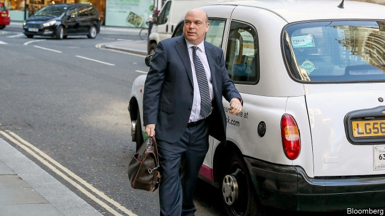

###### Lynch mob

# Britain’s biggest fraud trial pits Mike Lynch against Hewlett Packard 

 

> print-edition iconPrint edition | Britain | Jul 20th 2019 

LONDON’S LEGAL district, dotted with purveyors of horsehair wigs and pubs once frequented by Charles Dickens, seems an unlikely setting for an entrepreneur at the cutting edge of technology. Mike Lynch, sometimes called Britain’s Bill Gates, backed Darktrace, an artificial-intelligence-powered cyber-security firm that has become one of the country’s most highly valued startups. But Mr Lynch will not be celebrating. Instead he is spending summer in court fighting Hewlett-Packard (HP), an American IT giant, over alleged fraud at Autonomy, another firm he founded and which HP bought in 2011. 

It is Britain’s biggest-ever fraud case. HP’s claim of $5.1bn against Mr Lynch is massive chiefly because the American firm overpaid for Autonomy. A decade ago, after a series of boardroom crises, HP was keen to add high-margin software to its lacklustre hardware business. It paid $10.3bn for Autonomy, which reported revenues of $870m in 2010, representing a whopping 64% premium to its market value. 

HP’s shares fell by a fifth after news of the deal and other changes. Léo Apotheker, its boss and the deal’s architect, was sacked. In 2012 HP’s next boss, Meg Whitman, wrote off $8.8bn of Autonomy’s value and said HP had been duped. HP accuses Mr Lynch, and Autonomy’s former chief financial officer, Sushovan Hussain, of padding revenues and profits pre-acquisition. Mr Lynch has been indicted by America’s Department of Justice (DoJ). He says HP’s charges are baseless and that it destroyed Autonomy with bad management. 

That Autonomy’s revenue accounting was questionable is not in doubt. Before the HP deal Mr Lynch was accused of bullying bank analysts whose research pointed to aggressive practices. But Autonomy’s auditor, Deloitte, signed off the accounts. Neither did HP’s own pre-deal due-diligence process, conducted by KPMG, another big audit firm, raise problems. And a 2012 report by Ernst & Young, yet another auditor, concluded that the alleged incorrect accounting would not have had a material impact on HP’s valuation of Autonomy. Mr Lynch says in testimony that differences between international and American accounting standards help explain the gap, and that he knew nothing about the allegedly fraudulent transactions. 

So far the trial is going well for the tech entrepreneur, a commanding presence in the witness box who has taken to treating the court to short explainers on the software industry’s workings. A boost came from HP’s star witness, Chris Egan, a former head of Autonomy’s American business. He had admitted to some of the practices used to flatter revenues (such as backdating deals and doing “round-trip” transactions) and been fined. He struck a plea bargain with the DoJ. But in May he admitted he had no evidence that Mr Lynch directed any fraudulent accounting. 

Whatever the outcome in the British courts—the trial will conclude in December—Mr Lynch is threatened with extradition to America. The DoJ filed charges against him in November and added a new indictment in March. If extradited and convicted, as was Mr Hussain, he faces prison. 

An extradition demand would kick up a storm, especially since Britain’s arrangements with America, which date from soon after 9/11, are considered by many to be overly generous to US prosecutors. The last big case concerned Gary McKinnon, a British hacker with Asperger’s syndrome, who in 2012 won the right to stay put. His victory has made American prosecutors more determined, which may not help Mr Lynch. But at least the process has become less political. Courts, not the home secretary, now have the final say. If, post-Brexit, Britain goes all out for a trade deal with America, that should mean Mr Lynch is less likely to find himself used as a bargaining chip. ■ 

Vacancy: The Economist is looking to hire a staff writer to cover British economics. Journalistic experience is not necessary; the ability to write clearly and entertainingly is. For details of how to apply, visit economist.com/britainjob2019. The deadline is August 4th. 
<<<<<<< HEAD

-- 

 单词注释:

1.lynch[lintʃ]:n. 私刑, 私罚 vt. 处以私刑处死, 加私刑 

2.mob[mɒb]:n. 暴民, 民众, 暴徒 vt. 大举包围, 蜂拥进入, 围攻 vi. 聚众生事 

3.fraud[frɒ:d]:n. 欺骗, 欺诈, 诡计, 骗子 [经] 欺诈, 舞弊, 骗子 

4.mike[maik]:vi. 偷懒, 游手好闲 n. 休息, 游手好闲, 扩音器, 话筒 

5.Hewlett[]:n. 休利特（姓氏） 

6.packard[]:n. 帕卡德（姓氏） 

7.Jul[]:七月 

8.purveyor[pә'veiә]:n. 承办伙食者, 承办商人, 征发官员 

9.horsehair['hɔ:sheә(r)]:n. 马毛, 马鬃 [医] 马鬃 

10.wig[wig]:n. 假发, 斥责 vt. 给...戴假发, 激怒, 使发狂 vi. 激动, 发狂 

11.charle[]:n. 查理（男子名）；查理（姓氏） 

12.dicken[]: [男子名] [英格兰人姓氏] 迪肯 Dick的昵称 

13.entrepreneur[.ɒntrәprә'nә:]:n. 企业家, 主办人 [经] 承包商, 企业家 

14.startup[]:[计] 启动 

15.HP[]:n. 马力, 分期付款购买法 [计] 惠普公司 

16.allege[ә'ledʒ]:vt. 宣称, 主张, 提出, 断言 [法] 断言, 指称, 指证 

17.autonomy[ɒ:'tɒnәmi]:n. 自治, 自治权 [医] 自主性 

18.chiefly['tʃi:fli]:adv. 主要地 

19.overpay[.әuvә'pei]:vt. 多付, 多给报酬 vi. 付得过多 

20.sery[]:n. (Sery)人名；(俄)谢雷；(科特)塞里 

21.boardroom['bɒ:drum]:n. 会议室, 证券交换场所 

22.lacklustre['læklʌstә]:a. 无光泽的, 无生气的 n. 无光泽, 无生气 

23.whop[hwɒp]:v. 打, 抽出, 打败, 征服 n. 重击, 打击声 

24.premium['pri:miәm]:n. 额外补贴, 奖金, 奖赏, 保险费 [医] 保险费 

25.Léo[]:[地名] 莱奥 ( 布基 ) 

26.Apotheker[]:[网络] 波泰克；兼首席执行官李艾科；长阿波特克 

27.Meg[me^]:n. 梅格（女子名, 等于Margaret） 

28.whitman['(h)witmәn]:n. 惠特曼（姓氏） 

29.dupe[dju:p]:n. 傻瓜, 易受骗的人 vt. 欺骗, 愚弄 

30.hussain[]:n. (Hussain)人名；(阿拉伯)侯赛因 

31.indict[in'dait]:vt. 起诉, 控告, 指控 [法] 控告, 揭发, 对...起诉 

32.doj[]:abbr. Department of Justice <美国>司法部 

33.baseless['beislis]:a. 无根据的 

34.questionable['kwestʃәnәbl]:a. 可疑的 [法] 可疑的, 有问题的, 不可靠的 

35.bully['buli]:n. 欺凌弱小者, 土霸 vt. 威胁, 恐吓, 欺负 vi. 欺负 a. 特好的, 第一流的 adv. 十分 

36.analyst['ænәlist]:n. 分析者, 精神分析学家 [化] 分析员; 化验员 

37.auditor['ɒ:ditә]:n. 审计员, 听者, 旁听生 [经] 审计(查帐)员, 审计师, 会计检查员 

38.Deloitte[]:n. 德勤（四大会计师事务所之一） 

39.KPMG[]:abbr. 毕马威会计事务所 

40.audit['ɒ:dit]:n. 审计, 查帐 vt. 查(帐), 旁听 vi. 查账 [计] 查帐; 审查; 检查 

41.Ernst[ɛrnst]:n. 恩斯特（人名）；艾伦斯特（人名） 

42.valuation[.vælju'eiʃәn]:n. 评价, 估价, 价值判断 [经] 估价, 计价, 评价 

43.testimony['testimәni]:n. 证言, 证据, 声明 [医] 证据 

44.allegedly[ә'ledʒidli]:adv. 依其申述 

45.fraudulent['frɒ:djulәnt]:a. 欺诈的, 不正的, 不诚实的 [法] 欺诈的, 欺骗的, 骗取的 

46.transaction[træn'sækʃәn]:n. 交易, 办理, 学报, 和解协议 [计] 事务处理 

47.tech[tek]:n. 技术学院或学校 

48.explainer['eksplә.neitә]:n. 讲解员；说锰序 

49.working['wә:kiŋ]:n. 工作, 运转, 劳动 a. 工作的, 劳动的, 经营的, 抽搐的, 运转的 

50.chris[kris]:n. 克里斯（男子名）；克莉丝（女子名） 

51.Egan[]:n. 伊根（爱尔兰人名） n. 伊根（地名, 在美国） 

52.backdate['bækdeit]:vt. 写上比实际早的日期, 回溯 

53.plea[pli:]:n. 恳求, 辩解, 抗辩, 诉讼, 请愿, 托词 [法] 抗辩, 申诉案件, 答辩 

54.extradition[.ekstrә'diʃәn]:n. 引渡逃犯, 亡命者送还本国 [法] 引渡 

55.indictment[in'daitmәnt]:n. 起诉, 控告, 起诉状 [经] 起诉书 

56.convict[kәn'vikt]:n. 囚犯, 罪犯 vt. 宣告有罪, 使知罪 

57.overly['әuvәli]:adv. 过度地, 极度地 

58.prosecutor['prɒsikju:tә]:n. 实行者, 告发者, 公诉人 [法] 原告, 起诉人, 检举人 

59.gary['^eәri]:n. 盖理 

60.McKinnon[]:n. (McKinnon)人名；(英)麦金农 麦金农 

61.hacker['hækә]:[计] 计算机窃贼, 计算机新技术挑战者, 黑客 

62.syndrome['sindrәum]:n. 并发症状, 综合征, 同时存在的事物 [计] 校验子; 并发位 

63.les[lei]:abbr. 发射脱离系统（Launch Escape System） 

64.chip[tʃip]:n. 屑片, 薄片, 碎片 vt. 削, 切, 削成碎片, 使摔倒, 凿 vi. 削下屑片 [计] 孔屑; 组件; 晶片; 芯片 

65.economist[i:'kɒnәmist]:n. 经济学者, 经济家 [经] 经济学家 

66.journalistic[,dʒ\\: nә'listik]:a. 新闻业的, 新闻工作者的, 报刊特有的, 新闻工作的 

67.entertainingly[,entə'teiniŋli]:adv. 有趣地；使人愉快地 
=======
>>>>>>> 50f1fbac684ef65c788c2c3b1cb359dd2a904378

