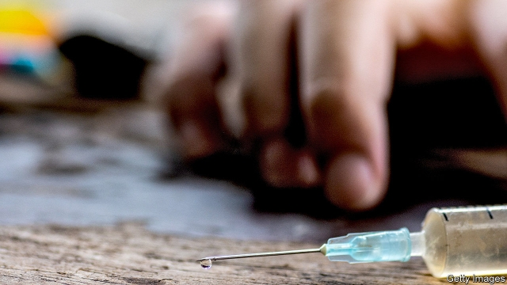
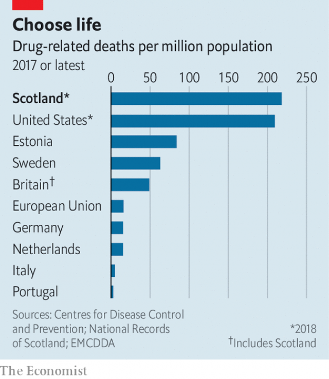

###### Trainspotting revisited

# Scotland overtakes America as the world’s drug-overdose capital 

 

> print-edition iconPrint edition | Britain | Jul 20th 2019 

DRUGS ARE killing more people in Scotland than ever before—and probably more than in any other country. Official figures published on July 16th showed that there were 1,187 drug-related deaths in Scotland last year, 27% more than in 2017 and double the figure five years ago. This gives Scotland a death rate three times higher than Britain as a whole, and higher than anywhere in the EU. It even puts the country ahead of America, which is suffering a drug epidemic previously thought to be the worst in the world. The Scottish government calls the situation an “emergency”. No one disagrees. 

Opiates such as heroin were involved in the vast majority of last year’s deaths. Most of the victims had taken more than one drug. “New psychoactive substances”, the fast-evolving synthetic drugs once known as legal highs, were involved in half the cases. Three-quarters of the dead were men and three-quarters were aged over 35. 

How did Scotland end up in such a state? It has long had more heroin users than the rest of Britain, as well as fewer people in treatment, points out the government-funded Scottish Drugs Forum (SDF). Waiting times to receive treatment are long, it adds, and those receiving methadone, a substitute for heroin, are sometimes given too little of it. Meanwhile the so-called Trainspotting generation, who took up the drug in the 1990s, are growing fragile. Long-term users are “ageing much sooner than the general population”, a Scottish government spokesman says. 

 

The Scottish government says it favours a public-health approach, with less involvement for the justice system. Earlier this month it announced that a “task force” would examine the causes of drug deaths. It supports a plan by Glasgow City Council to open “fix rooms”, where people can use illegal drugs under medical supervision. 

But whereas health and justice policy are largely devolved, drug law is not. The Scottish government argues that the Misuse of Drugs Act needs to be amended before the fix rooms can go ahead. Westminster is unwilling to do this. The SDF and others think a “letter of comfort” from the Lord Advocate, Scotland’s attorney-general, would be enough. But James Wolffe, the holder of the post, disagrees, saying a “comprehensive legal framework” is required. There is a feeling no one is exhausting every possibility. 

Meanwhile, calls are growing for stronger medicine. On July 4th the Daily Record newspaper called in a front-page editorial for drug use to be decriminalised. The Greens and Liberal Democrats back the idea, but the Scottish National Party, which runs the government, is less sure. A growing number of countries are experimenting along such lines. In 2001 Portugal decriminalised all drugs. Nearly two decades on, it is at the opposite end of the Europe’s drug-death league table to Scotland. ■ 

Vacancy: The Economist is looking to hire a staff writer to cover British economics. Journalistic experience is not necessary; the ability to write clearly and entertainingly is. For details of how to apply, visit economist.com/britainjob2019. The deadline is August 4th. 

