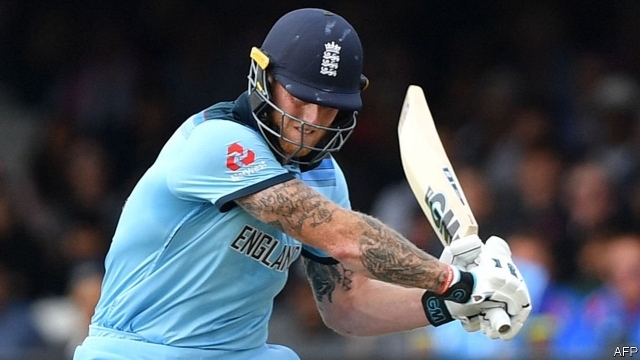

###### Fielding criticism

# Should cricket be free to air on British television? 

 

> print-edition iconPrint edition | Britain | Jul 20th 2019 

HERE’S THE pitch: why not make cricket, that most English of sports, free to air on national television? That is what Jeremy Corbyn, leader of the opposition, committed socialist and noted cricket nut, suggested on Twitter a few minutes after England won the World Cup on July 14th. The final, watched by up to 8m people, was the first England international match to be aired on free television since the Ashes in 2005, after which the sport moved to pay-TV and a far smaller audience. Making it free again could help to boost the popularity of the game, which many consider elitist or dull, the argument goes. And it would be a popular expression of Mr Corbyn’s slogan, “For the many, not the few.” 

Since the 1950s the government has had the power to ensure that big sports events are free to watch. The Broadcasting Act of 1996 designates certain events that qualify, including the Olympic games, Wimbledon and the finals of the football World Cup and FA Cup. A review of the list in 2009 would have removed some events and added lots more, including home cricket matches. But its recommendations were batted away by the Conservative-Lib Dem government in 2010. 

Making cricket free to view would certainly attract a larger audience. But it would also reduce the value of broadcasting rights, and thus the revenues of the England and Wales Cricket Board (ECB), the sport’s governing body, which makes most of its money from sponsorship and rights. That in turn would affect its ability to invest in the sport. 

There are more practical considerations as well. Lasting anywhere between three hours and five days, a cricket match is a rather more time-consuming affair than a game of football or tennis. For dedicated sports broadcasters, such as Sky, this is a godsend. Cricket provides hours of content. For a terrestrial broadcaster such as the BBC, on the other hand, it can be a headache to fit several hours of cricket into an already packed programming schedule. 

Channel 4, which broadcast this year’s final, had to move it to a sister channel, More4, for a period to accommodate the British Grand Prix. “It is an overly simplistic argument to think that the solution for cricket is just to list it and put all the Test [five-day] matches back on free-to-air TV,” says Paul Smith, an expert in sports broadcasting rights at De Montfort University. 

The ECB appears to be willing to sacrifice some revenue to improve the sport’s reach. From next year the BBC will show some Test matches on free television, though Sky will retain the bulk of the live coverage. More important, the BBC has the right to use clips across its digital platforms. Not many Britons can spend all day watching a cricket match and, as media habits shift, the internet is a sensible place to focus efforts to popularise the sport. There seems to be an audience for it: the BBC’s “live” page covering the World Cup final received the highest number of views in the history of the corporation’s website.■ 

Vacancy: The Economist is looking to hire a staff writer to cover British economics. Journalistic experience is not necessary; the ability to write clearly and entertainingly is. For details of how to apply, visit economist.com/britainjob2019. The deadline is August 4th. 
<<<<<<< HEAD

-- 

 单词注释:

1.Jul[]:七月 

2.jeremy['dʒerimi]:n. 杰里米（男子名） 

3.Corbyn[]:科尔宾（人名） 

4.opposition[.ɒpә'ziʃәn]:n. 反对, 敌对, 相反, 在野党 [医] 对生, 对向, 反抗, 反对症 

5.twitter['twitә]:n. 啁啾, 唧唧喳喳声 vi. 啭, 啁啾, 颤抖 vt. 嘁嘁喳喳地讲, 抖动 

6.popularity[.pɒpju'læriti]:n. 名声, 受大众欢迎, 流行 

7.elitist[ei'litist]:n. 优秀人材, 杰出人材 a. 优秀人材的, 杰出人材的 

8.designate['dezigneit]:vt. 指定, 指明, 称呼 a. 已选出而未上任的 

9.Wimbledon['wimbldәn]:温布尔登[英国英格兰东南部城市](位于伦敦附近, 是著名的国际网球比赛地) 

10.FA[fɑ:]:(英国)足球协会, 战地救护车, 野战救护队, 野战炮, 野战炮兵, 美术, 急救 [医] 脂肪酸 

11.DEM[dem]:[计] 解调器 

12.wale[weil]:n. 隆起的伤痕, 鞭痕, 凸条纹, 精华, 选择 vt. 在...上留下鞭痕, 织成棱纹, 挑选, 撑住 vi. 挑选 

13.ECB[]:[计] 事件控制块 

14.sponsorship['spɔnsәʃip]:n. 发起, 倡议, 主办, 保证人的地位, 教父的地位, 教母的地位 

15.dedicate['dedikeit]:vt. 献出, 贡献 

16.broadcaster['brɒ:dkæstә]:n. 播送者, 广播装置, 播种机 

17.godsend['^ɔdsend]:n. 意外的幸运机会, 意外地来得正好的事物, 天赐 

18.terrestrial[tә'restriәl]:n. 地球上的人 a. 地球的, 陆生的, 陆地的, 人间的 

19.BBC[]:英国广播公司 

20.prix[pri:]:n. 奖金, 价格 

21.overly['әuvәli]:adv. 过度地, 极度地 

22.simplistic[sim'plistik]:a. 过分简单化的 

23.paul[pɔ:l]:n. 保罗（男子名） 

24.smith[smiθ]:n. 铁匠, 金属品工匠 [机] 锻造工, 上手 

25.de[di:]:[化] 非对映体过量 [医] 铥(69号元素铥的别名,1916年Eder离得的假想元素) 

26.Montfort['mɔntfәt]:蒙特福特(姓氏) 

27.coverage['kʌvәridʒ]:n. 覆盖的范围, 保险总额, 新闻报导 [化] 可达范围; 覆盖度 

28.clip[klip]:n. 修剪, 夹子, 回形针, 剪下来的东西 vt. 修剪, 痛打, 夹牢, 剪报 vi. 剪报 

29.Briton['britәn]:n. 大不列颠人, 英国人 

30.popularise['pɔpjjlәraiz]:vt.vi. 使通俗化, 使受欢迎, 使大众化, 使普及, 宣传, 推广 

31.economist[i:'kɒnәmist]:n. 经济学者, 经济家 [经] 经济学家 

32.journalistic[,dʒ\\: nә'listik]:a. 新闻业的, 新闻工作者的, 报刊特有的, 新闻工作的 

33.entertainingly[,entə'teiniŋli]:adv. 有趣地；使人愉快地 
=======
>>>>>>> 50f1fbac684ef65c788c2c3b1cb359dd2a904378

