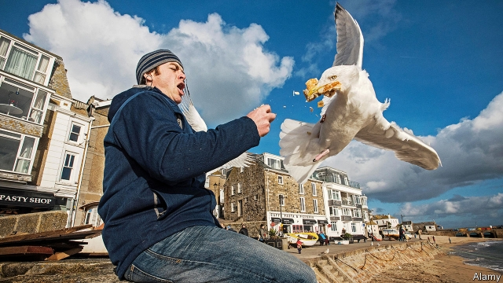
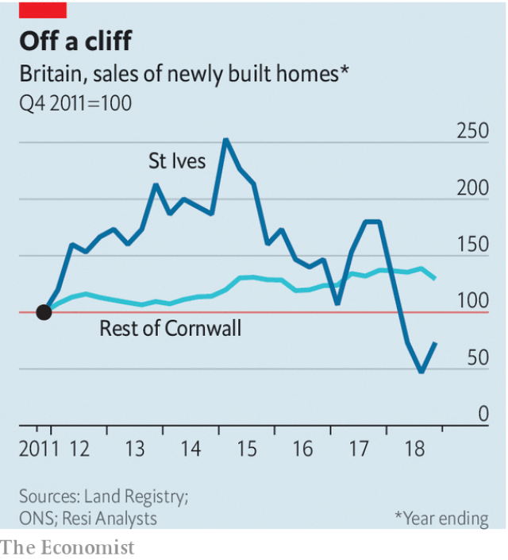

###### Trimming the main sale

# St Ives’s second-home crackdown has unintended consequences 

 

> print-edition iconPrint edition | Britain | Jul 20th 2019 

OUT-OF-TOWNERS have long flocked to St Ives. Artists such as J.M.W. Turner and Barbara Hepworth were drawn to the town’s clear light. Others come for the seafood and sandy beaches. Even the town’s notoriously aggressive seagulls, who dive-bomb unsuspecting tourists and steal their Cornish pasties, are not enough to put off outsiders. But St Ives’s popularity has a downside: visitors dominate the local housing market. 

Locals worry that the town is becoming a playground for rich Londoners, who in the summer months whizz down on the sleeper train from Paddington. At the last count, a quarter of the dwellings in St Ives were second homes or holiday lets. So in May 2016 locals decided to do something about it, voting in a referendum to introduce a “principal-residence policy”, which stops newly built houses in the town from being used as second homes. The thinking went that by stopping holidaymakers from snapping up new-builds, housing would become more affordable to people who live in St Ives all year round. 

Building firms and DIY shops, for whom second-homers are prized customers, opposed the plan. One property firm even challenged the policy in the High Court. But the legal challenge failed and the second-home ban went ahead. Since then a few other Cornish towns have introduced their own versions of the policy. 

Those involved in designing the plan say that, three years on, it is too early to assess its impact. But official statistics suggest that excluding second-home buyers from the new-build market has removed a big source of demand. The price of new homes in the town is 13% below what it might have been if the previous growth rate had continued. 

 

Locals struggling to afford a property may like the sound of this. But it has had an unwelcome side-effect: housebuilding has slumped (see chart). Developers who bought land when it was pricier can in some cases no longer sell homes at a profit. Others may be holding off from breaking ground in the hope that the policy is scrapped. In 2015 Acorn Property Group, a local firm, was about to buy a site for 34 homes, 14 of them “affordable” (ie, sold or let at below-market rates). But the policy made the scheme unviable because the open-market dwellings could no longer subsidise the affordable ones, the company says. 

Construction elsewhere in Cornwall has held up, suggesting that broader factors, such as Brexit-related uncertainty and a national levy on second homes introduced in 2016, are not to blame. 

Meanwhile, second-home buyers in St Ives seem to be shifting their attention to existing buildings, which are not covered by the policy. Data from Hamptons International, a property firm, suggest that in St Ives second-homers form a larger share of transactions than before the policy came into force. Excluding new-builds, prices have continued to climb. That represents a windfall to locals who already own their homes—and may eventually persuade even more of them to cash in and move out.■ 

Vacancy: The Economist is looking to hire a staff writer to cover British economics. Journalistic experience is not necessary; the ability to write clearly and entertainingly is. For details of how to apply, visit economist.com/britainjob2019. The deadline is August 4th. 
<<<<<<< HEAD

-- 

 单词注释:

1.ST[]:[计] 段表, 状态, 系统测试, 直端连接器 [化] 磺胺噻唑 

2.crackdown['krækdaun]:n. 制裁, 镇压, 痛击 

3.unintended['ʌnin'tendid]:a. 不是存心的, 无心的, 非故意的 

4.Jul[]:七月 

5.Ives[aivz]:艾夫斯(①姓氏,男子名②Charles Edward,1874-1954,美国作曲家 ③James Merritt, 1824-1895, 美国石印家) 

6.jmw[]:abbr. Japan Motor Wheel Co.Ltd. 日本车轮工业公司 

7.turner['tә:nә]:n. 车工, 体育协会会员 

8.barbara['bɑ:bәrә]:n. 芭芭拉（女子名） 

9.Hepworth[]:n. (Hepworth)人名；(英)赫普沃思 

10.seafood['si:fu:d]:n. 海味, 海鲜, 鱼类 

11.notoriously[]:adv. 臭名昭著的, 声名狼藉的 

12.unsuspecting[.ʌnsә'spektiŋ]:a. 不怀疑的, 无疑虑的, 信任的 [法] 无怀疑的, 信任的 

13.cornish['kɔ:niʃ]:a. 康沃尔人的；康沃尔郡的 

14.pasty['peisti. 'pæsti]:a. 面糊似的, (脸色)苍白的, 软弱的 n. 肉馅饼 

15.outsider[' aut'saidә]:n. 外人, 局外人, 非会员, 外行, 门外汉, 比赛中获胜可能性不大的选手 [经] 外船公司 

16.popularity[.pɒpju'læriti]:n. 名声, 受大众欢迎, 流行 

17.Londoner['lʌndәnә]:n. 伦敦人 

18.whizz[hwiz]:n. 飕飕声, 精明的人, 专家 v. (使)飕飕作声 

19.sleeper['sli:pә]:n. 睡眠者, 枕木, 卧铺 [法] 睡眠者, 懒人, 死人 

20.paddington['pædiŋtәn]:帕丁顿 

21.referendum[.refә'rendәm]:n. （就重大政治或社会问题进行的）全民公决，全民投票 

22.holidaymaker['hɒlәdi.meikә]:n. 度假者 

23.affordable[]:[计] 普及型 

24.DIY[]:不雇工, 自己动手, 供业余爱好者自己学用的, 自己动手制造和修理用具的主张 

25.statistic[stә'tistik]:n. 统计量 a. 统计的, 统计学的 

26.buyer['baiә]:n. 买主, 买方 [经] 买主, 买方, 买手 

27.unwelcome[ʌn'welkәm]:a. 不受欢迎的, 讨厌的 n. 冷淡 vt. 冷淡地对待, 冷淡地接受 

28.slump[slʌmp]:n. 暴跌, 垂头弯腰的姿态 vi. 猛然掉落, 陷入, 衰落(经济等) 

29.developer[di'velәpә]:n. 开发者 [计] 显影器 

30.pricy['praisi]:a. 昂贵的, 价格高的 

31.scrap[skræp]:n. 碎片, 残余物, 些微, 片断, 铁屑, 吵架 vt. 扔弃, 敲碎, 拆毁 vi. 互相殴打 a. 零碎拼凑成的, 废弃的 

32.acorn['eikɒ:n]:n. 橡树果实 [机] 浆栎, 浆栎果 

33.unviable[ʌn'vaɪəb(ə)l]:a. 不能独立生存的, 不可行的 

34.subsidise[]:vt. 给...补助金, 津贴, 资助 

35.cornwall['kɔ:nwɔ:l]:n. 康沃尔（英格兰西南部一郡, 加拿大城市名） 

36.uncertainty[.ʌn'sә:tnti]:n. 不确定, 不可靠, 不确定的事物 [化] 不确定度 

37.levy['levi]:n. 税款, 所征的人数, 征收 vi. 征税, 课税 vt. 征收, 强求, 召集 

38.datum['deitәm]:n. 论据, 材料, 资料, 已知数 [医] 材料, 资料, 论据 

39.hampton['hæmptәn]:n. 汉普顿（姓氏） 

40.transaction[træn'sækʃәn]:n. 交易, 办理, 学报, 和解协议 [计] 事务处理 

41.windfall['windfɒ:l]:n. 被风吹落的果子, 横财 [经] 意外损失 

42.economist[i:'kɒnәmist]:n. 经济学者, 经济家 [经] 经济学家 

43.journalistic[,dʒ\\: nә'listik]:a. 新闻业的, 新闻工作者的, 报刊特有的, 新闻工作的 

44.entertainingly[,entə'teiniŋli]:adv. 有趣地；使人愉快地 
=======
>>>>>>> 50f1fbac684ef65c788c2c3b1cb359dd2a904378

