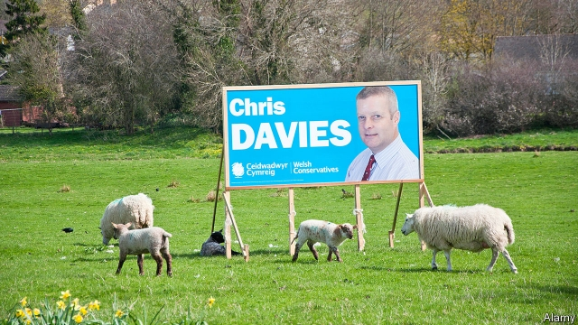

###### A Beacon for Brexit?

# The Brecon by-election is a test for Britain’s next prime minister 

 

> print-edition iconPrint edition | Britain | Jul 20th 2019 

POLITICIANS LONG for voters to think they are just like them. In the Welsh constituency of Brecon and Radnorshire, which is holding a by-election on August 1st, that means demonstrating farming credentials. At a hustings organised by a farmers’ union, the Labour candidate’s claim of agricultural roots is only slightly undermined by his disclosure that he is a lawyer. The woman from the UK Independence Party, who champions culling badgers and hunting foxes, proudly tells the crowd her father was a farmer. But the Brexit Party’s nominee tops them all. His grandfather was a shepherd on the Brecon Beacons, he says: “One horse, one dog, 14 children.” If the candidates could have arrived by tractor, they surely would have done. 

Chris Davies, who won the last election, in 2017, for the Tories with a majority of 8,000, spends much of his time apologising. In April he was convicted of making a false expenses claim after faking two invoices to split a genuine cost (£700, or $870, for office photographs) between two budgets. About 10,000 constituents signed a recall petition, forcing the by-election. Even so, Mr Davies is standing again, hoping his barrister was wrong to claim his career would be in “tatters”. “There was no financial gain in this and no financial intent,” he insists. “It was just a mess-up.” 

But Mr Davies’s expense account does not explain the buzz about the vote in Westminster. That concerns the decision by Plaid Cymru and the Green Party not to field candidates, in order to give a better chance of victory to Mr Davies’s closest rival, Jane Dodds of the Liberal Democrats. Pacts are rare in British politics. But if this pro-Remain alliance pays off, more might follow, particularly if there is a Brexit-themed general election later in the year. On the other side of the divide, polls show Tory members are keen for their party to strike such deals with the Brexit Party. 

The election will also be a significant first test for Britain’s next prime minister, who will take over from Theresa May on July 24th. Mrs May’s government floundered when the Democratic Unionist Party, which props it up, joined hardline Tory backbenchers in refusing three times to endorse her Brexit deal. If Mr Davies is thrown out, as looks likely, the new leader will be left with a working majority of just three, making the government even more vulnerable to a no-confidence vote. Jeremy Hunt and Boris Johnson, rivals for the top job, made this point in a local paper advert last week, claiming Mr Davies would “support us in Parliament to get Brexit done”. 

Even so, Remainers should not get too excited if the Lib Dems win. Since just over half of voters in the constituency backed Brexit in the referendum, Ms Dodds has not made her pro-Remain stance the centrepiece of her campaign. “Westminster couldn’t be further away,” she says, over an ice-cream in a lavender field. Instead she stresses “community issues”, like better broadband and keeping banks and libraries open. Though Ms Dodds praises the courage of the parties who stood aside for her, the pact is unlikely to make much difference: Plaid Cymru won only 3% of the vote in 2017 and the Greens did not stand. 

Tories hope that, in a place where locals cherish generations-old family ties, voters will judge Mr Davies on more than his recent conviction. Some seem willing to accept that he made a mistake. “It’s much ado about nothing,” says one. “I’ve met him a few times and he seems a tidy chap.” At the hustings, a woman struggles to ask a question as a male-voice choir begins a rehearsal upstairs. If the candidates were animals, she asks, what would they be? Mr Davies plumps for a local ram, from “quality stock”. If he defies the bookies’ odds and his barrister’s prediction, he would surely more closely resemble a phoenix. ■ 

Vacancy: The Economist is looking to hire a staff writer to cover British economics. Journalistic experience is not necessary; the ability to write clearly and entertainingly is. For details of how to apply, visit economist.com/britainjob2019. The deadline is August 4th. 
<<<<<<< HEAD

-- 

 单词注释:

1.beacon['bi:kn]:n. 烽火, 灯塔 v. 照亮 

2.Brecon['brekən]:n. 布雷肯（英国威尔士一城镇） 

3.Jul[]:七月 

4.voter['vәutә]:n. 选民, 投票人 [法] 选民, 选举人, 投票人 

5.Welsh[welʃ]:a. 威尔士的 n. 威尔士人 vi. 赖赌帐, 逃避责任 

6.constituency[kәn'stitjuәnsi]:n. 选民, 顾客, 读者 [法] 选区, 全体选民, 选区内的选民 

7.Radnorshire['rædnəʃiə]:n. 拉德诺郡（英国） 

8.credential[kri'denʃәl]:n. 国书, 凭据, 证明书 [经] 凭证, 证书 

9.husting[]:[网络] 匆忙 

10.undermine[.ʌndә'main]:vt. 在...下面挖, 渐渐破坏, 暗地里破坏 [法] 暗中破坏, 以阴谋中伤伤害 

11.disclosure[dis'klәuʒә]:n. 揭发, 泄露, 揭发(或暴露)的事实 [经] 揭示, 披露 

12.UK[ju: 'kei]:n. 联合王国 

13.cull[kʌl]:vt. 采, 摘, 拣 n. 拣出的等外品, 被剔出的动物 

14.badger['bædʒә]:n. 獾, 獾皮毛 vt. 纠缠 

15.proudly['praudli]:adv. 傲慢地, 自大地, 得意洋洋地 

16.Brexit[]:[网络] 英国退出欧盟 

17.nominee[.nɒmi'ni:]:n. 被提名者, 被任命者 [经] 被指定人 

18.beacon['bi:kn]:n. 烽火, 灯塔 v. 照亮 

19.chris[kris]:n. 克里斯（男子名）；克莉丝（女子名） 

20.davy['deivi]:n. 宣誓书 

21.Tory['tɒ:ri]:n. 托利党党员, 保守党员, 亲英分子 a. 保守分子的 

22.apologise[ә'pɔlәdʒaiz]:vi. 道歉（等于apologize） 

23.convict[kәn'vikt]:n. 囚犯, 罪犯 vt. 宣告有罪, 使知罪 

24.fake[feik]:n. 假货, 欺骗, 诡计 a. 假的 vt. 假造, 仿造 vi. 伪装 

25.invoice['invɒis]:n. 发票, 发货单 v. 开发票, 记清单 

26.constituent[kәn'stitjuәnt]:n. 成分, 选民, 构成物 a. 构成的, 组织的, 选举的 

27.petition[pi'tiʃәn]:n. 请愿, 诉状, 陈情书, 申请, 祈求, 祷文 v. 正式请求, 恳求, 请愿 

28.barrister['bæristә]:n. 出庭律师, 律师 [法] 律师, 专门律师, 大律师 

29.tatter['tætә]:n. 破布条, 破衣服, 梭编工人 vt. 把...扯碎 vi. 变破烂 

30.intent[in'tent]:n. 意图, 含义, 故意 a. 专心的, 决心的, 热心的 

31.buzz[bʌz]:n. 嗡嗡声, 流言 vi. 发出嗡嗡声, 说闲话 vt. 使嗡嗡叫, 散布 

32.Westminster['westminstә]:n. 威斯敏斯特 

33.plaid[plæd]:n. 格子花呢披风, 格子花呢, 格子图案 

34.cymru[]: （威尔士语）威尔士 

35.jane[dʒein]:n. 简（女子名） 

36.Dodds[]:n. 多兹（姓氏） 

37.democrat['demәkræt]:n. 民主人士, 民主主义者, 民主党党员 [经] 民主党 

38.pact[pækt]:n. 契约, 协定, 条约 [化] 合同 

39.politic['pɒlitik]:a. 精明的, 明智的, 策略的 

40.alliance[ә'laiәns]:n. 联盟, 联合 [法] 同盟, 联盟, 联姻 

41.Tory['tɒ:ri]:n. 托利党党员, 保守党员, 亲英分子 a. 保守分子的 

42.theresa[ti'ri:zә]:n. 特丽萨（女子名） 

43.Mr['mistә(r)]:先生 [计] 存储器回收程序, 多重请求 

44.flounder['flaundә]:vi. 挣扎, 折腾；错乱地做事或说话 

45.unionist['ju:njәnist]:n. 工会会员, 工联主义者 [法] 工会会员, 工会主义者 

46.prop[prɒp]:n. 支柱, 支持者, 倚靠人, 道具, 螺旋桨 vt. 支撑, 维持 

47.hardline[]:n. 强硬路线 [电] 硬线 

48.backbencher['bækbentʃә]:n. 后座议员 

49.endorse[in'dɒ:s]:vt. 支持, 赞同, 背书于, 签署 [经] 赞成, 背书 

50.vulnerable['vʌlnәrәbl]:a. 易受伤害的, 有弱点的, 易受影响的, 脆弱的, 成局的 [医] 易损的 

51.jeremy['dʒerimi]:n. 杰里米（男子名） 

52.boris['bɔris]:n. 鲍里斯（男子名） 

53.johnson['dʒɔnsn]:n. 约翰逊（姓氏） 

54.advert[әd'vә:t]:vi. 提出看法, 引起注意, 留意 n. 广告 

55.remainers[]:[网络] 剩余物 

56.lib[lib]:a. [口]解放的（等于liberal）；解放论者的 

57.DEM[dem]:[计] 解调器 

58.referendum[.refә'rendәm]:n. （就重大政治或社会问题进行的）全民公决，全民投票 

59.stance[stæns]:n. 准备击球姿势, 站立的姿势, 位置, 姿态 [经] 地位, 形势 

60.centrepiece['sentәpi:s]:n. 中心装饰品 

61.lavender['lævindә]:n. 熏衣草, 淡紫色 a. 淡紫色的 vt. 用熏衣草熏 

62.broadband['brɔ:dbænd]:[计] 宽带 

63.cherish['tʃeriʃ]:vt. 珍爱, 怀有, 爱护 

64.conviction[kәn'vikʃәn]:n. 定罪, 信服, 坚信 [法] 定罪, 证明有罪, 判罪 

65.ado[ә'du:]:n. 纷扰, 忙乱, 麻烦 

66.chap[tʃæp]:n. 小伙子, 颌, 龟裂 v. 皲裂 

67.plump[plʌmp]:a. 圆胖的, 丰满的, 直接下落的, 直率的 vt. 突然放下, 支持, 使丰满, 使鼓起 vi. 扑通落下, 投票赞成, 变丰满, 鼓起 adv. 沉重地, 突然地, 直截了当地 

68.ram[ræm]:n. 公羊, 撞锤 vi. 猛击, 撞 vt. 猛击, 填塞, 反复灌输 n. 只读内存, 随机存取内存, 随机存取存储器 [计] 随机存取存储器 

69.defy[di'fai]:vt. 藐视, 挑衅, 使落空 n. 挑战 

70.odds[ɒdz]:n. 可能性, 几率, 机会, 胜算, 不平等 

71.prediction[pri'dikʃәn]:n. 预言, 预报 [化] 预测 

72.phoenix['fi:niks]:n. 凤凰, 不死鸟, 死而复生的人, 完人, 殊品 

73.economist[i:'kɒnәmist]:n. 经济学者, 经济家 [经] 经济学家 

74.journalistic[,dʒ\\: nә'listik]:a. 新闻业的, 新闻工作者的, 报刊特有的, 新闻工作的 

75.entertainingly[,entə'teiniŋli]:adv. 有趣地；使人愉快地 
=======
>>>>>>> 50f1fbac684ef65c788c2c3b1cb359dd2a904378

