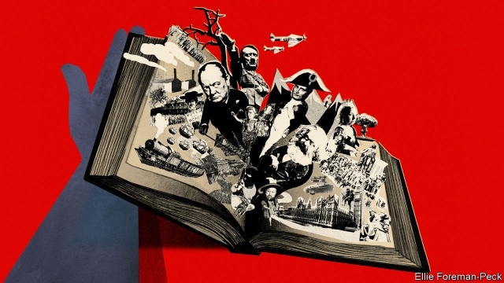

###### Bagehot

# The study of history is in decline in Britain 

 

> print-edition iconPrint edition | Britain | Jul 20th 2019 

WHATEVER YOU think about recent events in Britain, you cannot deny that they qualify as historic. The country is trying to make a fundamental change in its relationship with the continent. The Conservative Party is in danger of splitting asunder and handing power to a far-left Labour Party. All this is taking place against the backdrop of a fracturing of the Western alliance and a resurgence of authoritarian populism. 

Yet even as history’s chariot thunders at a furious pace, the study of history in British universities is in trouble. The subject used to hold a central position in national life. A scholarship to read history at one of the ancient universities was both a rite of passage for established members of the elite and a ticket into the elite for clever provincial boys, as Alan Bennett documented so touchingly in his play “The History Boys”. Prominent historians such as A.J.P. Taylor and Hugh Trevor-Roper were public figures who spoke to the nation about both historical and contemporary events. The Sunday Times had Trevor-Roper on retainer to write special reports on big news stories and Taylor’s televised lectures attracted millions of viewers. 

This was as it should be. Britain is a small island with a gigantic history, and history connects it with the wisdom of the ages. But something has gone badly wrong of late. Even as history itself has become more dramatic, the study of history has shrivelled. The number reading it at university has declined by about a tenth in the past decade. The number studying languages, which often have a historical component, has fallen by a fifth—hardly an auspicious start for “global Britain”. Students have instead been stampeding into overtly practical subjects such as medicine, veterinary sciences and business studies. 

At the same time, the historical profession has turned in on itself. Historians spend their lives learning more and more about less and less, producing narrow PhDs and turning them into monographs and academic articles, in the hamster-wheel pursuit of tenure and promotion. The need to fill endless forms to access government funding adds the nightmare of official bureaucracy to the nightmare of hyper-specialisation. And historians increasingly devote themselves to subjects other than great matters of state: the history of the marginal rather than the powerful, the poor rather than the rich, everyday life rather than Parliament. These fashions were a valuable corrective to an old-school history that focused almost exclusively on the deeds of white men, particularly politicians. But they have gone too far. Indeed, some historians almost seem to be engaged in a race to discover the most marginalised subject imaginable. What were once lively new ideas have degenerated into tired orthodoxies, while vital areas of the past, such as constitutional and military affairs, are all but ignored. 

The people who pay the heaviest price for this are the students who choose to spend several years of their lives, and many thousands of pounds, studying history. Under the old dispensation, students at least acquired a general sense of the history of their own country. Today, they often study a mish-mash of special subjects that don’t have much to hold them together, let alone provide a sense of broad historical development. The general public is also short-changed. Senior historians used to think that their job included talking to the nation and setting current events in their historical context. For the most part today’s historians remain isolated in their professional cocoons, spending more time fiddling with their footnotes than bringing the past to light for a broader audience. Who outside academia has heard of Lyndal Roper, the current Regius professor of history at Oxford? 

The obvious reason to worry about this is that there is more than a little truth in the old adage that those who don’t learn from history are condemned to repeat it. The world seems to be determined to copy the mistakes of the 1930s and ’40s, with Donald Trump recycling the isolationist rhetoric of America Firsters and Jeremy Corbyn embracing a failed socialist ideology. History is a safeguard against this kind of Utopianism. One of the reasons the world is in such a mess is that neoliberals became carried away with their own ideology. They made all sorts of unrealistic promises, about abolishing the boom-bust cycle or bringing democracy to the Middle East, that a moment’s reflection on history would have exploded. 

The study of history is also a safeguard against myopia. Modernity shrinks time as well as space; people live in an eternal present of short-term stimuli and instant gratification. History teaches them to broaden their horizons and shift their perspectives. On a more mundane level, history can be a safeguard against outright idiocy. The Northern Ireland secretary, Karen Bradley, might not have expressed surprise that Protestants and Catholics in the province vote along sectarian lines if she had spent, say, an hour studying the history of the province over which she presides. 

There are glimmers of hope. Britain still has historians with a genius for bringing their subject alive, such as Tom Holland, Sir Simon Schama and Dame Mary Beard. History festivals are booming. The decline in the number of students reading the subject has not been as precipitous as in America. But these are no more than glimmers. A striking number of Britain’s bestselling historians either don’t have academic jobs (like Mr Holland) or face brickbats and backbiting from their fellow professionals (as Dame Mary does). The public’s voracious appetite for military history, so clearly demonstrated during the D-day celebrations, is catered for almost entirely by non-academics such as Sir Max Hastings and Sir Antony Beevor. Historians need to escape from their intellectual caves and start paying more attention to big subjects such as the history of politics, power and nation-states. The extraordinary times that we are living through demand nothing less. ■ 

Vacancy: The Economist is looking to hire a staff writer to cover British economics. Journalistic experience is not necessary; the ability to write clearly and entertainingly is. For details of how to apply, visit economist.com/britainjob2019. The deadline is August 4th. 

-- 

 单词注释:

1.Bagehot[ˈbædʒət]:白芝浩；巴杰特（人名） 

2.Jul[]:七月 

3.cannot['kænɒt]:aux. 无法, 不能 

4.historic[hi'stɒrik]:a. 历史上著名的, 有历史性的 

5.asunder[ә'sʌndә]:adv. 分开, 散, 碎 

6.backdrop['bækdrɒp]:n. 背景幕, 背景 

7.fracture['fræktʃә]:n. 破碎, 骨折 v. (使)破碎, (使)破裂 

8.alliance[ә'laiәns]:n. 联盟, 联合 [法] 同盟, 联盟, 联姻 

9.resurgence[ri'sә:dʒәns]:n. 再起, 复活, 再现 

10.authoritarian[ɒ:.θɒri'tєәriәn]:a. 独裁的, 独裁主义的 

11.Populism['pɒpjulizm]:n. 平民主义, 民粹主义 

12.chariot['tʃæriәt]:n. 二轮战车 

13.rite[rait]:n. 仪式, 典礼, 惯例, 礼拜式 

14.elite[ei'li:t]:n. 精华, 精锐, 中坚分子 

15.provincial[prә'vinʃәl]:n. 外地人, 粗野的人 a. 省的, 外地的, 偏狭的 

16.alan['ælәn]:n. 艾伦（男子名） 

17.bennett['benit]:n. 班尼特（男子名, 等于Benedict） 

18.touchingly['tʌtʃɪŋlɪ]:adv. 令人同情地, 感人地, 动人地 

19.historian[hi'stɒ:riәn]:n. 历史学家, 记事者 

20.AJP[]:Additional-Jobs Programme (New Zealand) 其他工作计划(新西兰) 

21.taylor['teilә]:n. 泰勒 

22.hugh[hju:]:n. 休（男子名） 

23.retainer[ri'teinә]:n. 家臣, 侍从, 保持者 [化] 保持器; 定位器; 隔栅; 隔环; 护圈; 止动器; 止动装置 

24.televise['telivaiz]:v. 用电视播放, 播映 

25.gigantic[dʒai'gæntik]:a. 巨人般的, 巨大的 

26.shrivel['ʃrivl]:v. (使)起皱纹, (使)枯萎, (使)束手无策 

27.auspicious[ɒ:'spiʃәs]:a. 吉兆的, 幸运的 

28.stampede[stæm'pi:d]:v. (使)惊跑, (使)蜂拥 n. 惊跑, 蜂拥 

29.overtly['әuvә:tly. әu'vә:tly]:adv. 明显地；公开地, 公然地 

30.veterinary['vetәrinәri]:a. 兽医的 n. 兽医 

31.les[lei]:abbr. 发射脱离系统（Launch Escape System） 

32.phd[]:abbr. 哲学博士学位（Doctor of Philosophy） 

33.monograph['mɒnәgrɑ:f]:n. 专题论文, 专著, 专刊 vt. 写专题论文 

34.tenure['tenjuә]:n. 享有, 保有期 [经] (财产,职位等的)占有, 占有权 

35.promotion[prәu'mәuʃәn]:n. 晋级, 创建, 增进 [经] 推广, 推销, 促进 

36.nightmare['naitmєә]:n. 梦魇, 恶梦, 可怕的事物(或情景、人物) [医] 梦魇, 恶梦 

37.bureaucracy[bjuә'rɒkrәsi]:n. 官僚, 官吏 [法] 官僚主义, 官僚政治, 官僚机构 

38.marginal['mɑ:dʒinәl]:a. 边缘的, 最低限度的, 有旁注的 [医] 缘的 

39.corrective[kә'rektiv]:a. 纠正的, 改正的, 矫正的 n. 改善法, 矫正物 

40.marginalise['mɑ:dʒɪnəlaɪz]:v. 使显得微不足道；使处于边缘；使无实权 

41.imaginable[i'mædʒinәbl]:a. 可想像的, 可能的 

42.degenerate[di'dʒenәreit]:a. 堕落的 vi. 退化, 堕落 vt. 使变质, 使退化 

43.orthodoxy['ɒ:θәdɒksi]:n. 正统说法, 正教, 信奉正教 

44.constitutional[.kɒnsti'tju:ʃәnl]:a. 宪法的, 立宪的, 体质的 [医] 全身的; 体质的 

45.dispensation[.dispen'seiʃәn]:n. 分配, 施与, (义务的)免除 [法] 特免权, 豁免, 执行 

46.context['kɒntekst]:n. 上下文, 背景, 来龙去脉 n. 上下文 [计] 上下文 

47.cocoon[kә'ku:n]:n. 茧 [医] 茧 

48.fiddle['fidl]:n. 小提琴, 提琴类乐器 vt. 虚度时光, 拉小提琴 vi. 拉小提琴, (无目的地)拨弄, 瞎搞 

49.footnote['futnәut]:n. 脚注 [计] 脚注 

50.academia[.ækә'di:miә]:n. 学术界, 学术生涯 

51.lyndal[]:[网络] 林妲儿；琳道 

52.roper['rәjpә(r)]:n. 制绳者, <美>用索套捕牲口的牧人,诱人进入赌场者 

53.regius['ri:dʒiәs]:a. 钦定的, 皇家的 

54.adage['ædidʒ]:n. 格言, 谚语 

55.recycling[]:[电] 再循环 

56.isolationist[.aisә'leiʃәnist]:n. 孤立主义者 

57.rhetoric['retәrik]:n. 修辞, 修辞学, 雄辩(术) 

58.firsters[]:[网络] 先人 

59.jeremy['dʒerimi]:n. 杰里米（男子名） 

60.Corbyn[]:科尔宾（人名） 

61.ideology[.aidi'ɒlәdʒi]:n. 思想体系, 意识形态, 观念学, 空论 [医] 观念学, 观念形态 

62.safeguard['seifgɑ:d]:n. 保卫, 保护措施, 防护设施 vt. 保卫, 保护 

63.utopianism[ju:'tәupiәnizm]:n. 乌托邦思想, 空想的社会改良方案 

64.neoliberal[ˌni:əʊ'lɪbərəl]:n. 新自由主义者 

65.unrealistic[.ʌnriә'listik]:a. 不切实际的, 幻想的 

66.myopia[mai'әupiә]:n. 近视 [医] 近视 

67.modernity[mɒ'dә:nәti]:n. 现代性, 现代状态, 现代东西 

68.eternal[i'tә:nl]:a. 永恒的, 永远的, 不灭的 

69.stimulus['stimjulәs]:n. 刺激, 激励, 刺激品 [医] 刺激特, 刺激 

70.gratification[.grætifi'keiʃәn]:n. 令人满足的事(或物), 满足, 喜悦 [医] 愿望满足, 满意 

71.broaden['brɒ:dn]:vi. 变宽, 扩大 vt. 放宽, 使扩大 

72.mundane['mʌndein]:a. 现世的, 世俗的, 宇宙的 

73.outright['autrait]:a. 率直的, 完全的, 总共的, 直率的 adv. 完全地, 率直地, 立刻地, 一直向前 

74.idiocy['idiәsi]:n. 白痴, 极端愚蠢 [医] 白痴 

75.karen['kɑ:rәn]:n. 凯伦（人名）；克伦邦（缅甸邦名） 

76.bradley['brædli]:n. 布兰得利（男子名） 

77.Protestant['prɒtistәnt]:n. 新教徒 a. 新教的, 新教徒的 

78.sectarian[sek'tєәriәn]:a. 宗派的, 党派的, 偏狭的 n. 宗派成员, 闹宗派的人 

79.preside[pri'zaid]:vi. 统辖, 当主人, 主持 [法] 主持, 负责, 指挥 

80.glimmer['glimә]:n. 一丝光线, 微光, 少许 vi. 发微光 

81.tom[tɒm]:n. 雄性动物, 雄猫 

82.Holland['hɒlәnd]:n. 荷兰 

83.simon['saimәn]:n. 西蒙（男子名） 

84.schama[]:[网络] 莎玛 

85.dame[deim]:n. 夫人 

86.mary['meәri]:n. 玛丽（女子名） 

87.precipitous[pri'sipitәs]:a. 陡峭的, 轻率的 

88.bestselling[]:a. 畅销的 

89.brickbat['brikbæt]:n. 碎砖, 砖片, 侮辱 

90.backbit[]:backbite的过去式 

91.voracious[vә'reiʃәs]:a. 贪吃的, 狼吞虎咽的, 贪婪的 

92.entirely[in'taiәli]:adv. 完全, 全然, 一概 

93.MAX[mæks]:[计] 最大 

94.hasting[heistɪŋ]:v. 急忙, 匆忙( haste的现在分词 ) 

95.Antony[]:n. 安东尼（男子名） 

96.beevor[]: [人名] [英格兰人姓氏] 比弗 Beaver的变体 

97.politic['pɒlitik]:a. 精明的, 明智的, 策略的 

98.economist[i:'kɒnәmist]:n. 经济学者, 经济家 [经] 经济学家 

99.journalistic[,dʒ\\: nә'listik]:a. 新闻业的, 新闻工作者的, 报刊特有的, 新闻工作的 

100.entertainingly[,entə'teiniŋli]:adv. 有趣地；使人愉快地 

