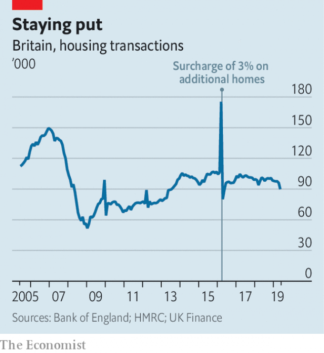

###### Weak foundations

# Wobbles in Britain’s housing market may augur something worse 

 

> print-edition iconPrint edition | Britain | Jul 20th 2019 

JUST OVER a decade ago, in an obscure corner of the economy, there was an early warning sign that Britain was about to fall into recession. Months before the downturn had been confirmed, the maker of Dulux paints reported that sales of its decorative range were down. Faced with global economic uncertainty and a weakening labour market, Britons were cutting back on refurbishment. At the same time, lower demand for new houses meant that builders needed fewer materials. 

What was first seen in the market for paints eventually spread to other parts of the property sector—and from there to the rest of the economy. Over a fifth of Britain’s building firms ultimately went under. Surveyors, estate agents and solicitors suffered. In all, falling housing investment accounted for a quarter of the drop in GDP in 2008-09. It played an even bigger role in the recessions of 1975, 1980-81 and 1990-91. 

 

So it is ominous that the housing market is again looking weak. In the past two years real house prices in London have fallen by a tenth (and by 5% in nominal terms). The rest of the country is now following suit; for the first time since 2013 real prices are falling year-on-year (see chart). There is growing evidence that, as in 2008, weakness in the housing market is dragging down overall economic growth. 

A few factors explain the slowdown. One is a tax reform in 2016 that subjected buy-to-let investors to higher stamp duty, a tax on property purchases. Another is the fact that foreign buyers, who snap up London flats as investments and status symbols, are giving Brexit Britain a wider berth. Tighter monetary policy is also playing a role. Since November 2017 the Bank of England has raised interest rates from 0.25% to 0.75%. That has pushed up average mortgage rates, meaning Britons cannot borrow as much. (It also means that, despite falling prices, for most people housing is no more affordable than it was before.) 

As prices have dropped, so has the number of transactions. In May the number of properties changing hands was 10% lower than a year earlier. A measure of buyers’ inquiries fell for ten consecutive months to May, before rallying slightly in June. Boris Johnson, the probable next prime minister, has floated the idea of reducing stamp duty, which could gee up the market—but buyers may be putting off their purchases until such a cut happens. 

 

The supply side of the market is also taking a hit. In recent decades the housing market has often seemed like a one-way bet, with real house prices rising faster than in any other G7 country. Now, confronted by falling prices, sellers of land are putting their plans on hold. A land-buyer for one of the big housebuilding companies complains that finding plots for sale has become more difficult. 

Even when developers have land, they seem increasingly reluctant to build on it. Not long ago they were firing on all cylinders, putting up 140,000 private homes in England in 2018, the most since before the financial crisis. Yet many now complain that in parts of the country, especially the south-east, there is an oversupply of properties. (This may in fact mean simply that they are not making quite such fat profits per house as they once did. Most economists believe Britain continues to need far more homes to bring down what are still sky-high prices.) The Bank of England’s “agents”, who speak to firms across the country, report that housebuilders have scaled back some large projects. Data from Glenigan, a consultancy, suggest that the number of residential projects acquiring planning permission fell during 2018. 

A weak housing market comes at a bad time. Survey data suggest that GDP did not grow in the second quarter of 2019, one reason why sterling has been sliding (see Finance section). Some economists believe the second-quarter readings are misleadingly low, because firms brought forward purchases of components to stockpile ahead of March 29th, the original Brexit date, and so spent the second quarter using them up. But it would not take much for growth to slip into negative territory. On July 18th the official Office for Budget Responsibility warned that a no-deal Brexit would tip Britain into recession. 

One worry is that declining house prices will dent consumer confidence, which is already low. Research on the American market finds that homeowners feel poorer if the value of their house is falling, which in turn leads them to reduce their spending. Yet studies by the Bank of England suggest that in Britain the vagaries of the property market have only a small effect on consumption. Household spending is holding up fairly well so far. 

The current weakness of the British economy is really a story about investment, which has stagnated since 2017. Capital spending on transport equipment and computers is dropping. The decline in housing transactions explains why investment in homes, which accounts for a quarter of the total, is also looking weak. Builders report that it is easier to find workers and materials than it was a few months ago, suggesting that they have plenty of spare capacity. And the market for paint is again flashing red: last year British firms’ sales of the stuff dropped by 2.4%. 

The housing market could well get worse before it gets better. Help to Buy, a government lending initiative which has boosted house prices and transactions, will start to be wound down in 2021. Yet this is but a gentle gust in comparison with the tornado of a no-deal Brexit, which could strike on October 31st. The Bank of England recently outlined a possible scenario in which no-deal was associated with a one-third drop in house prices. Another recession which starts in the housing market may not be far away. ■ 

Vacancy: The Economist is looking to hire a staff writer to cover British economics. Journalistic experience is not necessary; the ability to write clearly and entertainingly is. For details of how to apply, visit economist.com/britainjob2019. The deadline is August 4th. 

-- 

 单词注释:

1.wobble['wɒbl]:n. 摆动, 摇晃, 不稳定, 抖动 vi. 摇晃, 摇摆, 游移不定 vt. 使摇摆, 使颤动 

2.augur['ɒ:gә]:n. 占卜官, 预言者 v. 预示, 预言 

3.Jul[]:七月 

4.recession[ri'seʃәn]:n. 后退, 凹处, 衰退, 归还 [医] 退缩 

5.downturn['dauntә:n]:n. (尤指经济方面的)衰退, 下降趋势 [电] 低迷时期 

6.maker['meikә]:n. 制造者, 上帝 [经] 制造者, 出票人 

7.dulux['dʌlәks]:醇酸树脂 

8.decorative['dekәreitiv]:a. 装饰性的 

9.uncertainty[.ʌn'sә:tnti]:n. 不确定, 不可靠, 不确定的事物 [化] 不确定度 

10.Briton['britәn]:n. 大不列颠人, 英国人 

11.refurbishment[]:n. 整修; 翻新; 重新磨亮 

12.builder['bildә]:n. 建立者 [机] 组份 

13.surveyor[sә'veiә. sә:-]:n. 测量员；检验员 

14.solicitor[sә'lisitә]:n. (英)律师, 初级律师, (美)法务官, (美)掮客, 游说者, (美)募捐者 [经] 募损者, 律师 

15.ominous['ɒminәs]:a. 恶兆的, 不吉利的, 预兆的 

16.nominal['nɒminl]:a. 名义上的, 名字的, 有名无实的, 稍许的 n. 名词性词 

17.slowdown['slәudaun]:n. 降低速度, 减速 

18.investor[in'vestә]:n. 投资者 [经] 投资者 

19.buyer['baiә]:n. 买主, 买方 [经] 买主, 买方, 买手 

20.statu[]:[网络] 状态查看；雕像；特级雪花白 

21.Brexit[]:[网络] 英国退出欧盟 

22.berth[bә:θ]:n. 船岸之间的水区, 锚地, 卧铺 vi. 停泊 vt. 使停泊 

23.monetary['mʌnitәri]:a. 货币的, 金钱的 [经] 货币的, 金融的 

24.mortgage['mɒ:gidʒ]:n. 抵押, 约束性义务, 抵押借款 vt. 抵押, 以...作担保, 把...许给 

25.cannot['kænɒt]:aux. 无法, 不能 

26.affordable[]:[计] 普及型 

27.transaction[træn'sækʃәn]:n. 交易, 办理, 学报, 和解协议 [计] 事务处理 

28.consecutive[kәn'sekjutiv]:a. 连续的, 联贯的 [计] 连续的; 连接的 

29.rally['ræli]:n. 重振旗鼓, 集合, 群众集会, 跌停回升 v. 重整旗鼓, 集合, 恢复精神, 团结, 挖苦, 嘲笑 

30.boris['bɔris]:n. 鲍里斯（男子名） 

31.johnson['dʒɔnsn]:n. 约翰逊（姓氏） 

32.gee['dʒi:]:n. 马, 家伙 interj. 向右, 前进, 哎呀(惊讶时所发声音) v. (使)向右转 

33.confront[kәn'frʌnt]:vt. 使面对, 对抗, 遭遇, 使对质, 比较 [法] 对证, 使对质, 比较 

34.developer[di'velәpә]:n. 开发者 [计] 显影器 

35.cylinder['silindә]:n. 圆筒, 圆筒状物, 汽缸, 柱面 [计] 柱面 

36.oversupply[.әuvәsә'plai]:vt. 过度供给 n. 过多的供应品 

37.economist[i:'kɒnәmist]:n. 经济学者, 经济家 [经] 经济学家 

38.housebuilder[]: [医]造房工 

39.datum['deitәm]:n. 论据, 材料, 资料, 已知数 [医] 材料, 资料, 论据 

40.consultancy[]:n. 商量, 协商, 磋商, 会诊, 与...商量, 咨询, 请教, 找(医生)看病, 查阅, 考虑 [经] 咨询业务, 咨询服务 

41.residential[.rezi'denʃәl]:a. 住宅的, 与居住有关的 [法] 有关居住的, 房产的:居所的, 适于居住的 

42.sterling['stә:liŋ]:n. 英国货币, 标准纯银 a. 英国货币的, 标准纯银的, 含标准成分的 

43.misleadingly[mis'li:diŋli]:adv. 误导地 

44.stockpile['stɒkpail]:n. 储蓄, 积蓄, 库存 vt. 储蓄, 贮存 

45.dent[dent]:n. 凹痕 vt. 使凹下, 削弱 vi. 塌陷 

46.homeowner['hәum.әunә]:n. 私房屋主；自己拥有住房者 

47.vagary['veigәri]:n. 狂想, 奇特行为, 奇想 

48.stagnate['stægneit]:v. (使)淤塞, (使)停滞, (使)变萧条 

49.gust[gʌst]:n. 突然一阵, 趣味, 爱好 

50.tornado[tɒ:'neidәu]:n. 旋风, 龙卷风, 大雷雨 

51.scenario[si'nɑ:riәu]:n. 剧本提纲, 情节, 剧本, 方案, 事态 [计] 方案 

52.economist[i:'kɒnәmist]:n. 经济学者, 经济家 [经] 经济学家 

53.journalistic[,dʒ\\: nә'listik]:a. 新闻业的, 新闻工作者的, 报刊特有的, 新闻工作的 

54.entertainingly[,entə'teiniŋli]:adv. 有趣地；使人愉快地 

