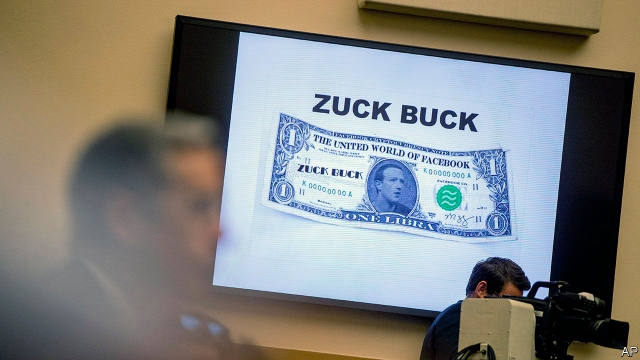
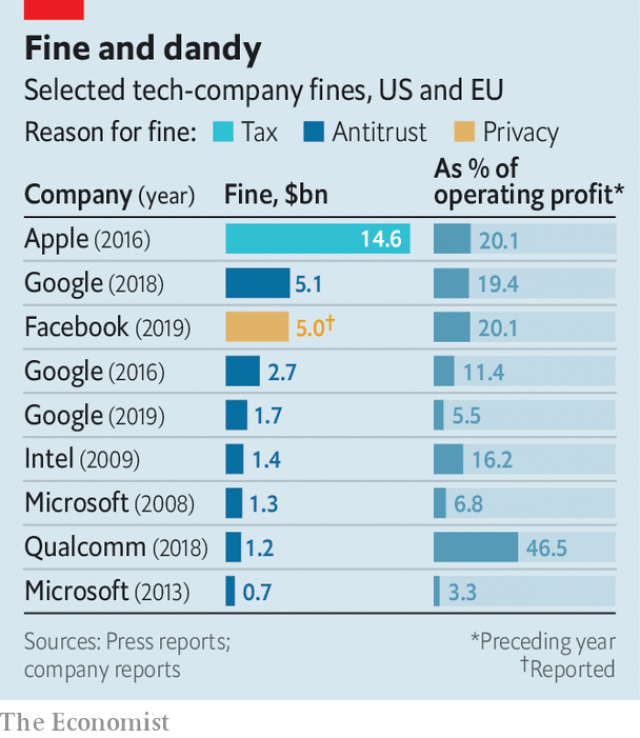

###### Volte-face

# Facebook says it will behave better from now on 

 

> print-edition iconPrint edition | Business | Jul 20th 2019 

THE SCENE is becoming familiar: a Facebook executive is hauled before Congress in Washington, DC; a public grilling ensues. At least on July 16th and 17th American lawmakers looked better prepared than they were a year ago when they displayed little idea of Facebook’s business during hearings over its failure to stop a rogue consultancy from harvesting data on 50m users without permission. This time David Marcus fielded mostly sensible questions about the social network’s nascent cryptocurrency project, Libra, which he heads. Would transaction data be mined for valuable spending patterns? How will Facebook make money from Libra, which is to be governed by an independent body based in Switzerland? 

Mr Marcus offered reasonable answers. User consent will be required to mine transaction data; money will come from advertisers, happy to pay to gain access to consumers more willing to part with their money thanks to easier online payments. The big question on everybody’s mind was different, however: why on Earth would scandal-plagued Facebook launch a global financial instrument at all? 

 

The query is all the more relevant in light of a decision days earlier by the Federal Trade Commission to fine the company $5bn for its recent misuse of user data. If approved by the Department of Justice, as looks likely, the penalty will be the largest that the American government has ever meted out to a technology company (the EU has been harsher, see chart). 

Facebook seems eager to convince governments that, despite piles of evidence to the contrary, it can be trusted. Mark Zuckerberg, Facebook’s boss, has called for more regulation of Big Tech, including his firm. On Capitol Hill Mr Marcus promised that Libra, and the division of Facebook which is meant to monetise it, Calibra, would not launch until the concerns of American lawmakers have been allayed. It now asks for permission rather than forgiveness, Mr Marcus appeared to be saying, not the other way around as in its youth. 

Facebook’s new, mature face plays well with investors. After a year of scandal and abysmal press, its share price is just shy of record highs. It gained more than 1% on the news of the latest fine, which had already been priced in thanks to astute telegraphing earlier this year—a sign, perhaps, of a good working relationship with the American regulator. A Facebook which works with governments rather than around them appeals to shareholders. 

So does Facebook’s ability to rake in money. The growth of its core social network is slowing down (see Graphic detail). But revenues from Instagram, its popular photo-sharing app, are growing apace. It has yet to realise the money-spinning potential of WhatsApp, its messaging service. Analysts expect Facebook’s second-quarter results, due out on July 24th, to show revenues up by 25% from last year, to $16.3bn. Unlike profits at some other technology firms (see article), its net income is expected to rise, by 6% to $5.4bn—more than enough to cover the fine. 

Facebook is not out of the woods. Other regulators and politicians are lining up to take a swipe at Big Tech, and not just in America. Financial authorities are leery of Libra, worrying that it could become a vehicle for fraud and money laundering, as happened with some other cryptocurrencies. Central bankers fear that if adopted widely enough it could threaten financial stability. On July 16th Ursula von der Leyen, president-elect of the European Commission, the EU’s executive arm, said she wants the tech giants to pay more taxes. The next day the bloc’s competition chief, Margrethe Vestager, announced a probe into Amazon’s use of merchant data. In some countries data-protection regulators want to order non-compliant companies to stop processing data altogether. That would hurt considerably more than a fine.■ 

-- 

 单词注释:

1.facebook[]:n. 脸谱网 

2.Jul[]:七月 

3.haul[hɒ:l]:n. 用力拖拉, 拖运, 强拉, 捕获量, 拖运距离 vi. 拖, 拉, 改变方向, 改变主意 vt. 拖拉, 拖运 

4.Washington['wɒʃiŋtn]:n. 华盛顿 

5.DC[]:直流电 [计] 数据单元, 数据中心, 数据代码, 数据通信, 数据控制, 数字控制, 直流 

6.ensue[en'su:]:vi. 跟着发生, 继起 vt. 追求 

7.lawmaker[lɒ:'meikә]:n. 立法者 

8.rogue[rәug]:n. 恶棍, 流氓, 小淘气 vt. 欺骗 vi. 游手好闲 

9.consultancy[]:n. 商量, 协商, 磋商, 会诊, 与...商量, 咨询, 请教, 找(医生)看病, 查阅, 考虑 [经] 咨询业务, 咨询服务 

10.datum['deitәm]:n. 论据, 材料, 资料, 已知数 [医] 材料, 资料, 论据 

11.david['deivid]:n. 大卫；戴维（男子名） 

12.Marcus['mɑ:kәs]:n. 马库斯（男子名） 

13.nascent['næsnt]:a. 发生中的, 开始存在的, 初期的 [医] 初发的, 初生的 

14.cryptocurrency[]:加密货币 

15.libra['laibrә]:n. 磅, 天秤座 [医] 磅 

16.transaction[træn'sækʃәn]:n. 交易, 办理, 学报, 和解协议 [计] 事务处理 

17.advertiser['ædvәtaizә]:n. 做广告者, 广告客户 [经] 广告商, 广告者 

18.online[]:[计] 联机 

19.query['kwiәri]:n. 疑问, 疑问号, 质问, 查询 v. 询问, 质问 [计] 查询 

20.misuse[.mis'ju:z]:n. 误用, 滥用 vt. 误用, 滥用, 虐待 

21.penalty['penәlti]:n. 处罚, 刑罚, 罚款, 罚球, 报应, 不利结果, 妨碍 [经] 罚金(款), 违约金 

22.mete[mi:t]:vt. 量, 测量, 分配 n. 边界, 界石 

23.EU[]:[化] 富集铀; 浓缩铀 [医] 铕(63号元素) 

24.zuckerberg[]:扎克伯格 

25.tech[tek]:n. 技术学院或学校 

26.Capitol['kæpitl]:n. 国会大厦, 州议会大厦, 朱比特神庙 

27.monetise['mʌnitaiz]:vt. 使货币化；把…定位法定货币（等于monetize） 

28.Calibra[]:n. 卡里布拉（一款进口车车名） 

29.allay[ә'lei]:vt. 使平静, 使缓和 

30.forgiveness[fә'givnis]:n. 宽恕, 宽仁之心 

31.investor[in'vestә]:n. 投资者 [经] 投资者 

32.abysmal[ә'bizmәl]:a. 深不可测的, 无底的 

33.astute[ә'stju:t]:a. 敏锐的, 狡猾的 

34.regulator['regjuleitә]:n. 调整者, 校准者, 校准器, 调整器, 标准钟 [化] 调节剂; 调节器 

35.shareholder['ʃєә.hәuldә]:n. 股东 [法] 股东, 股票持有人 

36.graphic['græfik]:a. 生动的, 轮廓分明的, 绘画似的, 图解的 [计] 图形的 

37.Instagram[]:一款图片分享应用 

38.APP[]:[计] 应用, 应用程序; 相联并行处理器 

39.apace[ә'peis]:adv. 快速地, 急速地 

40.WhatsApp[]:[网络] 智能手机；联络电话；每月活跃用 

41.analyst['ænәlist]:n. 分析者, 精神分析学家 [化] 分析员; 化验员 

42.swipe[swaip]:n. 强打, 用力挥击, 尖刻的话, 碰擦, 起重杆 vt. 强打, 用力挥击, 偷 

43.leery['liәri]:a. 机敏的, 猜疑的, 狡猾的 

44.fraud[frɒ:d]:n. 欺骗, 欺诈, 诡计, 骗子 [经] 欺诈, 舞弊, 骗子 

45.launder['lɒ:ndә]:n. 流水槽 v. 洗衣, 烫衣 

46.cryptocurrencies[]:加密数字货币（cryptocurrency的复数形式） 

47.banker['bæŋkә]:n. 银行家, 庄家 [经] 银行业者, 银行家 

48.ursula['ә:sjulә]:n. 厄休拉（女子名） 

49.Von[vɔn;fɔn;fәn]:[计] 冯·诺伊曼 

50.der[]:abbr. 区分编码规则（Distinguished Encoding Rules） 

51.leyen[]:[网络] 部女部长莱恩 

52.tech[tek]:n. 技术学院或学校 

53.margrethe[]:[网络] 丹麦女王玛格丽特；丹麦玛格丽特；丹麦女王玛格丽特二世 

54.probe[prәub]:n. 探索, 调查, 探针, 探测器 v. 用探针探测, 调查, 探索 

55.considerably[kәn'sidәrәbli]:adv. 非常地, 很, 颇 

