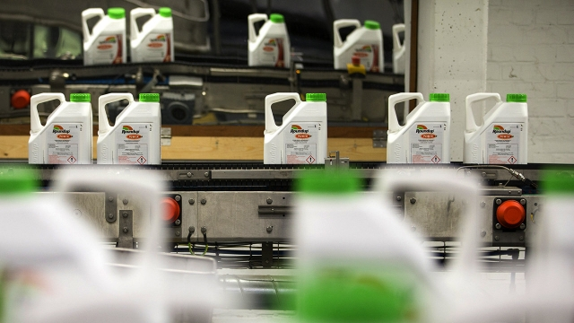

###### Bayer’s remorse

# Glyphosate woes prompt calls to split up Bayer 

 

> print-edition iconPrint edition | Business | Jul 20th 2019 

BAYER COULD do with a few Aspirin these days. On July 16th a judge in California rejected a request by the German chemicals giant (which makes the painkiller) for a retrial of a case in which jurors awarded the plaintiff $80m after concluding that Roundup, Bayer’s bestselling herbicide, caused his cancer. The judge’s decision to reduce damages to $25m offered only marginal analgesic relief. The verdict could open the floodgates to 13,400 other plaintiffs around the world who claim to have been harmed by Roundup. It comes on top of another headache caused by Austria’s lower house of parliament, which voted this month to ban glyphosate, Roundup’s active ingredient, from November. 

The glyphosate lawsuits—and the political backlash—stem from a finding by a division of the World Health Organisation, which said in 2015 that the chemical was “probably carcinogenic”. The study, controversial among scientists, has dogged Bayer ever since it bought Monsanto, Roundup’s American inventor, in 2018. Bayer’s market capitalisation has nearly halved since the takeover, to €55.5bn ($62.4bn), a little less than the $63bn it paid for the American agrochemicals giant. 

The uncertainty over the toll of glyphosate litigation explains much of the fall. It nevertheless looks like an overreaction. The lawsuits could certainly be painful but look unlikely to prove fatal. Markus Mayer of Baader Bank, an investment bank, estimates that they could cost between €5bn and €20bn—a fair bit less than the drop in Bayer’s share price would imply. Bayer plans to appeal against the verdict in California. At the end of June it signalled that it might be open to a settlement to end its legal battles once and for all. It set up a special committee to examine its legal strategy and appointed John Beisner, a combative lawyer, to advise on trial tactics. 

Losing Roundup altogether would similarly hurt but not kill the German firm. The weedkiller accounts for 12-15% of sales at Bayer’s crop-business and perhaps €1bn, or around a quarter, of Bayer’s operating profit. Despite talk of prohibitions around the world, many farmers fear that losing Roundup will reduce their yields—and have made their concerns known to their political representatives. The Austrian ban must still be approved by the upper house of parliament. It may be incompatible with the EU’s decision in 2017 to renew glyphosate’s licence for use until 2023. 

In the longer term the picture is blurrier still. Counterintuitively, bans may end up benefiting Bayer. Last month the company announced that it will spend €5bn to research alternatives to glyphosate-based weedkillers. That could position it ahead of rivals when the popular weedkiller is eventually phased out. 

If, that is, Bayer survives that long. Some investors, including Elliott, a feisty American hedge fund, have called for the company to excise the toxic agribusiness from a healthy drugmaker (Bayer’s original operation). To reassure investors the company’s management is cutting 12,000 jobs and has considered selling its animal-health, sun-cream and foot-care businesses. But it has resisted a full split, having fought hard to combine the two firms. 

A separation would contain the legal risk to a smaller unit. Analysts at AB Bernstein, a research firm, who recommend a split, point out that research overlap and technology transfer between the health and crop businesses are minimal. Bayer’s valuation is so low that a willing buyer may come forward. Many shareholders may pounce on the opportunity to rid themselves of the migraine. ■ 

-- 

 单词注释:

1.remorse[ri'mɒ:s]:n. 懊悔, 良心不安, 自责, 同情 [法] 悔恨, 自责, 懊悔 

2.glyphosate['^lifәseit]:[化] 草甘膦 

3.woe[wәu]:n. 悲哀, 悲痛, 苦痛 

4.baye[]: [地名] [毛里塔尼亚] 巴伊 

5.Jul[]:七月 

6.aspirin['æspәrin]:n. 阿斯匹林 [化] 乙酰水杨酸; 阿司匹灵; 邻乙酸基苯甲酸 

7.California[.kæli'fɒ:njә]:n. 加利福尼亚 

8.painkiller['pein,kilә(r)]:n. 解痛药, 止痛片, 止痛药 

9.retrial[ri:'traiәl]:n. 再审, 复试, 再试验 [法] 再审, 复审 

10.juror['dʒuәrә]:n. 陪审员, 审查委员 [法] 陪审员, 陪审官, 宣誓者 

11.plaintiff['pleintif]:n. 原告, 起诉人 [经] 原告, 原起诉人 

12.roundup['raundʌp]:n. 驱集, 集拢, 综述 

13.bestselling[]:a. 畅销的 

14.herbicide['hә:bisaid]:n. 除草剂 [化] 除草剂 

15.marginal['mɑ:dʒinәl]:a. 边缘的, 最低限度的, 有旁注的 [医] 缘的 

16.analgesic[.ænæl'dʒi:zik]:a. 止痛的, 痛觉缺失的 n. 止痛剂 

17.verdict['vә:dikt]:n. 裁决, 判决, 判断性意见, 定论, 结论 [法] 定论, 判断, 意见 

18.floodgate['flʌdgeit]:n. 水门, 水闸, 防潮水闸 

19.glyphosate['^lifәseit]:[化] 草甘膦 

20.organisation[,ɔ: ^әnaizeiʃən; - ni'z-]:n. 组织, 团体, 体制, 编制 

21.carcinogenic[kɑ:sinә'dʒәnik]:a. 致癌作用, 癌发生 [医] 致癌的 

22.monsanto[]:n. 孟山都公司（美国著名农业生化公司） 

23.capitalisation[,kæpitәlai'zeiʃən;-li'z-]:n. <主英>=capitalization 

24.halve[hɑ:v]:vt. 二等分, 对半分享, 把...减半 

25.takeover[]:n. 接管, 接收 [经] 接收 

26.les[lei]:abbr. 发射脱离系统（Launch Escape System） 

27.agrochemical[.ægrәu'kemikәl]:n. 农用化学品 

28.uncertainty[.ʌn'sә:tnti]:n. 不确定, 不可靠, 不确定的事物 [化] 不确定度 

29.toll[tәul]:n. 通行费, 代价, 钟声 vt. 征收, 敲钟, 鸣钟, 勾引, 引诱 vi. 征税, 鸣钟 

30.litigation[.liti'geiʃәn]:n. 诉讼, 起诉 [经] 诉讼, 纠葛 

31.overreaction[]:[经] 反应过度 

32.lawsuit['lɒ:sju:t]:n. 诉讼 [法] 诉讼, 诉讼案件 

33.MARKUS[]:n. 马库斯（姓氏） 

34.mayer['meiә]:[医] 迈尔(热容单位) 

35.baader[]:n. (Baader)人名；(德、捷)巴德尔 

36.john[dʒɔn]:n. 盥洗室, 厕所, 嫖客 

37.beisner[]:[网络] 贝斯纳 

38.combative[kәm'bætiv]:a. 好斗的, 好事的 

39.tactic['tæktik]:n. 一项战术, 一条策略 a. 战术的, 顺序的, 排列的 

40.weedkiller[ˈwi:dkɪlə(r)]:n. 除莠剂; 除草剂 

41.prohibition[.prәuhi'biʃәn]:n. 禁令, 禁止 

42.Austrian['ɒstriәn]:n. 奥地利人 a. 奥地利的, 奥地利人的 

43.incompatible[.inkәm'pætәbl]:a. 不相容的, 不能并存的, 矛盾的 [化] 不协调 

44.blurry['blә:ri]:a. 模糊的, 不清楚的, 污脏的 

45.counterintuitively[]:反常识地 

46.investor[in'vestә]:n. 投资者 [经] 投资者 

47.Elliott[]:n. 艾略特（姓氏） 

48.feisty['faisti]:a. 激动的, 活跃的, 好争吵的, 坐立不安的 

49.excise[ek'saiz]:n. (烟、酒等)消费税, 货物税, 国产税 vt. 切除 

50.toxic['tɒksik]:a. 有毒的, 中毒的 [医] 中毒的, 毒物的 

51.agribusiness['ægri.bizinis]:n. 农业综合经营 [经] 农产品行业 

52.drugmaker['drʌ^,meikә(r)]:制药者 

53.reassure[.ri:ә'ʃuә]:vt. 使...安心, 向...再保证 [法] 重新保证, 再保险, 使清除疑虑 

54.analyst['ænәlist]:n. 分析者, 精神分析学家 [化] 分析员; 化验员 

55.ab[æb]:prep. 从, 自 [计] 地址总线 

56.Bernstein[bә:n'stein]:[德]琥珀, 伯恩斯坦(姓氏) 

57.overlap[.әuvә'læp]:n. 重叠, 重复, 部分的同时发生 vt. 重叠, 重复, 与...同时发生 vi. 迭盖, 部分的同时发生 [计] 重叠 

58.minimal['miniml]:a. 最小的, 极微的, 最小限度的 [医] 最小的, 最低的 

59.valuation[.vælju'eiʃәn]:n. 评价, 估价, 价值判断 [经] 估价, 计价, 评价 

60.buyer['baiә]:n. 买主, 买方 [经] 买主, 买方, 买手 

61.shareholder['ʃєә.hәuldә]:n. 股东 [法] 股东, 股票持有人 

62.pounce[pauns]:n. 猛扑, 爪 vi. 猛扑, 突袭 vt. 扑住 

63.migraine['mi:^rein, 'mai-]:n. 严重的周期性偏头痛 [医] 偏头痛 

