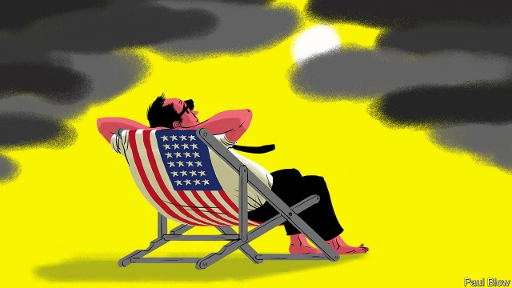
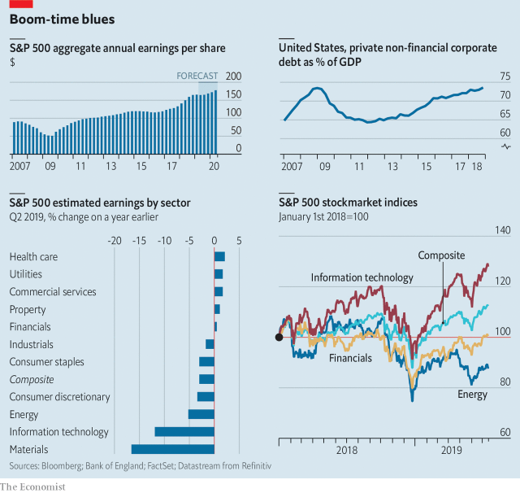

###### Earnings reprieve

# Profits are down in America Inc 

 

> print-edition iconPrint edition | Business | Jul 20th 2019 

“IT’S NOT that bad,” remarked Jamie Dimon, boss of JP Morgan Chase, of the global economy on July 16th. But, Wall Street’s favourite banker had to concede, business sentiment “is a little bit worse”. Prospects for American companies have indeed dimmed. Analysts expect earnings of the biggest among them, which have just begun reporting their latest set of results, to have declined in the second quarter. This would mark two consecutive quarters of falling profits, the first such “earnings recession” since 2016. Coming just as the current economic expansion makes history as America’s longest ever, it raises the prospect of a long boom running out of steam. Bosses are getting twitchy. 

America Inc has enjoyed an extraordinarily good run since the country rebounded from the global financial crisis of 2008-09. The economy has grown, inflation has been low and interest rates rock-bottom. Despite unemployment hovering below 5% wage pressures have been modest. All told, annualised corporate profits exceeded $2trn last quarter, nearly double the level a decade ago. President Donald Trump’s tax reform cut the corporate tax rate from 35% to 21%. This and his deregulatory efforts have freed up capital. Companies have used the windfall to buy back shares—reducing the amount of stock and superficially boosting earnings per share. The S&P 500, Dow Jones Industrial Average and Nasdaq Composite, three leading share indices, hit record highs on July 15th. 

Today the mood in boardrooms is less ebullient. The latest survey by the Business Roundtable, a conclave of bosses (chaired by Mr Dimon), put confidence higher than the historical average and well above the level which would signal a recession. But it has slipped. The National Federation of Independent Business observes a similar decline in optimism among bosses of small and medium-size enterprises. Nearly four-fifths of S&P 500 firms that have issued guidance on financial performance for the latest quarter have indicated that earnings per share will fall year on year. 

Analysts’ forecasts reflect these sentiments. Profits in six out of eleven big industries may have declined from April to June compared with a year earlier (see chart). FactSet, a research firm, estimates an average drop of 2.8% for S&P 500 earnings, on top of a 0.3% dip the quarter before. Observers—and executives themselves—see three reasons for the darkening outlook. 

 

The most prominent is Mr Trump’s trade war with China. Doug McMillon, boss of Walmart, has warned that tariffs will lead to higher costs for the retail giant, which sells plenty of Chinese-made goods. David Herring, head of the National Pork Producers Council, this week told Congress that the lobby group’s members were suffering from Chinese retaliatory tariffs on American pork. Despite his friendly encounter with China’s president, Xi Jinping, at a G20 summit in late June, Mr Trump threatened this week to impose fresh tariffs on $325bn of Chinese imports. According to JP Morgan Chase, the new levies could tip the economy into a contraction. 

A survey of companies by the Institute for Supply Management (ISM) echoes such worries. A manager at a chemicals firm told ISM that the levies were increasing costs. Another at a metals company worried they would weaken global demand for its products. Trade frictions are “wreaking havoc with supply chains and costs”, according to an executive at electronics manufacturer. “The situation is crazy.” 

The second reason for falling profits—rising labour costs—is good for workers but worrying for firms and investors. Amazon raised wages to $15 an hour in late 2018, as the labour market tightened. Costco and other retailers are doing the same. If pork tariffs weren’t enough, Mr Herring also reckons that farms and packing plants may shut down for lack of workers. Michael McDonald, president of the Sewn Products Equipment & Suppliers of the Americas, a trade group, says that clothesmakers face a “sizeable labour shortage”. 

David Kostin of Goldman Sachs, an investment bank, calculates that total compensation, which includes wages and all benefits, represents 13% of sales for a typical American firm. Wages and benefits are now rising at roughly 3% a year, up from 2% in 2018 and just 1% earlier in the business cycle. Michael Wilson of Morgan Stanley, another investment bank, reckons the official figures conceal much higher rises in such industries as retail, hotels and commercial services. 

The final explanation for the earnings crunch has to do with technology companies. Patrick Palfrey of Credit Suisse, one more investment bank, notes that the list of top ten contributors to the second quarter’s profit crunch includes representatives of Big Tech. Hardware and semiconductor goliaths such as Apple and Intel are facing a cyclical downturn in demand for their products. Trade spats exacerbate it. So too has Mr Trump’s decision on national-security grounds to impose sanctions on Huawei, China’s tech champion, which has upended global supply chains. Some internet firms are sputtering. Netflix’s share price lost 12% in after-hours trading on July 17th, when the streaming giant reported the first drop in American subscribers since 2011. 

Big trouble at a few massive—and massively profitable—tech firms may be dragging down average earnings. As Mr Kostin points out, some tech titans may see profits squeezed by 10% whereas the median technology firm can expect a rise in earnings per share of perhaps 3%. Some big firms, like Microsoft and Amazon, continue to thrive. Similarly, the aggregate decline in second-quarter earnings hides the fact that the median American company should see profit growth of 4%. 

The good times, on this view, are not quite over. “The headwinds will abate by 2020,” predicts Mr Palfrey. Many American bosses agree. Unless the Sino-American tariff tiffs turn into a full-blown trade war, they think, companies can handle the challenges. The Federal Reserve has recently turned dovish, partly in response to Mr Trump’s hawkishness on trade. It may cut interest rates, which could extend the economic expansion further. 

Not everyone accepts this view. Morgan Stanley expects profits across the metals and mining industries to decline, for example. The bank is also bearish on tech, where the “breadth of the expected negative results is stunning”. Mr Wilson, who was among the first to foresee the current decline in profits, believes that earnings have not yet hit the bottom. “The picture is getting worse, not better,” he warns. 

Unless America’s expansion enters Australia’s territory of 20-plus years of continuous GDP growth, the boost to profits from Mr Trump’s tax cuts came nearer the end than the beginning. That may have created excesses. As a share of GDP, corporate debt is nearly where it was before the subprime bubble burst in 2008. Inventories are building up across the economy. Firms must absorb higher depreciation costs from a tax-fuelled splurge of capital spending. All this can weigh on profitability. 

The quarterly financial results unveiled this week by several big banks bolster the case for cautious optimism. A boom in credit cards and mortgages pushed profits up at JPMorgan Chase, Citigroup and Wells Fargo. This implies that, as Mr Dimon also said this week, “the consumer in the United States is doing fine.” This will be cold comfort to industrial firms and other business-facing companies whose margins are shrinking. Given the sheer length of America’s record economic expansion, however, it really is not that bad.■ 
<<<<<<< HEAD

-- 

 单词注释:

1.earning['ә:niŋ]:n. 收入（earn的现在分词） 

2.reprieve[ri'pri:v]:n. 缓刑, 缓刑令, 暂缓 vt. 暂时解救, 缓期执行 

3.Inc[]:a. 根据法律组成的公司, 公司 

4.Jul[]:七月 

5.jamie[]:n. 杰米（男子名） 

6.dimon[]:戴蒙 

7.JP[]:n. 治安官, 地方司法官 [计] 作业处理器 

8.Morgan['mɒ:gәn]:n. 摩根马 

9.banker['bæŋkә]:n. 银行家, 庄家 [经] 银行业者, 银行家 

10.concede[kәn'si:d]:vt. 承认, 退让 vi. 让步 

11.sentiment['sentimәnt]:n. 感情, 感伤, 情操, 情绪, 感想, 意见 [医] 情感, 情操 

12.analyst['ænәlist]:n. 分析者, 精神分析学家 [化] 分析员; 化验员 

13.consecutive[kәn'sekjutiv]:a. 连续的, 联贯的 [计] 连续的; 连接的 

14.recession[ri'seʃәn]:n. 后退, 凹处, 衰退, 归还 [医] 退缩 

15.twitchy[ˈtwɪtʃi]:a. 抽搐的, 抽动的, 痉挛性的； 焦躁不安的 

16.extraordinarily[ik'strɔ:dθnәrili]:adv. 非凡, 破例, 特别, 非常, 离奇, 使人惊奇, 惊人, 特命, 特派 

17.rebound[ri'baund]:vi. 弹回, 返回, 产生事与愿违的结果 vt. 使弹回, 使返回 n. 反弹, 返回, 篮板球, 振作 rebind的过去式和过去分词 

18.inflation[in'fleiʃәn]:n. 胀大, 夸张, 通货膨胀 [化] 充气吹胀; 膨胀 

19.hover['hʌvә]:vi. 盘旋, 翱翔, 徘徊 vt. 孵 n. 翱翔 

20.annualised['ænjuəlaizd]:a. 年度的 v. 按年计算（annualise的过去式和过去分词） 

21.corporate['kɒ:pәrit]:a. 社团的, 合伙的, 公司的 [经] 团体的, 法人的, 社团的 

22.deregulatory[]:解除管制的 

23.windfall['windfɒ:l]:n. 被风吹落的果子, 横财 [经] 意外损失 

24.superficially[]:adv. 表面, 表面性, 浅层, 不深, 表皮, (贬)肤浅, 一知半解, 浅薄, 平方, 浮面 

25.dow[daj]:n. 美国陶氏；美国陶氏化学；道琼斯平均指数 

26.jones[dʒәunz]:n. 琼斯（姓氏） 

27.nasdaq['næz,dæk]:abbr. 全国证券交易商自动报价系统协会（National Association of Securities Dealers Automated Quotation） 

28.composite[kәm'pɒzit]:a. 合成的, 混合成的, 菊科的 n. 合成物, 复合材料, 菊科 

29.boardroom['bɒ:drum]:n. 会议室, 证券交换场所 

30.les[lei]:abbr. 发射脱离系统（Launch Escape System） 

31.ebullient[i'bʌljәnt]:a. 沸腾的, 热情的, 热情洋溢的 

32.roundtable[]:a. 圆桌的, 圆台 

33.conclave['kɒnkleiv]:n. 秘密会议, 教皇选举会议, 红衣主教团 

34.federation[fedә'reiʃәn]:n. 联邦, 联合, 联盟 [法] 联邦, 联盟, 联邦政府 

35.optimism['ɒptimizm]:n. 乐观主义, 乐观, 乐天 [医] 乐观主义, 乐观 

36.factset[]:[网络] 辉盛；研究系统公司；辉盛研究系统 

37.darken['dɑ:kn]:vt. 弄暗, 使模糊 vi. 暗下来, 颜色变深 

38.doug[]:n. 道格 

39.walmart['wɔlma:t]: 沃尔玛（世界连锁零售企业） 

40.tariff['tærif]:n. 关税, 关税表, 价格表, 收费表 vt. 课以关税 [计] 价目表 

41.david['deivid]:n. 大卫；戴维（男子名） 

42.herring['heriŋ]:n. 青鱼, 鲱 

43.producer[prә'dju:sә]:n. 生产者, 制作者, 制作人 [化] 发生器; (炉煤气)发生炉; 制气炉; 生产者 

44.lobby['lɒbi]:n. 大厅, 休息室, 游说议员者 vi. 游说议员, 游说 vt. 游说 

45.retaliatory[ri'tæliәtәri]:a. 报复的 [经] 报复性的 

46.levy['levi]:n. 税款, 所征的人数, 征收 vi. 征税, 课税 vt. 征收, 强求, 召集 

47.contraction[kәn'trækʃәn]:n. 收缩, 缩写式, 害病 [医] 收缩; 挛缩; 牙弓内缩 

48.ism['izm]:n. 主义, 学说, 制度 

49.wreak[ri:k]:vt. 发泄(怒火), 报仇 [法] 报仇, 报复, 施 

50.havoc['hævәk]:n. 大破坏, 蹂躏 vt. 严重破坏 

51.investor[in'vestә]:n. 投资者 [经] 投资者 

52.amazon['æmәzɒn]:n. 亚马孙河 [医] 无乳腺者 

53.tighten['taitn]:vt. 勒紧, 使变紧 vi. 变紧, 绷紧 

54.costco[]:n. 美国科思科连锁企业 

55.retailer['ri:teilә]:n. 零售商人, 传播的人 [经] 零售商 

56.reckon['rekәn]:vt. 计算, 总计, 估计, 认为, 猜想 vi. 数, 计算, 估计, 依赖, 料想 

57.michael['maikl]:n. 迈克尔（男子名） 

58.mcdonald[mәk'dɔnәld]:n. 麦克唐纳（男子名）；麦当劳（快餐店名称） 

59.supplier[sә'plaiә]:n. 供应者, 供给国, 供应商 [化] 承制厂; 供应厂商 

60.clothesmakers[]:[网络] 衣服 

61.sizeable['saizәbl]:a. 相当大的, 可观的 

62.Kostin[]:科斯京 

63.goldman[]:n. 高曼（姓氏） 

64.Sachs[zaks]:n. 萨克斯（汽车零配件生产厂商） 

65.compensation[.kɒmpen'seiʃәn]:n. 补偿, 赔偿金, 工资 [医] 代偿(机能), 补偿 

66.wilson['wilsn]:n. 威尔逊（姓氏） 

67.stanley['stænli]:n. 斯坦利（男子名） 

68.crunch[krʌntʃ]:v. 嘎吱嘎吱的咬嚼, 压碎, 嘎吱嘎吱地踏过 n. 咬碎, 咬碎声 

69.patrick['pætrik]:n. 帕特里克（男子名） 

70.palfrey['pɒ:lfri]:n. (妇女骑的)驯马 

71.Suisse[swi:s]:<法> = Switzerland 

72.contributor[kәn'tribjutә]:n. 贡献者, 捐助者, 赠送者, 投稿者 [法] 捐助人, 捐赠人, 投搞人 

73.tech[tek]:n. 技术学院或学校 

74.goliath[gәu'laiәθ]:n. 哥利亚(<<圣经>>中人物) 

75.intel[]:n. 美国英特尔公司（财富500强公司之一, 以生产CPU芯片著称） 

76.cyclical['siklik(e)l]:a. 周期的, 轮转的, 循环的, 轮列的, 轮卷的, 环状的, 环的, 组诗的, 始末的 [计] 循环的 

77.downturn['dauntә:n]:n. (尤指经济方面的)衰退, 下降趋势 [电] 低迷时期 

78.spat[spæt]:n. 蚝卵, 口角, 拍打 vi. 拍打, 争吵 spit的过去式和过去分词 

79.exacerbate[ek'sæsәbeit]:vt. 使恶化, 使增剧, 激怒, 使加剧 

80.sanction['sæŋkʃәn]:n. 核准, 制裁, 处罚, 约束力 vt. 制定制裁规则, 认可, 核准, 同意 

81.huawei[]: 华为 

82.tech[tek]:n. 技术学院或学校 

83.upend[ʌp'end]:v. 颠倒, 倒放 

84.sputter['spʌtә]:n. 喷溅声, 劈啪声, 语无伦次 vi. 唾沫飞溅, 结结巴巴地讲, 发劈啪声 vt. 喷出, 飞溅出, 气急败坏地说 

85.subscriber[sʌbs'kraibә]:n. 签署者, 捐献者, 订户 [经] 定户 

86.massively[]:adv. 大而重, 厚实, 粗大, 强有力, 结实, 魁伟, 大块, 大量, 大规模, 实心, 块状 [计] 大规模地 

87.Titan['taitn]:n. 提坦, 太阳神, 巨人 

88.median['mi:diәn]:a. 中央的, 中间的, 正中的 n. 正中动脉, 中位数, 中线 

89.Microsoft[]:n. (美国)微软公司 [电] 微软公司 

90.aggregate['ægrigәt]:n. 合计, 总计, 聚集体 a. 合计的, 聚集的 v. 聚集, 集合, 合计达 [计] 聚合体; 聚集 

91.headwind[]:n. 逆风, 顶风 

92.abate[ә'beit]:vt. 减少, 减轻, 减弱, 废除, 打折扣 vi. 减轻, 减弱, 减少, 失效, 被废除 

93.tiff[tif]:n. 一口淡酒, 小争吵, 小口角, 淡酒 vi. 小争吵, 生气 

94.dovish['dʌviʃ]:a. 鸽派的, 温和派的 

95.hawkishness[]:鹰派人物 主战分子 贪婪的人 

96.bearish['bєәri:ʃ]:a. 如熊的, 粗暴的 [经] 熊市 

97.stunning['stʌniŋ]:a. 打昏迷的, 弄得人昏头昏脑的, 令人震惊的 

98.subprime[ˌsʌb'praɪm]:a. 准一流的, 近乎头等的; 准最低贷款利率的 

99.inventory['invәntәri]:n. 详细目录, 存货清单 vt. 列入详细目录, 清点存货 [计] 存货清单 

100.depreciation[di.pri:ʃi'eiʃәn]:n. 价值减低, 减价, 跌落, 贬低, 折旧 [化] 折旧; 减值 

101.splurge[splә:dʒ]:n. 炫耀, 夸示 vi. 炫耀, 卖弄, 挥霍 vt. 挥霍 

102.profitability[.prɒfitә'biliti]:n. 收益性, 利益率 [经] 可获利润率 

103.unveil[.ʌn'veil]:vt. 揭开, 揭幕, 除去...的面纱 vi. 显露, 除去面纱 

104.bolster['bәulstә]:n. 支持, 长枕 vt. 支持, 支撑 

105.mortgage['mɒ:gidʒ]:n. 抵押, 约束性义务, 抵押借款 vt. 抵押, 以...作担保, 把...许给 

106.jpmorgan[]:[网络] 摩根大通；摩根大通银行；摩根大通公司 

107.citigroup[]:n. 花旗集团1998年4月6日; 花旗公司与旅行者集团宣布合并; 合并组成的新公司称为“花旗集团”; 其商标为旅行者集团的红雨伞和花旗银行的兰色字标。 

108.fargo['fɑ:ɡəu]:n. 法戈（美国北达科他州东南部城市） 

109.sheer[ʃiә]:a. 绝对的, 全然的, 纯粹的, 透明的, 峻峭的 vi. 偏转, 偏航 vt. 使急转向, 使偏航 adv. 完全, 全然, 峻峭 n. 偏航 
=======
>>>>>>> 50f1fbac684ef65c788c2c3b1cb359dd2a904378

