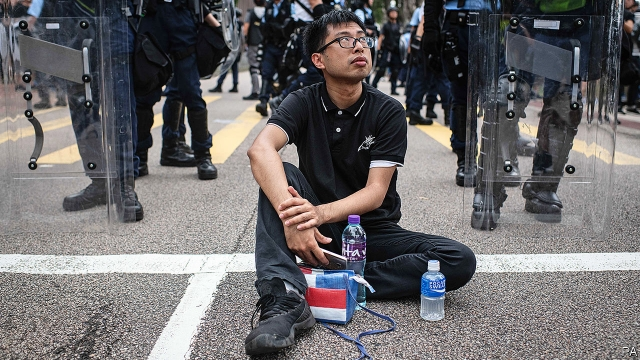

###### Pocarious position

# Taking sides in Hong Kong’s protests presents opportunities for firms 

 

> print-edition iconPrint edition | Business | Jul 18th 2019 

“SWEAT IS FUN!” insists Pocari Sweat, a Japanese soft drink loved by active types across Asia. This summer millions of Hong Kongers have taken up a new sport: marching, originally against a controversial extradition bill and increasingly in opposition to their territory’s pro-Beijing government. Many do so clutching bottles of the isotonic beverage. 

Pocari went from a source of hydration to a symbol of political resistance after a Facebook exchange on July 9th between Pocari Sweat Hong Kong and a customer revealed that it was withdrawing adverts from TVB, a local television network that pro-democracy activists say has portrayed them unfairly. In the statement Pocari Sweat said that it had taken a “proactive step” to urge TVB “to respond to public concern”. Pocari cans have since starred in dozens of revolutionary memes. 

Around the world consumer-facing companies have embraced progressive causes dear to the coveted demographic group of 20- and 30-somethings. In Hong Kong, however, corporate activism is complicated by consumer attitudes on the mainland, where anti-Beijing sentiment is often viewed as treasonous. 

Some companies side more or less openly with the protesters. Wonder Life, a Hong Kong maker of condoms, posted on Facebook that consumers’ objections about TVB had led it not to advertise on the channel. Others are more oblique. The Hong Kong arm of Cigna, an American insurer, said it would stop advertising on TVB and explained in a social-media post that “we are constantly reviewing our media planning strategies to promote our brand and our mission to be your health and well-being partner.” In June Ztore, a local e-commerce startup, tried to avert a boycott by distancing itself from a founder who backed the extradition bill. 

Just as appearing to stand up to the authorities can burnish corporate reputations, seeming to kowtow to them can do harm. Yoshinoya, a chain of Japanese restaurants which endeared itself with protesters after running a Facebook ad that seemed to mock heavy-handed Hong Kong policemen, faced a backlash when it deleted the ad and the boss of its Hong Kong franchise-owner told two newspapers that he had taken part in pro-police rallies. Online maps shared by protesters tag the chain as unfriendly to the cause. 

Some businesses fall foul of demonstrations through no clear fault of their own. Sun Hung Kai Properties is facing calls for a boycott of its 24 big shopping centres after some accused the developer, Hong Kong’s largest, of letting the police clash with protesters on its premises on July 14th. The company says it did not call the police and was unaware of the deployment. 

Firms with a presence on the mainland as well as in Hong Kong face the most delicate balancing act. Seeming to back protests may play well with Hong Kongers but backfires among mainland influencers. Last month Nike pulled a line of limited-edition trainers from being released in China after its Japanese designer’s opposition to the extradition bill prompted calls for a boycott on Chinese social media. 

Many brands are studiously trying to stay neutral. On July 10th Pizza Hut, which had stopped advertising on TVB days earlier, issued a statement to explain that its promotion had simply ended as scheduled. Three days later Tempo, which makes toilet paper, posted on Facebook, which is popular in Hong Kong, and on Weibo, the mainland’s biggest microblogging site, that it would carry on advertising with TVB, earning it plaudits from the Global Times, a Communist Party newspaper. 

Fearing a backlash Pocari’s mainland offices in Tianjin and Guangdong disassociated themselves from the Hong Kong branch. “We are two completely different entities,” they said in a statement. Headquarters in Japan has not weighed in publicly. On July 10th the Hong Kong arm posted a short statement on its Facebook page in which it apologised for any “inconvenience” caused by the conversation on July 9th. Marchers thirsting for undiluted political electrolytes may feel they are the ones who have been inconvenienced. ■ 

-- 

 单词注释:

1.hong[hɔŋ]:n. （中国、日本的）行, 商行 

2.Jul[]:七月 

3.pocari[]:[网络] 宝矿力；日本宝矿力；宝矿力水得 

4.originally[ә'ridʒәnli]:adv. 本来, 原来, 最初, 就起源而论, 独创地 

5.extradition[.ekstrә'diʃәn]:n. 引渡逃犯, 亡命者送还本国 [法] 引渡 

6.opposition[.ɒpә'ziʃәn]:n. 反对, 敌对, 相反, 在野党 [医] 对生, 对向, 反抗, 反对症 

7.clutch[klʌtʃ]:n. 抓紧, 掌握, 离合器, 一窝小鸡 vt. 抓住, 踩汽车离合器踏板 vi. 抓 [计] 联轴器; 离合器 

8.isotonic[.aisәu'tɒnik]:a. 等渗的, 等张的, 等压的 [医] 等张的, 等渗的 

9.beverage['bevәridʒ]:n. 饮料 [化] 饮料(如牛奶、茶、咖啡、啤酒等) 

10.hydration[hai'dreiʃәn]:n. 水合 [化] 水合 

11.facebook[]:n. 脸谱网 

12.kong[kɔŋ]:n. 含锡砾石下的无矿基岩；钢 

13.advert[әd'vә:t]:vi. 提出看法, 引起注意, 留意 n. 广告 

14.tvb[]:abbr. 香港无线电视台（Television Broadcasts Limited, 又称香港电视广播公司） 

15.activist['æktivist]:n. 激进主义分子 

16.portray[pɒ:'trei]:vt. 描绘, 描写, 描绘...的肖像 

17.unfairly[]:adv. 不正当地；不公平地 

18.proactive[,prәu'æktiv]:a. 〈心理〉前摄的 

19.meme[mi:m]:n. 大脑模仿病毒；文化基因；弥母 

20.covet['kʌvit]:v. 妄想, 垂涎 

21.demographic[.demә'græfik]:a. 人口统计的 [法] 人口统计的, 人口学的 

22.corporate['kɒ:pәrit]:a. 社团的, 合伙的, 公司的 [经] 团体的, 法人的, 社团的 

23.activism['æktivizm]:n. 激进主义, 行动主义, 能动论 [法] 激进主义, 行动主义 

24.sentiment['sentimәnt]:n. 感情, 感伤, 情操, 情绪, 感想, 意见 [医] 情感, 情操 

25.treasonous[]:a. 叛逆的, 谋反的, 犯叛国罪的, 涉及叛国罪的 

26.les[lei]:abbr. 发射脱离系统（Launch Escape System） 

27.openly['әjpәnli]:adv. 公开地, 坦率地, 直率地, 公然地 

28.protester[]:n. 抗议者, 持异议者, 拒付者 [经] 反对者 

29.maker['meikә]:n. 制造者, 上帝 [经] 制造者, 出票人 

30.condom['kɒndәm]:n. 避孕套 [医] 阴茎套 

31.oblique[ә'bli:k]:a. 斜的, 倾斜的, 间接的, 不光明正大的, 躲躲闪闪的 [医] 斜的 

32.cigna[]:abbr. Connecticut General Corporation Combined with the Insurance Company of North America 康涅狄格与北美保险公司联合的总公司 

33.insurer[in'ʃuәrә]:n. 保险公司 [法] 保险人, 承保人, 保险公司 

34.advertising['ædvәtaiziŋ]:n. 广告业, 广告 a. 广告的 [计] 发广告 

35.constantly['kɒnstәntli]:adv. 不变地, 不断地, 时常地 

36.startup[]:[计] 启动 

37.avert[ә'vә:t]:vt. 转开, 避免, 防止 

38.founder['faundә]:n. 创立者, 建立者 vt. 使沉没, 使摔倒, 弄跛, 浸水, 破坏 vi. 沉没, 摔到, 变跛, 倒塌, 失败 

39.burnish['bә:niʃ]:vt. 擦亮, 打磨, 磨光 vi. 磨光发亮 n. 光辉, 光泽 

40.kowtow[.kәu'tau]:n. 磕头 vi. 叩头 

41.endear[in'diә]:vt. 使受喜爱, 使受钟爱 

42.mock[mɒk]:n. 嘲笑, 戏弄, 模仿 a. 假的, 伪造的, 模拟的 adv. 虚伪地 vt. 嘲弄, 模仿, 使失望, 欺骗, 挫败 vi. 嘲弄 

43.backlash['bæklæʃ]:n. 后冲, 强烈反对 [电] 反撞, 逆栅流 

44.rally['ræli]:n. 重振旗鼓, 集合, 群众集会, 跌停回升 v. 重整旗鼓, 集合, 恢复精神, 团结, 挖苦, 嘲笑 

45.online[]:[计] 联机 

46.unfriendly[.ʌn'frendli]:adv. 不友善地 

47.foul[faul]:a. 污秽的, 邪恶的, 恶臭的, 肮脏的, 恶劣的, 淤塞的 vt. 弄脏, 妨害, 污蔑, 犯规, 淤塞 vi. 腐烂, 犯规, 缠结 adv. 违反规则地, 不正当地 n. 犯规, 缠绕 

48.demonstration[.demәn'streiʃәn]:n. 示范, 实证 [医] 示教, 实物教授 

49.kai[]:n. 卡伊（姓氏） 

50.developer[di'velәpә]:n. 开发者 [计] 显影器 

51.clash[klæʃ]:n. 冲突, 撞击声, 抵触 vi. 冲突, 抵触 vt. 使发出撞击声 [计] 对撞 

52.premise['premis]:n. 前提, 房屋连地基, 上述各项 vt. 预先提出, 引出, 作为...的前提 vi. 作出前提 

53.unaware[.ʌnә'wєә]:a. 未认识到的, 不知道的 [法] 不知道的, 不察觉的, 无意的 

54.deployment[]:[计] 展开 

55.backfire[.bæk'faiә]:n. 逆火, 回火, 放火 vi. 放逆火, 预先放火, 发生意外 

56.influencer[]:n. 影响者 

57.Nike['naiki:]:n. 胜利女神, 奈克导弹 

58.studiously[]:adv. 故意地；好学地；注意地 

59.pizza['pi:tsә]:n. 比萨饼 

60.promotion[prәu'mәuʃәn]:n. 晋级, 创建, 增进 [经] 推广, 推销, 促进 

61.tempo['tempәu]:n. 速度, 节奏, 进行速度, (棋的)一着 

62.Weibo[]:[网络] 新浪微博；我的微博；个人微博 

63.microblogging[ 'maɪkrəʊblɒgɪŋ]: 微博 

64.plaudit['plɒ:dit]:n. 拍手喝彩, 称赞, 赞美 

65.tianjin['tjɑ:n'dʒin]:n. 天津（中国一城市） 

66.disassociate[.disә'sәuʃieit]:v. (使)分离 

67.entity['entiti]:n. 实体, 实存物, 存在 [计] 实体 

68.headquarter[,hed'kwɔ:tә]:vt. 将...的总部设在 

69.apologise[ә'pɔlәdʒaiz]:vi. 道歉（等于apologize） 

70.inconvenience[.inkәn'vi:njәns]:n. 不便, 困难 vt. 使感不便, 使感困难 

71.marcher[]:n. 边界地区居民, 行进者, 游行者, 行军者 

72.undiluted[.ʌndai'lju:tid]:a. 未淡化的, 未稀释的, 未搀水的, 未冲淡的 [化] 未稀释的 

73.electrolyte[i'lektrәlait]:n. 电解物, 电解质, 电解液 [化] 电解质 

