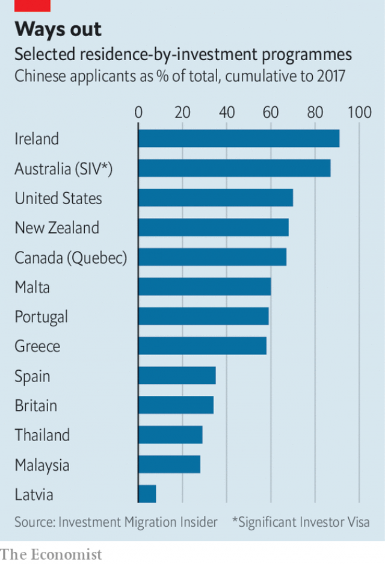

###### Golden parachutes

# Chinese are big customers for schemes selling foreign residency 

 

> print-edition iconPrint edition | China | Jul 20th 2019 

TANG SHOUGANG is one of a generation of young Chinese who seem to have it all. Aged just 35, Mr Tang (not his real name) has a well-paid job for a tech firm, and his wife owns a successful shop. They have two young sons, two cars and an apartment in downtown Shanghai worth a fortune. One perk enjoyed by others of their class, however, eludes them: a passport or long-term residents’ visa for a country other than China. Ideally they would like a green card that makes it easier to live, work and educate their children in America. That looks difficult, so the Tangs are pondering other options. 

A whole industry has grown in China to help them choose. About a hundred countries around the world have schemes that offer residence—a “golden visa”—in return for a big investment from the applicant. A dozen or so of these go further, and also offer a passport, in effect selling citizenship. By far the biggest users of these “residence or citizenship by investment” (RCBI) schemes are Chinese. Hundreds of businesses compete to help them navigate the labyrinthine procedures. They usually offer other services as well, such as help with applications for student visas. 

There are various reasons why Chinese citizens want residence abroad. By far the most common—the Tangs in this respect are typical—is education. Parents want to spare their offspring the horrors of China’s gruelling university-entrance exam, the gaokao. And they believe that a foreign education will open up opportunities unavailable at home. Even childless Chinese also see the attractions of a “plan B” should the political or economic climate in China deteriorate. Many like the idea of investing abroad, especially in property, to diversify their portfolios as much as to acquire a bolthole. And some may actually prefer to live, or at least retire, overseas. 

 

These, however, are difficult days for China’s RCBI industry, for a number of reasons. One, in the words of Larry Wang of Well Trend, one of the biggest and longest-established visa consultancies, is that it has become “the victim of its own success”. The sheer number of Chinese applicants has overwhelmed some of the RCBI schemes. By far the most sought-after is America’s EB-5 programme, launched in 1990. Mr Wang says it is top of the list for eight out of every ten of his clients—America’s universities being the biggest pull. 

EB-5 visas require investment of at least $1m, or half that if it goes into a “targeted” area of high unemployment. About 10,000 EB-5 visas are issued every year. A maximum of 7% can go to any single nationality—ie, just 700 Chinese, and the waiting-list for their compatriots is now 15 years long. A bill before Congress would abolish country caps. But so popular is the scheme worldwide that analysts reckon this would cut the waiting time for Chinese applicants by only three to five years. A group of more than 450 Chinese EB-5 investors is suing the American government, arguing that it is wrong to interpret the 10,000 annual limit as covering visas, rather than investors, whose dependents should then also be granted residency. 

For educational migrants, the obvious alternative to America would be another English-speaking country. But Canada closed its federal programme in 2014 (some provincial schemes, such as Quebec’s, continue). And in other countries the required investment is much bigger—A$5m in Australia ($3.5m); £2m in Britain ($2.5m) and NZ$3m ($2m) in New Zealand. So there is an opening for other countries keen to attract Chinese money, including a number in Europe, such as Greece, Portugal and Malta (which also offers citizenship). These programmes offer the attraction of visa-free travel around the 26-country Schengen area of the European Union. 

The European Commission and the OECD, a rich-country think-tank, worry that such schemes might provide cover for money-laundering and tax evasion. They have indeed been prone to scandal. The EB-5 scheme has been dogged by allegations of fraud, typically involving the embezzlement of Chinese investors’ money. And in Greece last year Chinese investors were accused of complicity in a scam in which a Greek developer bought properties at market value and sold them at a big mark-up to would-be investment migrants in China (and partially reimbursed them). 

There is another big problem for Chinese investment migrants: Chinese exchange controls. These limit citizens to sending $50,000 a year overseas—far less than the investment demanded by most RCBI programmes. So almost all Chinese investment migrants are probably breaking Chinese law. The Greek developer dodged the restrictions by the simple expedient of using point-of-sale machines linked to Greek banks to take money from the credit cards of Chinese in China—a breach both of Chinese law and the rules of Greece’s golden-visa scheme. 

The fuss this caused makes it unlikely others will get away with it. But plenty of shady avenues remain, such as pooling $50,000 allowances with others; making an arrangement with a Hong Kong resident or foreigner in China; inflating invoices for overseas payments; and cryptocurrencies. RCBI professionals say they do not advise their customers how to navigate China’s exchange controls. They even deny knowledge of how this is done. But they say clients do seem to be finding it more difficult. 

Oddly, China has recently liberalised the RCBI market. Last November it lifted a requirement that RCBI firms obtain a licence from the police. So competition has become more intense. Some of this comes from new entrants. But there may be a more serious threat to incumbents, says Christian Nesheim, editor of Investment Migration Insider, a trade journal. Banks and other wealth managers might be tempted to poach RCBI professionals to offer clients a fuller service, he says. 

There is no sign of any slackening in demand for such business. More people now find golden-visa schemes affordable. Ever since Deng Xiaoping a generation ago decreed (perhaps apocryphally) that to get rich is glorious, those who have succeeded in doing so have deemed it even more glorious to get out—or at least to be able to. Mr Tang has his eyes on Ireland. ■ 
<<<<<<< HEAD

-- 

 单词注释:

1.parachute['pærәʃu:t]:n. 降落伞 vi. 跳伞 

2.residency['rezidәnsi]:n. 住处 [法] 住处, 管辖区 

3.Jul[]:七月 

4.tang[tæŋ]:n. 强烈味道, 特殊的气味, 特性, 柄脚, 当的一声, 墨角藻 vt. 使发气味, 装刀柄于, 使发出当的一声 vi. 发出当的一声 

5.tang[tæŋ]:n. 强烈味道, 特殊的气味, 特性, 柄脚, 当的一声, 墨角藻 vt. 使发气味, 装刀柄于, 使发出当的一声 vi. 发出当的一声 

6.tech[tek]:n. 技术学院或学校 

7.perk[pә:k]:vi. 昂首, 振作, 举止高傲, 神气活现, 滤煮 vt. 竖起, 打扮, 使振作, 滤煮 n. 小费 

8.elude[i'lu:d]:vt. 逃避, 规避, 把...难倒 

9.ideally[ai'diәli]:adv. 完美地, 理想地 

10.tang[tæŋ]:n. 强烈味道, 特殊的气味, 特性, 柄脚, 当的一声, 墨角藻 vt. 使发气味, 装刀柄于, 使发出当的一声 vi. 发出当的一声 

11.ponder['pɒndә]:v. 沉思, 考虑 

12.citizenship['sitizәnʃip]:n. 国籍, 市民权, 市民的身份 [法] 公民权, 公民资格, 公民身分 

13.navigate['nævigeit]:vi. 航行 vt. 航行于, 驾驶, 操纵, 使通过 

14.labyrinthine[,læbә'rinθain, -θin]:[医] 迷路的 

15.offspring['ɒ:fspriŋ]:n. 子孙, 后代, 产物 [法] 后辈, 子孙, 后裔 

16.gruelling[]:a. 折磨人的, 使人精疲力尽的 n. 痛打, 惩罚 

17.gaokao[]:[网络] 高考·人生·选择；状元秘笈；录取查询 

18.unavailable[.ʌnә'veilәbl]:a. 得不到的, 不能利用的, 无用的 [化] 不可得的; 无效的; 不能利用的 

19.childless['tʃaildlis]:a. 无儿女的 

20.B[bi:]:[计] 基地址, 数据库, 基极, 二进制, 块, 字组, 布尔, 总线, 占线, 字节 [医] 硼(5号元素) 

21.deteriorate[di'tiәriәreit]:v. (使)恶化 

22.diversify[dai'vә:sifai]:vt. 使多样化, 使变化 

23.portfolio[pɒ:t'fәuliәu]:n. 皮包, 公文包, 部长职务, 有价证券财产目录, 艺术代表作选辑 [法] 公文包, 文件夹, 阁员职务 

24.bolthole['bəʊlthəʊl]:n. 能躲避危险的地方 

25.oversea['әuvә'si:]:adv. 海外, 向国外, 向海外, 国外 a. 外国的, 在国外的, 在海外的, 舶来的 

26.Larry['læri]:n. 拉里（男子名） 

27.wang[]:n. 王（姓氏）；王安电脑公司 

28.consultancy[]:n. 商量, 协商, 磋商, 会诊, 与...商量, 咨询, 请教, 找(医生)看病, 查阅, 考虑 [经] 咨询业务, 咨询服务 

29.sheer[ʃiә]:a. 绝对的, 全然的, 纯粹的, 透明的, 峻峭的 vi. 偏转, 偏航 vt. 使急转向, 使偏航 adv. 完全, 全然, 峻峭 n. 偏航 

30.overwhelm[.әuvә'hwelm]:vt. 淹没, 受打击, 制服, 压倒, 使不知所措 [法] 打翻, 倾覆, 覆盖 

31.compatriot[kәm'pætriәt]:n. 同国人 a. 同国的, 同胞的 

32.analyst['ænәlist]:n. 分析者, 精神分析学家 [化] 分析员; 化验员 

33.reckon['rekәn]:vt. 计算, 总计, 估计, 认为, 猜想 vi. 数, 计算, 估计, 依赖, 料想 

34.investor[in'vestә]:n. 投资者 [经] 投资者 

35.sue[su:]:vt. 控告, 起诉, 请求 vi. 提出诉讼, 提出请求 

36.educational[.edju'keiʃәnl]:a. 教育的, 教育性的 

37.migrant['maigrәnt]:n. 候鸟, 移居者 [法] 移居者 

38.provincial[prә'vinʃәl]:n. 外地人, 粗野的人 a. 省的, 外地的, 偏狭的 

39.zealand['zi:lәnd]:n. 西兰岛（丹麦最大的岛） 

40.Portugal['pɒ:tʃugl]:n. 葡萄牙 

41.Malta['mɒ:ltә]:n. 马尔他 

42.schengen['ʃɛŋən]: [地名] [卢森堡] 申根 

43.Oecd[]:[经] 已开发国家组织 

44.evasion[i'veiʒәn]:n. 逃避, 藉口 [法] 回避, 规避, 逃避 

45.prone[prәun]:a. 俯伏的, 面向下的, 有...倾向的 [医] 旋前的, 伏的, 俯的 

46.allegation[.æli'geiʃәn]:n. 断言, 主张, 申辩 [法] 声明, 事实陈述, 断言 

47.fraud[frɒ:d]:n. 欺骗, 欺诈, 诡计, 骗子 [经] 欺诈, 舞弊, 骗子 

48.typically['tipikәli]:adv. 代表性地；作为特色地 

49.embezzlement[im'bezlmәnt]:n. 盗用, 挪用, 侵占 [经] 贪污, 盗用(公款), 监守自盗 

50.complicity[kәm'plisiti]:n. 同谋, 串通, 复杂 [法] 共谋, 共犯关系 

51.scam[skæm]:n. 骗局, 诡计；故事 

52.developer[di'velәpә]:n. 开发者 [计] 显影器 

53.reimburse[.ri:im'bә:s]:vt. 付还, 偿还, 赔偿 [经] 偿付, 赔还, 付还; 偿还 

54.les[lei]:abbr. 发射脱离系统（Launch Escape System） 

55.dodge[dɒdʒ]:v. 避开, 躲避 n. 诡计, 躲藏 

56.expedient[ik'spi:diәnt]:n. 权宜之计 a. 权宜的, 方便的, 有用的 

57.breach[bri:tʃ]:n. 裂口, 违背, 破坏, 违反, 突破, 破裂 vt. 攻破, 突破 vi. 跳出水面 

58.fuss[fʌs]:n. 大惊小怪, 小题大作, 忙乱 vi. 无事自扰, 焦急, 焦燥, 忙乱 vt. 使激动, 使烦燥 

59.hong[hɔŋ]:n. （中国、日本的）行, 商行 

60.kong[kɔŋ]:n. 含锡砾石下的无矿基岩；钢 

61.inflate[in'fleit]:vt. 使膨胀, 使得意, 使通货膨胀, 使充气 vi. 充气, 膨胀 

62.invoice['invɒis]:n. 发票, 发货单 v. 开发票, 记清单 

63.cryptocurrencies[]:加密数字货币（cryptocurrency的复数形式） 

64.client['klaiәnt]:n. 客户, 顾客, 委托人 [计] 客户, 客户机, 客户机程序 

65.oddly['ɒdli]:adv. 奇怪地 

66.liberalise['lɪbərəlaɪz]:vt. 使自由化 

67.entrant['entrәnt]:n. 新会员, 新成员, 进入者 

68.incumbent[in'kʌmbәnt]:a. 现任的, 依靠的, 负有义务的 n. 领圣俸者, 在职者 

69.nesheim[]:[网络] 西姆 

70.migration[mai'greiʃәn]:n. 移民, 移往, 移动 [计] 迁移 

71.insider['in'saidә]:n. 内部的人, 权威人士, 知道内情的人 [经] 熟悉内情者 

72.poach[pәutʃ]:vt. 水煮(蛋), 偷猎, 侵入, 窃取 vi. 偷猎, 陷入泥中 

73.slacken['slækәn]:vt. 使松弛, 放松, 放慢 vi. 变松弛, 减弱, 松劲 

74.affordable[]:[计] 普及型 

75.decree[di'kri:]:n. 法令, 判决, 天意 vt. 颁布, 判决 vi. 发布命令 

76.apocryphally[]:伪造地 

77.deem[di:m]:v. 认为, 相信 
=======
>>>>>>> 50f1fbac684ef65c788c2c3b1cb359dd2a904378

