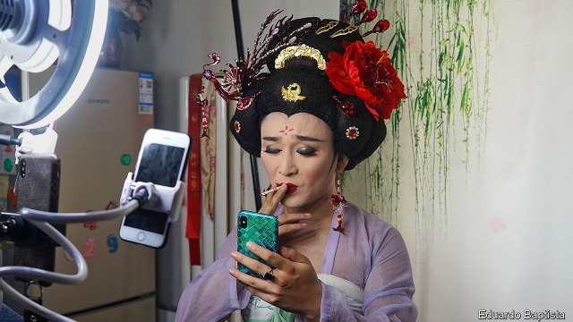

###### Dolled up for the party

# Politically correct cross-dressing in China 

 

> print-edition iconPrint edition | China | Jul 20th 2019 

THE FIRST time Wang Zhi performed in drag, 17 years ago, it was in a seedy gay bar three hours’ drive from his university dorm. Today Mr Wang (pictured) says he can make a tidy 2m yuan ($290,000) a year from his cross-dressing routines. Remarkably, they have the Communist Party’s blessing. He regularly appears on nationally televised variety shows. Officials often invite him to entertain people in poor areas. In Xinjiang and Tibet, he boasts, he has enraptured his ethnic-minority audiences. 

Mr Wang’s success may seem surprising. In recent years the party has been trying to sanitise or suppress any kind of culture that it does not regard as wholesome—including art that challenges conventional gender roles. Last September Xinhua, a state-run news agency, condemned some male performers simply for looking too feminine. Unusually, the party’s main mouthpiece, People’s Daily, retorted that men should be judged by their character, not appearance. But Xinhua’s views reflected a conservative turn since Xi Jinping became China’s leader in 2012. 

Mr Xi, however, has allowed Mr Wang’s style of drag to flourish. That is because it has a long and respected history in traditional Chinese opera, an art form which Mr Xi has been trying to promote. It used to be that female operatic roles, or dan, were always played by men. Such acting requires considerable skill as well as the wearing of elaborate make-up and full-length traditional costume that leaves no skin showing from the neck down. 

The rigours that dan specialists historically endured in training were featured in “Farewell My Concubine”, an award-winning Chinese film released in 1993 (and withdrawn two weeks later by prudish censors who allowed its re-release only after some references to homosexuality were cut). The film portrayed the ordeal of a dan performer, from the 1920s when boys were often selected for such roles at an early age, to the puritanical era of Mao Zedong. The protagonist finds himself confused by the reality of his biological sex and the feelings he harbours for his male co-star. 

In Mr Xi’s China it is hard to imagine such a film being made, let alone shown. Dan acting is fine, but art that explores gender identity or sexual orientation is not. Mr Wang says he is straight and asserts that most Chinese men who earn money from cross-dressing simply want to “beat women at their own game”. On WeChat, a Chinese messaging service, Mr Wang maintains a chat-group for dan enthusiasts. He often tells them to keep their “private inclinations” a secret. “Our society still doesn’t accept two men holding hands and kissing in public, so you shouldn’t do it,” he says. 

But Mr Wang and his internet followers are not actors in traditional opera. They are drag artists who merely don elaborate dan costumes for effect—a nod to tradition that seems enough to keep the party happy. Some go further and undergo plastic surgery to acquire features associated with feminine beauty, such as wide eyes, a sharp jawline or a high-bridged nose. 

In his shows, Mr Wang often aims to shock. A typical routine involves luring his audience into thinking he is a woman, then delivering a punchline in a manly voice. Mr Wang is dismissive of men who still look male in drag: they are simply yi zhuangpi, or transvestites, he says pejoratively. 

Such views help Mr Wang to thrive in the cultural chill. His female persona, Wang Shangrong, has over 670,000 fans on TikTok, a popular live-streaming platform. Many of them are female. He says there may be thousands of drag performers in China who engage in his type of politically correct cross-dressing. 

Risks attend those who wear risqué garb. Last year a video went viral of three men in revealing drag being accosted by police in the eastern city of Suzhou. Many online comments on it supported the cross-dressers, but Mr Wang says the police were justified since the men were still identifiable as male. “If I’m mocked, it’s because my feminine beauty isn’t convincing enough,” he says. “Once we raise the standards of our performance, nobody will dare to bully us.” ■ 
<<<<<<< HEAD

-- 

 单词注释:

1.politically[]:adv. 政治上 

2.Jul[]:七月 

3.wang[]:n. 王（姓氏）；王安电脑公司 

4.zhi[]:只（汉语拼音） 

5.seedy['si:di]:a. 多种子的, 结籽的, 破烂的, 肮脏的 

6.remarkably[ri'mɑ:kәbli]:adv. 显著地, 引人注目地, 非常地 

7.nationally['næʃәnәli]:adv. 作为整个民族, 举国一致地, 全国性地 

8.televise['telivaiz]:v. 用电视播放, 播映 

9.enrapture[in'ræptʃә]:vt. 使狂喜 

10.sanitise['sænitaiz]:vt. 采取卫生措施使其安全；给…消毒（等于sanitize） 

11.suppress[sә'pres]:vt. 镇压, 使止住, 禁止, 抑制, 查禁 [法] 镇压, 平定, 禁止出版 

12.gender['dʒendә]:n. 性 vt. 产生 

13.Xinhua[]:[经] 新华社 

14.feminine['feminin]:a. 女性的, 阴性的, 柔弱的 [医] 女性的, 雌性的 

15.mouthpiece['mauθpi:s]:n. 发话筒, 代言人, (电话)送话口 [机] 钳口垫片 

16.retort[ri'tɒ:t]:n. 反驳, 顶嘴, 蒸馏器, 曲颈甑 vi. 反驳, 回嘴, 反击 vt. 反击, 反驳, 蒸馏 

17.operatic[.ɒpә'rætik]:a. 歌剧的, 歌剧风格的 

18.dan[dæn]:n. 段(柔道、围棋运动员的等级) [建] 小车, 空中吊运车, 杓 

19.alway['ɔ:lwei]:adv. 永远；总是（等于always） 

20.costume['kɒstju:m]:n. 装束, 服装 

21.rigour['rigә]:n. 严格, 严厉, 苛刻, 严酷, 严密, 精确 

22.historically[his'tɔrikәli]:adv. 历史上地；从历史观点上说 

23.concubine['kɒŋkjubain]:n. 妾, 姘妇 [法] 妾, 姘妇, 情妇 

24.prudish['pru:diʃ]:a. 拘守礼仪的, 过分规矩的, 表面正经的 

25.censor['sensә]:n. 检查员 vt. 检查, 审查, 删改 

26.homosexuality[-'æliti]:n. 同性恋 [医] 同性性欲, 同性恋爱 

27.portray[pɒ:'trei]:vt. 描绘, 描写, 描绘...的肖像 

28.ordeal[ɒ:'di:l]:n. 严酷考验, 痛苦经历, 煎熬 [法] 神裁判法, 严酷的考验, 痛苦的经验 

29.puritanical[,pjuәri'tænikәl]:a. 清教徒的, 清教主义的, 宗教上极端拘谨的, 道德上极端拘谨的 

30.protagonist[prәu'tægәnist]:n. 主人公, 主角, 领导者 

31.biological[.baiәu'lɒdʒikәl]:a. 生物学的 [医] 生物学的 

32.dan[dæn]:n. 段(柔道、围棋运动员的等级) [建] 小车, 空中吊运车, 杓 

33.orientation[.ɒ:rien'teiʃәn]:n. 定方位, 适应, 向东方 n. 方向 [计] 方向 

34.assert[ә'sә:t]:vt. 主张, 坚称, 断言 [法] 宣称, 断言, 维护 

35.WeChat[]:[网络] 微信；微讯；腾讯微信 

36.enthusiast[in'θju:ziæst]:n. 热心家, 狂热者, 爱好者 

37.inclination[.inkli'neiʃәn]:n. 倾向, 趋向, 倾斜度, 点头 [化] 倾角 

38.follower['fɒlәuә]:n. 从者, 属下, 追补者 [电] 随动机 

39.don[dɒn]:n. 西班牙贵族(或绅士), 先生, 阁下 vt. 穿上 

40.jawline['dʒɔ:,lain]:n. 下颌的轮廓,下巴的外形 

41.lure[luә]:n. 饵, 诱惑 vt. 引诱, 诱惑 

42.punchline[]:n. 结尾警语；妙语如珠 

43.dismissive[dis'misiv]:a. 轻视的 

44.yi[ji:]:n. 彝人；彝语 

45.transvestite[træns'vestait]:n. 易装癖者 a. 爱穿异性服装的, 易装癖的 

46.pejoratively[pi'dʒɔrətivli]:adv. 轻蔑地 

47.cultural['kʌltʃәrәl]:a. 文化的, 教养的, 修养的 [医] 培养的 

48.persona[pә:'sәunә]:n. 人, 人物, 角色, 外表印象, 人格面具 [医] 伪装人格 

49.politically[]:adv. 政治上 

50.garb[gɑ:b]:n. 打扮, 装束 vt. 打扮, 穿衣 

51.viral['vairәl]:a. 病毒的, 病毒引起的 [医] 病毒的 

52.accost[ә'kɒst]:vt. 招呼, 搭讪, 勾引 [法] 勾引, 引诱 

53.online[]:[计] 联机 

54.identifiable[ai'dentifaiәbl]:a. 可辨认的 [法] 可证明为同一的, 可以办清的 

55.mock[mɒk]:n. 嘲笑, 戏弄, 模仿 a. 假的, 伪造的, 模拟的 adv. 虚伪地 vt. 嘲弄, 模仿, 使失望, 欺骗, 挫败 vi. 嘲弄 

56.bully['buli]:n. 欺凌弱小者, 土霸 vt. 威胁, 恐吓, 欺负 vi. 欺负 a. 特好的, 第一流的 adv. 十分 
=======
>>>>>>> 50f1fbac684ef65c788c2c3b1cb359dd2a904378

