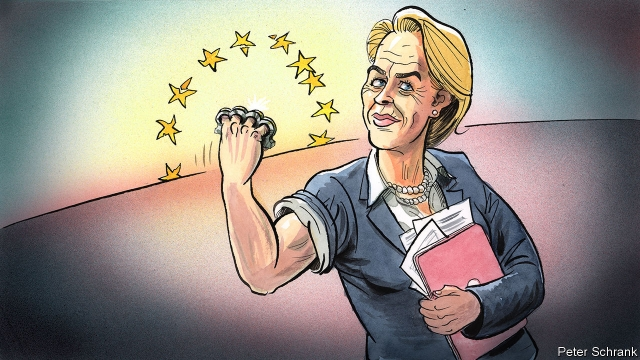

###### Charlemagne

# Does Ursula von der Leyen have the right skills for the EU Commission? 

 

> print-edition iconPrint edition | Europe | Jul 20th 2019 

IT IS HARD to imagine a biography less suited to the mood of today’s Europe than that of Ursula von der Leyen, the German incoming president of the European Commission. Insurgent parties are sweeping the continent, cracks are forming between and within the EU’s member states and new threats are looming in the wider world. Mrs von der Leyen is the posh daughter of a Christian Democrat (CDU) minister-president of Lower Saxony. She rose through various government roles as an ally of Angela Merkel, glides multilingually through the world’s foreign-policy salons and can seem rather prim. Many consider her spell as German defence minister a debacle. Just what the old continent needs, one might groan: a slick, over-promoted scion of Europe’s unloved political establishment. 

The manner of Mrs von der Leyen’s election supports that gloomy gloss. She was never a favourite to run the EU’s executive but rather a last-ditch candidate stumbled upon by sleep-deprived leaders at the conclusion of a three-day summit two weeks ago. In a speech before the European Parliament ahead of a binding approval vote on July 16th she issued a screed of mostly familiar albeit sensible policy proposals designed to secure a centrist majority, including faster progress towards carbon-emissions targets, enabling the EU to take some foreign-policy decisions without reaching unanimity, more capital-markets integration and a 50% female commission. She had hoped to win over socialists, liberals and greens as well as members of her own centre-right bloc—together the four hold 518 of the 751 seats in the parliament. But she failed to persuade parts of the centre-left and won her tiny nine-seat majority with the support of some opportunistic MEPs from populist groups. 

Appearances can be deceptive, however. Where Mrs Merkel is more straightforward than she sometimes seems, her erstwhile protégée is more enigmatic. And that is grounds for open-mindedness about her prospects as the first woman to be commission president goes about building her team of commissioners with national governments, who formally propose its members. 

For one thing, her background is not as smooth as it sounds. Her father was once an outsider in his own party. He took on the right-wingers who dominated his state branch and transformed it into one of the party’s most liberal outposts. “There was the Lower Saxon CDU before Ernst Albrecht and there was the Lower Saxon CDU after Ernst Albrecht,” notes Alexander Clarkson of King’s College London. Far from being a teacher’s pet, Mrs von der Leyen drifted for periods of her youth and spent a liberating spell as a student in London that, she says, gave her an “inner freedom”. She was never truly a creature of the CDU and was plucked from relative obscurity by Mrs Merkel, who admired her no-nonsense style, to become families minister in 2005. In that job Mrs von der Leyen appalled traditionalists by bringing in a swathe of social reforms, such as extending paternity leave and expanding child-care provision. As labour minister she tried but failed to bring in quotas for women in boardrooms. 

Her toughest assignment came when in 2013 she moved into the Bendlerblock, the grand complex housing Germany’s defence ministry and long considered the ejector seat of German ministerial careers. Her record there is at best mixed—Germany’s armed forces remain woefully under-equipped—but better than it looks. Mrs von der Leyen inherited a department scarred by decades of hierarchical conservatism, strategic sluggishness and underfunding and has led it during a period when pacifist, cautious Germany has undertaken recently unimaginable foreign military commitments in places like Mali, Iraq and Lithuania. She has championed a networked, active German role in the world (“leadership from the centre” she calls it) and has fought doughtily for budget increases. Her attempt to take on the brass and the bureaucrats by using outside experts, most notably appointing a management consultant to a senior job, ruffled feathers and prompted a still-ongoing parliamentary inquiry into the allocation of lucrative contracts to consultancies. Annegret Kramp-Karrenbauer, Mrs Merkel’s favoured successor as chancellor, takes over from Mrs von der Leyen in the ejector seat. 

Peter Dausend and Elisabeth Niejahr, Mrs von der Leyen’s biographers, compare her to a school pupil who takes on the strongest child in the playground. It seems reckless, but has advantages. Failure is assumed; victory carries big rewards. A certain gutsiness also marks her manner of working. She prefers to hold meetings not sitting down but on foot, and works next to trusted aides with laptops adjacent “like duetting pianists at one piano”. One military official says she often sleeps in the ministry. Frenetic, driven and a natural troublemaker, the real Mrs von der Leyen belies her smooth public image: less twinset and pearls than knuckle-duster and caffeine pills. 

All of which could mean that choosing her for a five-year spell at the Commission’s helm is a gamble. The vote on July 16th was deceptive. Mrs von der Leyen’s narrow majority said less about her authority than about the strategic feints, procedural grumbles and face-saving measures of MEPs from across the spectrum. Such is today’s fragmented and febrile European politics. The question is less what MEPs make of her now than whether she can bridge those gaps with broadly acceptable proposals that respond to Europe’s many challenges. That will take an ability to confront people but also to broker deals, so Mrs von der Leyen should appoint experienced commission hands like Margrethe Vestager, the Danish competition supremo, to powerful roles. Smooth and abrasive, established and insurgent, the incoming president may turn out to be the worst of all worlds. But with a strong team around her it is also possible that her contradictions will prove a blessing. ■ 
<<<<<<< HEAD

-- 

 单词注释:

1.Charlemagne['ʃɑ:lә'mein]:查理曼大帝(742-814, 世称 Charles the Great或Charles I, 768-814为法兰克王, 800-814为西罗马帝国皇帝) 

2.ursula['ә:sjulә]:n. 厄休拉（女子名） 

3.Von[vɔn;fɔn;fәn]:[计] 冯·诺伊曼 

4.der[]:abbr. 区分编码规则（Distinguished Encoding Rules） 

5.leyen[]:[网络] 部女部长莱恩 

6.EU[]:[化] 富集铀; 浓缩铀 [医] 铕(63号元素) 

7.Jul[]:七月 

8.les[lei]:abbr. 发射脱离系统（Launch Escape System） 

9.incoming['inkʌmiŋ]:a. 进来的, 刚开始的, 新来的 n. 进来 

10.insurgent[in'sә:dʒәnt]:a. 谋叛的, 起义的, 澎湃的 n. 起义者, 叛乱者 

11.loom[lu:m]:n. 织布机, 若隐若现的景象 vi. 朦胧地出现, 隐约可见, 可怕地出现 

12.Mr['mistә(r)]:先生 [计] 存储器回收程序, 多重请求 

13.posh[pɒʃ]:a. 豪华的, 漂亮的, 优雅的, 极好的 interj. 呸 

14.democrat['demәkræt]:n. 民主人士, 民主主义者, 民主党党员 [经] 民主党 

15.CDU[]:abbr. 中央显示器（Central Display Unit）；海防搜索潜艇雷达（Coast Defense radar for detecting U-boats） 

16.Saxony['sæksәni]:n. 光毛呢 

17.ally['ælai. ә'lai]:n. 同盟者, 同盟国, 助手 vt. 使联盟, 使联合, 使有关系 vi. 结盟 

18.angela['ændʒilә]:n. 安吉拉（女子名） 

19.merkel[]: [人名] 默克尔; [地名] [美国] 默克尔 

20.multilingually[]:adv. multilingual的变形 

21.salon['sælɔ:ŋ]:n. 大会客室, 大厅, 客厅, 交谊室, 沙龙, 美术展览馆, 画廊, 美容院, 发廊 

22.prim[prim]:a. 整洁的, 端正的, 规规矩矩的, 呆板的, 拘谨的 vt. 弄整齐, 使显出一本正经的表情 vi. 作出一本正经的样子 

23.debacle[dei'bɑ:kl]:n. 崩溃, 大失败 

24.slick[slik]:a. 光滑的, 熟练的, 聪明的, 华而不实的, 老套的, 陈腐的 adv. 灵活地, 聪明地 vt. 使光滑, 使漂亮 vi. 打扮整洁 n. 光滑平面, 平滑器, 修光工具 

25.scion['saiәn]:n. 接穗, 子孙 [医] 嫩枝, 接穗 

26.unloved[ʌn'lʌvd]:a. 不为人所爱的 

27.gloss[glɒs]:n. 光彩, 假象, 注释 vt. 使光彩, 掩盖, 上光于, 注释, 曲解 vi. 发光, 作注释 

28.screed[skri:d]:n. 冗长的文章, (瓦工用的)抹灰靠尺 [法] 事故陈述书, 呈文, 冗长文章 

29.albeit[ɔ:l'bi:it]:conj. 尽管, 虽然 

30.centrist['sentrist]:n. 中间党派的成员, 温和主义者 [法] 中间派议员, 中立派议员 

31.unanimity[.ju:nә'nimiti]:n. 无异议, 同意, (全体)一致 [法] 全体一致, 一致同意, 合意 

32.integration[.inti'greiʃәn]:n. 综合, 与环境协调的行为, 集成 [化] 集成; 整合 

33.opportunistic[.ɒpәtju:'nistik]:a. 机会主义的, 投机取巧的 

34.MEP[]:[化] 最低能量途径 

35.Populist['pɔpjulist]:n. 民粹派的成员 

36.deceptive[di'septiv]:a. 迷惑的, 虚伪的, 欺诈的 

37.erstwhile['ә:stwail]:adv. 以前, 往昔地 a. 以前的, 往昔的 

38.enigmatic[.enig'mætik]:a. 费解的, 谜一般的, 高深莫测的 

39.commissioner[kә'miʃәnә]:n. 委员, 理事, 行政长官 [法] 委员, 政府的特派员, 地方地官 

40.formally['fɒ:mәli]:adv. 正式地, 形式上 

41.outsider[' aut'saidә]:n. 外人, 局外人, 非会员, 外行, 门外汉, 比赛中获胜可能性不大的选手 [经] 外船公司 

42.outpost['autpәust]:n. 前哨, 前哨部队, 前哨基地 

43.Saxon[sæksn]:n. 撒克逊人 

44.Ernst[ɛrnst]:n. 恩斯特（人名）；艾伦斯特（人名） 

45.Albrecht[]:n. (Albrecht)人名；(英、瑞典、芬)阿尔布雷克特；(捷、波、荷)阿尔布雷赫特；(德、罗)阿尔布雷希特 

46.alexander[,æli^'zɑ:ndә]:n. 亚历山大（男子名） 

47.Clarkson[]:n. 克拉克森（男子名） 

48.obscurity[әb'skjuәriti]:n. 阴暗, 朦胧, 晦涩, 费解, 身份低微 

49.appall[ә'pɒ:l]:vt. 使丧胆, 使惊骇 

50.traditionalist[]:n. 传统主义者, 因循守旧者 

51.swathe[sweiθ]:vt. 绑, 裹, 包围 n. 带子, 绷带 

52.paternity[pә'tә:niti]:n. 父亲身份, 父系血统, 创始人(身份), 来源, 出处 [医] 父权, 亲权; 父系 

53.quota['kwәutә]:n. 配额, 限额 [化] 定额 

54.boardroom['bɒ:drum]:n. 会议室, 证券交换场所 

55.ejector[i'dʒektә]:n. 驱逐者, 排出器, 放出器 [化] 喷射泵; 喷射器 

56.ministerial[.mini'stiәriәl]:a. 部长的, 内阁的, 执政的 [法] 部长的, 部的, 公使的 

57.woefully[]:adv. 悲伤地；不幸地；使人痛苦地 

58.hierarchical[,haiә'rɑ:kikәl]:[计] 分级的, 分层的, 层次的 

59.conservatism[kәn'sә:vәtizәm]:n. 保守, 守旧性, 保守主义, [the]保守党的主张和政策, 保守党 [医] 保守性 

60.sluggishness['slʌɡɪʃnəs]: 不振, 萧条, 呆滞; 惰性; 滞性; 惯性 

61.underfunding[,ʌndə'fʌnd]:vt. 对…提供的资金不足 

62.pacifist['pæsifist]:n. 和平主义者, 反战论者, 不抵抗主义者 

63.unimaginable[.ʌni'mædʒinәbl]:a. 不能想象的, 不可思议的 

64.Mali['mɑ:li]:n. 马里 

65.Iraq[i'rɑ:k]:n. 伊拉克 

66.lithuania[,liθju(:)'einjә, -niә]:n. 立陶宛 

67.doughtily['dautili]:adv. 强悍地, 勇敢地 

68.bureaucrat['bjuәrәukræt]:n. 官僚作风的人, 官僚, 官僚主义者 [法] 官僚, 官僚作风的人 

69.notably['nәjtbәli]:adv. 显著地, 著名地, 尤其, 特别 

70.ruffle['rʌfl]:n. 皱褶, 波纹, 生气, 混乱 vt. 弄皱, 触怒, 洗(牌), 连续轻擂(鼓) vi. 起皱, 发脾气, 连续轻擂 

71.parliamentary[.pɑ:lә'mentәri]:a. 国会的, 议会的, 议会制度的 

72.allocation[.ælәu'keiʃәn]:n. 配置, 分配, 拨给 [经] 分配, 拨款, 分摊 

73.lucrative['lu:krәtiv]:a. 有利益的, 获利的, 合算的 

74.consultancy[]:n. 商量, 协商, 磋商, 会诊, 与...商量, 咨询, 请教, 找(医生)看病, 查阅, 考虑 [经] 咨询业务, 咨询服务 

75.successor[sәk'sesә]:n. 继承者, 接任者 [计] 后继 

76.chancellor['tʃɑ:nsәlә]:n. 大臣, 总理, 首相, 大使馆/领事馆的一等秘书, 司法官, 大学校长 

77.peter['pi:tә]:vi. 逐渐消失, 逐渐减少 

78.Elisabeth[i'lizәbәθ]:n. 伊丽莎白 

79.biographer[bai'ɒgrәfә]:n. 传记作者 

80.reckless['reklis]:a. 不介意的, 大意的, 鲁莽的, 不顾后果的 [法] 不注意的, 粗心大意的, 鲁莽的 

81.gutsiness['ɡʌtsinis]:n. 朝气蓬勃, 精力旺盛, 有勇气, 有胆量, 有气魄；gutsy的变形 

82.aide[eid]:n. 助手, 副官 [计] 数据输入的可说明性 

83.laptop[]:[计] 膝上型的 

84.adjacent[ә'dʒeisәnt]:a. 毗连的, 邻近的, 连接的 [机] 相邻的, 邻位的, 交界的 

85.duet[dju:'et]:n. 二重奏 

86.frenetic[fri'netik]:a. 发狂的, 狂热的 n. 发狂者 

87.troublemaker['trʌbl.meikә]:n. 惹麻烦的人 

88.belie[bi'lai]:vt. 掩饰, 与...不符, 使失望 

89.twinset[ˈtwɪnset]:n. 两件套, 运动衫裤 

90.caffeine['kæfi:n]:n. 咖啡因, 咖啡碱 [化] 咖啡因; 咖啡碱 

91.helm[helm]:n. 舵, 驾驶盘, 枢机, 头盔 vt. 给...掌舵, 指挥, 给...戴头盔 

92.gamble['gæmbl]:n. 赌博, 冒险 v. 赌博, 孤注一掷 

93.feint[feint]:n. 伪装, 假装, 假托, 佯攻 vi. 装作, 假装, 佯攻 a. 假的, 虚饰的 

94.procedural[prә'si:dʒәrәl]:a. 程序上的 [经] 程序上的 

95.grumble['grʌmbl]:n. 怨言, 满腹牢骚 vi. 抱怨, 发牢骚, 发隆隆声 vt. 抱怨 

96.spectrum['spektrәm]:n. 光谱, 范围, 系列 [化] 光谱 

97.febrile['fi:brail]:a. 发热的, 热病的, 热性的 [医] 热性的, 发热的 

98.politic['pɒlitik]:a. 精明的, 明智的, 策略的 

99.broadly['brɒ:dli]:adv. 宽广地, 明白地, 无礼貌地 

100.confront[kәn'frʌnt]:vt. 使面对, 对抗, 遭遇, 使对质, 比较 [法] 对证, 使对质, 比较 

101.broker['brәukә]:n. 掮客, 经纪人 [经] 经纪人, 掮客 

102.margrethe[]:[网络] 丹麦女王玛格丽特；丹麦玛格丽特；丹麦女王玛格丽特二世 

103.Danish['deiniʃ]:n. 丹麦文 a. 丹麦的, 丹麦人的, 丹麦文的 

104.supremo[sju'pri:mәu]:[英口]最高领导人, 总裁, 首脑 

105.abrasive[ә'breisiv]:n. 研磨料 a. 有研磨作用的 

106.insurgent[in'sә:dʒәnt]:a. 谋叛的, 起义的, 澎湃的 n. 起义者, 叛乱者 
=======
>>>>>>> 50f1fbac684ef65c788c2c3b1cb359dd2a904378

