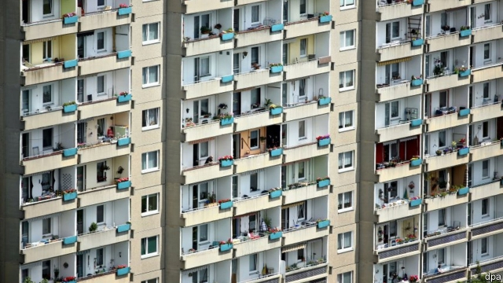

###### Thick as a brick

# Europe embraces rent controls, a policy that never works 

 

> print-edition iconPrint edition | Europe | Jul 20th 2019 

IN 1953 WORKERS in what was then East Germany protested against their Soviet overlords on Karl-Marx-Allee, a monumental boulevard in Berlin lined with Stalinist apartment blocks. The uprising was crushed. Earlier this year residents of the Allee, now yuppier, again took to the streets—to demand socialist policies. They called for big landlords’ properties to be expropriated and rents to be frozen in the capital. This time, the authorities listened. 

On June 18th legislators in Berlin voted to freeze rents for five years, excluding social housing and new-builds. The German capital thus joins a growing club of European cities implementing rent controls. Spain recently limited annual rent hikes, and Barcelona followed up with even stricter rules. Amsterdam is trying to stop investors buying up new-builds to rent them out expensively. On July 1st Paris reintroduced rent caps, which had been scrapped only in 2017. 

The proposal in Berlin is the most radical of these. Under new rules, rents that are deemed too high would be lowered. The law would be retroactive from June 18th, so that anyone who attempts to jack up prices before it is passed could be fined €500,000 ($563,000). Landlords who want to make renovations that would push up prices by more than €0.50 per square metre will have to seek approval. The decision could face challenges from the national government, but may become law early next year. 

In recent years cheap borrowing, low unemployment, an influx of foreign investment and population growth have helped to push up demand for houses across European cities. The rise of Airbnb, a home-stay site, and the relocation of companies due to Brexit, particularly to Frankfurt, Paris and Amsterdam, have accelerated the trend. Anger about gentrification and “over-tourism” may also have played a part in the Berlin proposal, as well as practices that have allowed certain rents to rise much faster than wage growth, pricing a lot of people out of the market. 

Economists warn that rent caps tend to have perverse effects. Landlords will often be tempted to skimp on repairs or may simply seek to sell their properties, as happened in Britain, where rent caps existed until the 1980s. Controls tend to deter investment in the housing market, thus aggravating the shortages that prompted them in the first place. The head of the German national housing association has already warned that member companies will build 50,000 fewer apartments over the next five years if the law is enacted. Shares in the company that is Germany’s biggest landlord tumbled on the day of the vote. In San Francisco, caps sharply decreased the supply of rental housing, driving up prices citywide by 5% after they were expanded in 1994. They encouraged landlords to demolish properties and build pricey new ones, since these were exempted, as would happen in Berlin. 

Critics argue that instead of trying to fix prices, cities should allow more homes to be built. Sebastian Czaja, an MP for the Free Democratic Party in Germany, says Berlin needs “a construction offensive”. The city has grown by about 50,000 people a year since 2011, but added only 10,000 new apartments per year. Berliners are not helping themselves: they have voted against developing a field the size of Monaco near the city centre, and halted plans to build on a huge patch of farmland nearby. Amsterdam is struggling to meet supply, too. It aims to build 1m new homes by 2030, but issued fewer than 10,000 permits last year. 

Rents in German new-builds are high partly because building regulations have become extremely stringent, says Michael Voigtländer of the German Economic Institute. Frédéric Cherbonnier of the Toulouse School of Economics says that in Paris large rent subsidies, which total 1% of GDP in France, have helped to push up prices and should be cut, since the benefits largely accrue to landlords, not renters. 

High rents are unlikely to come down soon. The European Central Bank is maintaining ultra-low interest rates, and urban migration will continue. If politicians really want to help renters, they should favour concrete-mixing, not price-fixing. ■ 

