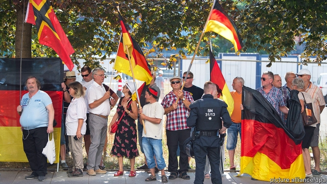
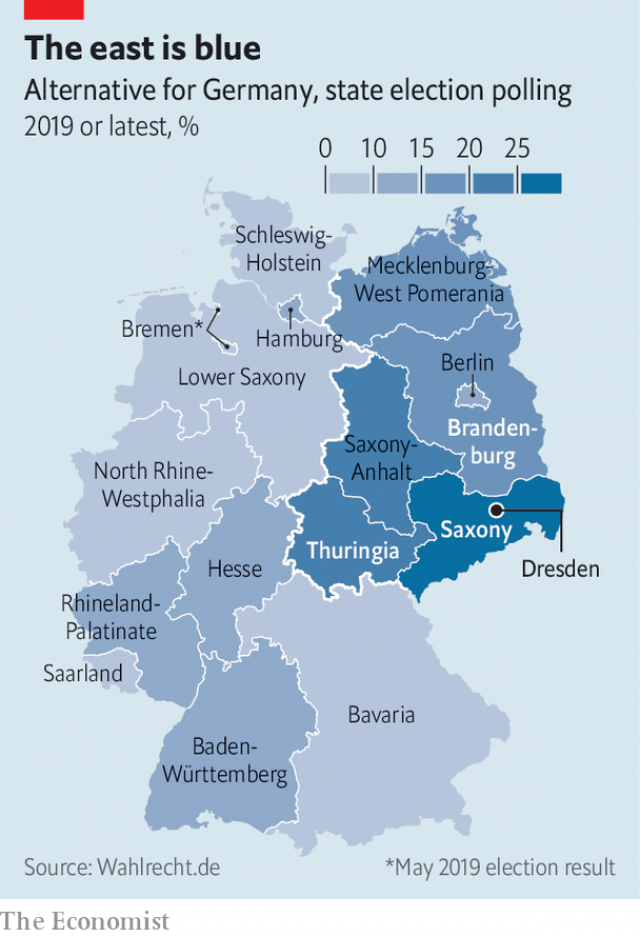

###### Wing nuts

# Germany’s far right: strong in the east, weak in the west 

 

> print-edition iconPrint edition | Europe | Jul 20th 2019 

IT IS AN ordinary Monday evening in Dresden. Around 1,000 people have gathered, under gunmetal skies and German flags, for the fortnightly demonstration organised by Pegida (“Patriotic Europeans Against the Islamisation of the Occident”). It is a peculiar blend of the convivial and the hateful. The crowd laughs and cheers as speakers rail against immigrants, politicians and the media. Later they march through the city centre, swapping insults with balaclava-clad counter-protesters. There are arrests for violence and Holocaust denial. Your correspondent’s attempts to interview participants are foiled by a ponytailed protester screaming “Lügenpresse!” (“Lying press”), a slur with Nazi overtones revived by Pegida. 

Far-right politics has long found a home in Saxony, the east German state of which Dresden is the capital. The NPD, a neo-Nazi outfit, had seats in Saxony’s parliament from 2004 to 2014. But in a state election on September 1st the Alternative for Germany (AfD), a far-right party, has a chance of coming first. It will also do well in two other eastern elections: in Brandenburg, on the same day, and Thuringia, in October. It polls much better in the states of the old East Germany than in the (far larger) West. But that difference has become a source of division inside the party. 

In the past five years the AfD has transformed itself from a tweedy set of Eurosceptics worried about euro-zone bail-outs into a populist-xenophobic outfit in the vein of Austria’s Freedom Party or the National Rally in France. It has proved a successful strategy. The party has won seats in all 16 state parliaments and, amid dismay over Angela Merkel’s open-door refugee policy, took third place in the general election of 2017, earning 13% of the vote and 94 seats. Yet this success has always rested on an uneasy coalition of disillusioned conservatives, nationalist populists and radicals on the fringes of democracy. Hostility to Mrs Merkel has helped unite these tribes. But they are a fractious lot. 

In Germany’s east the AfD has acquired a distinctive voice as it puts down local roots. Where radical groups like Pegida and the AfD once sought to prove their mutual independence, now east German AfD stars such as Björn Höcke, the party’s leader in Thuringia, make inflammatory speeches at Pegida demos. Pegida’s marches are much smaller than at their peak of 2015, when the group could draw up to 30,000 protesters. But the hard core that remains is more coherent, uniting strands of the radical right, explains Johannes Filous, co-founder of Strassengezwitscher, a journalistic group that monitors Saxony’s far right. Many demonstrators in Dresden now proudly wave the AfD flag. 

Mr Höcke, a race-baiting extremist in the charismatic strongman mould, sits at the heart of the Flügel (“Wing”), an ultra-right grouping inside the AfD whose influence far outstrips its support, thought to comprise perhaps one-third of party members. Disciplined and hierarchical, it is dominant in east Germany; it is also gaining strength in the west. That has occasioned drama in several AfD state associations. In North Rhine-Westphalia, Germany’s most populous state, earlier this month most of the party leadership quit in protest at the growing influence of the Flügel, which has left those loyal to Mr Höcke in charge. On July 10th over 100 AfD officials wrote an open letter vowing that they would strive to protect the party from the cult of personality surrounding Mr Höcke. 

Tellingly, none of the AfD’s national leaders was among them. The leadership “needs to keep both wings together, and that gives the advantage to the radicals,” says Werner Patzelt, a political scientist in Dresden. But should Mr Höcke become the voice of the party, conservative AfD voters in the west may be scared off. One party figure has said the AfD may lose ten votes in the west for each one it gains in the east. Paradoxically, success for the AfD in the autumn elections could intensify the party’s problems by vindicating the eastern ultras. Some internal differences are “difficult to reconcile,” acknowledges Tino Chrupalla, an AfD MP from eastern Saxony. All this comes at an awkward time for the party which is sagging in national polls. 

 

It has also been stung by suggestions that its rhetoric encourages violence. Annegret Kramp-Karrenbauer, the CDU’s leader, has said that anyone in her party who is considering working with the AfD should “close their eyes and imagine Walter Lübcke”, a reference to a CDU politician who was murdered recently, allegedly by a neo-Nazi fanatic. 

But the AfD’s success in the east creates a real problem for mainstream parties who must form governments from a fragmented vote. In Saxony the AfD and the CDU both poll around 25%. Michael Kretschmer, the state’s premier and CDU leader, rules out a coalition with the AfD after the election. But others in his party seem less sure. In neighbouring Saxony-Anhalt, where the CDU leads a fractious three-way coalition, some party figures want to open the debate. At municipal level there are signs of informal CDU-AfD co-operation. And even in Saxony, a minority CDU government open to working with all parties, including the AfD, may ultimately look more attractive than the unwieldy three- or four-party coalition that may be the only alternative. 

In the long term, the prospects for such deals may depend on the AfD itself. And in the east the party is making itself harder to work with. It has started to foster a nascent “Ossi” nationalism, hinting that easterners’ experience of dictatorship renders them cannier than west Germans, corrupted as westerners are by Merkel, migrants and the Lügenpresse—and, perhaps, well placed to bring about the necessary revolution. At the Pegida event a speaker attacks the domestic intelligence agency that has declared the Flügel a target for surveillance, triggering cries of “Stasi!” from the crowd. An east Berlin branch of the AfD recently circulated a meme depicting west Germany as an Islamic caliphate, with the national flag reserved for the east. 

Needless to say, the audience for this sort of thing in western Germany is limited. Hoping for a showdown, some of the AfD’s less radical politicians want the easterners to put themselves up for election to the party’s executive board, which is dominated by westerners, later this year. Mr Höcke has vowed that the board will change, but may not stand himself. That makes him a coward, snorts one of his internal opponents. But it is increasingly clear who has the upper hand. ■ 

