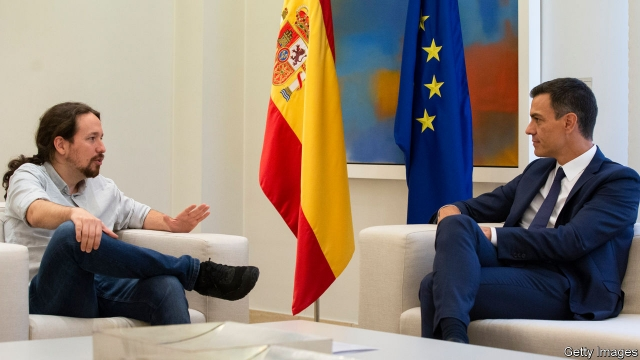
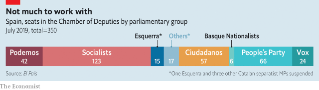

###### Iberian interregnum

# Spain stumbles towards a government 

 

> print-edition iconPrint edition | Europe | Jul 20th 2019 

IT IS ALMOST three months since an election gave Pedro Sánchez, the Socialist prime minister, victory but left him well short of a majority in a fragmented parliament. Spaniards have watched Danes and Greeks swiftly form new governments after more recent votes. No such luck for them. After weeks of stasis and then haggling, only in a debate starting on July 22nd will Mr Sánchez seek the approval of parliament to form a government. 

His clearest route involves hooking up his Socialists (with 123 of the 350 seats in parliament) in a coalition of some sort with Podemos (42), a further-left party. Parliamentary backing from Basque nationalists and two small regional parties would take the total to 173. Esquerra, a Catalan separatist party, will probably abstain, which would get Mr Sánchez over the line. “This is the agreement that could happen,” says Pablo Simón, a political scientist at Carlos III University. “But I don’t know if it will.” 

There is much bridge-building to do. Little took place in the first month after the election because a vote for mayors and 12 of Spain’s 17 regional administrations followed on May 26th. Then Mr Sánchez threw himself into the horse-trading over EU jobs, securing the post of foreign-relations supremo for Josep Borrell, his foreign minister. At home, Mr Sánchez’s possibilities are limited, mainly because Albert Rivera, the leader of Ciudadanos, a formerly liberal party that has swerved right, ruled out any agreement even before the election. Mr Sánchez has urged Ciudadanos and the conservative People’s Party (PP) to abstain to allow him to form a government. His case is weakened because he scorned a similar request from Mariano Rajoy, then prime minister, in 2016. 

 

That leaves two options: reach a deal with Podemos or call a fresh election in the autumn, which would be Spain’s fourth in as many years. Amid mounting acrimony, on July 15th Mr Sánchez said his talks with Pablo Iglesias, leader of Podemos, had broken down. The crux of their disagreement is over how much power Podemos would have in the government. Mr Sánchez at first hoped to form a Portuguese-style administration, in which the Socialists govern alone but with parliamentary support from two further-left parties. Unlike his Portuguese counterparts Mr Iglesias has insisted on a formal coalition. 

Mr Sánchez has successively offered a “government of co-operation” in which Podemos would have second-tier jobs, and then a couple of ministries for technocratic sympathisers. Officials rule out inviting Mr Iglesias himself or Irene Montero, his political and life partner, into senior cabinet posts. “They don’t trust them,” says Mr Simón. There are big policy disagreements, ranging from the economy to Catalonia, where Mr Iglesias supports a referendum on self-determination. 

If the investiture fails this month, in theory Mr Sánchez could try again in September. But it would be no easier then. His bet is that Mr Iglesias will come back to the table rather than risk another election. In April Podemos lost 29 seats and over a quarter of its vote, mainly to the Socialists. Polls suggest it would now do even worse. But another election is risky for the prime minister too. Voters might blame him for political paralysis. So the betting in Madrid is that a deal will be struck for a low-level coalition. Mr Sánchez is “a good negotiator” and he has the initiative, says Eduardo Serra, a former minister. After ousting Mr Rajoy in a censure motion in June 2018, he managed to govern for 11 months with just 84 seats. 

To consolidate Spain’s slowly fading economic recovery, tackle the social scars of its previous slump and contain Catalan separatism will be hard. It would require reforms of the labour market, education and training and regional financing, as well as deficit-cutting. The first task is to approve a budget. Mr Sánchez envisages some tax increases but also the gradual implementation of a public-spending review. On many of these issues Podemos would be an awkward partner. 

Spain’s politicians are still struggling to adapt to change. Since democracy was restored in 1977 it has never had a coalition government. But under the strain of slump and separatism, the old two-party system has splintered. The top dogs are all young and inexperienced; at 47, Mr Sánchez is the oldest of the national leaders. Nevertheless, Spaniards will be fed up if they fail to give the country a government before they head for the beaches next month. ■ 

