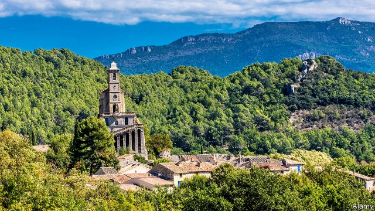

###### Gallic shrubs

# Why France’s forests are getting bigger 

 

> print-edition iconPrint edition | Europe | Jul 20th 2019 

ON THE NORTHERN edge of Provence, a mountain pass winds its way out of a valley of apricot orchards and olive groves into a startling landscape of emerald forest and limestone ridges. This is part of one of France’s newest regional natural parks, the Baronnies Provençales, set up four years ago and spreading across 1,800 square kilometres (700 square miles) of the Drôme and Hautes-Alpes. With a mix of pine, oak and beech, fully 79% of the park is covered by forest, and this share is growing. In fact, as the world worries about deforestation, the total area of forests in France is actually on the rise. 

Forests now cover 31% of France. In terms of area, it is the fourth most forested country in the EU, after Sweden, Finland and Spain. Since 1990, thanks to better protection as well as to a decline in farming, France’s overall wooded or forested areas have increased by nearly 7%. And France is far from being alone. Across the EU, between 1990 and 2015, the total forested and wooded area grew by 90,000 square kilometres—an area roughly the size of Portugal. Almost every country has seen its forests grow over the period. 

In the minds of city-dwellers and green voters, this is self-evidently a good thing. Certainly, the mass planting of trees on a global scale has the potential to help absorb the carbon-dioxide emissions that drive global warming. Deep within the Baronnies Provençales natural park, where rare species such as the black vulture can now occasionally be spotted above higher peaks, things are not quite that simple. 

Some of the 34,000 people who live inside the park see species such as the black pine, a drought-resistant conifer that encroaches on pastureland, as a pest. During the dry summer months, there are also worries that unmanaged forest growth increases the risk of fire. “The fact that forests are growing here can be problematic,” says Audrey Matt, in charge of forests at the park. “It all depends which way round you look at it.” 

Indeed, when the park was first created, local opposition groups were vocal. There were (unfounded) fears, recalls one local resident, that it would mean an end to hunting and would bring stricter environmental rules. An association calling itself “Free Baronnies, No Park” denounced a “steamroller” approach to its creation. It took nearly two decades of planning to set up the park and, even then, 44 of the 130 communes that lie within its boundaries initially refused to join in. A dozen or so have since changed their minds. 

Managing the forest is complex. The park covers a web of local governments. Most of the trees grow on private land, beyond the reach of rangers, and are therefore usually left untended. Competing demands, between those seeking to protect nature at all costs and others with jobs in logging or related industries, are not easy to reconcile. Paradoxically, France is a net importer of wood, something the French government wants to change. Yet last October employees of France’s National Forestry Office marched in the nearby town of Valence to protest against the increasing commercial exploitation of forests, as well as job and budget cuts. 

The French have a long and ambiguous link to their forests, a source of conflict during the revolution in the eighteenth century between nobles and peasants seeking firewood and land for grazing. The first serious attempt to protect them, a decree passed in 1669 under the ancien régime, was in reality designed to secure timber for Louis XIV’s naval ships. Then, as now, those with a long-term interest in exploiting forests have a powerful incentive to conserve and replenish them. ■ 
<<<<<<< HEAD

-- 

 单词注释:

1.gallic['gælik]:a. 瘿的, 镓的 

2.shrub[ʃrʌb]:n. 矮树, 灌木, 果汁甜酒 

3.Jul[]:七月 

4.Provence['prɒvens]:n. 普罗旺斯(在法国东南部) 

5.apricot['eiprikɒt]:n. 杏子, 杏树, 杏黄色 a. 杏黄色的 

6.orchard['ɒ:tʃәd]:n. 果园, 果树林 

7.olive['ɒliv]:n. 橄榄, 橄榄树, 橄榄色, 橄榄枝 a. 黄绿色的, 黄褐色的, 橄榄色的 

8.grove[grәuv]:n. 小树林 

9.landscape['lændskeip]:n. 风景, 山水, 风景画 vi. 从事景观美化 vt. 美化...景观 [计] 横向 

10.emerald['emәrәld]:n. 翡翠, 绿宝石, 翠绿色 a. 翡翠的, 翠绿色的 

11.limestone['laimstәun]:n. 石灰石 [化] 石灰石; 石灰岩 

12.regional['ri:dʒәnәl]:a. 地方的, 地域性的 [医] 区的, 部位的 

13.Drôme[]:[地名] 德龙河 ( 法 ) 

14.oak[әuk]:n. 橡树, 橡木 a. 橡木制的 

15.beech[bi:tʃ]:n. 山毛榉 [机] 山毛榉 

16.fully['fuli]:adv. 十分地, 完全地, 充分地 

17.deforestation[di:.fɒ:ri'steiʃәn]:n. 采伐森林, 森林开伐 [法] 砍伐森森 

18.EU[]:[化] 富集铀; 浓缩铀 [医] 铕(63号元素) 

19.Sweden['swi:dn]:n. 瑞典 

20.Finland['finlәnd]:n. 芬兰 

21.Spain[spein]:n. 西班牙 

22.wooded['wudid]:a. 树木繁茂的 

23.Portugal['pɒ:tʃugl]:n. 葡萄牙 

24.voter['vәutә]:n. 选民, 投票人 [法] 选民, 选举人, 投票人 

25.emission[i'miʃәn]:n. 发射, 射出, 发行 [医] 发射, 遗精 

26.specie['spi:ʃi]:n. 硬币 [经] 硬币 

27.vulture['vʌltʃә]:n. 秃鹫, 贪婪的人 [法] 贪婪而残酷者, 劫掠成性者 

28.conifer['kɒnifә]:n. 松柏目植物, 针叶树 

29.encroach[in'krәutʃ]:vi. 侵犯, 侵蚀, 蚕食 [法] 侵犯, 侵入, 侵占 

30.pastureland['pɑ:stʃәlænd;'pæs-]:n. 牧场 

31.unmanaged[]:非托管的 

32.problematic[prɔblә'mætik]:a. 成问题的, 未定的, 疑难的, 有疑问的, 盖然性的, 或然性的 

33.audrey['ɔ:dri:]:n. 奥德丽（女子名） 

34.matt[mæt]:a. 表面暗淡的, 无光泽的, 表面粗糙的, 不光滑的 [医] 无光泽 

35.opposition[.ɒpә'ziʃәn]:n. 反对, 敌对, 相反, 在野党 [医] 对生, 对向, 反抗, 反对症 

36.vocal['vәukl]:a. 嗓音的, 声音的, 有声的, 歌唱的 n. 元音, 声乐作品 

37.unfounded['ʌn'faundid]:a. 没有事实根据的, 没有理由的, 虚幻的, 未建立的 [法] 无根据的, 无稽的, 没有理的 

38.environmental[in.vaiәrәn'mentәl]:a. 周围的, 环境的 [经] 环境的, 环保的 

39.denounce[di'nauns]:vt. 告发, 抨击, 谴责 [法] 谴责, 斥责, 告发 

40.steamroller['sti:mrәjlә(r)]:vt.vi. 压垮, 压服 n. 蒸汽压路机, 高压力量, 高压手段 

41.creation[kri:'eiʃәn]:n. 创造, 创作物, 发明 [化] 产生 

42.commune[kә'mju:n]:n. 恳谈, 社区, 公社 vi. 亲密交谈, (感情上)融为一体 

43.initially[i'niʃәli]:adv. 最初, 开头 

44.ranger['reinʒә]:n. 王室守林人, 骑警, 漫游者 

45.untended['ʌn'tendid]:a. 未受到照顾的, 被忽略了的 

46.reconcile['rekәnsail]:vt. 使和解, 调停, 使和谐, 使一致, 使听从 [经] 对帐, 使一致 

47.paradoxically[]:adv. 反论, 荒谬, 自相矛盾, 似非而可能是 

48.importer[im'pɒ:tә]:n. 输入者, 进口商 [法] 进口商, 输入者 

49.forestry['fɒristri]:n. 林学, 森林地 [法] 林地, 林学, 林业 

50.valence['veilәns]:n. 原子价 [化] 化合价; 原子价 

51.exploitation[.eksplɒi'teiʃәn]:n. 开发, 开采, 剥削 [经] 开发, 剥削, 宜传 

52.eighteenth[ei'ti:nθ]:num. 第十八, 十八分之一 

53.graze[greiz]:n. 吃草, 放牧, 擦伤, 轻擦 v. (使)吃草, 放牧, 轻擦, 擦伤 

54.decree[di'kri:]:n. 法令, 判决, 天意 vt. 颁布, 判决 vi. 发布命令 

55.ancien[]:[网络] 过去的；古战场；古希 

56.louis['lu(:)i, 'lu(:)is]:n. 路易斯（男子名） 

57.incentive[in'sentiv]:n. 动机 a. 激励的 

58.replenish[ri'pleniʃ]:vt. 把...重新补足, 把...再装满 vi. 被再装满, 充满 
=======
>>>>>>> 50f1fbac684ef65c788c2c3b1cb359dd2a904378

