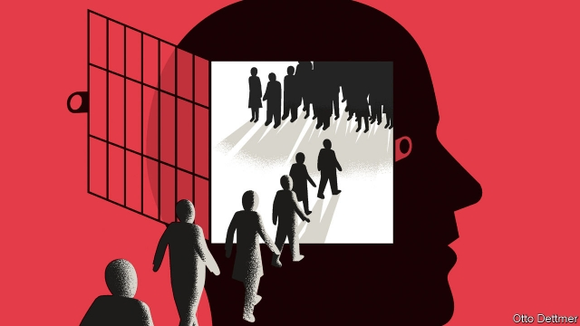
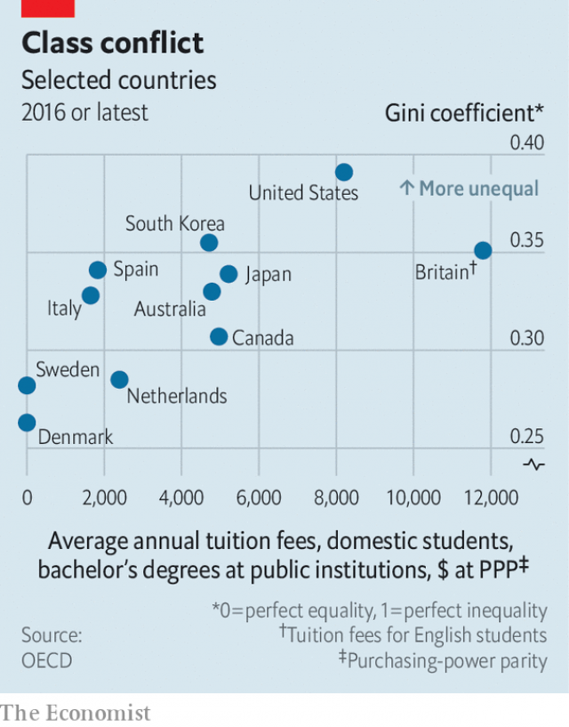

###### Free exchange

# A debate is under way about the cost of higher education 

 

> print-edition iconPrint edition | Finance and economics | Jul 18th 2019 

IN MANY WAYS the flood of bold, progressive policy proposals coursing across America’s political landscape began in 2015, when Bernie Sanders, an independent senator from Vermont, put a plan to make higher education at public universities free at the centre of his upstart campaign for the presidency. Then the idea seemed radical, even gimmicky. Now it is noteworthy when leading Democrats oppose the notion. Yet some do, for example Pete Buttigieg, the mayor of South Bend, and their arguments still pack a punch. Why indeed should taxpayers’ money be spent on the children of the rich rather than more generous financial aid for the poor? The Democratic debate over free college is in fact part of a deeper disagreement about how best to structure a welfare state. 

Across much of the rich world, a public-university education is free or nearly free, apart from the cost of books and living expenses. (Danish students even receive a stipend to help pay for such things.) But those in America and Britain pay tuition fees which are high and growing higher. In Britain, a change in the law in 1998 allowed public universities to begin charging. The average tuition fee at four-year public universities in America has roughly tripled over the past three decades after adjusting for inflation. Rising fees represent an evolution towards a means-tested approach to covering the rising cost of higher education, which has gone up steadily all around the world. Places like America and Britain pass some of this increase on to students in the form of higher fees, with the understanding that poorer students will receive financial aid while richer ones will bear the full tuition bill. 

To many politicians in these places, this seems just. Unlike primary or secondary education, university is a minority pursuit in most advanced economies. Across the OECD, a club of mostly rich countries, only about 45% of adults aged 25 to 34 have some post-secondary education. Those people tend to come from richer families and to earn more than the population as a whole. A universal programme that mostly benefits a well-off not-quite-half of the country would seem a strange aspiration for egalitarian-minded politicians (though less strange for those desiring young people’s votes). Better to target aid at those from poorer families. 

An economic approach points in a similar direction. A post-secondary education represents an investment in a person’s future earning power, thanks to the skills obtained in school, the connections and credentials gathered along the way, and the signal a tertiary degree provides to employers. Since students reap most of the benefit, they should bear the cost (borrowing against future earnings if need be), lest subsidies encourage people to spend years at university that might be better allocated elsewhere. 

Against this, supporters of free university marshal a number of practical arguments. University attendees are more likely to come from wealthier families precisely because university is not free, they say. There is something to this. Higher tuition charges do push some people away from post-secondary education. Several analyses of the introduction of tuition fees in Britain found a negative effect on university attendance. A report produced by the Institute for Fiscal Studies, a think-tank, estimated that an increase of £1,000 ($1,243) in tuition fees is associated with a decline of 3.9 percentage points in the rate at which recent school-leavers choose to go on to university. Work by Thomas Kane of Harvard University found a response of similar magnitude in America. And research by Susan Dynarski of the University of Michigan and Judith Scott-Clayton of Columbia University concludes that both attendance and completion rates are higher when education is more affordable. Their work also suggests that the tangle of eligibility rules and application processes students must navigate to get financial aid can lessen its benefits. 

Free tuition, by contrast, is simple to administer and easy to understand. The rich, furthermore, can pay for their privilege later in life through systems of progressive taxation. (Mr Sanders would pay for his plan through a tax on financial transactions; his Democratic rival, Senator Elizabeth Warren, would fund a free-college programme with a tax on multi-millionaires.) In any case, many young people from well-off households will attend pricey private universities rather than free public ones. 

But the most powerful arguments for free university are about values rather than economic efficiency. To politicians like Mr Sanders, a post-secondary education is a part of the basic package of services society owes its members. There are broad social benefits to a well-educated citizenry, because new ideas allow society as a whole to prosper and cultivating an informed population in an increasingly complex world probably takes more than 12 or so years of schooling. Amid constant technological change, a standing offer of free higher education may represent an important component of the social safety-net. Universality reinforces the idea that free education is not an expedient form of redistribution, but part of a system of collective insurance underpinning an egalitarian society. To progressive politicians, means-tested services send the message that government programmes are for those who cannot help themselves, whereas universal programmes are a means by which society co-operates to help everyone. 

 

Ironically, such values-based arguments, however one feels about them, are undercut by rising inequality. As the rich pull away from the rest, their increased political power may stymie tax rises needed to fund universal public services. Meanwhile for progressive politicians the need to target available funds at the worst-off in society grows more urgent; in America, the argument that the children of billionaires should not receive a government-funded education takes on greater moral as well as practical weight. It is probably no coincidence that tuition fees are lowest in places with the most equal income distributions (see chart). Strong safety-nets compress the income distribution. But inequality may also make the sorts of comprehensive public services that underpin egalitarian societies ever harder to sustain. ■ 
<<<<<<< HEAD

-- 

 单词注释:

1.Jul[]:七月 

2.coursing['kɔ:siŋ]:n. 追赶；奔驰；携带猎犬狩猎 

3.landscape['lændskeip]:n. 风景, 山水, 风景画 vi. 从事景观美化 vt. 美化...景观 [计] 横向 

4.bernie['bә:ni]:n. 伯尼（男子名）；[俚]可卡因（等于cocaine） 

5.sander['sændә]:[电] 散沙 

6.senator['senәtә]:n. 参议员, (某些大学的)理事 [法] 参议员, 上议员 

7.Vermont[vә:'mɔnt]:n. 佛蒙特 

8.upstart['ʌpstɑ:t]:n. 新贵, 暴发户, 自命不凡者 a. 暴富的 

9.presidency['prezidәnsi]:n. 总统职权, 总裁职位 

10.gimmicky['^imiki]:a. 巧妙手法的 

11.noteworthy['nәutwә:ði]:a. 值得注目的, 显著的 

12.democrat['demәkræt]:n. 民主人士, 民主主义者, 民主党党员 [经] 民主党 

13.Pete[pi:t]:n. 皮特（等于Peter, 男子名） 

14.buttigieg[]:布蒂吉格 

15.Danish['deiniʃ]:n. 丹麦文 a. 丹麦的, 丹麦人的, 丹麦文的 

16.stipend['staipend]:n. 薪金, 定期生活津贴 [经] 薪水 

17.triple['tripl]:n. 三倍数, 三个一组 a. 三倍的 vt. 使增至三倍 vi. 增至三倍 

18.inflation[in'fleiʃәn]:n. 胀大, 夸张, 通货膨胀 [化] 充气吹胀; 膨胀 

19.Oecd[]:[经] 已开发国家组织 

20.aspiration[.æspә'reiʃәn]:n. 热望, 志向, 渴望 [医] 吸入; 吸[引], 吸引术 

21.les[lei]:abbr. 发射脱离系统（Launch Escape System） 

22.credential[kri'denʃәl]:n. 国书, 凭据, 证明书 [经] 凭证, 证书 

23.tertiary['tә:ʃiәri]:a. 第三的, 第三位的, 第三产业的 n. 第三修道会会员, 第三纪 第三的; 三代的(指无机盐) 

24.earning['ә:niŋ]:n. 收入（earn的现在分词） 

25.supporter[sә'pɒ:tә]:n. 支持者, 后盾, 迫随者, 护身织物 [法] 支持者, 赡养者, 抚养者 

26.marshal['mɑ:ʃәl]:n. 元帅, 陆空军高级将官, 典礼官, 执法官 vt. 整理, 引领, 统率 vi. 排列, 各就各位 

27.attendee[æten'di:]:[计] 出席人, 参加者, 被照顾者, 被服务者 

28.precisely[pri'saisli]:adv. 精确地, 明确地, 刻板地, 拘泥地, 正好, 恰恰, 对, 正是如此, 确实如此, 不错 

29.attendance[ә'tendәns]:n. 出席, 出席的人数, 照料 [法] 管理, 照料, 资助 

30.fiscal['fiskәl]:a. 财政的, 国库的 [经] 财政上的, 会计的, 国库的 

31.thoma[]:n. (Thoma)人名；(阿尔巴、阿拉伯)索玛；(英、德、罗、匈、捷、塞、瑞典)托马 

32.kane[kein]:n. 凯恩（姓氏, 美国北极探险家） 

33.Harvard['hɑ:vәd]:n. 哈佛大学 

34.magnitude['mægnitju:d]:n. 巨大, 重大, 重要, 大小, 数量, 星等(指星的亮度) [计] 大小; 值 

35.susan['su:zn]:n. 苏珊（女子名） 

36.Michigan['miʃigәn]:n. 密歇根州 

37.judith['dʒu:diθ]:n. 朱迪思（女子名） 

38.Columbia[kә'lʌmbiә]:n. 哥伦比亚 

39.completion[kәm'pli:ʃәn]:n. 完成 [经] 完井, 结束, 完工 

40.affordable[]:[计] 普及型 

41.tangle['tæŋgl]:n. 缠结, 纠结的一团, 困惑, 纠纷, 混乱 vt. 使缠结, 缠住 vi. 缠结, 乱作一团 

42.eligibility[.elidʒә'biliti]:n. 适任, 合格 [法] 合格, 合格性 

43.navigate['nævigeit]:vi. 航行 vt. 航行于, 驾驶, 操纵, 使通过 

44.administer[әd'ministә]:vt. 管理, 料理, 执行 vi. 执行遗产管理人的职责, 给予帮助 

45.taxation[tæk'seiʃәn]:n. 课税, 征税, 抽税, 税款, 估定的税额 [经] 征税, 纳税, 税制 

46.transaction[træn'sækʃәn]:n. 交易, 办理, 学报, 和解协议 [计] 事务处理 

47.senator['senәtә]:n. 参议员, (某些大学的)理事 [法] 参议员, 上议员 

48.elizabeth[i'lizәbәθ]:n. 伊丽莎白（女子名） 

49.warren['wɒrәn]:n. 养兔场, 拥挤的地区 

50.pricey['praisi]:a. 昂贵的, 价格高的 

51.citizenry['sitizәnri]:n. 市民 [法] 市民 

52.prosper['prɒspә]:vi. 繁荣, 兴隆, 成功 vt. 使成功, 使昌盛 

53.amid[ә'mid]:prep. 在其间, 在其中 [经] 在...中 

54.technological[.teknә'lɒdʒikl]:a. 技术的 [经] 工艺的, 技术的 

55.universality[.ju:ni'sæliti]:n. 普遍性, 一般性, 广泛性 [化] 普适性 

56.expedient[ik'spi:diәnt]:n. 权宜之计 a. 权宜的, 方便的, 有用的 

57.redistribution['ri:distri'bju:ʃәn]:n. 重新分配, 再分发 [计] 重新分配 

58.underpin[.ʌndә'pin]:vt. 从下面支承, 支撑, 支持 [经] 支撑 

59.egalitarian[i.gæli'tєәriәn]:a. 平等主义的 n. 平等主义 

60.cannot['kænɒt]:aux. 无法, 不能 

61.ironically[]:adv. 冷嘲地, 挖苦地, 讽刺地, 令人啼笑皆非地 

62.undercut['ʌndәkʌt]:n. 底切, 牛腰部下侧嫩肉, 下口, 下旋削球 vt. 廉价出售, 底切, 雕出, 下旋削球 vi. 切除底部 

63.inequality[.ini'kwɒliti]:n. 不平等, 不同, 不平坦, 不平均 n. 不平等, 不等式 [计] 不等式 

64.stymie['staimi]:n. (喻)困难的境地 vt. 使(球)处于困难的位置, 使为难, 使处困境, 妨碍, 阻挠, 阻碍 

65.billionaire[.biljә'nєә]:n. 亿万富翁 
=======
>>>>>>> 50f1fbac684ef65c788c2c3b1cb359dd2a904378

