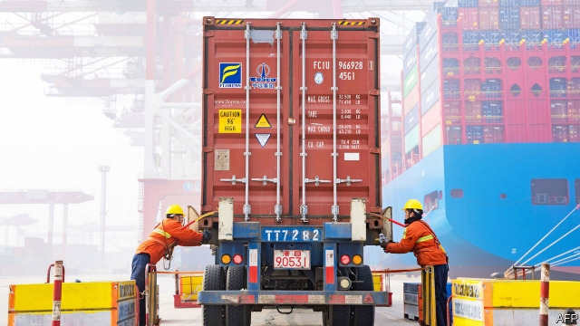
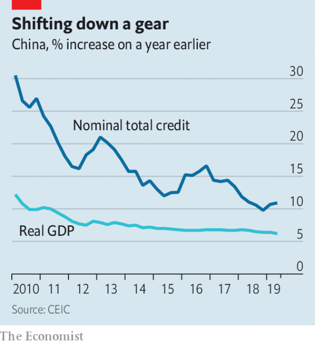

###### Darker horizon

# China’s growth is the slowest in nearly three decades: get used to it 

 

> print-edition iconPrint edition | Finance and economics | Jul 20th 2019 

CHINA’S ECONOMY is slowing, again. After a good start to the year annual growth slipped to 6.2% in the second quarter, the weakest in nearly three decades. That is hardly cause for panic: for an economy now worth nearly $14trn, such a growth rate is impressive. As the trade war with America hurts exporters, it also underlines the extent to which China’s economy is now fuelled by domestic demand. The question for the coming months is whether that domestic strength will remain sufficient to offset the trade turmoil. 

The export picture has clearly worsened. Last year, even as America’s president, Donald Trump, first levied tariffs on China, the country still managed to increase its exports by 10%. But this year Chinese exports have all but stopped growing. 

In May Mr Trump ratcheted up tariffs on Chinese goods, and he has threatened to hit China with yet more duties if trade negotiators fail to resolve an impasse. China, for its part, appears to be in no rush to reach a deal: Zhong Shan, the hard-nosed commerce minister, recently joined the Chinese negotiating team. In published comments this week he blamed America for the trade war, calling it “a classic example of unilateralism and protectionism”. 

China’s willingness to take a more unyielding stance partly reflects confidence in its own economy. Activity accelerated towards the end of the second quarter. Investment in factories, roads and other fixed assets increased by 6.3% in June compared with a year earlier, up from 4.3% year-on-year in May. Retail sales were also robust, rising 9.8% in June compared with a year earlier, up from 8.6% in May. 

Yet there are doubts about how long this resilience will last. Some of the apparent strength is transient. Car sales, which had been in the doldrums, surged in June to double-digit growth, pushing up retail sales more broadly. But that was largely because dealers had slashed prices to run down inventories before tough new emission standards were imposed in July. The property sector, a bellwether for the economy, also seems set to soften after sales were down in the second quarter. Uncertainty from the trade war may take a toll, too. Foreign companies have started to shift more operations away from China. 

 

The government has started to spend more on infrastructure, a tried-and-tested method in China for revving up growth. In recent months it has made it easier for municipal officials to raise funds for building railways and highways. With the central bank injecting cash into the financial system, nominal credit growth has also edged up since the end of 2018 (see chart). 

But there are limits to how far the government will go. China’s president, Xi Jinping, has declared that containing financial risks is a matter of national security. The likelihood of another giant stimulus, routine in the past whenever growth slowed, is lower this time. And the government has less money to work with, having already racked up so much debt over the past decade. It also wants to conserve its fiscal firepower in case the trade war turns uglier. In the meantime, get used to headlines about Chinese growth at multi-decade lows. They are likely to appear again in three months and, again, three months after that. ■ 

