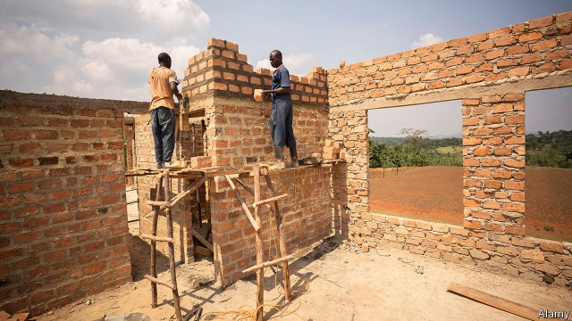

###### One brick at a time

# Housing microfinance can help poor people build better homes 

 

> print-edition iconPrint edition | Finance and economics | Jul 20th 2019 

WHENEVER MICHAEL JJOGA earns some money from his welding business, he buys a bag of cement. Brick by brick he has built a two-roomed house for his family on land he cleared himself in Wakiso district, in central Uganda. Another house stands half-finished nearby until he collects enough iron sheets to make a roof. Across the glade a chorus of bleats drifts from a crumbling hut, shaped from thatch and earth. He used to live in it; now it shelters his goats. 

By 2025 some 1.6bn city dwellers will be living without decent, affordable housing, according to consultants at McKinsey. Many more people lack adequate shelter in the countryside. While governments and private developers fall short, people like Mr Jjoga are building houses themselves. They construct in stages, over years or even decades, preferring to buy a stack of bricks than to put money in a bank. Some move in well before completion. Lenders long overlooked this self-help model, but financed it unwittingly: perhaps a fifth of microloans to businesses are thought to be diverted into housing. 

Now some lenders are starting to target this market directly. Conventional mortgages are rare in developing countries: in Uganda, which has 40m people, there are only 5,000. Instead, banks and microlenders offer smaller housing loans, paid back over shorter periods of 1-3 years. A family might borrow for a cement floor, and then for an extra room. Two-thirds of the firms offering housing microfinance entered the sector in the past decade, according to a global survey in 2017 by Habitat for Humanity, a non-profit organisation. 

Many borrowers lack land titles to use as collateral. Swarna Pragati, an Indian microlender, gets around the problem by establishing de facto ownership through village meetings. Select Africa, which operates in east and southern Africa, offers unsecured housing loans to salaried workers, deducting repayments from their pay cheques. Centenary Bank in Uganda accepts untitled land as security. Robert Canwat, its microfinance manager, says attachment to home makes the whole family monitor repayment. “Everybody becomes your recovery officer,” he smiles. Most lenders report that housing loans are paid back more reliably than other products in their portfolio. 

Houses built incrementally by local artisans are often shoddy. Some lenders try to improve them by providing technical support, such as sample plans or an engineer’s advice. Others help borrowers buy appliances such as solar panels and water filters. One promising innovation is iBuild, an Uber-like app in parts of Africa and Asia. It connects households to builders and suppliers, allowing them to compare quality and price as well as to apply for loans. 

Finance also comes directly from suppliers. CEMEX, a Mexican cement giant, offers credit through its Patrimonio Hoy programme. Customers pay a weekly fee. In return they get technical advice and advance delivery of building materials. The scheme has reached 600,000 households and extended more than $300m of loans since 1998. 

Unlike business loans, which can be paid back out of greater profits, lending for housing creates no obvious income stream. But home ownership frees borrowers from paying rent. And some borrowers use loans to build rental units, shops or even schools. “Think of the house as a place from where the household earns money,” says Kecia Rust of the Centre for Affordable Housing Finance in Africa, a think-tank. 

Habitat for Humanity recently commissioned two evaluations of microfinance products it had developed with lenders in east Africa. In Uganda, the likelihood that a household had a separate kitchen rose by 22% after taking out a loan. In Kenya, borrowers upgraded their roofs and walls. In both cases satisfaction with housing rose, though stress levels and school attendance were unchanged. Repayment rates have been high. “We’ve proved there’s a business case,” says Kevin Chetty of Habitat. 

Microcredit is expensive, because lenders must assess risk and monitor repayment on even the tiniest amount. Housing loans are usually larger than business ones, so processing them is proportionally cheaper. But they also have longer maturities, which means lenders must chase scarce long-term funding. Throw in ponderous law courts and weak competition, and annual interest rates typically reach 20-35%. Some homebuilders are certainly eager for credit. But until such structural problems are addressed, others will keep doing things the old way—even if that means waiting longer to put a decent roof over their heads. ■ 

