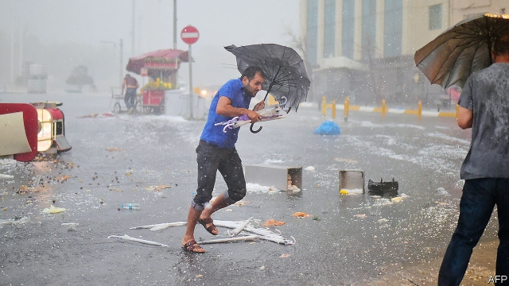
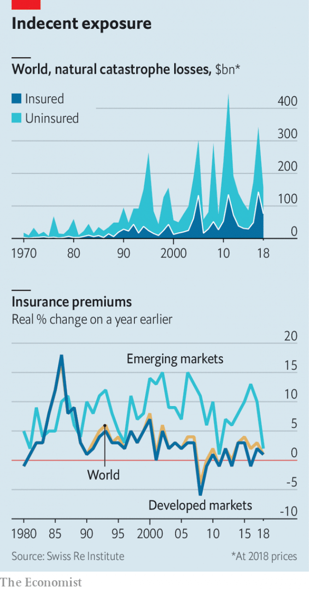

###### Run for cover

# The future of insurance is happening without insurance firms 

 

> print-edition iconPrint edition | Finance and economics | Jul 20th 2019 

EVERY MORNING, from a room in Birmingham, some of the world’s largest firms are briefed by phone on the weather in store. As continents, arrows and weather fronts flicker across their screens, meteorologists at The Weather Company (TWC) help British grocers decide whether to stock soups or salads, and Chinese energy firms when to operate wind turbines. Yet such sessions are getting rarer. Computed by 172 models crunching 400 terabytes of data—33 times the amount Twitter stores every 24 hours—most of TWC’S 25bn daily forecasts now feed directly into customers’ computer systems. 

Big data has turned weather into a big business. TWC, which was bought by IBM in 2016, serves governments, media channels and 40% of the world’s airlines. But many property insurers, whose fortunes rely on forecasting climate-induced losses, are still learning how to use the information, says Leon Brown of TWC. Their cluelessness is symptomatic of a problem for all insurance lines, including casualty, life and health. Reinsurance firms (which insure the insurers) and Asian insurance champions are almost the only innovators in an industry that is moving at a glacial pace. 

Meanwhile the risks insurers are meant to cover are becoming more severe and unpredictable. Since the 1980s average annual losses from natural disasters have more than sextupled in real terms (see chart). Other risks are variations on old themes, such as pandemics or the fallout from increasing protectionism. And new ones have emerged. Ageing populations push up health-care costs. Cyber-attacks can shut power plants, paralyse firms and siphon fortunes from banks’ coffers. 

 

Insurable assets are becoming harder to value and protect, too. In 2018 “tangibles”, such as buildings and equipment, accounted for just 16% of the value of the S&P 500. “Intangibles”, such as intellectual property and reputation, accounted for the other 84%. Meanwhile insurers’ products and processes are losing touch with 21st-century life, from the way populations work to the way they drive. A generation born digital expects speed and style, which do not come naturally to the centuries-old trade. 

Insurers say they have read the memo. AXA, the world’s second-largest by premiums written, has earmarked millions for tech upgrades and designing services that complement its policies, says Guillaume Borie, its innovation chief. But the sector comes second to last in an innovation ranking by BCG, a consultancy. No insurer ranks among the world’s top 1,000 public companies by amount invested in research and development. Insurers allocate an average of 3.6% of their revenue to computing technology—about half the share that is typical for banks. In a study of 500 innovation topics across 250 firms Ninety, a consultancy, finds that many insurers are working on the same narrow set of ideas. Some of the noisiest, such as blockchain, are the least productive. 

Digital entrepreneurs have spied an opening. The first quarter of 2019 saw a record 85 “insurtech” deals totalling $1.42bn, according to Willis Towers Watson, a broker. Some focus on the consumer, aiming to simplify quotations, make policies clearer and develop snazzy apps. Some seek to make internal processes cheaper, faster and fairer, from pricing risks to paying compensation. The most ambitious craft policies that insure against new threats, match modern lifestyles or do more than just make payouts. 

Slice, a startup in New York, offers policies to flat- or ride-sharers that cover single items for a few days. Brooklyn-based Trupo provides disability insurance to “gig” workers, from makeup artists to Uber drivers. Bought by Many, a British startup, caters to people with niche possessions, for example model railways or exotic pets. 

Small and specialist incumbents are seeking to insure businesses against new risks, such as environmental liability or terrorism. In April a group led by Beazley, a 33-year-old British firm, launched a policy covering reputational damage. Using share-price drops as the trigger, it provides compensation and a crisis-management package. It prices risk by scraping information from social media and analysing the impact of past meltdowns. On June 25th a group of underwriters at Lloyd’s of London launched a £53m ($66m) facility designed to speed up product development. 

But spotty innovation does not make up for a stagnating core. In theory, startups should provide valuable additions to insurers’ toolbox. Yet incumbents often dismiss insurtechs as “cute” little things that fail to grasp complexities, says Heidi Lawson of Cooley, a law firm. Administrative costs absorb 20-50% of incumbents’ premiums. A quote for home coverage is often a multiple-choice hell, with cascading options depending on such matters as whether you own a shed or keep bees. Businesses can wait months for a policy’s final wording. “It’s just so depressing,” says an industry veteran. 

The growing abundance of data means customers increasingly think they can do without insurance altogether. The portion of the economy that is covered is shrinking. In developed countries total non-life insurance premiums have grown by 1.2% a year on average since 2008; life has seen an average decline of 0.5%. Despite increased take-up by rising middle classes in emerging markets, global premiums grew in real terms by only 1.3% annually over the period, to $5.2trn. The world economy managed twice that. 

The result is a “protection gap”. On average, over the past ten years, only 30% of catastrophe losses were covered by insurance, according to Swiss Re, a reinsurer. The balance, worth some $1.3trn, was borne by individuals, firms and governments. According to Capgemini, a consultancy, less than a quarter of businesses feel their insurance coverage is adequate. That fell below 15% for personal lines, and even further for health, cyber- and political risks. 

A central reason for insurers’ caution is the fear that regulators will punish them for unwittingly taking on bad risks—or because some new, AI-powered underwriting method is found to be rejecting or overcharging consumers from certain ethnic groups or neighbourhoods. That creates a culture of “trying not to change anything, not to break things”, says Dan White of Ninety. Moreover, waves of consolidation mean insurers have disconnected datasets and computer systems, making it hard to innovate or to absorb successful startups. 

Other weaknesses are less excusable. Mr White describes a typical sequence. Starting from the premise that innovation is good, insurers try to make it “part of the DNA”. Facing internal resistance, those pressing for change shift to an “arm’s-length model”. Many insurers have set up innovation “labs”, “studios” or “garages” where pricey data scientists are told to come up with cool new pilots. Located separately, they operate under different rules: they have beer fridges and pool tables, and staff wear jeans and commute on scooters. 

Then staff at the parent firm get disgruntled with their rule-breaking peers—who, for their part, have not been given the budget to build anything sizeable. So the parent firm’s return on investment is poor. Eventually the labs are closed or mothballed. Firms then give their money to venture-capital funds, run internally or by third parties. But these are designed to bet on startups, not to perfect processes at lumbering giants. Three of Europe’s top six insurers have recently frozen or shrunk their main technology-investment arms. 

Insurers’ apathy is energising reinsurers to innovate in their stead. As the primary insurers that do their distribution lose touch with the market, the reinsurers feel cut off. Reinsurers are also less strangled in red tape. Munich Re, the world’s largest, is in front. It has hired 200 data scientists and trained over 100 experts internally, and crowdsources ideas from staff. Good ideas are fast-tracked; duds are killed quickly, says Tom Van den Brulle, its innovation chief. Last year it paid $250m for relayr, a startup in Berlin that uses sensors to extract data from industrial machinery. 

Reinsurers’ greatest breakthrough so far is probably “parametric insurance”. Rather than compensating for losses reported ex-post, such policies pay out a pre-agreed sum when a clearly defined parameter, such as rainfall or seismic magnitude, reaches a pre-agreed threshold. Since debuting in the 1990s, parametric insurance has mostly been confined to the reinsurance of catastrophic events. But the spread of internet-connected objects creates the potential for it to be applied to previously uninsurable risks. Gerry Lemcke of Swiss Re, which offers parametric insurance against pandemics, flight delays and hurricane damage to coral reefs, sees it as working rather like derivatives in finance, which have a strike price. Customers receive their payouts straight away; insurers save the time and cost of adjusting claims. 

Reinsurers could soon shake up the market further. In recent years third-party capital providers such as pension and sovereign-wealth funds have sought to deploy vast sums in reinsurance markets. That has prompted reinsurers to set up money-management platforms, akin to betting interfaces, where investors can punt on various classes of risk. As a result reinsurers are keen to take on a broadening range of risks directly, by seeking to work with insurtechs and cutting primary insurers out altogether. “They’re calling us,” says Ms Lawson. “They’re looking for deals.” 

Asian giants are also pulling ahead of Western peers. Pia Tischhauser of BCG reckons they are “15 years ahead” on innovative ways to price risk. In China Ping An, which in the 30 years since its founding has become the world’s most valuable insurer, employs 23,000 researchers, spends 1% of revenue on innovation and has over 12,000 patent applications. Its average underwriting time has fallen from five days to 15 minutes; it uses AI to recruit and train its 1.5m-strong army of agents, who are 50% more efficient than the competition. Yet in November its chief executive ruled out major international acquisitions, preferring to focus on domestic expansion. 

For Western incumbents, the greater risk may lie closer to home. Rumours are growing that Big Tech is gearing up to enter insurance. Amazon, Apple and Google have troves of data and idle capital; they lack underwriting skills but can easily lure talent. And they can hope for handsome profits: BCG calculates that the top quarter of insurance firms returned a median 24% to shareholders in 2018. Scaremongering, sceptics say. But an adviser to tech titans is adamant. “We’re seeing what’s happening behind the scenes. They’re on the path.” ■ 
<<<<<<< HEAD

-- 

 单词注释:

1.Jul[]:七月 

2.Birmingham['bә:miŋәm]:n. 伯明翰 

3.flicker['flikә]:n. 闪烁, 闪光, 颤动 vi. 闪动, 闪烁, 摇动, 扑动翅膀 vt. 使摇曳, 使闪烁 

4.meteorologist[.mi:tiә'rɒlәdʒist]:n. 气象学者 

5.TWC[]:abbr. 美国时代华纳电缆公司（Time Warner Cable）；三元催化转化器（Three Way Catalysts） 

6.crunch[krʌntʃ]:v. 嘎吱嘎吱的咬嚼, 压碎, 嘎吱嘎吱地踏过 n. 咬碎, 咬碎声 

7.terabyte[]:[计] 太字节(万亿字节) 

8.twitter['twitә]:n. 啁啾, 唧唧喳喳声 vi. 啭, 啁啾, 颤抖 vt. 嘁嘁喳喳地讲, 抖动 

9.datum['deitәm]:n. 论据, 材料, 资料, 已知数 [医] 材料, 资料, 论据 

10.IBM[]:美国国际商用机器公司 [计] 国际商用机器公司 

11.insurer[in'ʃuәrә]:n. 保险公司 [法] 保险人, 承保人, 保险公司 

12.leon['li(:)әn]:n. 利昂（男子名, 等于Leo） 

13.cluelessness[]:[网络] 无知的；无绪；摸着石头过河 

14.symptomatic[.simptә'mætik]:a. 作为征候的, 症状的, 根据征候的 [医] 症状的 

15.casualty['kæʒjuәlti]:n. 意外事故, 伤亡, 受害者 [化] 事故 

16.reinsurance[.ri:in'ʃurәns]:n. 再保险, 再保险金额 [医] 再保险 

17.innovator['inәuveitә]:n. 改革者, 创新者 

18.glacial['gleiʃәl]:a. 冰的, 冰川的, 冰川时代的, 冰冷的 [医] 冰的, 冰样的 

19.unpredictable[.ʌnpri'diktәbl]:a. 不可预知的 

20.sextupled[]:（使）变成六倍( sextuple的过去式和过去分词 ) 

21.pandemic[pæn'demik]:a. 大流行的, 普遍的, 全世界的 [医] 大流行的, 大流行病 

22.fallout['fɒ:laut]:n. 原子尘的降下, 辐射性微尘, 原子尘, 附带结果 [医] [放射尘]回降 

23.protectionism[prә'tekʃәnizm]:n. 贸易保护主义, 贸易保护制 [经] 保护(贸易)主义, 保护(贸易)制 

24.paralyse['pærәlais]:vt. 使麻痹, 使瘫痪, 使无力, 使气馁, 终止 [医] 使麻痹, 使瘫痪 

25.siphon['saifәn]:n. 虹吸管 vt. 用虹吸管吸出, 抽取 vi. 通过虹吸管 

26.coffer['kɒfә]:n. 保险箱, 金库 vt. 把...锁进箱子 

27.insurable[in'ʃurәbl]:a. 可保险的 [经] 可保险的, 应保险的 

28.asset['æset]:n. 资产, 有益的东西 

29.tangible['tændʒәbl]:n. 可触知的东西, 有形资产 a. 可触摸的, 有实体的, 非相像的, 有形的, 明确的 

30.intangible[in'tændʒәbl]:a. 难以明了的, 无形的 [经] 无形的 

31.memo['memәu]:n. 备忘录 [经] 备忘录 

32.Axa['æksə]:abbr. 法国安盛（AXA Financial , Inc） 

33.premium['pri:miәm]:n. 额外补贴, 奖金, 奖赏, 保险费 [医] 保险费 

34.earmark['iәmɑ:k]:n. 耳上记号, 特征, 记号, 标记 vt. 在耳朵上做记号, 标记, 指定...作特定用途 

35.tech[tek]:n. 技术学院或学校 

36.upgrade['ʌpgreid]:n. 上坡, 升级, 上升 adv. 往上 vt. 使升级, 提升, 改良品种 vi. 升级 [计] 升级 

37.complement['kɒmplimәnt]:n. 补足物, 补语, 补数 vt. 补充, 补足 [计] 补码; 反相器; 补数 

38.Guillaume[,^i:'jәum]:纪尧姆(①姓氏 ②Charles Edouard, 1861-1938, 生于瑞士的法国物理学家, 曾获1920年诺贝尔物理学奖) 

39.innovation[.inәu'veiʃәn]:n. 改革, 创新 [法] 创新, 改革, 刷新 

40.sector['sektә]:n. 扇形, 部门, 部分, 函数尺, 象限仪, 段, 区段 vt. 把...分成扇形 [计] 扇面; 扇区; 段; 区段 

41.BCG[]:卡介苗 [化] 卡介苗 

42.consultancy[]:n. 商量, 协商, 磋商, 会诊, 与...商量, 咨询, 请教, 找(医生)看病, 查阅, 考虑 [经] 咨询业务, 咨询服务 

43.computing[kәm'pju:tiŋ]:[计] 计算 

44.blockchain[blɒkt'ʃeɪn]:na. (脚踏车等的)车链 [网络] 块环链；数据块链；资料块链 

45.entrepreneur[.ɒntrәprә'nә:]:n. 企业家, 主办人 [经] 承包商, 企业家 

46.willis['wilis]:n. 威利斯（姓氏, 男名） 

47.Watson['wɔtsn]:[计] 沃森 

48.broker['brәukә]:n. 掮客, 经纪人 [经] 经纪人, 掮客 

49.snazzy['snæzi]:a. 华丽的, 华丽而俗气的, 时髦的 

50.APP[]:[计] 应用, 应用程序; 相联并行处理器 

51.compensation[.kɒmpen'seiʃәn]:n. 补偿, 赔偿金, 工资 [医] 代偿(机能), 补偿 

52.ambitious[æm'biʃәs]:a. 有野心的, 抱负不凡的, 雄心勃勃的 

53.lifestyle['laifstail]:n. 生活方式 

54.payout['pei'aut]:n. 支出, 付出款项 [经] 付出款项, 花费, 支出 

55.startup[]:[计] 启动 

56.york[jɔ:k]:n. 约克郡；约克王朝 

57.gig[gig]:n. 旋转物, 轻便双轮马车, 赛艇, 鱼叉, 记过, 爵士乐演奏会 vi. 乘轻便双轮马车, 乘快艇, (用鱼叉)叉鱼 vt. (用鱼叉)叉, 刺激, 记过 

58.makeup['meikʌp]:n. 组成, 性格, 化妆品, 化装(术), 虚构, 补考 

59.uber['ju:bә]:[医] 乳房 

60.niche[nitʃ]:n. 壁龛 vt. 放入壁龛, 安顿 

61.exotic[ig'zɒtik]:a. 异国的, 外来的 n. 外来人, 外来物, 舶来品 

62.incumbent[in'kʌmbәnt]:a. 现任的, 依靠的, 负有义务的 n. 领圣俸者, 在职者 

63.environmental[in.vaiәrәn'mentәl]:a. 周围的, 环境的 [经] 环境的, 环保的 

64.liability[laiә'biliti]:n. 责任, 债务, 倾向 [经] 责任, 义务, 负债 

65.terrorism['terәrizm]:n. 恐怖主义, 恐怖统治, 恐怖状态 [法] 胁迫, 暴政, 恐怖政治 

66.Beazley[]:n. (Beazley)人名；(英)比兹利 

67.reputational[,repju'teiʃən]:a. reputation（名声, 声誉）的变形 

68.trigger['trigә]:n. 触发器, 扳机 vt. 触发, 发射, 引起 vi. 松开扳柄 [计] 切换开关 

69.meltdown['meltdaun]:[经] 销毁(货币等), 变卖(财产) 

70.underwriter['ʌndә.raitә]:n. 保险业者, 证券包销者 [法] 承保人, 保险人, 保险商 

71.spotty['spɒti]:a. 有斑点的, 有污点的, 质量不一的, 发疹的 

72.stagnate['stægneit]:v. (使)淤塞, (使)停滞, (使)变萧条 

73.toolbox['tu:lbɒks]:n. 工具箱 [计] 工具箱 

74.cute[kju:t]:a. 可爱的, 聪明的, 伶俐的 [医] 品他病 

75.complexity[kәm'pleksiti]:n. 复杂, 复杂性, 复杂的事物 

76.heidi['haidi]:n. 海蒂（Adalheid的昵称） 

77.Lawson['lɔ:sn]:n. [姓氏] 劳森 

78.Cooley[]:库利 

79.administrative[әd'ministrәtiv]:a. 管理的, 行政的 [法] 行政的, 管理的, 遗产管理的 

80.coverage['kʌvәridʒ]:n. 覆盖的范围, 保险总额, 新闻报导 [化] 可达范围; 覆盖度 

81.cascade[kæ'skeid]:n. 小瀑布, 瀑布状物 vi. 成瀑布落下 [计] 层叠, 级联 

82.wording['wә:diŋ]:n. 用词, 措词 

83.depressing[di'presiŋ]:a. 抑压的, 沉闷的, 阴沉的 

84.abundance[ә'bʌndәns]:n. 丰富, 充足, 大量 [经] 丰富, 充裕 

85.annually['ænjuәli]:adv. 一年一次, 每年 [经] 年度的, 每年的 

86.re[ri:]:prep. 关于 n. 不动产, 房地产 [计] 赖斯编码 

87.reinsurer[]:n. 再保险人；分保接受人 

88.Capgemini[]:[网络] 凯捷；凯捷咨询；凯捷咨询公司 

89.les[lei]:abbr. 发射脱离系统（Launch Escape System） 

90.regulator['regjuleitә]:n. 调整者, 校准者, 校准器, 调整器, 标准钟 [化] 调节剂; 调节器 

91.unwittingly[]:adv. 不知情地；不知不觉地；不经意地 

92.underwriting['ʌndә.raitiŋ]:n. 保险业 [经] (海上)保险业, 证券包销 

93.overcharge[.әuvә'tʃɑ:dʒ]:v. 讨价过高, 装载过多, 过度充电, 渲染 n. 超载, 装药过多, 过度充电 

94.ethnic['eθnik]:a. 人种的, 种族的 [医] 人种的 

95.dan[dæn]:n. 段(柔道、围棋运动员的等级) [建] 小车, 空中吊运车, 杓 

96.consolidation[kәn.sɒli'deiʃәn]:n. 巩固, 团结, 合并, 加强 [医] 实变 

97.disconnect[.diskә'nekt]:vt. 使分离, 使不相连, 拆开 vi. 断开 [计] 断开 

98.dataset[]:[电] 资料组 

99.innovate['inәuveit]:vi. 改革, 创新 

100.excusable[iks'kju:zәbl]:a. 可原谅的, 可容许的, 可免除的 [法] 可辩解的, 可原谅的, 可免除的 

101.premise['premis]:n. 前提, 房屋连地基, 上述各项 vt. 预先提出, 引出, 作为...的前提 vi. 作出前提 

102.DNA[]:脱氧核糖核酸 [计] 无效数据, 数字网络体系结构, 分布式网络体系结构 

103.pricey['praisi]:a. 昂贵的, 价格高的 

104.jean[dʒi:n]:n. 牛仔裤, 牛仔布, 斜纹棉布 

105.commute[kә'mju:t]:vt. 交换, 折偿, 减轻 vi. 代偿, 经常乘车来往 

106.scooter['sku:tә]:n. 小型摩托车, 踏板车 [机] 机车 

107.disgruntle[dis'grʌntl]:vt. 使不高兴 

108.sizeable['saizәbl]:a. 相当大的, 可观的 

109.internally[in'tәnәli]:[计] 内部的 

110.apathy['æpәθi]:n. 无感情, 无兴趣, 冷漠 [医] 无情[感], 淡漠 

111.energise['enәdʒaiz]:vt. 供给…能量；使精力充沛（等于energize） 

112.stead[sted]:n. 代替, 接替, 有利, 用处, 好处 vt. 对...有利 

113.strangle['stræŋgl]:vt. 勒死, 扼死, 压制, 使窒息, 抑制 vi. 被扼死, 被绞死, 窒息而死 

114.Munich['mju:nik]:n. 慕尼黑 

115.crowdsources[]:[网络] 群众消息源 

116.dud[dʌd]:n. 衣服, 哑弹, 无用物 a. 无用的 

117.quickly['kwikli]:adv. 很快地 

118.tom[tɒm]:n. 雄性动物, 雄猫 

119.den[den]:n. 兽穴, 洞穴 [法] 匪巢, 贼窝 

120.brulle[]:[网络] 布鲁勒 

121.Berlin[bә:'lin]:n. 柏林, (软质)柏林毛线 

122.sensor['sensә]:n. 传感器 [计] 检测器 

123.extract[ik'strækt]:n. 榨出物, 精汁, 摘录, 选段 vt. (费力地)取出, 采掘, 榨取, 摘录, 吸取 [计] 提取 

124.machinery[mә'ʃi:nәri]:n. 机器, 机械装置, 机构 [化] 机械 

125.parametric[,pærә'metrik]:a. 参数的, 参量的 [医] 子宫旁的 

126.parameter[pә'ræmitә]:n. 参变数, 参变量, 参数, 参量 [计] 参量; 参数 

127.seismic['saizmik]:a. 地震的 

128.magnitude['mægnitju:d]:n. 巨大, 重大, 重要, 大小, 数量, 星等(指星的亮度) [计] 大小; 值 

129.threshold['θreʃәuld]:n. 门槛, 入口, 开端, 阈 [计] 阈; 阈值 

130.debute[]:[网络] 首次演出；初次露面 

131.reinsurance[.ri:in'ʃurәns]:n. 再保险, 再保险金额 [医] 再保险 

132.catastrophic[.kætә'strɒfik]:a. 悲惨的, 灾难的 

133.uninsurable[,ʌnin'ʃjәrәbl]:a. 不可予以保险的 

134.gerry['^eri]:n. 格里（男名） 

135.lemcke[]:莱姆克 

136.reef[ri:f]:n. 暗礁, 礁, 缩帆 v. 缩(帆) 

137.derivative[di'rivәtiv]:a. 引出的, 派生的 n. 引出之物, 派生物, 衍生字 

138.provider[prә'vaidә]:n. 供应者, 供养人, 伙食承办人 [计] 提供器 

139.deploy[di'plɒi]:v. 展开, 配置 

140.akin[ә'kin]:a. 同类的, 同族的, 同源的 

141.interface['intәfeis]:n. 分界面, 接触面, 界面 [计] 接口, 界面 

142.investor[in'vestә]:n. 投资者 [经] 投资者 

143.punt[pʌnt]:n. 方头平底船, 踢悬空球, 赌博者 v. 踢悬空球, 用篙撑船, 赌博 

144.broaden['brɒ:dn]:vi. 变宽, 扩大 vt. 放宽, 使扩大 

145.peer[piә]:n. 同等的人, 匹敌, 贵族 vi. 凝视, 窥视, 费力地看, 隐现 vt. 与...同等, 封为贵族 

146.PIA['pi:ә]:[计] 外部接口适配器 [医] 软脑[脊]膜 

147.reckon['rekәn]:vt. 计算, 总计, 估计, 认为, 猜想 vi. 数, 计算, 估计, 依赖, 料想 

148.innovative['inәjveitiv]:a. 革新的, 创新的, 富有革新精神的 

149.ping[piŋ]:n. 砰(子弹击中时的声音), 报时的最后一声, 声脉冲 vi. 砰(铛)地发声 [计] internet网络包测程序, 连通性检测命令 

150.AI[ai]:[计] 附加信息, 人工智能 [化] 人工智能 

151.tech[tek]:n. 技术学院或学校 

152.amazon['æmәzɒn]:n. 亚马孙河 [医] 无乳腺者 

153.google[]:谷歌；搜索引擎技术；谷歌公司 

154.trove[trәuv]:n. 发现物, 收藏品 [法] 发现物, 收藏物 

155.lure[luә]:n. 饵, 诱惑 vt. 引诱, 诱惑 

156.median['mi:diәn]:a. 中央的, 中间的, 正中的 n. 正中动脉, 中位数, 中线 

157.shareholder['ʃєә.hәuldә]:n. 股东 [法] 股东, 股票持有人 

158.scaremonger['skєәmʌŋgә]:n. 散布谣言的人, 危言耸听者 

159.sceptic['skeptik]:n. 怀疑论者 

160.adviser[әd'vaizә]:n. 顾问, 劝告者, 指导教师 [法] 顾问, 劝告者 

161.Titan['taitn]:n. 提坦, 太阳神, 巨人 

162.adamant['ædәmәnt]:n. 坚硬的东西 a. 非常坚硬的, 坚强的, 固执的 
=======
>>>>>>> 50f1fbac684ef65c788c2c3b1cb359dd2a904378

