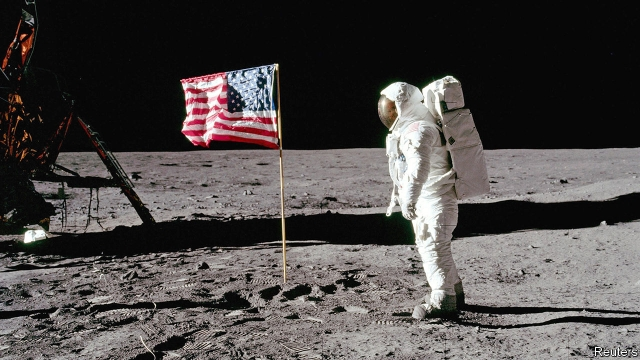
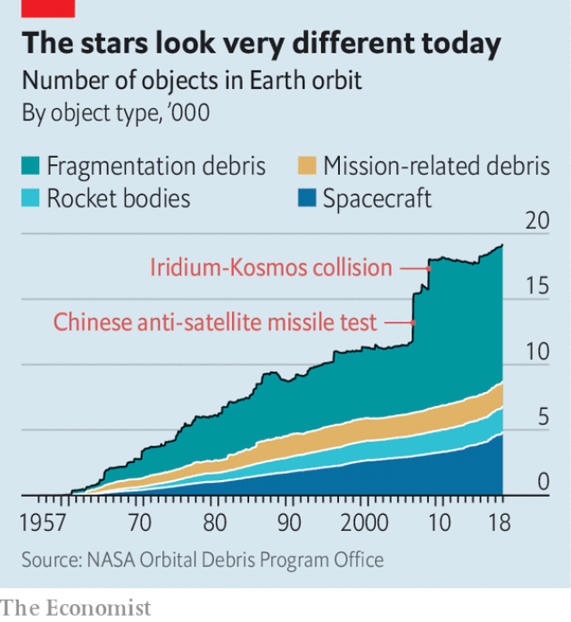

###### Lawless wastes

# Space law is inadequate for the boom in human activity there 

 

> print-edition iconPrint edition | International | Jul 18th 2019 

IN MAY JEFF BEZOS gave an hour-long presentation on his vision for humanity’s future in space: a series of artificial settlements in orbit that would be home to as many as 1m people each. Mr Bezos was talking in his role as founder of Blue Origin, a privately held rocket-launch firm. But he also referred to the company for which he is better known, Amazon. 

Amazon would never have existed, he said, without pre-existing infrastructure: postal services to deliver packages; home computers to order goods; credit cards to make payments. The job of the current generation would be to build an equivalent “infrastructure” for space. Mr Bezos identified two elements of this: much lower launch costs and the exploitation of resources in space. But he might have mentioned another, more basic requirement for enterprise: a proper legal environment. 

What rules there are largely date from the cold-war era. The Outer Space Treaty of 1967 is the foundational space-law text. It sets out some basic principles, among them that space is free for exploration and use by all states, and that no claims of sovereignty can be made. Later agreements assign liability for damage caused by space objects and require states to help rescue astronauts in distress. 

A common thread runs through these texts. They all assume that space is a realm dominated by states, not by companies, let alone individual billionaires. As space industrialises, the gaps in the law are becoming clearer. Two areas of concern stand out: debris and resource extraction. 

Debris is much the more pressing issue. NASA, America’s space agency, already tracks more than 500,000 pieces of space junk in orbit around Earth. Items that are smaller than a marble are not yet tracked but NASA reckons there are millions; and at velocities of more than 27,000km per hour, even a fleck of paint can cause damage. Systems are in place to reduce the risk of collisions (“conjunction risk” in the understated argot of the satellite industry). Firms that launch objects into space need licences from the relevant national authorities. These regulators are meant to vet proposed orbits and set end-of-life rules for old satellites either to re-enter Earth’s atmosphere, where they burn up, or to be propelled into “graveyard slots” where there is no risk of collision. 

International guidelines, based on American standards, specify best practices for mitigating the risk of debris. America’s Space Surveillance Network shares some data on the trajectory of larger bits of space junk. The International Telecommunication Union (ITU), a UN agency, responsible among other things for allocating radio frequencies in space, acts as a clearing-house for information on satellites in orbit. 

 

But the current system is, in the words of Alexandre Vallet of the ITU, less a binding framework than “a gentlemen’s agreement”. End-of-life rules vary between regulators. The guidelines on debris mitigation are not enforceable internationally. When satellites are on a crash course, demanding large changes in orbit, as happens perhaps once or twice a year, common sense is what stops a collision. States themselves are free to ignore norms of good behaviour. India caused both outrage and a fresh debris field in March by conducting an anti-satellite missile test; China increased the amount of trackable debris then in space by 25% with a single such test in 2007 (see chart which covers bigger objects, with a diameter of more than about 10cms). This system has worked well enough so far. But the problems are becoming more complex. First, launch capabilities are spreading. Last year an American startup called Swarm Technologies paid a footling $900,000 fine for sending four tiny satellites into orbit on an Indian rocket, having been denied permission to do so by the US Federal Communications Commission. 

Second, the number of objects in the heavens is about to rocket. The UN’s Office for Outer Space Affairs says about 8,650 objects have been launched into space since Sputnik went up in 1957. SpaceX, a rocketry firm, alone has plans to launch more than 12,000 in a constellation of small satellites known as Starlink. Other constellations are planned. Space tourism may well add to the amount of traffic to be managed. 

These constellations are needed because the satellites will be in low-Earth orbit (LEO). The bulk of satellite communications today comes through objects in a geostationary orbit, some 36,000km above the Earth. At that altitude a satellite takes a day to travel around the planet, seeming to hover in the same place. At a lower orbit, lots of satellites are needed to maintain coverage of a specific area; constellations will criss-cross each other as they whizz around the world. 

The rules are clear for objects that stay in the same location, says Ruth Pritchard-Kelly of OneWeb, an operator which has six LEO satellites in orbit already and plans eventually to launch at a rate of 30 a month until its constellation is complete. “But there are an infinite number of ways for an object to be non-geostationary. We have to come up with rules on how to share space.” An ITU conference in Egypt in October and November will try to do just that. 

Liability rules also need refreshing. A 1972 regime assigns liability for damage caused by a space object based on who launched it. That made more sense in an era when governments launched their own objects from their own territory. Take the collision in 2009 between a defunct Russian military satellite called Kosmos-2251 and an operational commercial satellite called Iridium 33. Iridium 33 was owned by an American firm but it was launched from a Russian-owned spaceport. Had there been a claim for compensation, Iridium would have had to call in the State Department to approach the Russian Ministry of Foreign Affairs. The Russians could have argued that, since Iridium 33 launched from Russia, it was in effect Russian and this was an internal affair. 

Iridium, which ended up not making a claim, would have faced another argument, too: that responsibility for a collision lies with the party which had the last opportunity to avoid it. Working that out is not always easy, and becomes well-nigh impossible if both objects are defunct. “If you have two drivers on a road with no traffic lights, no steering wheels and no brakes, who’s at fault if they crash?” asks Dara Panahy of Milbank, a law firm. 

In these circumstances, mitigating the risk of future collisions is not enough; it is also necessary to be able to remove debris from space. A range of technologies, from harpoons to tethers to nets, are being developed to do that. But the practice would require a change in the rules. International law states, for example, that an object belongs in perpetuity to the country that launched it. James Vedda of the Centre for Space Policy and Strategy, a research group, argues for an equivalent of a maritime-salvage regime, so that it is possible either to recover an object without permission or to get such permission very quickly. 

Compared with the problem of space debris, the legal questions raised by space mining are less urgent. The technological and financial hurdles to success are immense: companies like Planetary Resources and Deep Space Industries, formed in a blaze of publicity to prospect for minerals on asteroids, have already stumbled. But the ambition remains, focused clearly on Earth’s nearest neighbour. 

“If we can utilise resources to keep a community on the Moon,” says Michelle Hanlon of the Air and Space Law Programme at the University of Mississippi School of Law, “that is our best way to find out how to keep humans in space for the long term.” At his presentation in May, Mr Bezos envisaged using ice in the shadowed craters of the Moon to generate fuel, and targeted a lunar landing by Blue Origin by 2024. NASA plans a space station in lunar orbit, from where astronauts would operate robotic probes on the surface that could harvest minerals. China and India both have lunar programmes and, doubtless, similar thoughts. 

Some question whether resource extraction would be legal. The Outer Space Treaty prohibits national appropriation in space. To the question “who owns the Moon?”, the unambiguous answer is “no one”. In practice, however, the question is not so much whether mining can happen, but in what circumstances. 

International lawyers point to two, admittedly imperfect, analogies on Earth as ways to think about space mining. One is the high seas: no nation has sovereignty but you don’t need international permission to extract resources (ie, fish). The other template is provided by seabed mining, an activity subject to strict licensing and regulation by an organisation called the International Seabed Authority (ISA). 

An attempt to set up a space equivalent of the seabed-mining regime has already been tried, however, and failed to gain traction. The Moon Agreement came into force in 1984. It calls for an international regime to administer any exploitation of lunar resources. But the agreement has only been ratified by 18 countries. “Spacefaring states like voluntary standards and non-spacefarers like the idea of international obligations,” says Patrick Slomski of Clyde & Co, a law firm. These divergent interests weaken the chances either of the Moon Agreement gaining fresh momentum or of a big, new international space treaty. 

Instead, the high-seas model is the one that looks likely to prevail. Both America and Luxembourg, which has long punched above its weight in the satellite and aerospace industries, have passed legislation that explicitly allow firms incorporated on their territories to carry out space mining; the United Arab Emirates is about to follow suit. Proponents of the high-seas approach like the fact that it allows commercial firms to act fast. But unbridled competition for resources is also a recipe for trouble. If a Chinese miner and an American one were to set up shop next door to each other on the lunar surface, say, domestic laws would be no help in resolving any conflict that might result. 

That argues for co-ordination and common standards. The award of licences by national authorities could be notified to an international body modelled on the ITU’s radio-frequency regime for satellites. Rules could usefully be set for the duration of mining licences, for the placement of buffer zones around mining sites and for dispute-resolution processes. 

Ms Hanlon, who also runs an NGO called For All Moonkind, suggests an even narrower goal: an agreement on common lunar landing-pads in order to protect historic sites such as the landing area of Apollo 11 in 1969. “We are not going to agree a treaty in the next five years, but we can take baby steps,” she says. Mr Bezos would approve of that. His talk ended with a picture of him alone at a desk in the early days of Amazon and the caption “Big things start small”. ■ 

-- 

 单词注释:

1.lawless['lɒ:lis]:a. 非法的, 违法的 

2.inadequate[in'ædikwәt]:a. 不充分的, 不适当的 [法] 不充分的, 不适当的 

3.Jul[]:七月 

4.jeff[dʒef]:n. 杰夫（男子名, 等于Jeffrey） 

5.bezos[]:贝索斯（人名） 

6.sery[]:n. (Sery)人名；(俄)谢雷；(科特)塞里 

7.bezos[]:贝索斯（人名） 

8.founder['faundә]:n. 创立者, 建立者 vt. 使沉没, 使摔倒, 弄跛, 浸水, 破坏 vi. 沉没, 摔到, 变跛, 倒塌, 失败 

9.privately[]:adv. 秘密地；私下地 

10.amazon['æmәzɒn]:n. 亚马孙河 [医] 无乳腺者 

11.postal['pәustl]:a. 邮政的, 邮局的 [经] 邮政的 

12.infrastructure['infrәstrʌktʃә]:n. 基础结构, 基础设施 [经] 基础设施 

13.exploitation[.eksplɒi'teiʃәn]:n. 开发, 开采, 剥削 [经] 开发, 剥削, 宜传 

14.foundational[]:a. 基础的, 基本的 

15.exploration[.eksplә'reiʃәn]:n. 探险, 踏勘, 探测 [医] 探察 

16.sovereignty['sɒvrәnti]:n. 主权, 独立国 [法] 主权, 主权国家, 统治权 

17.liability[laiә'biliti]:n. 责任, 债务, 倾向 [经] 责任, 义务, 负债 

18.billionaire[.biljә'nєә]:n. 亿万富翁 

19.industrialise[in'dʌstriәlaiz]:vi.vt. (使)工业化 

20.debris['deibri:]:n. 碎片, 残骸 [医] 碎屑 

21.extraction[ik'strækʃәn]:n. 抽出, 取出, 拔出术, 抽出物 [化] 萃取; 提取 

22.debris['deibri:]:n. 碎片, 残骸 [医] 碎屑 

23.NASA['næsә]:国家航空和宇宙航行局(美国) [电] 国际航空和太空总署的同义字 

24.reckon['rekәn]:vt. 计算, 总计, 估计, 认为, 猜想 vi. 数, 计算, 估计, 依赖, 料想 

25.fleck[flek]:n. 斑点, 雀斑, 斑纹 vt. 使起斑点, 使有斑纹, 使有斑驳 

26.understate[.ʌndә'steit]:v. 不完全地陈述, 保守地说, 有意轻描淡写 

27.argot['ɑ:gәu]:n. 行话, 俚语, 黑话 

28.regulator['regjuleitә]:n. 调整者, 校准者, 校准器, 调整器, 标准钟 [化] 调节剂; 调节器 

29.vet[vet]:n. 兽医 vi. 当兽医 vt. 诊断, 检审 

30.propel[prәu'pel]:vt. 推进, 驱使 [机] 推进 

31.graveyard['greivjɑ:d]:n. 墓地 

32.slot[slɒt]:n. 水沟, 细长孔, 硬币投币口, 缝, 狭槽, 狭通道, 位置, 一档(广播节目等) vt. 开槽于, 把...纳入机构 [计] 槽; 存储槽 

33.guideline['gaidlain]:n. 指导路线, 方针, 指标 [经] 指导路线, 方针, 准则 

34.mitigate['mitigeit]:vt. 温和, 缓和, 减轻 [医] 缓和, 减轻 

35.surveillance[sә:'veilәns]:n. 监视, 监督 [电] 侦测 

36.datum['deitәm]:n. 论据, 材料, 资料, 已知数 [医] 材料, 资料, 论据 

37.trajectory[trә'dʒektri]:n. 轨道, 弹道, 轨线 [化] 轨道 

38.telecommunication['telikәmju:ni'keiʃәn]:n. 电讯, 远距离通讯, 无线电通讯 [计] 远程通信, 电信 

39.ITU[]:国际电信联盟(美国) [计] 国际电信联盟 

40.UN[ʌn]:pron. 家伙, 东西 [经] 联合国 

41.Alexandre[]:n. 亚历山大（马其顿国王） 

42.vallet[]:[地名] 瓦莱 ( 法 ) 

43.les[lei]:abbr. 发射脱离系统（Launch Escape System） 

44.mitigation[.miti'geiʃәn]:n. 缓和, 减轻 [法] 减, 减轻, 缓和 

45.enforceable[in'fɔ: sәbl]:a. 可实施的, 可强行的 

46.internationally[.intә'næʃәnәli]:adv. 国际性地, 在国际间 

47.norm[nɒ:m]:n. 基准, 模范, 标准, 准则, 平均数 [化] 定额 

48.outrage['autreidʒ]:n. 暴行, 侮辱, 愤怒 vt. 凌辱, 虐待, 触犯 

49.trackable['trækәbl]:a. 可跟踪的, 可追踪的 

50.capability[.keipә'biliti]:n. 能力, 性能, 约束力 [化] 能力 

51.startup[]:[计] 启动 

52.footle['fu:tl]:n. 废话, 傻话, 愚蠢的做法, 呓语, 呆话 vi. 说呆话, 做笨事 

53.sputnik['sputnik]:n. 人造卫星 

54.spacex[]:[网络] 太空探索技术公司；美国太空探索技术公司；太空探索科技公司 

55.rocketry['rɒkәtri]:n. 火箭研究 

56.constellation[.kɒnstә'leiʃәn]:n. 星座, 荟萃 [化] 构象 

57.starlink[]:[网络] 星际连线；星联；星链 

58.Leo['li:ou]:n. 狮子, 狮子座 

59.geostationary[,dʒi(:)әu'steiʃәnәri]:[计] 同步 

60.hover['hʌvә]:vi. 盘旋, 翱翔, 徘徊 vt. 孵 n. 翱翔 

61.coverage['kʌvәridʒ]:n. 覆盖的范围, 保险总额, 新闻报导 [化] 可达范围; 覆盖度 

62.whizz[hwiz]:n. 飕飕声, 精明的人, 专家 v. (使)飕飕作声 

63.ruth[ru:θ]:n. 怜悯, 悲哀 

64.OneWeb[]:[网络] 只提供一个网站；一网同仁；一个站点 

65.Egypt['i:dʒipt]:n. 埃及 

66.liability[laiә'biliti]:n. 责任, 债务, 倾向 [经] 责任, 义务, 负债 

67.regime[rei'ʒi:m]:n. 政权, 当权期间, 政体, 社会制度, 体制, 情态 [医] 制度, 生活制度 

68.defunct[di'fʌŋkt]:a. 死的, 不能使用的 n. 死者 

69.iridium[ai'ridiәm]:n. 铱 [化] 铱Ir 

70.spaceport['speispɔ:t]:n. 火箭、导弹和卫星的试验发射中心 

71.compensation[.kɒmpen'seiʃәn]:n. 补偿, 赔偿金, 工资 [医] 代偿(机能), 补偿 

72.alway['ɔ:lwei]:adv. 永远；总是（等于always） 

73.dara[]:n. 达拉（女子名） 

74.milbank[]: [人名] 米尔班克; [地名] [美国] 米尔班克 

75.harpoon[hɑ:'pu:n]:n. 鱼叉 vt. 用鱼叉叉, 用鱼叉捕获 

76.tether['teðә]:n. 系绳, 系链, 界限, 范围 vt. 栓, 束缚, 限制 

77.perpetuity[.pә:pi'tju:iti]:n. 永久, 不朽, 终身职位, 终身任期, 永久使用权 [经] 永续年金, 终身年金 

78.jame[]: 灰岩井 

79.Vedda[]:维达人 

80.quickly['kwikli]:adv. 很快地 

81.technological[.teknә'lɒdʒikl]:a. 技术的 [经] 工艺的, 技术的 

82.hurdle['hә:dl]:n. 障碍, 跳栏, 临时活动篱笆 vt. 用篱笆围, 越过, 克服 

83.planetary['plænitri]:a. 行星的, 流浪的, 迁移不定的, 地球上的, 现世的 

84.publicity[pʌb'lisiti]:n. 名声, 宣传, 公开场合 [经] 宣传, 广告 

85.asteroid['æstәrɒid]:n. 小行星, 海盘车 a. 星状的 

86.utilise['ju:tilaiz]:vt. 利用, 运用, 使用 

87.Michelle[mɪ'ʃɛl]:n. 米歇尔（女子名） 

88.HANLON[]:n. (Hanlon)人名；(西)安隆；(英)汉隆 

89.Mississippi[.misi'sipi]:n. 密西西比河, 密西西比州 

90.envisage[in'vizidʒ]:vt. 面对, 正视, 想象 

91.crater['kreitә]:n. 火山口, 环行山, 弹坑 [化] 焊口; 火山石; 弧坑; 焰口 

92.robotic[rәu'bɔtik]:a. 自动的；机器人的, 像机器人的 

93.probe[prәub]:n. 探索, 调查, 探针, 探测器 v. 用探针探测, 调查, 探索 

94.appropriation[әprәupri'eiʃәn]:n. 拨用, 挪用, 拨款 [经] 拨款, 挪用 

95.unambiguous[.ʌnæm'bigjuәs]:a. 不含糊的, 明确的 [法] 清晰的, 明白的, 不模糊的 

96.admittedly[әd'mitidli]:adv. 公认地, 诚然 

97.imperfect[im'pә:fikt]:a. 不完美的, 不完整的, 减弱的, 未完成过去时的 n. 未完成体 

98.analogy[ә'nælәdʒi]:n. 相似, 类似 [计] 模拟 

99.extract[ik'strækt]:n. 榨出物, 精汁, 摘录, 选段 vt. (费力地)取出, 采掘, 榨取, 摘录, 吸取 [计] 提取 

100.template['templit]:n. 样板, 模板, 垫木 [计] 模板 

101.seabed['si:bed]:n. 海底, 海床 

102.organisation[,ɔ: ^әnaizeiʃən; - ni'z-]:n. 组织, 团体, 体制, 编制 

103.seabed['si:bed]:n. 海底, 海床 

104.ISA[]:[计] 指令系统体系结构, 工业标准结构 

105.traction['trækʃәn]:n. 曳, 牵引, 牵引力 [医] 牵引 

106.administer[әd'ministә]:vt. 管理, 料理, 执行 vi. 执行遗产管理人的职责, 给予帮助 

107.ratify['rætifai]:vt. 批准, 认可 [经] 证实, 肯定, 确认 

108.spacefaring[]:n. 外层空间旅行(的)；宇宙飞行(的) [网络] 太空付费；航天飞行 

109.patrick['pætrik]:n. 帕特里克（男子名） 

110.clyde[klaid]:n. 克莱德（男子名） 

111.Co[]:[医] 钴(27号元素) 

112.divergent[dai'vә:dʒәnt]:a. 有分歧的 [医] 散开的, 偏斜的 

113.momentum[mәu'mentәm]:n. 动力, 动量 [化] 动量 

114.luxembourg['luksәm,bә:^]:n. 卢森堡公国；卢森堡（卢森堡公国首都） 

115.aerospace['єәrәuspeis]:n. 航天空间, 航天技术 

116.explicitly[]:adv. 明确地；明白地 

117.incorporate[in'kɒ:pәreit]:a. 合并的, 组成公司的, 一体化的 vt. 吸收, 合并, 使组成公司, 体现 vi. 合并, 混合, 组成公司 

118.emirate[e'miәrit]:n. 埃米尔的地位, 酋长国 

119.proponent[prә'pәunәnt]:n. 建议者, 支持者 [法] 提议者, 辩护者, 支持者 

120.unbridle[.ʌn'braidl]:vt. 放松缰绳, 放纵 

121.usefully[]:adv. 有效地, 有用地 

122.placement['pleismәnt]:n. 放置, 布置, 工作安排, 编班, 定位球 [计] 放置 

123.buffer['bʌfә]:n. 缓冲器, 缓冲区 vt. 缓冲 [计] 缓冲区, 缓冲器 

124.ngo[]:abbr. 民间组织；非政府组织（Non-Governmental Organization） 

125.historic[hi'stɒrik]:a. 历史上著名的, 有历史性的 

126.Apollo[ә'pɒlәu]:n. 阿波罗(太阳神), 美男子 

