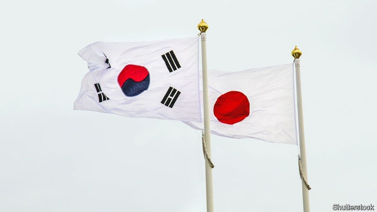

###### History wars

# A trade dispute between Japan and South Korea has Trumpian echoes 

 

> print-edition iconPrint edition | Leaders | Jul 20th 2019 

TAKE JUST about any trade fight today, and President Donald Trump’s America is at the centre of it: with Europe over cars and aeroplanes; with foreign producers of steel; with China over, well, everything. But a brawl now under way in Asia, between Japan and South Korea, has the potential to be as damaging as much of what Mr Trump has stirred up. It is also a sign that his model of abusing economic partners is spreading. 

Tensions between Japan and South Korea go back centuries. Japan’s colonisation of Korea between 1910 and 1945 is still resented. Japan believes a 1965 agreement resolved claims by South Korea over forced labour. It is incensed that South Korea’s supreme court last year ordered Japanese firms to compensate victims (see Banyan). Amid a widening rift, Japan took its most serious action on July 4th when it began restricting exports to South Korea of three specialised chemicals used to make semiconductors and smartphones. 

The stakes are high. Japan accounts for as much as 90% of global production of these chemicals. It exported nearly $400m-worth of them to South Korea last year. That may not sound like much, but their importance is outsized. They are needed to make memory chips, which are essential to all sorts of electronic devices. And South Korean firms are the world’s dominant manufacturers of memory chips. If Japan were to choke off exports, the pain would ripple through global tech supply chains. 

Japan has also hinted that it might start requiring case-by-case licences for the sale to South Korea of some 850 products with military uses. South Korean firms have called for boycotts of Japanese goods. The two countries, whose trade relationship, worth over $80bn a year, is larger than that between France and Britain, need to step back from the brink. 

Japan’s decision to limit exports is economically shortsighted, as it should know since it has itself been on the other side of such controls. When China restricted exports of rare-earth minerals in 2011, Japan responded by investing in its own mines. China’s market share dropped. Already, the South Korean government is discussing plans to foster the domestic chemicals production. Japan insists that South Korean companies will, once approved, still be able to buy its chemicals, but the threat of an embargo, once issued, cannot be easily dispelled. 

The broader geopolitical context makes Japan’s self-harm even more reckless. Regional supply chains are already under assault. South Korean and Japanese companies are scrambling to find alternatives to China as a manufacturing base to avoid American tariffs. Mr Trump has threatened both countries with import duties on their cars. 

Ultimately, it is up to South Korea and Japan to repair relations. But America’s waning interest in diplomacy does not help. And Mr Trump is normalising the use of trade weapons in political spats. His tactics teach others how to find an excuse for these actions: by citing national security. Japanese media have suggested that South Korea has allowed the shipment of sensitive chemicals to North Korea, a far-fetched claim but one that could feature in a defence of its export restrictions. Under a different president, America would be doing more to bind together Japan and South Korea, two indispensable allies. Barack Obama pushed the Trans-Pacific Partnership that included Japan, and that South Korea was expected to join eventually. One of Mr Trump’s first acts was to ditch that deal. 

It is not too late to defuse the situation. The commercial damage has been limited so far. Japan is aware that, notwithstanding America’s current tactics, export controls look bad; it is thus susceptible to pressure from other trading partners. The two countries will discuss their disagreement at the World Trade Organisation later this month. This is shaping up to be a test of whether the global trading system can, despite great strains, still soothe tensions—or whether it is being supplanted by a new, meaner order, in which supply chains are weaponised and commerce is purely an extension of politics.■ 
<<<<<<< HEAD

-- 

 单词注释:

1.Korea[kә'riә]:n. 朝鲜, 韩国 

2.Trumpian[]:特朗普的 

3.Jul[]:七月 

4.producer[prә'dju:sә]:n. 生产者, 制作者, 制作人 [化] 发生器; (炉煤气)发生炉; 制气炉; 生产者 

5.brawl[brɒ:l]:n. 争吵 vi. 争吵, 哗哗地流水 

6.colonisation[,kɔlənai'zeiʃən]:n. 定殖；殖民地化；集群现象 

7.resent[ri'zent]:vt. 愤恨, 憎恶, 怨恨 

8.incense['inseins]:n. 香, 香气, 奉承 vi. 焚香 vt. 用香焚, 使发怒 

9.banyan['bænjәn]:n. 印度榕树 [医] 榕树, 孟加拉榕 

10.amid[ә'mid]:prep. 在其间, 在其中 [经] 在...中 

11.rift[rift]:n. 裂口, 空隙 vi. 裂开 vt. 使分开, 使割开 

12.specialise['speʃә,laiz]:vt. 特加指明, 列举, 使专门化, 限定...的范围 vt.vi. (使)特化, (使)专化 vi. 成为专家, 专务, 专攻, 专门研究, 逐条详述 

13.smartphones[]: 智能手机（smartphone的复数） 

14.outsize['autsaiz]:a. 特大的 n. 特大号 

15.chip[tʃip]:n. 屑片, 薄片, 碎片 vt. 削, 切, 削成碎片, 使摔倒, 凿 vi. 削下屑片 [计] 孔屑; 组件; 晶片; 芯片 

16.Korean[kә'riәn]:n. 朝鲜人, 朝鲜语 a. 朝鲜人的, 朝鲜语的 

17.dominant['dɒminәnt]:a. 占优势的, 支配的 [医] 优性的, 显性的 

18.ripple['ripl]:n. 涟波, 涟漪, 波纹, 粗钢梳 vt. 使起涟漪 vi. 起微波, 起潺潺声 

19.tech[tek]:n. 技术学院或学校 

20.brink[briŋk]:n. 边缘, 陡岸 

21.economically[i:kә'nɔmikәli]:adv. 节约地, 不浪费地, 节省地, 节俭地, 在经济上, 在经济学上 

22.shortsighted['ʃɒ:t'saitid]:a. 近视的, 目光短浅的, 缺乏想像力的 

23.foster['fɒstә]:a. 收养的, 养育的 vt. 养育, 抚育, 培养, 鼓励, 抱(希望) 

24.embargo[im'bɑ:gәu]:n. 封港令, 禁运 vt. 禁止出入港口, 禁运 

25.cannot['kænɒt]:aux. 无法, 不能 

26.dispel[dis'pel]:vt. 驱散, 驱逐 

27.geopolitical[,dʒi(:)әupә'litikәl]:[计] 地理的 

28.context['kɒntekst]:n. 上下文, 背景, 来龙去脉 n. 上下文 [计] 上下文 

29.reckless['reklis]:a. 不介意的, 大意的, 鲁莽的, 不顾后果的 [法] 不注意的, 粗心大意的, 鲁莽的 

30.regional['ri:dʒәnәl]:a. 地方的, 地域性的 [医] 区的, 部位的 

31.assault[ә'sɒ:t]:n. 攻击, 袭击 vt. 袭击, 攻击 vi. 发动攻击 

32.scramble['skræmbl]:n. 攀缘, 爬行, 抢夺, 混乱, 紧急起飞 vi. 攀缘, 杂乱蔓延, 争夺, 拼凑, 匆忙 vt. 攀登, 扰乱, 使混杂 

33.manufacturing[.mænju'fæktʃәriŋ]:n. 制造业 a. 制造业的 

34.tariff['tærif]:n. 关税, 关税表, 价格表, 收费表 vt. 课以关税 [计] 价目表 

35.wane[wein]:n. 减少, 衰微, 败落, 亏缺, 月亏 vi. 变小, 亏缺, 衰落, 消逝, 退潮 

36.diplomacy[di'plәumәsi]:n. 外交, 外交手腕, 交际手段 [法] 外交, 外交手腕, 权谋 

37.normalise['nɔ:mәlaiz]:vt.vi. 使正常化, 恢复友好状态, 使标准化 

38.spat[spæt]:n. 蚝卵, 口角, 拍打 vi. 拍打, 争吵 spit的过去式和过去分词 

39.tactic['tæktik]:n. 一项战术, 一条策略 a. 战术的, 顺序的, 排列的 

40.cite[sait]:vt. 引用, 引证, 表彰 [建] 引证, 指引 

41.shipment['ʃipmәnt]:n. 装船, 出货 [经] 运送, 运送(寄出)货物, 装载 

42.ally['ælai. ә'lai]:n. 同盟者, 同盟国, 助手 vt. 使联盟, 使联合, 使有关系 vi. 结盟 

43.barack[bɑ:'ræk]:n. 巴拉克（男子名） 

44.obama[]:n. 奥巴马(姓) 

45.partnership['pɑ:tnәʃip]:n. 合伙, 合股, 合作关系 [经] 合伙(合作)关系, 全体合伙人 

46.defuse[.di:'fju:z]:vt. 去掉...的引信, 平息 

47.notwithstanding[.nɒtwiθ'stændiŋ]:adv. 虽然, 尽管 prep. 尽管 conj. 虽然 

48.susceptible[sә'septәbl]:a. 易受影响的, 易感动的, 容许...的 [法] 易感的, 易受影响的, 容许 

49.organisation[,ɔ: ^әnaizeiʃən; - ni'z-]:n. 组织, 团体, 体制, 编制 

50.soothe[su:ð]:vt. 缓和, 使安静, 安慰, 奉承 vi. 起安慰作用 

51.supplant[sә'plɑ:nt]:vt. 排挤掉, 代替 

52.meaner[miːn]:vt. 表示…的意思；意思是；作…解释：；意味着；即是： vi. 用意；怀有特定用意；有重要意义；有重要性；有影响： 

53.weaponised['wepənaiz]:vt. 把…改装成武器；使…武器化 
=======
>>>>>>> 50f1fbac684ef65c788c2c3b1cb359dd2a904378

