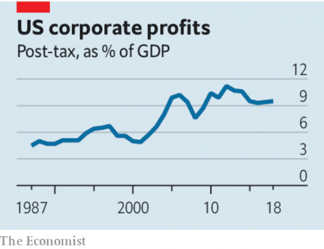

###### Soaring stockmarket, peaking profits

# After years of plenty America Inc is struggling to crank out more earnings 

 

> print-edition iconPrint edition | Leaders | Jul 20th 2019 

OVER THE past 25 years America’s stockmarket has soared. Far from being built on thin air, this long bull run has rested on a boom in corporate profits. The worldwide earnings of all American firms, whether listed or not, have risen by 455% over this period and are now 35% above their long-term average relative to GDP. America Inc mints $1bn every five hours. 

Globalisation, tepid wage rises, the ascent of tech and feeble competition made the bonanza possible. But as some of these forces ebb, the era of relentlessly expanding profits is under threat. Over the next few weeks America’s blue-chip companies will report their latest profit figures, which are expected to drop slightly (see Business section). Managers and investors need to be alert, especially given the growing number of firms with high debts that rely on bulging profits to stay afloat. 

Profits are an essential part of capitalism—they reward savers, incentivise innovators and create surplus funds for investment. America is the home of the bottom line: firms based there account for 33 cents of every dollar made by listed companies worldwide. The level of profitability shifts over time: in the boom after 1945 American firms made hay, whereas they struggled in the mid-1980s. Even so the upswing since the 1990s has been striking. The worldwide post-tax earnings of American firms rose from 5.9% of GDP in 1994 to close to 10% now (the dip in the 2008-09 recession was short-lived). The trend echoes the prediction of Thomas Piketty, an economist, who argues that the rate of return on capital exceeds the rate of economic growth. This implies that company owners win an inexorably rising share of output as the rest of society is squeezed. 

 

Yet peer closer and the reality is murkier. Domestic profits, and the worldwide profits of American firms, peaked relative to GDP in 2012, and have plateaued since then. President Donald Trump’s tax cuts boosted earnings in 2018. But the underlying trend is one of stagnation. The members of the S&P 500 index of big companies are forecast to say that second-quarter earnings-per-share dropped by 3% compared with the prior year, the second consecutive quarter of mild decline. Individual firms’ fortunes wax and wane—General Electric’s second-quarter profits are expected to drop by 91% from their peak in 2015; Microsoft should book its highest absolute quarterly profits since it was founded in 1975. But there are also deeper forces that are muting the earnings boom. 

Globalisation helped make firms more efficient but now pulls down profits. The share of pre-tax earnings made abroad has slipped from 35% a decade ago to 25%. Company conference calls with investors now feature discussions about trade wars. At home the jobs market is tightening, putting more pressure on wage bills, which rose by about 5% last year. 

The earnings boom of the past two decades has also been fuelled by the rise of a few exceptionally profitable tech firms, such as Alphabet and Facebook. But their growth rates are slowing and the next generation of tech stars, such as Uber and Netflix, burn up cash rather than print it. On July 17th Netflix’s shares tumbled after it announced weak subscriber figures. Lastly, there is some sign that competition is biting at last in cosy industries, such as telecoms, media and branded foods. After years of waving through mergers, antitrust regulators are taking a tougher line on deals. 

During recessions corporate earnings typically fall by a sixth or more. But even if the economy keeps on growing—at 121 months old the expansion is now the longest on record—downward pressure on profit margins is on the cards. That would allow consumers and workers to get a better deal from big business, but presents two risks for investors and executives. 

First, equity-fund managers and Wall Street analysts, accustomed to years of high growth, expect a rebound in profits later in the year. They may be disappointed. Second, many firms have geared up their balance-sheets in the belief that the good times will roll on for ever. Corporate borrowing in America has risen to 74% of GDP, above the peak in 2008; 40% of the stock of debt is owed by highly leveraged firms with debts of over four times their gross operating profits. 

Although most managers accept that a mixture of flat profits and high debts is toxic, they never think it will undo them. But already several giants that were considered reliable profit-machines are struggling. AT&T needs to pay down a colossal pile of $169bn of net debt even as its profits come under pressure from TV customers jumping ship. Kraft Heinz has to service $30bn of net debts even as a new generation of consumers abandon Mac & Cheese for healthier products. 

In the past, profits have been considered a fickle friend by business people. But after a long boom, rising earnings have become baked into American corporate life. Most investors and creditors assume that profits will go on growing. Almost every company presentation assumes that rising margins are the natural state of affairs. This groupthink is complacent—and possibly dangerous. That’s the bottom line.■ 

