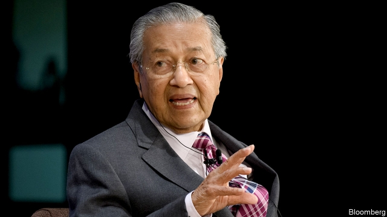

###### Time to bury the tools of oppression

# Malaysia’s government should scrap repressive laws while it still can 

 

> print-edition iconPrint edition | Leaders | Jul 20th 2019 

THERE ARE many ways this editorial could fall foul of Malaysian law. If it is too critical of Malaysia’s government, or of its courts, or of its system of racial preferences for Malays (the biggest ethnic group), or of its pampered and prickly sultans, it could be deemed seditious. If it contradicts the government’s account of any given event or circumstance, it could be in breach of the Anti-Fake News Act, adopted last year. Then there is a series of restrictive laws about who can publish what and who can give offence to whom (it is essential to steer clear of anything that might be construed by a paranoid prosecutor as an insult to Islam, in particular). These rules give the police an excuse to arrest irksome journalists and hand censors the authority to ban and seize offending material. If all else fails, a trio of laws that allow long periods of detention without trial can be used to lock up activists, opposition politicians or anyone else. 

Happily, Malaysia is currently run by a coalition that is not inclined to use these sweeping powers. In part, that is because many senior figures from the Pakatan Harapan (PH) government were themselves tormented by the same laws while in opposition. The party in charge until elections last year, the United Malays National Organisation (UMNO), built an elaborately repressive edifice to keep itself in power. In addition to all the restrictions on freedom of speech, UMNO manipulated the electoral system, curbed public protests and prosecuted opponents on trumped-up charges. In the run-up to the vote, PH promised that, if it won, it would repeal or amend the laws that were being used to hobble it. But PH has been in office for over a year now, and the abusive rules remain on the books (see Asia section). 

To be fair, when it comes to civil liberties, PH is streets ahead of UMNO. Journalists and opposition politicians regularly take the new government to task, without ending up in prison. It has called a halt to most—but not quite all—prosecutions under the laws it criticised while it was in opposition. It has appointed as attorney-general a man who has spent his career fighting against the manipulation of the law for political purposes. It is in the process of amending one of the laws at issue, to make it easier to hold public protests. And its failure to do more stems from trouble setting priorities (its manifesto contained 464 different initiatives), as well as opposition from UMNO and its allies which still control the upper house, rather than from any hidden authoritarian impulses. 

Yet doing away with the government’s critic-cudgelling arsenal should be a much higher priority. Although many senior members of the government have been victims of UMNO’s repression, the prime minister, Mahathir Mohamad, himself a defector from UMNO, eagerly and frequently abused the government’s authority during a previous stint in power from 1981 until 2003. At one point he had over 100 critics detained without charge, in theory to preserve public order. Dr Mahathir (pictured) does genuinely seem to have turned over a new leaf, but it is only natural that defenders of civil liberties are not inclined to take his word for it when he promises that the law on sedition, for example, will soon be replaced by something more palatable. 

Moreover, restoring political freedoms is not just one item on a long to-do list. It is the reform that underpins all others. The laws in question helped keep UMNO in power for 61 years without interruption, even when it was palpably unpopular. This is a once-in-a-lifetime chance to make politics fairer and more competitive. If PH does not get the economy going, it may wind up in opposition for a few years; if it does not refurbish Malaysia’s democracy, it may be out of office for a generation. 

More important still, if Malaysians are not confident that they can voice their opinions and debate public policy without repercussion, then PH cannot hope to fulfil their aspirations, because it will not know what they are. Civil liberties are not a hindrance that fair-minded politicians must put up with. They are a tool to help them do their jobs well. UMNO ended up losing power because it did not have an accurate sense of just how unpopular it was. If it had not been so busy silencing its critics, it might have found better ways to answer them. ■ 
<<<<<<< HEAD

-- 

 单词注释:

1.oppression[ә'preʃәn]:n. 压抑, 沉闷, 压迫手段 [医] 压迫, 压抑 

2.scrap[skræp]:n. 碎片, 残余物, 些微, 片断, 铁屑, 吵架 vt. 扔弃, 敲碎, 拆毁 vi. 互相殴打 a. 零碎拼凑成的, 废弃的 

3.repressive[ri'presiv]:a. 压抑的, 抑制的, 镇压的 

4.Jul[]:七月 

5.foul[faul]:a. 污秽的, 邪恶的, 恶臭的, 肮脏的, 恶劣的, 淤塞的 vt. 弄脏, 妨害, 污蔑, 犯规, 淤塞 vi. 腐烂, 犯规, 缠结 adv. 违反规则地, 不正当地 n. 犯规, 缠绕 

6.Malaysian[mә'leiziәn]:a. 马来西亚的 n. 马来西亚人 

7.Malay[mә'lei]:n. 马来 a. 马来人的, 马来语的 

8.ethnic['eθnik]:a. 人种的, 种族的 [医] 人种的 

9.pamper['pæmpә]:vt. 放纵, 使吃饱, 使过量 

10.prickly['prikli]:a. 多刺的, 满是针刺的, 针刺般痛的 

11.sultan['sʌltn]:n. 苏丹(某些伊斯兰国家统治者的称号) 

12.deem[di:m]:v. 认为, 相信 

13.seditious[si'diʃәs]:a. 煽动性的, 妨害治安的 [法] 妨害治安罪的, 煽动性的, 危及治安的 

14.breach[bri:tʃ]:n. 裂口, 违背, 破坏, 违反, 突破, 破裂 vt. 攻破, 突破 vi. 跳出水面 

15.sery[]:n. (Sery)人名；(俄)谢雷；(科特)塞里 

16.restrictive[ri'striktiv]:a. 限制的, 约束的, 限定的 n. 限制词 

17.construe[kәn'stru:]:vt. 解释, 分析, 对...逐字直译 vi. 作句法分析 n. 直译 

18.paranoid['pærәnɔid]:a. (似)患妄想狂的, (似)患偏执狂的 n. 患妄想狂的人 

19.prosecutor['prɒsikju:tә]:n. 实行者, 告发者, 公诉人 [法] 原告, 起诉人, 检举人 

20.Islam['izlɑ:m]:n. 伊斯兰教 

21.irksome['ә:ksәm]:a. 厌恶的, 讨厌的, 令人厌烦的 

22.censor['sensә]:n. 检查员 vt. 检查, 审查, 删改 

23.trio['tri:әu]:n. 三重唱 

24.detention[di'tenʃәn]:n. 阻止, 监禁, 拘留 [医] 隔离, 拘留, 滞留, 停滞 

25.activist['æktivist]:n. 激进主义分子 

26.opposition[.ɒpә'ziʃәn]:n. 反对, 敌对, 相反, 在野党 [医] 对生, 对向, 反抗, 反对症 

27.Malaysia[mә'leiziә]:n. 马来西亚 [经] 马来西亚 

28.currently['kʌrәntli]:adv. 现在, 当前, 一般, 普通 [计] 当前 

29.coalition[.kәuә'liʃәn]:n. 结合体, 结合, 联合 [经] 联合, 联盟 

30.Pakatan[]:[网络] 蔡锐铭 

31.pH[pi:eitʃ]:氢离子指数 [医] 药典; 苯基 

32.torment['tɒ:ment]:n. 使人痛苦的东西, 折磨者, 苦痛 vt. 使苦恼, 纠缠, 歪曲, 拷问 

33.organisation[,ɔ: ^әnaizeiʃən; - ni'z-]:n. 组织, 团体, 体制, 编制 

34.umno[]: United Malays National Organization 马来民族统一机构 

35.elaborately[i'læbәreitli]:adv. 苦心经营地, 精巧地 

36.edifice['edifis]:n. 大厦, 大建筑物 

37.manipulate[mә'nipjuleit]:vt. 操纵, 利用, 操作, 巧妙地处理, 假造 

38.electoral[i'lektәrәl]:a. 选举人的, 选举的, (有关)选举的 [法] 选举的, 选举人的, 由选举人组成的 

39.curb[kә:b]:n. 抑制, 勒马绳, 边石 vt. 抑制, 束缚, 勒住 

40.prosecute['prɒsikju:t]:vt. 告发, 起诉, 彻底进行, 执行, 从事 vi. 告发, 起诉, 作检察官 

41.repeal[ri'pi:l]:n. 废止, 撤消 vt. 废止, 撤消, 放弃 

42.amend[ә'mend]:vt. 修改, 改善, 改良 vi. 改过自新 

43.hobble['hɒbl]:vi. 蹒跚 vt. 使跛行, 阻碍 n. 跛行 

44.abusive[ә'bju:siv]:a. 恶言谩骂的, 被滥用的, 腐败的, 虐待的 

45.criticise['kritisaiz]:v. 批评, 吹毛求疵, 非难 

46.manipulation[mә.nipju'leiʃәn]:n. 操作, 处理 [化] (用手)操作; 使用 

47.manifesto[.mæni'festәu]:n. 宣言, 声明 

48.ally['ælai. ә'lai]:n. 同盟者, 同盟国, 助手 vt. 使联盟, 使联合, 使有关系 vi. 结盟 

49.authoritarian[ɒ:.θɒri'tєәriәn]:a. 独裁的, 独裁主义的 

50.impulse['impʌls]:n. 冲动, 驱使, 刺激, 推动, 冲力, 建议, 脉冲 vt. 推动 

51.arsenal['ɑ:snәl]:n. 兵工厂, 军械库 [机] 兵工厂 

52.repression[ri'preʃәn]:n. 抑制, 压抑, 制止 [医] 压抑, 抑制 

53.Mahathir[]:n. (Mahathir)人名；(马来)马哈蒂尔 

54.Mohamad[]:n. (Mohamad)人名；(阿拉伯、印尼)穆罕默德 

55.defector[di'fektә]:n. 背叛者, 叛离者 [法] 变节分子, 背叛者, 开小差者 

56.eagerly[]:adv. 渴望, 热衷于, 热切 

57.stint[stint]:vt. 节省, 限制, 停止 vi. 节约 n. 吝惜, 节约, 限额 

58.detain[di'tein]:vt. 扣留, 扣押, 耽搁 [法] 拘留, 扣押, 留住 

59.genuinely[]:adv. 真诚地；诚实地 

60.defender[di'fendә]:n. 防卫者, 防护者, 辩护者 [法] 辩护人, 保护人 

61.sedition[si'diʃәn]:n. 煽动骚乱, 暴动, 妨害治安, 骚动 [法] 煽动, 煽动叛逆罪, 暴动 

62.palatable['pælәtәbl]:a. 美味的, 好吃的, 可口的 [医] 适口的, 味美的 

63.underpin[.ʌndә'pin]:vt. 从下面支承, 支撑, 支持 [经] 支撑 

64.palpably[]:adv. 摸得出, 可触知, 明显可知, 容易感觉到, 易用感官感知 

65.unpopular['ʌn'pɔpjulә]:a. 不得人心的, 不受欢迎的, 不流行的 

66.politic['pɒlitik]:a. 精明的, 明智的, 策略的 

67.refurbish[.ri:'fә:biʃ]:vt. 再磨光, 刷新 

68.Malaysian[mә'leiziәn]:a. 马来西亚的 n. 马来西亚人 

69.repercussion[.ri:pә'kʌʃәn]:n. 弹回, 反响, 反射 [医] 消退[法], 消肿[法], 浮动诊胎法 

70.cannot['kænɒt]:aux. 无法, 不能 

71.aspiration[.æspә'reiʃәn]:n. 热望, 志向, 渴望 [医] 吸入; 吸[引], 吸引术 

72.hindrance['hindrәns]:n. 妨害, 障碍, 阻碍物 
=======
>>>>>>> 50f1fbac684ef65c788c2c3b1cb359dd2a904378

