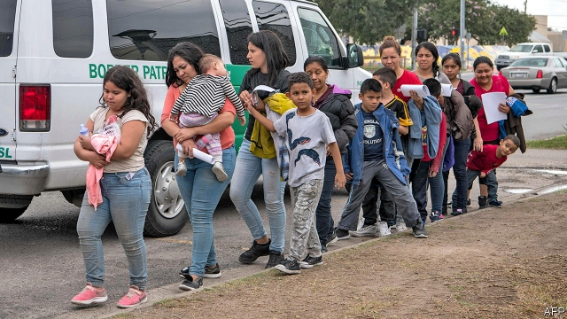
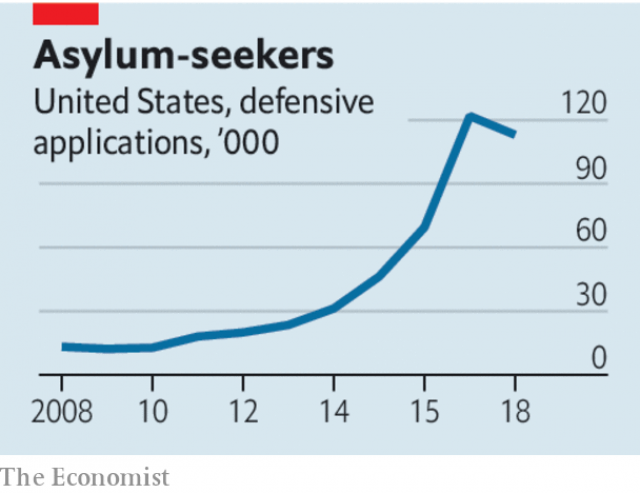

###### While you were tweeting

# The White House ditches half a century of immigration law 

 

> print-edition iconPrint edition | Leaders | Jul 20th 2019 

IT IS A familiar pattern. The president says something outrageous—this time Donald Trump told four black and brown-skinned Democratic congresswomen, all of whom are US citizens and three of whom were born in America, to “go back” where they came from. His supporters, who have come to accept what many of them previously found unconscionable, stay silent. His opponents, rightly appalled, lament what has happened to their country. At the same time the Trump administration makes a big policy change that attracts far less attention—in this case, an edict that directly affects tens of thousands of people a year and overturns half a century of precedent. 

Last year 120,000 people claimed asylum, the majority of them at the south-western border. On July 15th the White House announced that claims will no longer be considered unless applicants can prove that they sought asylum in one of the countries they passed through on their way to America, and were rejected. There will be legal challenges to the new rule, because America is party to the 1951 Refugee Convention and because the change may contravene America’s own Refugee Act of 1980. But in the meantime anyone who passes through Guatemala or Mexico on the way to the southern border without first seeking refuge there may be turned away. 

There is no kind way to enforce immigration law, which by its very existence must squash the dreams of some who wish to migrate (see Americas section). Plenty of asylum-seekers at America’s southern border are not fleeing persecution but crime and poverty. However, this is the wrong way to go about things, for reasons of principle and also of pragmatism. 

 

First, principle. The idea that a refugee should be protected, regardless of which countries he might have traipsed through beforehand, is worth defending. It is already dying in Australia and Europe. The European Union outsources much of its asylum policy to Turkey and Libya, for example, or to member states on its fringes; thousands of people languish in crowded camps in Greece. But for America to abandon this norm sends an even more disturbing signal. The land of the free has a proud history of resettling refugees from far-off places, rehousing many more than any other country. 

Second, pragmatism. Mr Trump has already used threats on trade to persuade Mexico to host more asylum applicants on its side of the border while they await news of their claims. Unable to build his oft-promised wall, his administration has tried to deter migrants by other means, including separating children from their parents at the border. Migration numbers are volatile, and tend to decline in the hot summer months, but so far none of these things has cut the numbers enough for Mr Trump. Clamping down even harder will not alter the incentives to leave El Salvador, Honduras and Guatemala, where most asylum-seekers come from, in search of a better life. It simply makes it more likely that migrants will rely on traffickers rather than the legal system to cross into America. 

There is a better way. The first step would be to increase the number of judges, to clear the backlog of immigration cases. There are currently not far off a million cases pending; the waiting time to hear them can be as long as three years. Many asylum-seekers disappear into the grey labour market as they wait for their cases to be adjudicated, joining the ranks of America’s 10.5m unlawful migrants; the Department of Justice says almost half do not show up for court hearings. The next step would be to allow the immigration and citizenship service to decide asylum applications at the border. Finally, the federal government could provide more aid to improve conditions in Central America. When Mexico’s economy improved and the fertility rate fell, the number of Mexicans migrating north slowed to a trickle. A different president, with a more expansive view of American greatness, would enforce rules and change incentives, not abrogate rights. ■ 

