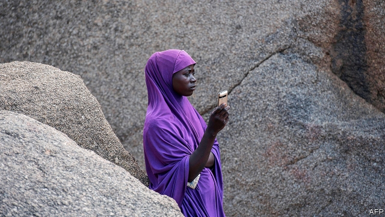
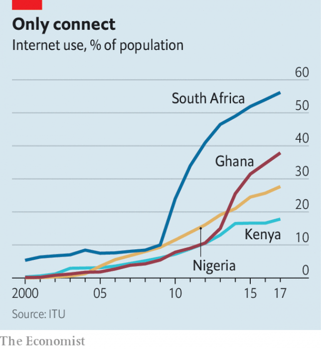

###### What’s up with WhatsApp?

# How WhatsApp is used and misused in Africa 

 

> print-edition iconPrint edition | Middle East and Africa | Jul 20th 2019 

“WHEN I OPEN my phone, I am swamped by news,” says Matthew Stanley, a driver in Abuja, Nigeria’s capital. He scrolls through WhatsApp, a messaging service, bringing up a slick video forwarded into his church group. In a tone befitting a trailer for a horror film, the narrator falsely claims that Muhammadu Buhari, Nigeria’s Muslim president, is plotting to kill Christians. Mr Stanley squints at the tiny screen. “I think it’s fake news,” he says. “I need to check the source.” 

If only everyone were so sceptical. WhatsApp, which has 1.5bn users globally, is especially influential in Africa. It is the most popular social platform in countries such as Nigeria, Ghana, Kenya and South Africa. In the West it is common for people to use multiple platforms such as Facebook and Twitter (see Graphic detail) but in African countries, where money is tighter and internet connections patchy, WhatsApp is an efficient one-stop-shop. The ability to leave audio notes makes it popular among illiterate people. But WhatsApp’s ubiquity also makes it a political tool. 

That much is clear from Nigerian presidential and state elections in February and March. As recent research by Nic Cheeseman, Jamie Hitchen, Jonathan Fisher and Idayat Hassan indicates, Nigerians’ use of WhatsApp both reflects and exploits the country’s social structures. 

 

For example, Nigerians belong to much larger WhatsApp groups than Westerners do. A survey by Mr Hitchen and Ms Hassan in Kano, a northern city, found that locals are typically in groups ofat least 50 people. These may be made up of school acquaintances, work colleagues or fellow worshippers. The larger the group, the more quickly information can spread. And since these groups often comprise friends and community leaders, recipients are inclined to trust what they read. 

Nigeria’s use of WhatsApp reflects its political culture as well. Nigerian elections may not be clean, but they are competitive, points out Matthew Page of Chatham House, a think-tank. “Big man” politicians try to win through patronage rather than policy. Both of the two main presidential candidates, Mr Buhari, the eventual victor, and Atiku Abubakar, had large social-media teams. They had dedicated WhatsApp groups for supporters in every one of Nigeria’s 36 states and 774 municipalities. 

The parties deny that they spread lies. But they need not do so themselves. Being close to a politician is often the surest way to a steady income in Nigeria. That has led to a cottage industry of social-media entrepreneurs seeking to please. These “propaganda secretaries”, as they are known, produce videos, tendentiously caption photographs and disseminate memes for ad hoc payments of up to $84 per month. 

The aim is for a meme to go viral. That way an ally of a political boss will notice and perhaps slip the creator a bonus, a job or a contract. Popular fake stories include one in which Mr Abubakar had been “endorsed” by the Association of Nigerian Gay Men, a fictional entity. Some of the most popular play on existing beliefs. The hilarious idea that Mr Buhari had died and been replaced by a Sudanese man named Jubril seemed credible for many reasons. The president is old and sickly, and one of his predecessors died in office. 

Do the fibs get through? Researchers find it hard enough to know how many people see fake news, let alone how many believe it. What is certain, though, is that the truth takes longer to get its boots on. During the elections the Centre for Democracy and Development, a think-tank run by Ms Hassan, employed five fact-checkers who tried to refute dodgy stories. But they were soon overwhelmed by the volume of misinformation. “I don’t think fact-checking makes any difference,” she sighs. 

Nigeria is not the only place where WhatsApp is influencing political culture. Mr Hitchen notes that during elections in Sierra Leone in 2018, stories spread by an urban minority on WhatsApp would find their way onto popular radio talk shows. In Kenyan elections in 2017 “keyboard warriors” used the platform to collect the phone numbers of group members and allegedly sell them to political parties. 

Such chicanery has been found elsewhere in the world. In Brazil supporters of Jair Bolsonaro used WhatsApp to deliver “an onslaught of daily misinformation”, says Luca Belli, a law professor at Fundação Getulio Vargas, a university in Rio de Janeiro. Partly in response WhatsApp, which was bought by Facebook in 2014, limited to five the number of times a user could forward a message. Previous concerns over its misuse in India prompted WhatsApp to label messages as having been forwarded. 

These changes will only have limited effect. “You can make it harder to share misinformation,” says Mr Cheeseman. “But that just means that it takes longer to share—it doesn’t make it impossible.” As long as WhatsApp allows the sharing of information in groups, it will be used to share lies as well as truths. The only resilient defence is savvier, more sceptical users. 

There are some efforts to use WhatsApp to encourage those. Several were set up ahead of the elections in South Africa on May 8th. One was “What’s Crap on WhatsApp”, an initiative by Africa Check, an NGO with offices in four African countries. It invited South Africans to forward them potential cases of misinformation, which it tried to debunk through one of its WhatsApp channels. 

Another is the creation of Sizwe Mpofu-Walsh, a 30-year-old activist and writer. Eager to produce a political show for young people, he first considered YouTube and radio, but instead launched one via WhatsApp. Mr Mpofu-Walsh uses WhatsApp for Business, the platform’s commercial arm, which makes it possible to broadcast to more than the 256-person limit in an ordinary group. It is a format that has proved successful in China (via an app called WeChat) but is rare in Africa (or anywhere, really). He produces five shows every week. They have about 10,000 viewers, not far off what a cable news show gets in South Africa. “There is an intimacy to WhatsApp that makes people ready to listen to a message,” says Mr Mpofu-Walsh. That is why the platform is popular. But it is also what can make it dangerous. ■ 

-- 

 单词注释:

1.WhatsApp[]:[网络] 智能手机；联络电话；每月活跃用 

2.misuse[.mis'ju:z]:n. 误用, 滥用 vt. 误用, 滥用, 虐待 

3.Jul[]:七月 

4.Matthew['mæθju:]:n. 马太, 马太福音 

5.stanley['stænli]:n. 斯坦利（男子名） 

6.Abuja[a:'bu:dʒa:]:n. 阿布贾（尼日利亚现在的首都） 

7.scroll[skrәul]:n. 卷轴, 画卷, 名册, 条幅, 滚动 v. (使)成卷形 [计] 滚动 

8.slick[slik]:a. 光滑的, 熟练的, 聪明的, 华而不实的, 老套的, 陈腐的 adv. 灵活地, 聪明地 vt. 使光滑, 使漂亮 vi. 打扮整洁 n. 光滑平面, 平滑器, 修光工具 

9.befit[bi'fit]:vt. 适合于, 适宜于 

10.trailer['treilә]:n. 追踪者, 拖车 [电] 拖车 

11.narrator[]:n. 讲述者, 叙述者 [法] 陈述者, 叙述者 

12.falsely['fɒ:lsli]:adv. 虚伪地, 错误地, 不实地 

13.buhari[]:[网络] 布哈里 

14.Muslim['mjzlim; (?@) 'mʌzlem]:n. 伊斯兰教, 伊斯兰教教徒 

15.squint[skwint]:n. 斜视眼, 斜着 a. 斜视的 vt. 使变斜视眼 vi. 斜视, 倾向, 斜行 

16.fake[feik]:n. 假货, 欺骗, 诡计 a. 假的 vt. 假造, 仿造 vi. 伪装 

17.globally[]:[计] 全局地 

18.Nigeria[nai'dʒiriә]:n. 尼日利亚 

19.Ghana['gɑ:nә]:n. 加纳 

20.Kenya['kenjә]:n. 肯尼亚 

21.facebook[]:n. 脸谱网 

22.twitter['twitә]:n. 啁啾, 唧唧喳喳声 vi. 啭, 啁啾, 颤抖 vt. 嘁嘁喳喳地讲, 抖动 

23.graphic['græfik]:a. 生动的, 轮廓分明的, 绘画似的, 图解的 [计] 图形的 

24.patchy['pætʃi]:a. 补缀的, 凑合的, 不调和的, 散落的, 斑驳的, 不完全的 

25.illiterate[i'litәrәt]:n. 文盲 a. 目不识丁的, 没受教育的 

26.ubiquity[ju:'bikwәti]:n. 到处存在, 普遍存在 

27.Nigerian[nai'dʒiriәn]:n. 尼日利亚人 

28.presidential[.prezi'denʃәl]:a. 总统制的, 总统的, 首长的, 统辖的 [法] 总统的, 议长的, 总经理的 

29.NIC[nik]:[计] 网络接口卡, 网络信息中心 

30.cheeseman[]: [人名] [英格兰人姓氏] 奇斯曼职业名称，干酪制作者或销售者，来源于古英语，含义是“干酪+人”(cheese+man) 

31.jamie[]:n. 杰米（男子名） 

32.hitchen[]: [人名] 希钦 

33.jonathan['dʒɔnәθәn]:n. 乔纳森（男子名） 

34.fisher['fiʃә]:n. 渔夫, 食鱼动物, 渔船 

35.Hassan[]:n. 哈山（男子名） 

36.Nigerian[nai'dʒiriәn]:n. 尼日利亚人 

37.Kano['kɑ:nәu]:卡诺[尼日利亚北部城市] 

38.typically['tipikәli]:adv. 代表性地；作为特色地 

39.worshipper[]:n. 礼拜者, 崇拜者, 爱慕者 

40.quickly['kwikli]:adv. 很快地 

41.recipient[ri'sipiәnt]:a. 领受的, 容易接受的, 感受性强的 n. 领受者, 容纳者, 容器 

42.chatham['tʃætәm]:n. 查塔姆（姓氏） 

43.patronage['pætrәnidʒ]:n. 赞助, 恩赐态度, 光顾, 任免权, 保护人的身分 [经] 光顾, 资助, 赞助 

44.eventual[i'ventʃuәl]:a. 最后的, 终于的 

45.victor['viktә]:n. 胜利者 a. 胜利的 

46.atiku[]:[网络] 阿蒂库 

47.abubakar[]:n. (Abubakar)人名；(尼日利、坦桑)阿布巴卡尔 

48.dedicate['dedikeit]:vt. 献出, 贡献 

49.supporter[sә'pɒ:tә]:n. 支持者, 后盾, 迫随者, 护身织物 [法] 支持者, 赡养者, 抚养者 

50.municipality[.mju:nisi'pæliti]:n. 自治区, 市当局, 市民 [法] 市, 自治市, 自治地区 

51.entrepreneur[.ɒntrәprә'nә:]:n. 企业家, 主办人 [经] 承包商, 企业家 

52.propaganda[.prɒpә'gændә]:n. 宣传, 宣传活动 [医] 宣传 

53.tendentiously[ten'denʃəslɪ]:adv. 宣传性地, 不公平地, 有倾向性地 

54.disseminate[di'semineit]:vt. 散播, 传播, 宣传 vi. 广为传播 

55.meme[mi:m]:n. 大脑模仿病毒；文化基因；弥母 

56.hoc[]:abbr. 下议院, 众议院（House of Commons）；肝卵圆细胞（Hepaticoval Cells）；重油催化裂化（Heavy Oil Cracking ）；最高输出信道（Highest Outgoing Channel）；均质铸锭（Homogeneous Casting） 

57.viral['vairәl]:a. 病毒的, 病毒引起的 [医] 病毒的 

58.ally['ælai. ә'lai]:n. 同盟者, 同盟国, 助手 vt. 使联盟, 使联合, 使有关系 vi. 结盟 

59.Creator[kri:'eitә(r)]:n. 上帝, 创造者, 创作者 

60.endorse[in'dɒ:s]:vt. 支持, 赞同, 背书于, 签署 [经] 赞成, 背书 

61.fictional['fikʃәnl]:a. 虚构的, 编造的, 小说式的 [法] 拟制的, 假定的, 虚构的 

62.entity['entiti]:n. 实体, 实存物, 存在 [计] 实体 

63.hilarious[hi'lєәriәs]:a. 喜不自禁的, 欢闹的, 引人发笑的 

64.Sudanese[su:dә'ni:z]:a. 苏丹的, 苏丹人的 n. 苏丹人 

65.credible['kredәbl]:a. 可信的, 可靠的 [法] 可信的, 可靠的 

66.sickly['sikli]:a. 病弱的, 令人不快的, 无精打采的 adv. 病态地 vt. 使现病容 

67.predecessor[.predi'sesә]:n. 前任, 先辈, 前身 [医] 初牙, 前辈, 祖先 

68.fib[fib]:n. 小谎话 vi. 撒小谎 vt. 一击, 打 

69.dodgy['dɒdʒi]:a. 狡猾的, 逃避的, 难弄的 

70.overwhelm[.әuvә'hwelm]:vt. 淹没, 受打击, 制服, 压倒, 使不知所措 [法] 打翻, 倾覆, 覆盖 

71.misinformation['misinfә'meiʃәn]:n. 错误的消息, 误传 [法] 错误的消息, 误传 

72.sierra[si'єәrә]:n. 呈齿状起伏的山脉 

73.Leone[li:'әun]:[经] 里昂 

74.kenyan['kenjәn]:n. 肯尼亚人 

75.warrior['wɒ:riә]:n. 战士, 勇士, 武士, 鼓吹战争的人, 战斗, 尚武 

76.allegedly[ә'ledʒidli]:adv. 依其申述 

77.chicanery[ʃi'keinәri]:n. 强词夺理, 狡辩, 欺骗 

78.Brazil[brә'zil]:n. 巴西 

79.jair[]:[网络] 睚珥；贾伊尔；睢珥 

80.onslaught['ɒnslɒ:t]:n. 突击, 猛击, 猛攻 

81.luca[]:n. 卢卡（男子名） 

82.belli[]:贝利（人名） 

83.getulio[]:[网络] 格图利奥；格图柳 

84.VARGAS[]:瓦尔加斯, 瓦格斯（人名） 巴尔加斯（地名, 在阿根廷、巴拿马、玻利维亚、古巴、洪都拉斯） 

85.rio[]:n. 里约（巴西共和国的旧首都） 

86.de[di:]:[化] 非对映体过量 [医] 铥(69号元素铥的别名,1916年Eder离得的假想元素) 

87.Janeiro[]:n. （葡）一月 

88.resilient[ri'ziliәnt]:a. 弹回的, 有弹力的 [医] 回弹的, 回能的 

89.savvy['sævi]:v. 理解, 领悟 n. 理解能力, 机智, 悟性 

90.crap[kræp]:n. 废物, 废话 vi. 掷骰子 

91.ngo[]:abbr. 民间组织；非政府组织（Non-Governmental Organization） 

92.debunk[di:'bʌŋk]:vt. 揭穿, 暴露, 拆穿假面具 

93.creation[kri:'eiʃәn]:n. 创造, 创作物, 发明 [化] 产生 

94.activist['æktivist]:n. 激进主义分子 

95.youtube[]:n. 视频网站（可以让用户免费上传、观赏、分享视频短片的热门视频共享网站） 

96.APP[]:[计] 应用, 应用程序; 相联并行处理器 

97.WeChat[]:[网络] 微信；微讯；腾讯微信 

98.intimacy['intimәsi]:n. 亲密, 熟悉, 亲昵行为(言语) [法] 亲近的行为, 亲密, 隐私 

