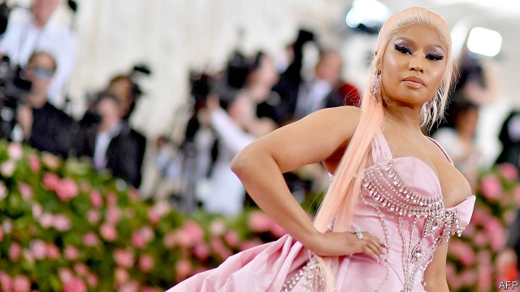

###### Changing the guard

# Saudi Arabia weighs loosening more controls on women 

 

> print-edition iconPrint edition | Middle East and Africa | Jul 20th 2019 

NICKI MINAJ spoke, and Saudi Arabia listened. That is not quite what happened with the scantily clad feminist rapper from New York—though recent events make it a tempting theory. This month Saudi officials disclosed that they want to loosen “guardianship” rules that force women to seek a male relative’s permission to marry, travel abroad or accept many jobs. The proposed change would end the travel restriction, which also applies to men under the age of 21. The idea leaked on the same day that Ms Minaj (pictured) cancelled a gig in Saudi Arabia, citing its oppression of women and gay people. 

If the new rules take effect later this year, as planned, both sexes will be free to leave the country once they reach 18. Such a shift would be controversial, and raise awkward questions about the broader cultural changes desired by the crown prince, Muhammad bin Salman. 

These changes would have been difficult to imagine five years ago. Last June Saudi Arabia lifted a decades-long ban on women driving. In 2017 King Salman decreed that women could seek government services, such as education and health care, without a man’s consent. The rules on segregating the sexes have been unofficially relaxed, and Prince Muhammad has suggested that women need not wear flowing abayas (full-length gowns) in public. 

All of this has passed without much public brouhaha, in part because anyone who might complain is in prison. Police have arrested both clerics who oppose the changes and liberal activists who want more. Though the driving decision had its detractors, hidebound husbands and fathers can still coerce their charges into staying at home. A recent YouGov poll found that of the vast majority of Saudi women who have not applied for a driving licence, 16% refrained because of objections from a male relative. 

Changing the guardianship laws would prove more controversial, particularly in conservative areas outside the big cities. Some fear it could lead to more cases like that of Rahaf Mohammed, a Saudi teenager who fled to Thailand in January to escape her family. Relatives unsuccessfully tried to bring her back (she received asylum in Canada). Other young women followed her lead. Hence the cautious manner of the announcement. While the driving ban was lifted by official decree, news of the guardianship change was leaked as a trial balloon—first to the Saudi newspaper Okaz and then to foreign outlets. 

Prince Muhammad has not yet had much luck overhauling the Saudi economy. Unemployment remains high and the private sector is not creating jobs. His cultural changes have gone further, but they too have been uneven. In June a firm based in the United Arab Emirates tried to open an alcohol-free nightclub in Jeddah, the most cosmopolitan Saudi city. Officials shut it down on opening night, though it has since reopened as a “lounge” (same venue, less dancing). 

Or there is the case of Ms Minaj, who was due to perform at a music festival in Jeddah this month. She seemed an odd fit for a puritanical theocracy, given her raunchy outfits and lyrics. (“He toss my salad like his name Romaine” is one of her milder lines.) Days before the concert she backed out. Hoping to save face, the Saudis claimed it was in fact they who disinvited her. The episode provoked wry commentary on social media. In one widely shared video, a young Saudi woman asked why she had to wear an abaya while Ms Minaj was free to come “shake her ass”. 

It is a fair question. The prince’s behaviour is idiosyncratic: he jails reformers even as he decrees reforms. He justifies some social reforms as economic necessities (if Saudis can go to concerts at home, they won’t spend their money abroad). The public have no say. Some young Saudis are enjoying this moment of relative openness; others flee into exile, for reasons both personal and political. Ironically, by letting women travel, Prince Muhammad may allow some to leave and never return.■ 

-- 

 单词注释:

1.saudi['sajdi]:a. 沙乌地阿拉伯（人或语）的 

2.Arabia[ә'reibiә]:n. 阿拉伯半岛 

3.Jul[]:七月 

4.Nicki[]:尼基 

5.minaj[]:[网络] 爱泰利酱 

6.scantily[ˈskæntɪlɪ]:adv. 缺乏地; 不充足地; 吝啬地; 狭窄地 

7.clad[klæd]:vt. 在金属外包上另一种金属 a. 包层金属的 clothe的过去式和过去分词 

8.feminist['feminist]:n. 男女平等主义者 

9.rapper['ræpә]:n. 敲门人, (美)(非正式)控告人, 证人, 检举人 [机] 敲杆 

10.guardianship['gɑ:diәnʃip]:n. 监护, 保护, 守护 [法] 监护, 保护, 监护人的职责 

11.minaj[]:[网络] 爱泰利酱 

12.gig[gig]:n. 旋转物, 轻便双轮马车, 赛艇, 鱼叉, 记过, 爵士乐演奏会 vi. 乘轻便双轮马车, 乘快艇, (用鱼叉)叉鱼 vt. (用鱼叉)叉, 刺激, 记过 

13.cite[sait]:vt. 引用, 引证, 表彰 [建] 引证, 指引 

14.oppression[ә'preʃәn]:n. 压抑, 沉闷, 压迫手段 [医] 压迫, 压抑 

15.cultural['kʌltʃәrәl]:a. 文化的, 教养的, 修养的 [医] 培养的 

16.muhammad[]:n. 穆罕默德 

17.bin[bin]:n. (贮存谷物等的)容器, 箱子 [计] 二进制, 商业信息网 

18.Salman[]:n. 萨尔曼（男子名） 

19.decree[di'kri:]:n. 法令, 判决, 天意 vt. 颁布, 判决 vi. 发布命令 

20.segregate['segrigeit]:a. 分离的, 被隔离的 vi. 分离, 隔离, 分凝 vt. 使分离, 使隔离 

21.unofficially[]:adv. 非公认地；非正式地 

22.abaya[ә'beijә]:n. 毛织物, (阿拉伯式)长袍 

23.brouhaha[bru:'hɑ:hɑ:]:n. 吵闹, 骚动 

24.cleric['klerik]:a. 牧师的, 教士的 

25.activist['æktivist]:n. 激进主义分子 

26.detractor[di'træktә(r)]:n. 毁损者, 贬低者 

27.hidebound['haidbaund]:a. 思想偏狭顽固的, 死板的, 量小的 [医] 绷紧的, 包紧的(皮肤) 

28.coerce[kәu'ә:s]:vt. 强制, 强迫 

29.YouGov[]:[网络] 民治调查公司；尤格夫；民治公司 

30.refrain[ri'frein]:n. 重复的话, 叠句, 副歌 vi. 节制, 避免, 克制 

31.Mohammed[mu'hæmәd]:n. 穆罕默德(伊斯兰教创始人) 

32.Thailand['tailәnd]:n. 泰国 

33.unsuccessfully[]:adv. 无用；失败地 

34.asylum[ә'sailәm]:n. 庇护, 收容所 [医] 养育院 

35.okaz[]:[网络] 奥卡兹新闻报；欧卡兹报；吉达市一家阿文日报 

36.overhaul[.әuvә'hɒ:l]:vt. 分解检查, 翻修, 精细检查, 彻底革新 n. 分解检查, 精细检查, 大检修 

37.sector['sektә]:n. 扇形, 部门, 部分, 函数尺, 象限仪, 段, 区段 vt. 把...分成扇形 [计] 扇面; 扇区; 段; 区段 

38.uneven[.ʌn'i:vәn]:a. 不平坦的, 不均等的, 奇数的 

39.emirate[e'miәrit]:n. 埃米尔的地位, 酋长国 

40.nightclub['naitklʌb]:n. 夜总会 

41.Jeddah[]:n. 吉达（沙特阿拉伯地名） 

42.cosmopolitan[,kɔzmә'pɔlitәn]:a. 世界主义的, 世界性的, 全世界的, 遍生的, 不偏狭的, 卓有见识的 n. 世界主义者, 世界性 

43.reopen[.ri:'әupәn]:v. 重开, 再开始, 再开 

44.venue['venju:]:n. 犯罪地点, 审判地, 发生地点 

45.les[lei]:abbr. 发射脱离系统（Launch Escape System） 

46.puritanical[,pjuәri'tænikәl]:a. 清教徒的, 清教主义的, 宗教上极端拘谨的, 道德上极端拘谨的 

47.theocracy[θi'ɒkrәsi]:n. 神权政治, 神权国 

48.raunchy['rɒ:ntʃi]:a. 不整洁的, 不修边幅的, 肮脏的, 淫秽的 

49.outfit['autfit]:n. 用具, 配备, 机构 vt. 配备, 供应 vi. 得到装备 

50.lyric['lirik]:n. 抒情诗, 歌词 a. 抒情的 

51.romaine[rәu'mein]:n. 长叶莴苣 

52.saudi['sajdi]:a. 沙乌地阿拉伯（人或语）的 

53.provoke[prә'vәuk]:vt. 激怒, 惹起, 诱导 [法] 刺激, 煽动, 激怒 

54.wry[rai]:a. 扭歪的, 歪曲的, 歪斜的 v. 扭曲, 扭歪 

55.commentary['kɒmәntәri]:n. 注释, 评论, 说明 [法] 注释, 评注, 评论 

56.ass[æs]:n. 驴, 傻瓜, 笨蛋, 屁股 [计] 模拟仿真系统 

57.reformer[ri'fɒ:mә]:n. 改革家, 改革运动者 [化] 转化炉; 转化器; 重整器; 重整炉 

58.openness['әupәnnis]:n. 公开；宽阔；率真 

59.exile['eksail]:n. 放逐, 流放, 被放逐者 vt. 放逐, 流放, 使背井离乡 

60.ironically[]:adv. 冷嘲地, 挖苦地, 讽刺地, 令人啼笑皆非地 

