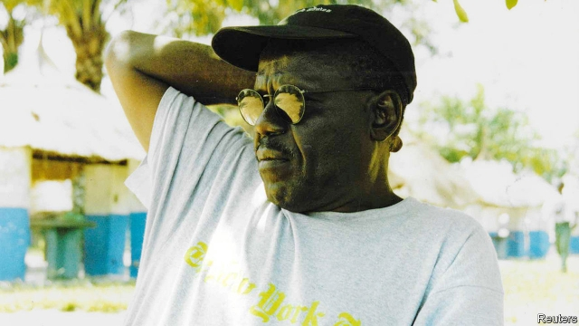

###### Congo’s wheels

# Obituary: Pierre Mambele died on June 8th 

 

> print-edition iconPrint edition | Obituary | Jul 20th 2019 

SINCE THE best place to pick up a fare in Kinshasa, Congo’s capital, was outside the Grand hotel (for a time, the Intercontinental), that was where Pierre Mambele usually parked his car. There he would wait, with a bottle of Sprite, under the trees for shade. 

His car was nothing fancy. It was a dark blue 1976 Fiat which had seen service on plenty of bad roads. The side mirrors and windscreen-wipers had long gone, good riddance to them. The front doors could fly open at speed, so sometimes had to be tied to the chassis with plastic bags. The exhaust trailed. This car limped from one criminal mechanic to another, but as long as it ran, and people were willing to pay him for a ride, he wasn’t bothered. 

His clothes were nothing fancy either. On most days in fashion-proud Kinshasa he wore a greasy T-shirt and dirty jeans. His thick glasses, mended with Sellotape, had never been much use. Yet he drove crazy-fast, pedal to the floor, roaring round the city. He was not a Kinois himself, one of that snooty so-sophisticated lot, and the other drivers outside the Grand called him “Kisangani” after the city where he was born, in the east. He spoke Swahili as well as Lingala. But he had been a taxi-driver in the capital for decades, and knew the ramshackle place like the back of his hand. Kin-la-belle, now Kin-la-poubelle, as everyone said. 

Driving fast also showed his contempt for any sort of authority. Soldiers toting guns in the road were a joke: pas sérieux, quel cinéma! As for the roulages, the yellow-helmet traffic cops who would leap out to bang on his windscreen and demand money for some offence he hadn’t committed, he would shout and argue with them until it came to fists, and they gave up. A cop got in his way once when he was doing a three-point turn outside a grocery store. He just kept going, with the idiot spreadeagled on the bonnet. 

Because he was so audacious, and had good instincts, and would go to places other drivers wouldn’t, his taxi became the car of choice for Western journalists. It was good money, $35 a day in the 1990s (though the best money came from Western TV crews, if they turned up in town). His regular passengers for years included Michela Wrong and Stephanie Wolters of Reuters, Howard French of the New York Times, Dino Mahtani of Reuters (and The Economist), on whose office sofa he would take naps, William Wallis of the Financial Times. Though he spoke no English and growled thickly in French, often just to himself, they all knew what he was grumbling about. He was the conduit through which they, and their readers, came to grasp what was happening in Congo. 

None of it was good. C’est pas bien, c’est foutu, finger wagging angrily as he careered along. He had ulcers, his stomach hurt and his wife was divorcing him, but his country pained him more. Everyone was corrupt. Everything was screwed. In his lifetime Congo had gone from brutal Belgian colonialism to brief independence under Patrice Lumumba to dictatorship under Mobutu Sese Seko, before the Kabila clan took over. He had met Lumumba at rallies in Kisangani, and liked him. For Mobutu and his henchmen he had no time at all. Nor for the Kabilas, whose claims to be rassembleurs, unifiers, made him laugh out loud. His hopes lay with Etienne Tshisekedi, “the Sphinx”, founder of a party for democratic change without violence. But Tshisekedi never made it to president, and his son Félix managed it only by villainy, like all the rest. 

There had been one golden moment. It came in 1974, the year he started driving a taxi. Congo, then called Zaire, won the African Soccer Cup and hosted the Rumble in the Jungle, the heavyweight boxing match between George Foreman and Muhammad Ali. Kinshasa was suddenly swarming with Americans, hands full of dollars, needing a cab. Even better, one evening Ali himself, his hero, came out of the hotel. One of the younger drivers tried to spar with him, and he, Pierre, stepped between them like a referee to shout “Break! Dégage-toi!” He saw that fight, which Ali won, and loved ever after to drive his journalists past the May 20th Stadium, remembering it. 

He could show them other good things, too. He took many to eat fish and cassava at Maluku on the Congo river, and encouraged some to meet Papa Wendo, the ancient father of the Congolese rumba, or to listen in on meetings of intellectuals who conversed in English. He wanted to display Congo’s best side—the really impressive side, not the overweening official villas on the hill in Binza towards which the little Fiat would trundle, then expire, and need to be jump-started while the sharp suits stood and stared. 

Some of those officials, the grosses legumes, he knew, and they gave him a certain respect, both because he kept turning up with Western journalists and because, clearly, he was fearless. This made him useful as a fixer, though he was a driver first, and ran the same risks the journalists did when he strayed into presidential compounds or, as in the 1990s, into riots. But he and the car, as its bashes showed, would drive through anything. He had to get his journalists, first, to where they wanted to go and, second, safely back again. If bad stuff happened, and they ended up hauled from the car or in jail, he would stay until he had rescued them—sometimes because he knew the right person, often by shoving and shouting. He became their protector and friend. In return they gave him money to buy a better car, but he preferred to get a cheap one and, in his chaotic style, fritter the rest away. 

At times he found he was thinking like a journalist himself, pushing his charges to get closer to the action when something newsworthy occurred. He wanted to be there in the sweat of it when history happened. Yet history seemed to have slowed almost to a stop in Congo. Nothing changed, and nothing would. Its leaders were idiots. The economy was bust. Some parts were given over to constant war. Fewer journalists came to cover it, so it was hardly worth waiting even outside the Grand. Il n’y a rien, il n’y a rien, he would mutter down the phone to his journalist friends who had gone home. In response they sent him clothes and money for the hospital where eventually he had to go; they had not forgotten Congo. Sadly, it seemed to him that the rest of the world had.■ 

