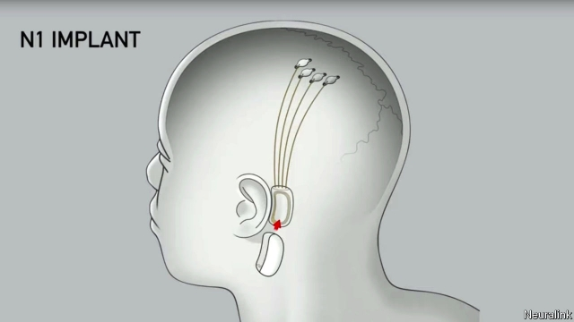

###### Brain-machine interfaces

# Elon Musk wants to link brains directly to machines 

 

> print-edition iconPrint edition | Science and technology | Jul 18th 2019 

ELON MUSK, perhaps the world’s most famous entrepreneur, is sometimes referred to as “the Trump of technology”—not for political reasons, but because of his habit of making, at short notice, spectacular pronouncements that stretch the bounds of credibility. On July 16th he was at it again, unveiling a new type of brain-machine interface (BMI). If human beings do not enter a symbiosis with artificial intelligence (AI), he declared, they are sure to be left behind. And he, the announcement implied, was going to be the man who stopped that happening. 

Connecting brains directly to machines is a long-standing aspiration. And it is already happening, albeit in a crude way. In deep-brain stimulation, for example, neurosurgeons implant a few electrodes into a patient’s brain in order to treat Parkinson’s disease. Utah arrays, collections of 100 conductive silicon needles, are now employed experimentally to record brain waves. A team at the University of Washington has built a “brain-to-brain network” that allows people to play games with each other using just their thoughts. And researchers at the University of California, San Francisco, have captured neural signals from people as they talk, and have then turned that information, via a computer, into intelligible speech. 

As with all things Musk-related, Neuralink is much more ambitious. The firm does not just want to develop a better BMI. Its aim is to create a “neural lace”, a mesh of ultra-thin electrodes that capture as much information from the brain as possible. Unsurprisingly, hurdles abound. The electrodes needed to do this must be flexible, so that they do not damage brain tissue and will also last for a long time. They have to number at least in the thousands, to provide sufficient bandwidth. And to make the implantation of so many electrodes safe, painless and effective, the process has to be automated, much like LASIK surgery, which uses lasers to correct eyesight. 

Neuralink does indeed seem to have made progress towards these goals. Its presentation, at the California Academy of Sciences, in San Francisco, included videos of a neurosurgical robot that is best described as a sewing machine. This robot grabs “threads” (films, containing electrodes, that measure less than a quarter of the diameter of a human hair), and shoots them deep into the brain through a hole in the skull. It is capable of inserting six threads, each carrying 32 electrodes, per minute. The firm has also designed a chip that can handle signals from as many as 3,072 electrodes—ten times more than the best current systems—and transmit them wirelessly. 

The real magic, however, kicks in only when the output is analysed—which happens in real time. Looked at superficially, neurons in the brain seem to fire at random. Software can, though, detect patterns when the individual those neurons are in does certain things. Stick enough electrodes into someone’s motor cortex, for instance, and it is possible to record what happens in the brain when he types on a keyboard or moves a mouse around. Those data can then be used to control a computer directly. Conversely, the electrodes can be employed to stimulate neurons, perhaps to give the person in question the feeling of touching something. 

Neuralink has already tested its system successfully on rats and monkeys. These were, it says, able to move cursors on screens with it. The firm now hopes to work with human volunteers, perhaps as early as next year should America’s Food and Drug Administration play along. 

The first goal is to use the technology to help people overcome such ailments as blindness and paralysis. Neuralink is, however, clearly aiming for a bigger market than this. It has also designed a small device that would sit behind someone’s ear, picking up signals from the implanted chip and passing them on as appropriate. In a few years, using a brain implant to control your devices may be as de rigueur among San Francisco’s techno-chics as wearing wireless earbuds is today. Ultimately, Mr Musk predicts, neural lace will allow humans to merge with AI systems, thus enabling the species to survive. 

Though, as this announcement shows, Mr Musk does have a habit of presenting himself as the saviour of the human race (his desire to settle Mars seems motivated partly by fear of what might, in the future, happen to Earth), the idea that some machines at least will come under the direct control of human brains seems plausible. The biggest obstruction to this happening will probably not be writing the software needed to interpret brainwaves, but rather persuading people that the necessary surgery, whether by sewing machine or otherwise, is actually a good idea.■ 

Correction (July 18th 2019): Neuralink’s new chip can handle signals from ten times as many electrodes as the best current systems, not 30 times as many, as we first wrote. 

-- 

 单词注释:

1.interface['intәfeis]:n. 分界面, 接触面, 界面 [计] 接口, 界面 

2.elon[i'lɔn]:n. 埃伦（可溶性显影剂粉末） 

3.musk[mʌsk]:n. 麝香, 麝香的气味 [化] 麝香 

4.Jul[]:七月 

5.elon[i'lɔn]:n. 埃伦（可溶性显影剂粉末） 

6.musk[mʌsk]:n. 麝香, 麝香的气味 [化] 麝香 

7.entrepreneur[.ɒntrәprә'nә:]:n. 企业家, 主办人 [经] 承包商, 企业家 

8.spectacular[spek'tækjulә]:a. 公开展示的, 惊人的, 壮观的 n. 奇观, 惊人之举, 展览物 

9.pronouncement[prә'naunsmәnt]:n. 声明, 公告, 宣言, 宣告, 发表, 意见, 决定 [法] 宣判, 宣布, 宣告 

10.credibility[.kredi'biliti]:n. 可信用, 确实性, 可靠 [法] 证据能力, 可信程度, 确实性 

11.unveil[.ʌn'veil]:vt. 揭开, 揭幕, 除去...的面纱 vi. 显露, 除去面纱 

12.bmi[]:abbr. 身体质量指数（Body Mass Index）；广播音乐联合会（Broadcast Music Incorporated） 

13.symbiosis[.simbai'әusis]:n. 共栖, 共同生活 [化] 类聚效应 

14.AI[ai]:[计] 附加信息, 人工智能 [化] 人工智能 

15.aspiration[.æspә'reiʃәn]:n. 热望, 志向, 渴望 [医] 吸入; 吸[引], 吸引术 

16.albeit[ɔ:l'bi:it]:conj. 尽管, 虽然 

17.stimulation[.stimju'leiʃәn]:n. 刺激, 激励, 鼓舞 [医] 兴奋, 刺激 

18.neurosurgeon[,njjәrәj's\\:dʒәn]:n. 神经外科医师 [医] 神经外科医师 

19.implant[im'plɑ:nt]:vt. 深植, 灌输, 嵌入 n. 植入物, 植入管 

20.electrode[i'lektrәud]:n. 电极 [化] 电极; 焊条; 电焊条 

21.Utah['ju:tɑ:]:n. 犹他 

22.array[ә'rei]:n. 排列, 衣服, 大批, 军队 vt. 布署, 打扮, 排列 [计] 数组; 阵列 

23.conductive[kәn'dʌktiv]:a. 传导性的, 有传导力的, 传导的 [机] 传导性的 

24.silicon['silikәn]:n. 硅 [化] 硅Si 

25.experimentally[ik.speri'mentli]:adv. 实验式地, 在实验上 

26.Washington['wɒʃiŋtn]:n. 华盛顿 

27.California[.kæli'fɒ:njә]:n. 加利福尼亚 

28.san[sɑ:n]:abbr. 存储区域网（Storage Area Networking） 

29.francisco[fræn'siskәu]:n. 弗朗西斯科（男子名, 等于Francis） 

30.neural['njuәrәl]:a. 神经的, 神经系统的, 神经中枢的, 背的 [医] 神经的 

31.intelligible[in'telidʒәbl]:a. 可理解的, 易理解的, 纯概念性的 

32.ambitious[æm'biʃәs]:a. 有野心的, 抱负不凡的, 雄心勃勃的 

33.mesh[meʃ]:n. 网孔, 网丝, 网眼, 网状物, 圈套, 陷阱, 啮合 vt. 以网捕捉, 啮合, 使缠住 vi. 落网, 相啮合 

34.unsurprisingly[]:adv. 不出所料的；不出奇的；意料中的 

35.hurdle['hә:dl]:n. 障碍, 跳栏, 临时活动篱笆 vt. 用篱笆围, 越过, 克服 

36.abound[ә'baund]:vi. 大量存在, 富于, 充满 

37.bandwidth['bændwidθ]:n. 频带宽度, 通带宽度 [计] 带宽, 频宽 

38.implantation[.implɑ:n'teiʃәn]:n. 移植, 鼓吹, 灌输 [医] 植入法, 移植法, 植入, 埋入法(如药物等) 

39.painless['peinlis]:a. 无痛的, 不痛的 [医] 无痛的 

40.automate['ɔ:tәmeit]:vt.vi. (使)自动化 [计] 自动化 

41.LASIK[]:abbr. 镭射视力矫正手术（Laser Assisted In-situ Keratomi） 

42.neurosurgical[ˌnjʊərəʊˈsɜ:dʒɪkl]:a. <医>神经外科的 

43.grab[græb]:n. 抓握, 掠夺, 强占, 东方沿岸帆船 vi. 抓取, 抢去 vt. 攫取, 捕获, 霸占 

44.les[lei]:abbr. 发射脱离系统（Launch Escape System） 

45.skull[skʌl]:n. 头盖骨, 头脑, 好学生 [医] 头颅 

46.chip[tʃip]:n. 屑片, 薄片, 碎片 vt. 削, 切, 削成碎片, 使摔倒, 凿 vi. 削下屑片 [计] 孔屑; 组件; 晶片; 芯片 

47.wirelessly[]:adv. wireless的变形 

48.superficially[]:adv. 表面, 表面性, 浅层, 不深, 表皮, (贬)肤浅, 一知半解, 浅薄, 平方, 浮面 

49.neuron['njuәrɔn]:n. 神经原, 轴索, 神经细胞 [计] 神经元 

50.cortex['kɒ:teks]:n. 皮层 [医] (树)皮; 皮质, 皮层 

51.datum['deitәm]:n. 论据, 材料, 资料, 已知数 [医] 材料, 资料, 论据 

52.cursor['kә:sә]:n. 游标, 光标 [计] 光标 

53.ailment['eilmәnt]:n. 病痛, 疾病 [医] 疾病 

54.blindness['blaindnis]:n. 盲目, 失明, 愚昧 [医] 盲, 视觉缺失 

55.paralysis[pә'rælisis]:n. 麻痹, 停顿, 瘫痪 [医] 麻痹, 瘫痪 

56.de[di:]:[化] 非对映体过量 [医] 铥(69号元素铥的别名,1916年Eder离得的假想元素) 

57.rigueur[]:un. 不可缺少的 [网络] 严峻；严密性 

58.earbuds[]:[网络] 耳机；耳塞式耳机；耳道式耳机 

59.merge[mә:dʒ]:vt. 使合并, 使消失, 吞没 vi. 合并, 渐渐消失 [计] 合并 

60.specie['spi:ʃi]:n. 硬币 [经] 硬币 

61.saviour['seivjә]:n. 救助者, 救世主, 救星 

62.mar[mɑ:]:vt. 损毁, 损伤, 糟蹋 n. 三月 

63.plausible['plɒ:zibl]:a. 貌似真实的, 貌似合理的, 说得煞有其事的 [法] 花言巧语的, 似乎有理的 

64.obstruction[әb'strʌʃәn]:n. 障碍, 妨碍, 闭塞物 [医] 梗阻, 不通 

65.brainwave['breinweiv]:n. 脑(电)波, 灵感 

