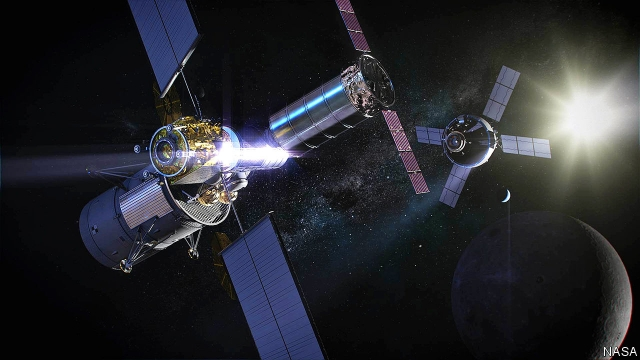
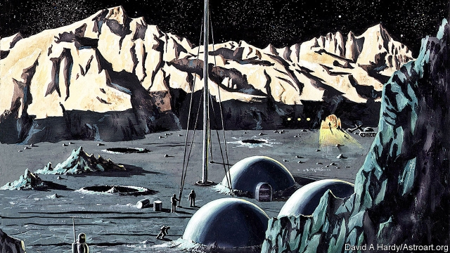

###### Lunar exploration

# Is it time to go back to the Moon? 

 

> print-edition iconPrint edition | Science and technology | Jul 18th 2019 

ON MARCH 26TH Mike Pence, America’s vice-president, gave a speech at the US Space & Rocket Centre in Huntsville, Alabama, in which he told his audience that he was bringing forward, “by any means necessary”, the target date for America to send astronauts back to the Moon. The previous deadline had been 2028. It was now 2024. Then, on May 13th, NASA’s administrator Jim Bridenstine gave the reinvigorated project a name. It will be called “Artemis”, after Apollo’s twin sister, the ancient Greek goddess of the Moon. Following this, on July 10th, Mr Bridenstine moved two long-standing managers of NASA’s human space flight programme to other duties, writing in his memo, “In an effort to meet this challenge, I have decided to make leadership changes to the Human Exploration and Operations (HEO) Mission Directorate.” 

The timing of all this is surely no coincidence. On July 21st it will be exactly 50 years since Neil Armstrong fluffed his lines at the culmination of the original Moon programme—his “small step” off Apollo 11’s lunar module, Eagle, onto the regolith of the Sea of Tranquillity. America abandoned Moon shots 41 months later, and attempts to revive them have never appeared convincing. But Artemis looks not unlike the real deal. For one thing, its arrival on the Moon will now fall conveniently within the second term of office of Mr Pence and his boss, Donald Trump, should they be re-elected in 2020. It also helps that Artemis is recycling ideas salvaged from those previous attempts, notably the Constellation programme, unveiled in 2005 by George W. Bush and cancelled five years later by Barack Obama. 

Nor will Artemis be alone. In matters lunar, something is stirring. China’s space agency, though in less of a hurry than Mr Pence, also plans to land people on the Moon. Its target date is 2035. Other agencies, European, Indian, Japanese and Russian, intend to bombard the place with robot probes. And private enterprise is also seeking a share of the glory. In the mind of Johann-Dietrich Wörner, head of the European Space Agency, there is a sense of community among these ventures, giving rise to what he calls a “Moon village”. 

Some, indeed, would go further, and convert this village from a metaphor into a reality. People like Robert Zubrin, a prominent American evangelist for manned space flight, think that this time around there should be no namby-pamby messing about with tip-and-run missions like Apollo. A Moon base should be the objective from the beginning. 

It could be built quickly, according to a blueprint Dr Zubrin, an aerospace engineer, published in a book called “The Case for Space”. It would be at one of the lunar poles, where mountain tops in near-perpetual sunlight could house solar-energy farms, and craters in everlasting shadow contain ice from billions of years of comet impacts. This ice could supply drinking water. It could also, if its molecules were split by electricity from the mountain tops, provide oxygen for breathing, and hydrogen and further oxygen for rocket fuel. 

Dr Zubrin’s back-of-the-envelope calculations suggest his base would cost about $7bn, and take seven years to develop and build. Thereafter, it would need $250m a year to sustain it. NASA, however, has other plans. Though Artemis does require a base of sorts, that base will not be on the Moon. Instead, it will be an intermittently crewed space station, the Lunar Orbital Platform—Gateway (depicted, about to dock with a supply vessel, in an artist’s impression on the previous page) that is in orbit around the Moon. 

Artemis will work like this. Its crewed vehicle, Orion, is a version of a craft originally designed for the now-abandoned Constellation project. Similarly, the rocket which will lift Orion, the Space Launch System (SLS), is a cut-down version of Constellation’s heavy lifter, Ares V. Orion’s destination will be Gateway. Two of its four crew will stay on the station while the others descend to the surface in a special lunar shuttle, do their stuff, then return to Gateway and thence to Earth, leaving the station uncrewed until the next mission arrives. 

If Congress approves the additional $20bn-30bn for NASA’S budget that Mr Bridenstine says the project will require over the next five years—a big “if”—Orion, the SLS and the lunar shuttle could all be ready and tested within Mr Pence’s timetable. There is, however, the small matter of Gateway itself, for which existing plans involve all the partners of the International Space Station (ISS)—Europe, Russia, Japan and Canada, as well as America. 

The first Gateway module is intended for launch in 2022 and subsequent components would go up in a series of missions using both commercial and SLS launches, until 2028. This means that, when Orion arrives at Gateway in 2024 with its Moon-bound astronauts, it will dock with a partially completed space station. There is no official cost for the Gateway project but, given the $150bn price tag of the ISS, it would be a surprise if the lunar space station cost less than several tens of billions of dollars. In light of all this, Dr Zubrin’s approach starts to look attractive. 

As with the ISS, currently in orbit around Earth at an altitude of 400km, China is pointedly excluded from involvement in building Gateway. American law prevents NASA collaborating with the Chinese—something regretted by Wu Ji, a former director-general of China’s National Space Science Centre who is now an adviser to the government. 

In fact, says Dr Wu, China’s main goal in space over the next decade is to build a space station of its own in orbit around Earth. Development of a crewed Moon programme will probably begin in the mid-2020s. “By 2035, there will be a Chinese person landing on the Moon,” he says. But there is no rush. “We are not in competition with anybody. So we go step by step. So even if we land Chinese on the surface of the Moon by 2035, it’s still great.” 

 

China has, however, already landed unmanned probes there. Its most recent mission, Chang’e 4, touched down on the lunar far side (the part never visible from Earth) in January. The next two probes in the series will be sample-return missions, and further craft will explore the Moon’s poles. 

The launch of India’s second lunar mission, Chandrayaan 2, which will put a lander and a rover down near the south pole, has been delayed, but should happen soon. India is also working with Japan’s space agency, JAXA, to develop a joint robotic mission. Russia, too, has plans. Luna 25, scheduled for 2021, will be another visitor to the south pole. And six more Luna missions—orbiters and landers—are intended to follow before the end of the decade. 

From a scientific point of view, the Moon is not only of interest in its own right. It is also a museum of the solar system’s past. Its surface will probably be strewn with terrestrial rocks older than anything now preserved on Earth that were blasted into space aeons ago by asteroids colliding with that planet. It will also preserve clues about the sun’s history, the galactic environments that the solar system has encountered on its journey through space since its formation 4.6bn years ago, and the abundance in the early solar system of objects so large that their impact might have interfered with the emergence of life on Earth or elsewhere. 

The Moon (or rather its far side) is also a good place to hide radio telescopes from the deluge of radio waves coming from Earth’s surface. There, they will be able to pick up signals that are otherwise swamped—particularly, radiation from the earliest days of the universe, which may encode details of the origin of everything. 

As to the Moon village’s non-governmental members, these are led by the usual suspects of private space flight, Elon Musk (SpaceX) and Jeff Bezos (Blue Origin), both billionaires who hope that the Moon might one day be made to pay its way, but who would probably admit that the whole, giddy adventure of it, rather than the prospect of profit, is what truly drives them on. 

SpaceX already has a contract for lunar tourism. Yusaku Maezawa, founder of Zozotown, Japan’s largest online clothing retailer, wants to take a group of artists with him for a project he calls #dearMoon. This is a free-return-trajectory trip around the Moon (there and back again, passing behind the far side, but without going into orbit) that SpaceX says could happen as early as 2023 using the Starship spacecraft the firm is developing. If the SLS does not measure up, the Starship system might take on its job, too. 

Blue Origin, meanwhile, recently unveiled a mock-up of its Blue Moon lunar lander. The company claims this would be able to deliver 3.6 tonnes of cargo to the Moon’s surface. That is just the sort of thing Dr Zubrin would need to help construct his Moon base, but a more likely first mission for it would be as Artemis’s lunar shuttle. 

Besides the two behemoths, smaller fry are also involved in the Moon village’s commercial side. One of these, Astrobotic, a firm in Pittsburgh, is developing an unmanned lunar lander it calls Peregrine. This will carry the Mexican Space Agency’s first lunar payload. Astrobotic is also one of three firms awarded contracts by NASA as part of its Commercial Lunar Payload Services programme. The other two are Intuitive Machines of Houston, Texas and OrbitBeyond of Edison, New Jersey. NASA wants these companies to help it survey various places on the Moon’s surface that might be suitable for building bases. 

Even if Dr Zubrin does not get his way, then, there are likely, within decades, to be permanent human outposts on the Moon, frequented by scientists and tourists from many countries. The place will thus become something like Antarctica is today—hard to get to, but not impossible if you have the money or the right government backing. And, just as Antarctica is no longer enough in the eyes of those who look to explore new frontiers, so, in the minds of some, the residents of these actual Moon villages will be testing human endurance, psychology and technology with a view to constructing an even more remote hamlet: on Mars.■ 

Science correspondent’s job: The Economist is looking for a new Science and Technology correspondent. Knowledge of the field, an ability to write informatively, succinctly and wittily, and an insatiable curiosity are more important attributes than prior journalistic experience. Please send a CV, a brief letter introducing yourself, and an article of 600 words suitable for publication to scijob@economist.com. The closing date for applications is August 23rd. 
<<<<<<< HEAD

-- 

 单词注释:

1.exploration[.eksplә'reiʃәn]:n. 探险, 踏勘, 探测 [医] 探察 

2.Jul[]:七月 

3.mike[maik]:vi. 偷懒, 游手好闲 n. 休息, 游手好闲, 扩音器, 话筒 

4.huntsville[]:n. 亨茨维尔（美国城市） 

5.Alabama[.ælә'bæmә]:n. 亚拉巴马州 

6.administrator[әd'ministreitә]:n. 管理人, 行政官 [经] 遗产管理人员 

7.jim[dʒim]:n. 吉姆（人名） 

8.reinvigorate[.ri:in'vigәreit]:vt. 使再振作, 使复兴 

9.Artemis['ɑ:timis]:n. 阿耳特弥斯(月亮与狩猎的女神) 

10.goddess['gɒdis]:n. 女神, 美女, 受崇拜的女性 

11.memo['memәu]:n. 备忘录 [经] 备忘录 

12.exploration[.eksplә'reiʃәn]:n. 探险, 踏勘, 探测 [医] 探察 

13.heo[]:abbr. higher executive officer 高级行政官员; high elliptical orbit satellite 高轨道地球卫星; highly elliptical orbit, hyperelliptic earth orbit 高椭率（地球）轨道; highly-inclined elliptical orbit 大倾角椭圆轨道 

14.directorate[di'rektәrit]:n. 理事之职务, 董事会, 理事会 [经] 董事会 

15.timing['taimiŋ]:n. 时间选择, 时间测定, 定时, 调速 [计] 定时器时钟 

16.neil[]:n. 尼尔（男子名） 

17.Armstrong['ɑ:mstrɔŋ]:[计] 公理 

18.fluff[flʌf]:n. 软毛, 柔毛, 绒毛, 错误, 无价值的东西 vi. 起毛, 变松, 出错 vt. 使起毛, 抖松, 念错 

19.culmination[.kʌlmi'neiʃәn]:n. 顶点, 高潮, 最高点 

20.Apollo[ә'pɒlәu]:n. 阿波罗(太阳神), 美男子 

21.module['mɒdju:l]:n. 组件, 模数 [计] 模块 

22.regolith['re^әliθ]:n. （=mantlerock）[地质]风化层, 土被 

23.tranquillity[træŋ'kwɪlətɪ]: 心神稳定 

24.revive[ri'vaiv]:vt. 使苏醒, 使复兴, 使振奋, 回想起, 重播 vi. 苏醒, 复活, 复兴, 恢复精神 

25.conveniently[]:a. 方便, 合宜 

26.recycling[]:[电] 再循环 

27.salvage['sælvidʒ]:n. 海上救助, 抢救, 打捞, 抢救出来的财物 vt. 海上救助, 抢救, 打捞, 营救 [计] 文件恢复程序 

28.notably['nәjtbәli]:adv. 显著地, 著名地, 尤其, 特别 

29.constellation[.kɒnstә'leiʃәn]:n. 星座, 荟萃 [化] 构象 

30.unveil[.ʌn'veil]:vt. 揭开, 揭幕, 除去...的面纱 vi. 显露, 除去面纱 

31.george[dʒɔ:dʒ]:n. 乔治（男子名）；自动操纵装置；英国最高勋爵勋章上的圣乔治诛龙图 

32.W['dʌb(ә)lju:]:[计] 等待, 写, 字 [医] 钨(74号元素) 

33.barack[bɑ:'ræk]:n. 巴拉克（男子名） 

34.obama[]:n. 奥巴马(姓) 

35.les[lei]:abbr. 发射脱离系统（Launch Escape System） 

36.bombard[bɒm'bɑ:d]:vt. 炮击, 攻击, 轰击 n. 射石炮 

37.probe[prәub]:n. 探索, 调查, 探针, 探测器 v. 用探针探测, 调查, 探索 

38.metaphor['metәfә]:n. 隐喻 

39.Robert['rɔbәt]:[法] 警察 

40.zubrin[]:[网络] 卓比林 

41.evangelist[i'vændʒilist]:n. 福音传道者, 圣经新约福音书的作者 

42.quickly['kwikli]:adv. 很快地 

43.blueprint['blu:'print]:n. 蓝图, 设计图, (周详的)计划 vt. 制成蓝图, 计划 

44.aerospace['єәrәuspeis]:n. 航天空间, 航天技术 

45.crater['kreitә]:n. 火山口, 环行山, 弹坑 [化] 焊口; 火山石; 弧坑; 焰口 

46.everlasting[.evә'læstiŋ]:a. 永恒的, 持久的 n. 上帝, 神 

47.comet['kɒmit]:n. 彗星 

48.thereafter[.ðєәr'æftә]:adv. 其后, 从那时以后 

49.NASA['næsә]:国家航空和宇宙航行局(美国) [电] 国际航空和太空总署的同义字 

50.intermittently[]:adv. 间歇地 

51.orbital['ɒ:bitәl]:a. 轨道的, 眼眶的 [化] 轨道 

52.depict[di'pikt]:vt. 描述, 描写 

53.Orion[әu'raiәn]:n. 俄里翁(希腊神话人物), 猎户星座 

54.originally[ә'ridʒәnli]:adv. 本来, 原来, 最初, 就起源而论, 独创地 

55.SL[]:[计] 仿真语言, 源语言, 系统语言 

56.lifter['liftә]:n. 举起的人, 贼, 升降机 [机] 提砂钩, 夹钳, 升降杆 

57.V[vi:]:[计] 溢出, 变量, 向量, 检验, 虚拟, 垂直 [医] 钒(23号元素) 

58.gateway['geitwei]:n. 门, 通路 [计] 网关 

59.thence[ðens]:adv. 从那时起, 从那时以后, 从那里起, 由此, 因此 

60.uncrewed[]:[网络] 不清楚 

61.sery[]:n. (Sery)人名；(俄)谢雷；(科特)塞里 

62.ISS[]:[化] 离子散射能谱; 离子散射能谱学 

63.tens[]:十位 

64.currently['kʌrәntli]:adv. 现在, 当前, 一般, 普通 [计] 当前 

65.pointedly[]:adv. 指向地；尖锐地 

66.involvement[in'vɔlvmәnt]:n. 卷入, 牵连, 包含, 困窘 [经] 财政困难, 经济上的困窘 

67.wu[]:abbr. 西联（Western Union）；工作单位（Work Unit）；武汉航空公司 

68.ji[]:abbr. 共同减量（Joint Implementation）；亚洲的一个恐怖组织（Jemaah Islamiyah） 

69.adviser[әd'vaizә]:n. 顾问, 劝告者, 指导教师 [法] 顾问, 劝告者 

70.unman[.ʌn'mæn]:vt. 使失去男子气概, 使怯懦, 使气馁 

71.lander['lændә]:n. 出铁槽；着陆器；把钩工人 

72.rover['rәuvә]:n. 漂泊者, 流浪者, 海盗 [法] 流浪者, 海盗, 海盗船 

73.JAXA[]:[网络] 日本宇宙航空研究开发机构；日本宇航探索局；日本宇宙航空研发机构 

74.robotic[rәu'bɔtik]:a. 自动的；机器人的, 像机器人的 

75.luna['lu:nә]:n. 卢娜(月神), 月 

76.strew[stru:]:vt. 散播, 撒满 

77.terrestrial[tә'restriәl]:n. 地球上的人 a. 地球的, 陆生的, 陆地的, 人间的 

78.aeon['i:әn]:n. 永世, 万古, 极长的时期 

79.asteroid['æstәrɒid]:n. 小行星, 海盘车 a. 星状的 

80.collide[kә'laid]:vi. 碰撞, 互撞, 抵触 

81.galactic[gә'læktik]:a. 乳汁的, 银河的, 极大的 [医] 乳液的, 催乳液的 

82.abundance[ә'bʌndәns]:n. 丰富, 充足, 大量 [经] 丰富, 充裕 

83.emergence[i'mә:dʒәns]:n. 出现, 浮现, 发生 

84.deluge['delju:dʒ]:n. 大洪水, 泛滥 vt. 使泛滥 

85.encode[in'kәud]:vt. 把(电文、情报等)译成密码 [计] 编码 

86.elon[i'lɔn]:n. 埃伦（可溶性显影剂粉末） 

87.musk[mʌsk]:n. 麝香, 麝香的气味 [化] 麝香 

88.spacex[]:[网络] 太空探索技术公司；美国太空探索技术公司；太空探索科技公司 

89.jeff[dʒef]:n. 杰夫（男子名, 等于Jeffrey） 

90.bezos[]:贝索斯（人名） 

91.billionaire[.biljә'nєә]:n. 亿万富翁 

92.giddy['gidi]:a. 眼花的, 头晕的 v. (使)眼花, (使)眩晕 

93.maezawa[]:[网络] 前泽；前泽工业 

94.founder['faundә]:n. 创立者, 建立者 vt. 使沉没, 使摔倒, 弄跛, 浸水, 破坏 vi. 沉没, 摔到, 变跛, 倒塌, 失败 

95.online[]:[计] 联机 

96.retailer['ri:teilә]:n. 零售商人, 传播的人 [经] 零售商 

97.starship[ˈstɑ:ʃɪp]: 恒星飞船 

98.tonne[tʌn]:n. 吨, 公吨 [经] 吨 

99.behemoth[bi'hi:mɔθ]:n. 庞然大物 

100.Pittsburgh['pitsbә:g]:n. 匹兹堡 

101.peregrine['peri^rin]:a. 流浪的, 移居的, 漫游的, 外国的, 异样的, 异国风味的, 外来的 n. 寄居外国的人 

102.payload['peilәud]:n. 商务载重, 工资负担, 净载重量, 有效负荷, 弹头 [化] 负荷量 

103.payload['peilәud]:n. 商务载重, 工资负担, 净载重量, 有效负荷, 弹头 [化] 负荷量 

104.intuitive[in'tju:itiv]:a. 直觉的 

105.Houston['hju:stәn]:n. 休斯敦 

106.Texas['teksәs]:n. 德克萨斯 

107.Edison['edisn]:n. 爱迪生 

108.jersey['dʒә:zi]:n. 运动衫 

109.outpost['autpәust]:n. 前哨, 前哨部队, 前哨基地 

110.endurance[in'djuәrәns]:n. 忍耐, 忍耐力, 耐性 [机] 持九性 

111.economist[i:'kɒnәmist]:n. 经济学者, 经济家 [经] 经济学家 

112.informatively[]:adv. 提供信息地 

113.succinctly[sək'sɪŋktlɪ]:adv. 简洁地; 简洁地, 简便地 

114.wittily['witili]:adv. 机智地, 机敏地, 俏皮地 

115.insatiable[in'seiʃjәbl]:a. 不知足的, 贪求无厌的 [医] 不能满足的, 不饱的 

116.journalistic[,dʒ\\: nә'listik]:a. 新闻业的, 新闻工作者的, 报刊特有的, 新闻工作的 

117.cv[]:abbr. 简历（Curriculum Vitae） 
=======
>>>>>>> 50f1fbac684ef65c788c2c3b1cb359dd2a904378

