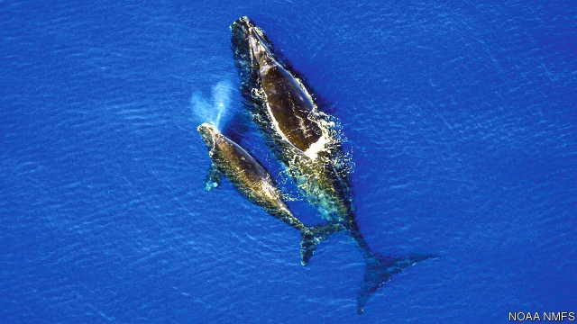
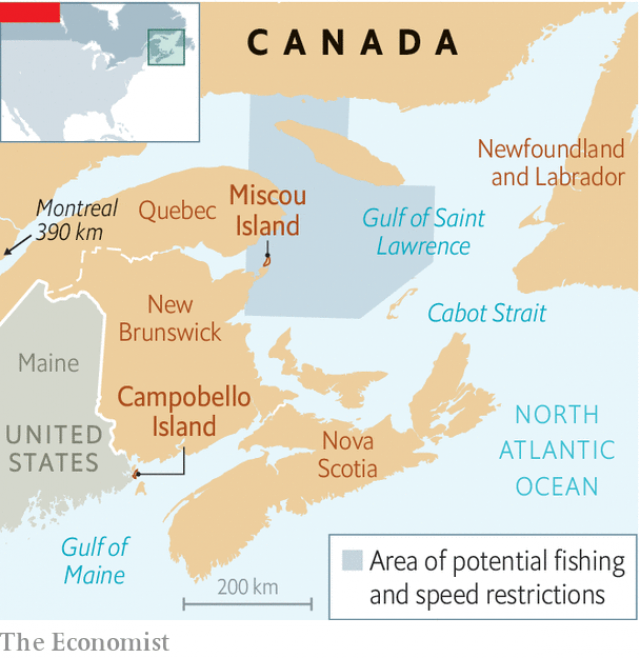

###### Right whales, wrong place

# To save whales, Canada sets a maritime speed limit 

 

> print-edition iconPrint edition | The Americas | Jul 20th 2019 

WHEN 12 NORTH ATLANTIC right whales died in the Gulf of St Lawrence in the spring and early summer of 2017, Canada imposed speed limits on large ships in the area and told snow-crab fishermen to move. In the following year the government worked with researchers, fishermen and the shipping industry to refine the restrictions. No whales died in the gulf in 2018. “We kept wondering if what we had done was good, or were we lucky?” says Moira Brown, a scientist at the Canadian Whale Institute, a research body. 

Apparently it was luck. Six right whales died in the gulf in June this year after colliding with ships or getting entangled in fishing lines. Three others were spotted near Miscou Island trailing ropes, which attach crab and lobster traps on the seabed to buoys (see map). Just 400 North Atlantic right whales, which can grow to 18 metres (60 feet) in length, remain alive. The steps Canada is taking to save them from extinction are expensive for industry. 

 

On July 8th Canada responded to the latest deaths by expanding the zone in which ships must observe a ten-knot speed limit, reducing to 13 metres from 20 the length of ships that must comply, increasing aerial surveillance of whales and extending the period during which a fishing area must close after a whale is sighted. The measures will reduce risk for whales but will not eliminate it, says Jonathan Wilkinson, Canada’s fisheries minister. 

The whales, which migrate annually north from the coast of Florida, have been “showing up in areas where we did not anticipate they would be”, says Mr Wilkinson. Because of climate change the Gulf of Maine, where the whales used to stay, is warming faster than almost all other ocean regions. That has pushed northward their favourite food, copepods, a kind of small crustacean. 

The Canadian waters into which the whales are now venturing hold some 400,000 fishing lines. That is in addition to the 600,000 the animals navigate already. An analysis of 30 years of data showed that every year a quarter of right whales, which can live to be 100, are wounded by fishing gear. There is “no place within the fished area along the east coast of North America for which entanglement risk is zero”, concluded a report in 2018 by the National Oceanic and Atmospheric Administration (NOAA), an American government agency. 

Some solutions cause problems. In 2015 the NOAA told American fishermen to put more traps on each fishing line to reduce the number of lines in the water. That required stronger rope, which made it harder for whales to free themselves. Some ships are thought to speed up before entering a speed-limit zone, raising the risk of killing a whale. In American waters, the speed limits near whale sightings are voluntary. 

The whale-protection measures have reduced fishermen’s catch. The speed limit on large boats can lengthen by eight hours the time it takes to get from Cabot strait to Montreal. Cruise ships have had to cancel stops. Owners of container ships may need to add more vessels to meet delivery schedules. Despite the extra costs, captains have mostly obeyed the rule. According to the Canadian transport department, only 111 of the 1,472 ships that sailed through restricted zones between April 28th and June 27th broke the speed limit. 

The government hopes that eventually new devices, like ropeless fishing gear, will save some whales. It is giving more money to organisations like Campobello Whale Rescue, a group of scientists, researchers and fishermen on Campobello Island in New Brunswick. They set forth in inflatable speedboats to free whales from fishing lines. It is dangerous work. In 2017 a whale struck one of its rescuers with its tail, killing him. On July 8th this year another team sped out from Campobello to free the whales off Miscou island. By July 15th they had disentangled two of them partially. The whales swam off trailing ropes.■ 
<<<<<<< HEAD

-- 

 单词注释:

1.maritime['mæritaim]:a. 海的, 海上的, 海事的, 沿海的, 海员的 [经] 海事的, 海上的, 海员的 

2.Jul[]:七月 

3.ST[]:[计] 段表, 状态, 系统测试, 直端连接器 [化] 磺胺噻唑 

4.lawrence['lɔrәns]:n. 劳伦斯（男子名） 

5.Moira['mɔirә]:n. 莫伊拉（女子名） 

6.apparently[ә'pærәntli]:adv. 表面上, 清楚地, 显然地 

7.collide[kә'laid]:vi. 碰撞, 互撞, 抵触 

8.entangle[in'tæŋgl]:vt. 使纠缠, 卷入, 使混乱 

9.crab[kræb]:n. 螃蟹, 偏航, 脾气乖戾的人, 沙果 vi. 捕蟹, 偏航, 发牢骚 vt. 使偏航, 抱怨, 破坏 

10.lobster['lɒbstә]:n. 龙虾 

11.seabed['si:bed]:n. 海底, 海床 

12.buoy[bɒi. 'bu:i]:n. 浮标, 航标, 救生圈 vt. 使浮起, 鼓励 

13.extinction[ik'stiŋkʃәn]:n. 消失, 消灭, 废止 [化] 消光; 熄灭 

14.comply[kәm'plai]:vi. 顺从, 依从 [法] 遵守, 承诺, 照做 

15.aerial['єәriәl]:a. 空中的, 航空的, 空气的, 空想的 n. 天线 

16.surveillance[sә:'veilәns]:n. 监视, 监督 [电] 侦测 

17.jonathan['dʒɔnәθәn]:n. 乔纳森（男子名） 

18.wilkinson['wilkinsn]:n. 威尔金森（姓氏） 

19.fishery['fiʃәri]:n. 渔业 [法] 捕鱼, 捕鱼权 

20.migrate['maigreit]:vi. 移动, 移往, 随季节而移居 [计] 迁移程序 

21.annually['ænjuәli]:adv. 一年一次, 每年 [经] 年度的, 每年的 

22.Florida['flɒridә]:n. 佛罗里达州 

23.Maine[mein]:n. 缅因州 

24.northward['nɒ:θwәd]:n. 北方, 北 a. 向北的 adv. 向北 

25.copepod['kәupәpɒd]:n. 桡足动物 

26.crustacean[krʌ'steiʃjәn]:a. 甲壳纲的 n. 甲壳纲动物 

27.navigate['nævigeit]:vi. 航行 vt. 航行于, 驾驶, 操纵, 使通过 

28.datum['deitәm]:n. 论据, 材料, 资料, 已知数 [医] 材料, 资料, 论据 

29.entanglement[in'tæŋglmәnt]:n. 纠缠, 卷入, 缠绕物 [化] 缠结 

30.oceanic[.әuʃi'ænik]:a. 海洋的, 产于海洋的, 在海洋中生活的, 广阔的 

31.Noaa['nәjә]:[经] 美国国家气象局 

32.sighting[saitiŋ]:n. 照准；瞄准；视线 

33.lengthen['leŋθәn]:vt. 加长, 使延长 vi. 变长 

34.cabot['kæbәt]:n. 卡伯特（意大利航海家, 北美大陆的发现者） 

35.montreal[,mɔntri'ɔ:l]:n. 蒙特利尔（加拿大东南部港市） 

36.cruise[kru:z]:n. 巡航, 巡弋, 漫游 v. 巡航, 巡弋, 漫游 

37.ropeless[]:[网络] 无光泽 

38.organisation[,ɔ: ^әnaizeiʃən; - ni'z-]:n. 组织, 团体, 体制, 编制 

39.Campobello[,kæmpəu'beləu]:坎波贝洛(加拿大东南部岛屿) 

40.Brunswick['brʌnzwik]:n. 不伦瑞克(德国城市) 

41.inflatable[in'fleitәbl]:a. 膨胀的, 得意的, 通货膨胀的 

42.speedboat['spi:dbәut]:n. 高速游艇 

43.rescuer['reskjuә]:n. 救助者 

44.disentangle[.disin'tængl]:vi. 解开纠结, 松开, 解决 vt. 解开, 松开 
=======
>>>>>>> 50f1fbac684ef65c788c2c3b1cb359dd2a904378

