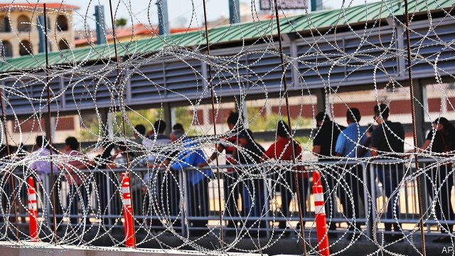
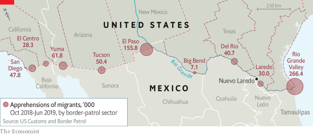

###### Border order

# Trump builds a bureaucratic wall to keep out migrants 

 

> print-edition iconPrint edition | The Americas | Jul 20th 2019 

AT A MIGRANT shelter in Nuevo Laredo, a city in the Mexican border state of Tamaulipas, the mood is cheerful. Children play among cinderblocks and piles of sand. Volunteers fry eggs in the kitchen. Residents tell their stories. “The salaries! It’s seven dollars a week in Cuba,” says Eldis, an engineer who left the island in May. A woman, her arms draped around her two daughters, one-ups him. “In Venezuela, it’s six dollars a month,” she replies. They are smiling because these hardships seem to lie behind them. But the mood darkens when the conversation turns to news from the United States, where they are heading.  

On July the Trump administration promulgated a rule that upends the United States’ system of dealing with asylum-seekers and could dash the hopes of those in Nuevo Laredo and thousands more. Under the new rules, no migrant can apply for asylum unless he or she has sought it in “at least one” other country along the way and been refused. 

The rules affect anyone who is not Mexican and arrives at the American border by land. That describes a lot of America-bound migrants. Of the 688,000 apprehended at the border between October 2018 and June this year, only 18% were Mexican. Most of the rest came from Central America and countries elsewhere in Latin America. Now they must appeal for asylum to Mexico or somewhere farther south.  

The order is President Donald Trump’s latest attempt to keep immigrants out of the country but in the headlines. It followed the last-minute cancellation of a visit to the White House by Guatemala’s president, Jimmy Morales. He had been expected to conclude a “safe-third-country agreement”, which would have allowed the United States to deny asylum to anyone who had passed through Guatemala from other countries. The deal fell apart, perhaps because Guatemala’s constitutional court seemed likely to block it. 

 

Even before the new rule took effect, the migrants in Nuevo Laredo were subject to an earlier decision by Mr Trump to require asylum-seekers to remain in Mexico while American courts process their claims. In June Mexico’s government agreed to extend that all along its border, and to step up policing of its borders, after Mr Trump threatened to impose tariffs on Mexican exports if it failed to stop the migrant flow. 

“Metering” will make the migrants’ wait longer. That is a revival of an American policy, used during the Obama administration, to limit the number of asylum claims the border authorities will consider each day. This year apprehensions at the border have been soaring, which suggests that the bureaucratic wall has had little effect. That may be starting to change. In June the number of apprehensions dropped 29% from May. Hot weather usually reduces the number but the decline was bigger than expected. Even so, 95,000 people were nabbed. 

Under international and American law, people are entitled to asylum if they face persecution in their home countries because of their race, religion, nationality, membership of a social group or political opinion. In recent years, governments and judges have expanded their understanding of what constitutes persecution. A growing number of migrants have tried to use those rights to gain admission to the United States. The share asking for asylum after being apprehended without the right documents has risen from 5% to 40% over the past decade. Many do not qualify even under an elastic definition of persecution. Central Americans are more likely to be fleeing poverty. Relatives in the United States are a big draw. 

A “large majority” of asylum claims at the border are rejected, says the Justice Department. Officials say that “meritless” claims worsen overcrowding in American detention centres and lengthen delays. Even genuine refugees should not be able to “shop” for asylum in their preferred country, they grumble. 

The Trump administration’s response has been to narrow its interpretation of what asylum means and, at the same time, to transfer to other countries responsibility for caring for asylum-seekers and judging their cases. It has tightened the standards under which victims of gang violence or domestic abuse can claim they are suffering from “persecution”. 

Mr Trump’s latest order makes migrants’ situation more uncertain than ever. The recent deal with Mexico now seems “obsolete”, says Andrew Selee of the Migration Policy Institute, a think-tank in Washington, DC. Instead of waiting in Mexico for a ruling from American authorities, migrants are now expected to stay in a country that cannot provide security to its own citizens. Those still determined to reach the United States may have to pay large sums to people-trafficking gangs and risk their lives in the desert. 

Migrants’ hopes of a less perilous passage depend on whether American courts overturn the new policies. They have already struck down a rule that denied the right to claim asylum to people who cross the border without authorisation. The “remain in Mexico” policy faces a challenge. Mr Trump’s latest order is illegal because the United States has no safe-third-country agreements with any of the Latin American countries to which it might send asylum-seekers, contends Lee Gelernt of the American Civil Liberties Union, which has filed a lawsuit against the new rule. 

Tamaulipas, a hub for drug-trafficking, is among Mexico’s least safe states. Newspaper offices have memorials to murdered journalists. Truckloads of armed men prowl the roads at night. But more migrants go through Tamaulipas than any other state. Miami-bound Cubans and Venezuelans often choose it as the shortest route without taking account of the dangers. America sends a third of deported Mexican migrants to Nuevo Laredo. Those waiting in shelters are reluctant to venture outside. One risk is that drug gangs will try to press them into service. Their favourite recruits are said to be Cubans, who typically have military training (as conscripts in the Cuban army). 

Eldis, the 46-year-old from central Cuba, has waited eight weeks in Tamaulipas to apply for asylum in the United States but is now unsure what to do. He expects that Mr Trump will reverse his decision, at least as it applies to Cubans, when he realises that it could cost him votes in Florida, a swing state. If not, he will ring the Canadian embassy, he says. Chances are, he will get a friendlier refusal. ■ 

