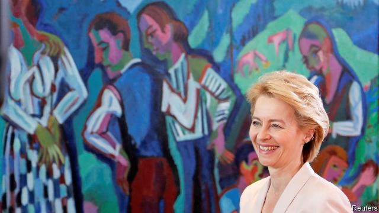

###### The next 50 years in space

# Politics this week 

 

> Jul 20th 2019 

Ursula von der Leyen, until recently Germany’s defence minister, was approved by the European Parliament as the next president of the European Commission, the EU’s executive arm. She secured 383 votes, nine more than the required absolute majority, suggesting that she will take office with her authority already brittle. Her first, and very tricky, task is to assign jobs to the commissioners of each country. See article. 

France’s environment minister, François de Rugy, resigned. The French press had lashed out at him for spending large amounts of taxpayers’ money on lavish dinners, including fine wine and lobsters, which he says he does not like (“champagne gives me a headache”). He denies any wrongdoing. 

There were 1,187 drug-related deaths in Scotland last year according to official figures. That is a rate of just over 218 people per million, higher than in the United States, which is in the grip of an opioid epidemic. Scotland’s drug problem has escalated quickly; over the past five years the number of drug-related deaths has more than doubled. See article. 

Turkey took delivery of the first of its S-400 anti-aircraft missiles from Russia. The purchase has caused a huge row with NATO. America has ended Turkey’s role in making F-35 fighter planes, for fear that its secrets will be stolen by Turkey’s Russian partners. 

A Turkish diplomat was killed in a gun attack in Erbil, the capital of Iraqi Kurdistan. Turkey recently stepped up its offensive in the Hakurk region of northern Iraq against Kurdish fighters, who have waged war with Turkish forces for decades. 

The soldiers running Sudan signed a power-sharing deal with the opposition, whose protests led to the fall of President Omar al-Bashir, a tyrant, in April. The accord lacks many details, but the two sides have agreed on a path to elections after three years, and the composition of a sovereign council of civilians and military types. 

The World Health Organisation formally declared the Ebola epidemic in the Democratic Republic of Congo to be a global health emergency. More than 1,670 people have died in the latest outbreak. See article. 

Police arrested Alejandro Toledo, a former president of Peru, in California. Peru has requested his extradition to face charges that during his presidency from 2001 to 2006 he took $20m in bribes from Odebrecht, a Brazilian construction company. He denies wrongdoing. 

A judge in New York sentenced Joaquín Guzmán, also known as El Chapo (or Shorty), to life in prison plus 30 years. The former head of Mexico’s Sinaloa drug gang, who has twice escaped from Mexican prisons, was convicted in February on ten charges, including trafficking cocaine and heroin and conspiracy to murder. 

Donald Trump ordered that asylum-seekers who have passed through another country en route to America (ie, most of them) must prove that they have applied for asylum in that country first—and been rejected—before they can claim sanctuary in the United States. Civil-rights groups sued to overturn the order. See article. 

Tsai Ing-wen, Taiwan’s president, upset China by dawdling in America while on her way to and from the Caribbean. She was scheduled to spend four days on American soil—somewhat longer than is necessary to change planes. Her meetings with American politicians infuriated the People’s Republic, which insists that no one should treat Taiwan like a country. America also announced a $2bn arms sale to Taiwan. Meanwhile, the Kuomintang, Taiwan’s main opposition party, chose as its candidate for presidential elections next year Han Kuo-yu, a mayor, rather than Terry Gou, the founder of Foxconn, the world’s biggest contract manufacturer of mobile phones. 

America barred four Burmese generals from entering the country, saying that they were involved in Myanmar’s “gross violations of human rights”. The Burmese army helped lead a pogrom that sent 700,000 members of the Rohingya minority fleeing into neighbouring Bangladesh in 2017. 

Ambassadors from 37 countries signed a letter praising China’s “contribution to the international human-rights cause”, including in its restive western region of Xinjiang, where China has locked up perhaps 1m people, mostly Muslim Uighurs, in “vocational training” camps. The signatories were all from authoritarian regimes with dodgy human-rights records. An earlier letter condemning the camps was signed by 22 democracies. 

Unrest continued in Hong Kong over a law that would allow criminal suspects to be sent for trial in mainland China. The bill has been shelved, but protesters want it formally withdrawn. 

Donald Trump told four non-white Democratic congresswomen, two of them Muslim, to “go back” to where they came from and fix their “own” corrupt governments before criticising America. Three of the women were born in the United States; the other is an American citizen. A resolution to impeach Mr Trump over his words attracted 95 votes, losing heavily. It was the first time such a motion against Mr Trump had come to a vote. A Republican senator called the women “a bunch of communists”. See article. 

Thousands of protesters demanded the resignation of Puerto Rico’s governor, Ricardo Rosselló. Some threw bottles and fireworks at police, who responded with tear gas and rubber bullets. Mr Rosselló is in trouble after 900 pages of chat-group messages were leaked, in which he apparently referred to a female politician as a “whore” and suggested that the US federal board that oversees Puerto Rico’s awful finances should commit a sex act with itself. 

Alex Acosta resigned as America’s labour secretary. As a prosecutor in 2008, Mr Acosta had struck a plea deal with Jeffrey Epstein, a financier accused of having sex with under-age girls. 

