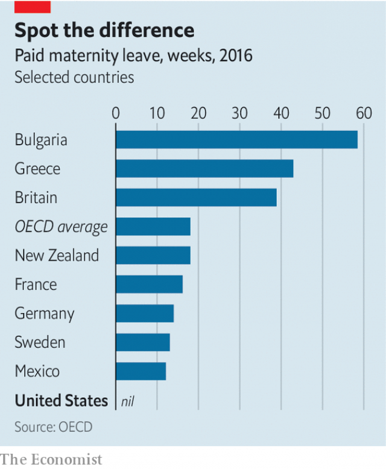

###### Looking after baby

# America is the only rich country without a law on paid leave for new parents 

 

> print-edition iconPrint edition | United States | Jul 20th 2019 

THE PRESIDENT’S Commission on the Status of Women was unequivocal in its recommendation: “Paid maternity leave or comparable insurance benefits should be provided for women workers.” That conclusion was reached in 1963, when John Kennedy was president, but America still has no federal policy in place to guarantee working mothers or fathers paid time off to care for their new babies. It is one of only two countries in the world, along with Papua New Guinea, that have no statutory national policy of paid maternity leave. The average member of the OECD, a club of mostly rich countries, offers new mothers 18 weeks of paid leave. 

For decades paid leave was “dismissed as anti-business and marginalised as a woman’s issue,” says Ellen Bravo, who runs Family Values at Work, an NGO. That is changing. The 2016 race was the first time both presidential candidates publicly lent support to paid parental leave and the issue is likely to feature in 2020. The president’s most recent budget included a proposal for six weeks of paid parental leave, but provided no details on funding. Several bills have been introduced in Congress, including one co-sponsored by Kirsten Gillibrand, a Democratic senator who is running for president, which would provide paid leave for new parents and caregivers for sick family members, and another co-sponsored by Marco Rubio, a Republican senator, which focuses exclusively on new parents. Neither bill has passed, but a national policy will pass both the House and Senate in the next three to five years, Ms Bravo predicts. 

In the meantime, states are taking action. Connecticut and Oregon recently became the seventh and eighth states to guarantee paid family leave, and a handful of others, including Colorado, Minnesota, and Vermont, are expected to take up the issue next year. California recently extended its maximum paid family leave benefits from six to eight weeks, and its governor, Gavin Newsom, has floated the idea of extending parental leave to six months to promote parental bonding with new children and to help families save on child-care costs. “It’s the next gay marriage,” says Jason Sabo of Frontera Strategy, a lobbying firm in Texas, who predicts that paid leave will quickly evolve from being perceived as a fringe issue to gaining mainstream support and broader acceptance by society. 

There are several reasons why paid leave is attracting more interest from lawmakers. First, it is a popular issue with people of all political persuasions, especially younger voters and women, who think new parents should certainly have time off to bond with their babies. Conservatives concerned about the health of families have fastened on to it. Men who want to be more involved in their children’s lives have pushed employers to offer paternity leave. 

 

Second, it has become more apparent that existing policies do not reach enough American workers. The Family Medical Leave Act (FMLA) of 1993, signed into law by Bill Clinton, provides unpaid leave for a limited set of tasks, including caring for a new baby. However only 60% of private-sector workers are eligible for the FMLA because of strict requirements about firm size and hours previously worked. Nearly half struggle to afford taking unpaid time off even if they qualify for it. 

Whereas small businesses are generally loth to offer paid leave, larger companies have started to do so voluntarily, especially large ones that can afford to foot the bill, such as Deloitte, Nike, Lowe’s, Walmart, and many of Silicon Valley’s technology firms. But only 16% of private-sector employees nationally have access to paid family leave through their firms, and that access is unequal. It is available to only 6% of people working in the lowest quartile of paid jobs, compared with 25% of those in the highest quartile. 

Third, there is mounting evidence from states that have already extended their own paid-leave policies that the policies do not place a big burden on companies and governments relative to their benefits. Research from California, which was the first state to pass a paid family-leave policy, in 2002, shows that most firms found the impact either neutral or positive. Allowing employees to take paid time off increases the chances that they will stay, which is especially valuable in such a competitive job market. Offering paid leave also reduces the likelihood of workers going into debt and drawing on public assistance. 

There is also greater understanding of the health benefits of paid leave for babies and parents. Fewer babies are admitted to hospital, and both breast-feeding and vaccination rates increase. Mothers who take some time off are also less likely to suffer from depression. 

But while there is growing support for offering paid leave, strong disagreements persist, even among advocates of a federal policy. One concerns whether to extend leave beyond new parents to those who need to care for a sick loved one. Parental leave accounts for only about 20% of the 20m absences taken each year under the FMLA. Caring for a close family member or attending to one’s own poor health account for 73% of cases. All states that have passed paid-leave laws have adopted a wider definition of the family than the FMLA does and some states, such as Oregon, go especially far in extending leave not just to family members but to close friends and other chosen family, says Vicki Shabo of New America, a progressive think-tank. 

Republicans such as Mr Rubio back paid parental leave more strongly than paid leave more broadly defined. “The key concern folks have is that it’s much harder to verify. People worry there’s more scope for cheating the system,” explains Maya Rossin-Slater of Stanford University, though she doubts that there is much cheating in states with paid leave. 

The biggest obstacle, though, is working out how to fund paid leave. The states that have embraced their own policies have funded them through payroll taxes on employees, employers or some split between the two, with rates ranging from less than 0.1% of worker wages in New Jersey up to 1.1% in Rhode Island. The rates are small enough to have avoided a backlash from employers and workers, says Ms Shabo of New America. The bill that Ms Gillibrand has introduced in the Senate, called the Family and Medical Insurance Leave Act, would also be funded by a new payroll tax, with employers and employees each contributing 0.2% of wages. Voters, who are broadly keen on paid leave, may be less so if it comes at a high cost to them. Around three-quarters of Americans support a federal paid-leave programme when costs are not mentioned, but around 52% say they would oppose it if it cost them $450 a year in higher taxes, according to a survey for the Cato Institute, a libertarian think-tank. 

Another way to finance paid leave, endorsed by Mr Rubio, would be for new parents to withdraw money from Social Security early and to delay retirement, but that is controversial. This route would disproportionately hurt women, who take leave more often and would thus be forced to work longer before retirement. It would also drain the Social Security benefits of low-wage-earners, who most need retirement benefits later on. 

This puts advocates for a national paid-leave policy in a bind. Is it better to accept an imperfect solution that guarantees progress on paid leave, or hold out in the hope of a more comprehensive, inclusive and generous policy later on? Advocates would be wise to keep momentum going. With a strong economy and bipartisan interest, the moment is right for action. Better 56 years late than never.■ 
<<<<<<< HEAD

-- 

 单词注释:

1.Jul[]:七月 

2.statu[]:[网络] 状态查看；雕像；特级雪花白 

3.unequivocal[.ʌni'kwivәkl]:a. 不含糊的, 不模棱两可的, 明确的 [法] 不含混的, 明白的, 直率的 

4.maternity[mә'tә:niti]:n. 母性, 怀孕, 妇产科医院 a. 产妇的 

5.john[dʒɔn]:n. 盥洗室, 厕所, 嫖客 

6.kennedy['kenidi]:n. 肯尼迪（姓氏, 美国第35任总统） 

7.Papua['pæpjuә]:n. 巴布亚岛 

8.guinea['gini]:n. 几内亚 

9.statutory['stætjutәri]:a. 法令的, 法定的, 可依法惩处的 [经] 法定的 

10.Oecd[]:[经] 已开发国家组织 

11.marginalise['mɑ:dʒɪnəlaɪz]:v. 使显得微不足道；使处于边缘；使无实权 

12.ellen['elin]:n. 埃伦（女子名） 

13.bravo['brɑ:vәu]:n. 亡命徒, 喝彩 interj. 好啊 vt. 喝彩 

14.ngo[]:abbr. 民间组织；非政府组织（Non-Governmental Organization） 

15.presidential[.prezi'denʃәl]:a. 总统制的, 总统的, 首长的, 统辖的 [法] 总统的, 议长的, 总经理的 

16.parental[pә'rentәl]:a. 父母亲的, 做双亲的, 作为渊源的 [医] 父母的, 双亲的 

17.Kirsten['k\\:stәn]:n. 柯尔斯顿(f.) 

18.gillibrand[]: [人名] 吉利布兰德 

19.senator['senәtә]:n. 参议员, (某些大学的)理事 [法] 参议员, 上议员 

20.caregiver[ˈkeəgɪvə(r)]:n. 照料者, 护理者 

21.marco[]:n. 马尔科（人名）；显示地图；展现地图 

22.rubio[]: [地名] [玻利维亚、古巴、美国、墨西哥、委内瑞拉、西班牙] 鲁维奥 

23.Connecticut[kә'netikәt]:n. 康涅狄格 

24.Oregon['ɒ:rigɒn]:n. 俄勒冈 

25.Colorado[,kɔlә'rɑ:dәu]:n. 科罗拉多, 科罗拉多河 

26.Minnesota[.mini'sәutә]:n. 明尼苏达州 

27.Vermont[vә:'mɔnt]:n. 佛蒙特 

28.California[.kæli'fɒ:njә]:n. 加利福尼亚 

29.gavin[]:n. 加文（男子名） 

30.newsom[]: [人名] [英格兰人姓氏] 纽瑟姆 Newsome的变体 

31.jason[]:n. 詹森（男子名） 

32.sabo[]:abbr. sabotage 破坏，故意损毁 

33.frontera[]: [地名] [玻利维亚、墨西哥、西班牙] 弗龙特拉 

34.lobby['lɒbi]:n. 大厅, 休息室, 游说议员者 vi. 游说议员, 游说 vt. 游说 

35.Texas['teksәs]:n. 德克萨斯 

36.quickly['kwikli]:adv. 很快地 

37.fringe[frindʒ]:n. 边缘, 端, 流苏, 穗, 初步 vt. 加穗于, 加饰边于 a. 边缘的, 附加的 

38.mainstream['meinstri:m]:n. 主流 

39.lawmaker[lɒ:'meikә]:n. 立法者 

40.persuasion[pә'sweiʒәn]:n. 说服, 信念, 派别, 说服力 

41.voter['vәutә]:n. 选民, 投票人 [法] 选民, 选举人, 投票人 

42.paternity[pә'tә:niti]:n. 父亲身份, 父系血统, 创始人(身份), 来源, 出处 [医] 父权, 亲权; 父系 

43.fmla[]:abbr. Family Medical Leave Act 家庭与医疗假期法案 

44.clinton['klintәn]:n. 克林顿（男子名） 

45.unpaid[.ʌn'peid]:a. 未付款的, 不支薪水的 [经] 未付的, 未缴纳的 

46.eligible['elidʒәbl]:a. 有资格当选的, 合格的 n. 有资格者, 合格者, 适任者 

47.loth[lәuθ]:a. 不愿意的, 厌恶的 

48.voluntarily[.vɒlәn'terili]:adv. 自愿地, 以自由意志 

49.Deloitte[]:n. 德勤（四大会计师事务所之一） 

50.Nike['naiki:]:n. 胜利女神, 奈克导弹 

51.walmart['wɔlma:t]: 沃尔玛（世界连锁零售企业） 

52.silicon['silikәn]:n. 硅 [化] 硅Si 

53.nationally['næʃәnәli]:adv. 作为整个民族, 举国一致地, 全国性地 

54.unequal[.ʌn'i:kwәl]:a. 不相等的, 不规则的, 不能胜任的 [经] 不平均的, 不等的 

55.quartile['kwɒ:tail]:n. 四分位数 [医] 四分值, 四分线 

56.vaccination[.væksi'neiʃәn]:n. 接种疫苗, 种痘 [医] 接种; 种痘 

57.les[lei]:abbr. 发射脱离系统（Launch Escape System） 

58.parental[pә'rentәl]:a. 父母亲的, 做双亲的, 作为渊源的 [医] 父母的, 双亲的 

59.Vicki[]:n. 维姬；薇琪（女子名） 

60.Shabo[]:[网络] 北京 

61.broadly['brɒ:dli]:adv. 宽广地, 明白地, 无礼貌地 

62.Maya['mɑ:jә]:n. 马雅人, 马雅语 a. 马雅人的, 马雅语的 

63.stanford['stænfәd]:n. 斯坦福（姓氏, 男子名）；斯坦福大学（美国一所大学） 

64.payroll['peirәul]:n. 工资名单, 饷金名单, 发放的工资总额 [计] 工资表, 工资单 

65.jersey['dʒә:zi]:n. 运动衫 

66.rhode[]:n. 罗德岛 

67.backlash['bæklæʃ]:n. 后冲, 强烈反对 [电] 反撞, 逆栅流 

68.Cato['keitәu]:加图(①姓氏 ②Marcus Porcius, 前234-前149, 罗马政治家, 将军, 称为“老加图” ③Marcus Porcius, 前95-前46, 罗马斯多噶派 哲学家, 政治家, 老加图的曾孙, 称为“小加图”) 

69.libertarian[.libә'tєәriәn]:n. 自由意志主义支持者, 行动自由者 a. 自由意志主义支持者的, 主张个人思想的 

70.endorse[in'dɒ:s]:vt. 支持, 赞同, 背书于, 签署 [经] 赞成, 背书 

71.retirement[ri'taiәmәnt]:n. 退休, 隐居, 撤退 [经] 退休, 退股, (固定资产)报废 

72.disproportionately[]:adv. 不匀称, 不相称 

73.imperfect[im'pә:fikt]:a. 不完美的, 不完整的, 减弱的, 未完成过去时的 n. 未完成体 

74.inclusive[in'klu:siv]:a. 包含的, 包括的 

75.momentum[mәu'mentәm]:n. 动力, 动量 [化] 动量 

76.bipartisan[bai,pɑ:ti'zæn]:a. 两党连立的 
=======
>>>>>>> 50f1fbac684ef65c788c2c3b1cb359dd2a904378

