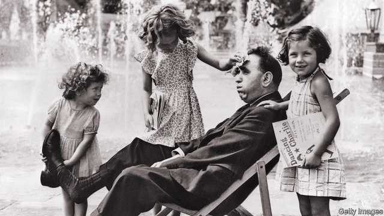

###### The Daddy trap

# Fathers face higher penalties for taking parental leave than mothers do 

 

> print-edition iconPrint edition | United States | Jul 20th 2019 

AN OVERWHELMING number of studies show that working mothers face a motherhood penalty—resulting in lower earnings and poorer evaluations from superiors—while men receive a fatherhood bonus. Stories abound of women struggling to balance motherhood and a career, while stories of men failing to balance children and a career are largely absent. A new study helps to explain why. According to research by Kate Weisshaar of the University of North Carolina at Chapel Hill, opting out of work to care for children has negative consequences for both parents, but it is considerably worse for fathers who choose to stay at home in competitive job markets. 

To analyse this effect Ms Weisshaar distributed thousands of fictitious cover letters and CVs to real job postings in 50 American cities for five different types of job. These fictional jobseekers were all parents with similar credentials. They differed only in their work history and in their gender. While some said they had jobs in the cover letter, others said they were unemployed as a result of lay-offs. The third group declared that they had been stay-at-home parents. 

The study found that parents who had opted out of work to care for children were least likely to receive a call back for an interview. Whereas 15% of employed parents and 9-10% of unemployed fathers and mothers received interviews, only 5% of parents who had taken time out of the workforce to care for children were called back. The depressed responses were not simply a result of unemployment. Parents who opted out of work were about half as likely to get an interview as parents who were unemployed because of lay-offs. 

According to Ms Weisshaar’s study, Americans see opting out to care for children as a sign of lower commitment to work and even flakiness. Employers are least likely to hire fathers who are caring for children when the job market is competitive. In less competitive markets, 7% of these fictitious stay-at-home dads got interviews. In more competitive ones, fathers received only one-third as many callbacks. By comparison, 5% of mothers received callbacks, and the rate was not affected by how competitive the market was. 

Whereas mothers who take time off to rear offspring face difficulties when returning to work, opt-out fathers may fare worse, says Scott Behson, author of a book called “The Working Dad’s Survival Guide: How to Succeed at Work and at Home”. America has a workaholic culture, he says. Mothers who put their families first eschew that culture, resulting in costs to their careers. But fathers who do so are violating both the workaholic culture and traditional gender norms. 

According to the Pew Research Centre, women are the sole or primary breadwinners in 40% of American households, and 15% of mothers with children younger than 18 earn more than their husbands. In heterosexual unions, families often decide that a father should stay at home because he has been laid off from work or the mother has a higher-earning career, says Brad Harrington of the Boston College Centre for Work and Family. In 2016, 6% of fathers were stay-at-home. That number is likely to grow as women achieve higher levels of education than men, and American jobs shift away from male-dominated professions to female-dominated ones. Unless norms about who should be responsible for what change, the opt-out penalty will become a bigger problem as more fathers make the choice to stay at home. ■ 
<<<<<<< HEAD

-- 

 单词注释:

1.daddy['dædi]:n. 爸爸 

2.penalty['penәlti]:n. 处罚, 刑罚, 罚款, 罚球, 报应, 不利结果, 妨碍 [经] 罚金(款), 违约金 

3.parental[pә'rentәl]:a. 父母亲的, 做双亲的, 作为渊源的 [医] 父母的, 双亲的 

4.Jul[]:七月 

5.overwhelm[.әuvә'hwelm]:vt. 淹没, 受打击, 制服, 压倒, 使不知所措 [法] 打翻, 倾覆, 覆盖 

6.motherhood['mʌðәhud]:n. 母道, 母性, 母亲们 

7.earning['ә:niŋ]:n. 收入（earn的现在分词） 

8.evaluation[i.vælju'eiʃәn]:n. 评估, 估价, 求值 [计] 鉴定; 评价; 求值 

9.fatherhood['fɑ:ðәhud]:n. 父亲的身分, 父性, 父权, 父道 

10.abound[ә'baund]:vi. 大量存在, 富于, 充满 

11.kate[keit]:n. 凯特（女子名, 等于Catherine） 

12.Carolina[.kærә'lainә]:n. 北(或南)卡罗来纳州 

13.chapel['tʃæpәl]:n. 小教堂, 礼拜式 

14.opt[ɒpt]:vi. 选择 

15.considerably[kәn'sidәrәbli]:adv. 非常地, 很, 颇 

16.fictitious[fik'tiʃәs]:a. 假想的, 编造的, 虚伪的 [法] 假定的, 假设的, 虚构的 

17.cv[]:abbr. 简历（Curriculum Vitae） 

18.posting['pәustiŋ]:[计] 记入, 记录, 稿件, 邮件 [经] 过帐, 誊入总帐 

19.fictional['fikʃәnl]:a. 虚构的, 编造的, 小说式的 [法] 拟制的, 假定的, 虚构的 

20.jobseeker['dʒɔb,si:kә(r)]:n. 求职者 

21.credential[kri'denʃәl]:n. 国书, 凭据, 证明书 [经] 凭证, 证书 

22.gender['dʒendә]:n. 性 vt. 产生 

23.unemployed[.ʌnim'plɒid]:a. 失业的, 未被利用的 [经] 没有被雇用的, 失业的, 没有被利用的 

24.flakiness['fleɪkɪnəs]:n. 成薄片, 片状 

25.les[lei]:abbr. 发射脱离系统（Launch Escape System） 

26.callback['kɒ:lbæk]:n. 收回 

27.offspring['ɒ:fspriŋ]:n. 子孙, 后代, 产物 [法] 后辈, 子孙, 后裔 

28.scott[skɔt]:n. 斯科特（男子名） 

29.workaholic[.wә:kә'hɒlik]:n. 工作迷, 醉心于工作的人 [法] 为免遭辞退而工作过份卖力的人 

30.eschew[is'tʃu:]:vt. 避开, 远避 

31.norm[nɒ:m]:n. 基准, 模范, 标准, 准则, 平均数 [化] 定额 

32.pew[pju:]:n. 教堂长椅, 会众, 座位 vt. 为(教堂)安装座位, 把...围在一起 

33.breadwinner['bred.winә]:n. 负担家计的人 

34.heterosexual[.hetәrә'sekʃuәl]:a. 异性的, 异性爱的 n. 异性恋的人 

35.brad[bræd]:n. 角钉, 曲头钉 

36.Harrington[]:n. 哈林顿（姓；人名） n. 哈灵顿（澳大利亚等国家的地名） 

37.Boston['bɒstәn]:n. 波士顿 
=======
>>>>>>> 50f1fbac684ef65c788c2c3b1cb359dd2a904378

