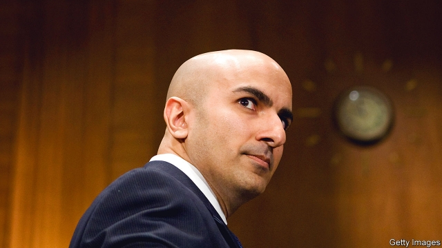

###### Storytime with the Fed

# Low inflation means the Federal Reserve is changing whom it listens to 

 

> print-edition iconPrint edition | United States | Jul 20th 2019 

HEAVEN HELP anyone who complains of a labour shortage to Neel Kashkari, president of the Federal Reserve Bank of Minneapolis. “We just don’t have enough people to build,” said the head of an affordable housing organisation in Aberdeen, South Dakota, on July 11th. A local wind-turbine maker grumbled about his struggles to expand his headcount. Mr Kashkari showed little sympathy: “If you pay more they will come,” he says. 

Mr Kashkari has been sceptical of such pleading for years, convinced that the labour market could be hotter. His doubts appear to have spread. When testifying to Congress on July 10th Jerome Powell, the Fed’s chairman, said that “while we hear lots of reports of companies having a hard time finding qualified labour, nonetheless we don’t see wages really responding.” 

It may seem strange that anecdotes would matter to monetary policymakers, given the swathes of statistics at their disposal. But the Fed devotes a non-trivial amount of energy to gathering them. Eight times a year they are compiled in a publication known as the Beige Book, based on interviews with business folk and “community contacts” across America. 

Since 1983 the Beige Book has been released two weeks before each meeting of the Federal Open Market Committee (FOMC). The gap, according to the Minneapolis Fed, was supposed to send the message that the information was not timely, and therefore “did not have a major influence on policy.” Still, financial analysts pour over every new edition. Anecdotes from the Beige Book pepper the minutes of each FOMC meeting. And although weathered economists will say that data and models determine policy, the stories are supposed to serve as reality checks. 

For years the Beige Book has revealed that workers are neither as abundant, nor as cheap, as employers would like. When complaints of shortages started popping up in it in 2011, they were laughable. (The unemployment rate was then above 8%.) But they became more plausible as unemployment fell. And when theory and data pointed to fears that a burst of inflation was round the corner, gripes from business owners reinforced the view that a rise in interest rates would be necessary to get in front of it. 

“Those anecdotes did matter,” says Tim Duy of the University of Oregon, adding that “they matter less now.” This is because the inflation that was supposed to arrive in 2018 never did. As unemployment sank below 4%, wage growth remained in line with the sum of inflation and productivity growth. That has raised doubts about whether the labour market is as hot as people thought. On July 10th Mr Powell quipped that “to call something hot, you need to see some heat.” 

Signs of coolness have been around for years, in the data and in the Beige Book. In September 2017 contacts in New England reported that they were adapting to the “tight-supply landscape” by expanding online, building stronger relationships with job-market candidates, and “active community engagement”. In October 2018 some businesses reported “non-wage strategies” to recruit and retain workers, such as flexible work schedules and longer holiday time. If employers were really so desperate for workers, Mr Kashkari has argued, they should be bidding up their price. 

The voices found in the Beige Book are skewed towards businesses, who will tend to prefer an abundance of workers and resent the hassle of having to train up less-qualified recruits. The lack of excessive wage pressure and muted inflation have allowed a new set of stories to become more prominent. As part of recent “listening sessions”, union leaders and local development organisations have shared their tales about how the hot economy is forcing employers to pull in some of America’s most marginalised workers. In a speech on July 16th Mr Powell said he had heard “loud and clear” about the benefits of the long recovery for low- and moderate-income Americans. Previously the most prominent stories supported interest-rate increases. The newer ones highlight the risks of killing off the expansion. 

If inflation were rising above the Fed’s 2% target, its leadership would be picking different tales to emphasise. And if, as investors expect, the Fed cuts interest rates at its next meeting on July 30th and 31st, Mr Powell will probably cite uncertainties about trade and global growth, as well as a downward drift in inflation expectations. (The latest Beige Book, published on July 17th, contains plenty to support him.) 

But if Mr Powell wants some more anecdotes, he could pick them up from the rest of Mr Kashkari’s trip. A breakfast to discuss substance abuse included complaints from participants that, despite a local unemployment rate of merely 2.7%, employers were still being far too sniffy about hiring ex-felons. “They can stack shelves,” said one reproachfully. Such stories might mislead and they can easily be cherry-picked. But at the moment these anecdotes seem to be carrying more weight than complaints from employers. ■ 

