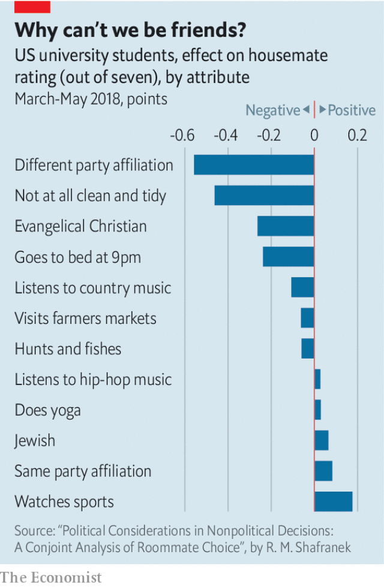

###### Strange bedfellows

# Trump supporters need not apply 

 

> print-edition iconPrint edition | United States | Jul 20th 2019 

FOR APARTMENT-HUNTERS in Santa Ana, California, a city about an hour south of Los Angeles, a $625-per-month sublet recently listed on Craigslist, a classified-advertising website, might seem ideal. The apartment, which is shared among four 20- and 30-somethings, is spacious, tidy and only minutes from a park. It comes with conditions, however: “No racists, no homophobes, no Trump supporters!” Discrimination of this sort is not uncommon on Craigslist, which is based in San Francisco. Toni, an artist seeking a flatmate in Ann Arbor, Michigan, advises potential applicants, “I won’t live with anyone bigoted, racist, sexist, or Trump supporting.” Another Craigslist-poster in Missoula, Montana warns, “Trump supporters need not apply”. 

One might assume that such political preferences would be held only among staunch partisans. But a new paper by Richard Shafranek, a political science PhD student at Northwestern University, suggests they are relatively common. In his study, published last month in the journal Political Behaviour, Mr Shafranek surveyed a group of students at a large midwestern university. He asked them to answer a series of demographic questions followed by questions about their politics, interests and personal habits. Subjects in the study were then presented with two fictitious flatmates and asked to rate each on a scale of one to seven based on the same set of demographic and personal characteristics. This was repeated for ten hypothetical housemate pairs. 

 

The results were striking. Among the 40-odd attributes included in Mr Shafranek’s survey, partisan affiliation—specifically, whether a potential roommate was a member of another party—had the biggest effect, reducing ratings by 0.56 points (see chart). This was true even after controlling for traits normally associated with support for the two political parties. Other undesirable characteristics proved less influential. 

Subjects who described themselves as “not at all clean and tidy”, for example, were rated 0.46 points lower. Those who said they preferred going to bed early were downgraded 0.24 points. To ensure his results were robust, Mr Shafranek estimated how a match with a potential roommate on a given characteristic affected their rating. Using this approach party political affiliation once again came out on top. A match on cleanliness boosted scores by only half as much. Jewish sports fans who listen to hip-hop are the Platonic ideal of a flatmate. 

Does this study say anything broader about American politics? The temptation is to conclude that Americans like living with those who are politically like-minded. In fact it is more that they dislike living with those who think about politics differently. In an illustration of a phenomenon political scientists call “negative partisanship”—the tendency for voters to be defined more by their hatred of the other side than love for their own—the desire not to live with someone who votes for the other party is much greater than the desire to live with a fellow Democrat or Republican. Indeed, according to Mr Shafranek’s estimates, it is about seven times as large. ■ 

