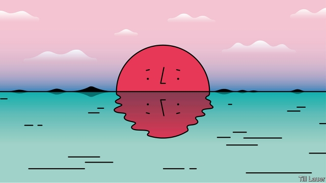

###### Banyan

# Ahead of the Tokyo Olympics, Japan ponders what it means to be Japanese 

 

> print-edition iconPrint edition | Asia | Jul 27th 2019 

THE EYES of the world will be upon Japan next summer when Tokyo hosts the Olympics. Of that, the country is acutely aware. Barely a week goes by without mention of the attention that the games will bring. This has been used to argue for everything from curbs on single-use plastic to changes in the way Japanese names are written in English. The country is not accustomed to being centre stage. Its response betrays its insecurities, not least because Japan is no longer the leader in technology it was when it last hosted the summer Olympics, in 1964. 

All countries ponder their identity but Japan does so more than many. An entire genre of literature, Nihonjinron—“theories about the Japanese”—is dedicated to the question of what defines the country and what it means to be Japanese. Both locals and foreigners have gamely tried to come up with answers. 

Historically, Japan’s identity is particularly fraught thanks to a poisonous strain of thought about the uniqueness and superiority of the Japanese race. Traditionalists once saw the Japanese as a chosen people (some still do). By their account, the emperor is descended directly from the sun goddess (even if the post-war order stripped him of his divinity). This idea fed Japan’s colonisation of parts of Asia and inspired its troops in the second world war. 

Its defeat in that war, and America’s subsequent occupation and castration of Japan militarily, destroyed the power of that identity—and the country’s self-esteem. In its place Japan sought, and found, a new narrative: since 1945, goes the tale, the collective effort of its people has transformed the country into a developed nation with a powerful economy that is—crucially—pacifist. 

That idea was shaken in the early 1990s when its economic bubble burst and it lost two decades to sluggish growth. Japan sought comfort in a new version of the post-war narrative: its ability to overcome adversity and rebound, epitomised by its resilience after the Fukushima disaster of 2011. Today Japan sees its ability to bounce back after crises as central to what it means to be Japanese, argues David Leheny of Waseda University in Tokyo. 

But the contradictions within Japan’s sense of identity compound its insecurity. It wants both to stand out and to fit in. It strives to be a nation that is advanced and respected globally, but not feared. It is influenced by Asia and America in equal measure. Japan commands respect from other rich nations, but is an uneasy member of their clubs. Unlike Germany, it has never fully reckoned with its wartime past. 

That Japan is rapidly becoming less socially homogenous threatens its understanding of itself, too. The model of the salaryman who enjoys a job for life has broken down. Families, the building block of society, come in many more forms. Foreigners now live and work in Japan in record numbers. Such changes are exposing how overblown the claims of the homogeneity and togetherness of the Japanese were in the first place, reckons Akiko Hashimoto, a sociologist at the University of Pittsburgh. 

This strikes fear into some. The response of diehard revisionists, including a few close to the prime minister, Shinzo Abe, is to look backwards. They talk of making Japan great again, inspired by a glorious, if often fictionalised, past. Some are pushing to change the constitution, written by the United States in 1947, in particular to make Japan a normal military power. Others focus on putting a divine emperor and the Shinto religion back at the heart of Japan’s identity, even if that was largely devised in the Meiji restoration of 1868, reinventing tradition for the purposes of the creation of a modern constitutional state. 

Since that moment Japan has in fact been remarkably adept at changing. It took on Western forms of economic, military and governmental organisation in order to fight off Western imperialism. After Japan’s defeat in the second world war, its transformation from a country in ruins to the world’s third-largest economy, from warmaker to peaceable nation—it has not fired a single bullet in anger since the end of the second world war—is extraordinary. 

The dichotomies of its identity today make it intriguing, as evidenced by the ever-rising numbers of foreign visitors. Other countries dream of having Japan’s problems. Its worries about demographic change, an economy that no longer fizzes and a relatively less visible role in the world are nothing compared with its earlier challenges. Japan remains impressive in its own right. 

