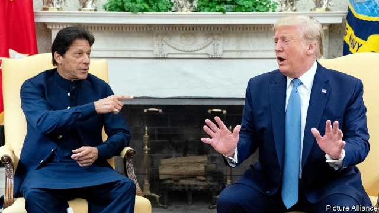

###### Pakistan and America

# America swaps its stick for a carrot in its dealings with Pakistan 

 

> print-edition iconPrint edition | Asia | Jul 27th 2019 

IF A WEEK is a long time in politics, eight months is a lifetime. Last November Donald Trump blasted Pakistan, accusing it of duplicity and dishonesty. America’s faithless ally in the war on terror received billions in aid while not doing “a damn thing” in return, he snapped, in justification of his decision to cut military aid. Imran Khan, Pakistan’s own hot-tempered populist prime minister, then newly elected, shot back that his country was tired of being the scapegoat for American failures in Afghanistan. Pakistan would no longer fight someone else’s war, said Mr Khan. 

Fast forward to this week: Mr Trump welcomed Mr Khan to the White House for their first talks face to face. American anger was replaced with soft soap. The president flattered the former cricketer, lauding him as an athlete and leader. Their future was bright, trade deals were on the cards and the flow of aid could be switched back on. 

During a joint press conference, Mr Trump boasted crudely that he could wipe Afghanistan, an American ally, off the face of the Earth. But as his host blustered, Mr Khan seemed to have little cause for concern. Mr Trump’s cavalier offer to mediate in the dispute between Pakistan and India over Kashmir was a boost for Mr Khan, even if, as seems certain, it leads to nothing. Pakistan has long wanted to internationalise the argument with its neighbour. India believes the two countries should sort out their 70-year row over the territory between themselves. Mr Trump’s offer provoked paroxysms in Delhi. But Pakistan’s former sins seemed to have been forgiven. 

Threats of Armageddon aside, Afghanistan explains the American president’s change of heart towards Pakistan. “I think Pakistan is going to help us out, to extricate ourselves,” he said, referring to America’s 18-year entanglement. Pakistan “is going to make a big difference,” he repeated. The administration hopes that Pakistan will use its influence over the Taliban to coax the militants into a face-saving political settlement that will allow American troops to come home. Talks led by Zalmay Khalilzad, Mr Trump’s point man on Afghanistan, have been moving slowly. The Taliban want to talk with the Americans about troop withdrawal, but are refusing to engage in formal negotiations with Afghan officials to determine how the country will then be governed. They met members of the Afghan government informally this month, but the impasse persists. 

Mr Khan said the right things in Washington to assure America of his country’s intentions. Pakistan had abandoned its policy of meddling in Afghanistan to give it “strategic depth” against India, he insisted. The army would not go behind the civilian government’s back to conduct its own policy. He would sit down with the Taliban and persuade them to talk to the Afghans. 

America and its allies have heard such promises before and been disappointed. Militants still operate from havens in Pakistan. Officials familiar with how talks are progressing say that Pakistan has yet to throw its full support behind them. Pakistan’s generals are hedging their bets; some think the Taliban may still triumph and so are reluctant to push them too hard. 

But the determination in Washington for success in the negotiations is intense. Mike Pompeo, the secretary of state, has said he wants a deal by September 1st. To make that happen, America seems willing to overcome its former disappointment with Pakistan and try a new approach.■ 

