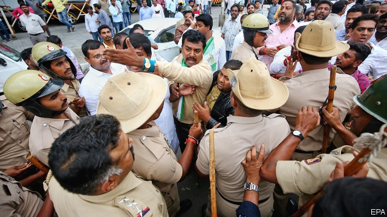

###### Indian politics

# India’s ruling party keeps on winning seats, even after the elections 

 

> print-edition iconPrint edition | Asia | Jul 27th 2019 

IN THE END, the vote of no-confidence on July 23rd that brought down the government of Karnataka state came as an act of mercy. Despite three postponements and countless impassioned speeches, only 99 of the assembly’s 225 members supported the chief minister, H.D. Kumaraswamy. This month 16 members of his coalition government jumped ship, soon after Narendra Modi’s crushing victory in national elections. They “defected”, in Indian political argot, by resigning—ditching their comrades in the Congress party and Mr Kumaraswamy’s provincial party, in favour of Mr Modi’s Bharatiya Janata Party (BJP). The party’s national dominance has not lessened its determination to seize further power at the state level. 

The defecting lawmakers of Karnataka were spirited to a heavily guarded hotel in Maharashtra, a neighbouring state governed by the BJP. When D.K. Shivakumar, a member of the Congress party who supported Mr Kumaraswamy’s government, went there to try to stare down his former comrades he was blocked—by state police—and left to sulk outside in the monsoon drizzle. Back in Bangalore, the capital of Karnataka, the government’s death was protracted and dramatic. Its people were buying time to lure back the defectors before a floor vote. Politicians donned pyjamas for an all-night slumber party in the legislature. They traded accusations of black magic and eventually imposed a citywide ban on liquor sales, as if that might calm things down. As the government crumbled, Mr Shivakumar mused: “My friends who backstabbed me will backstab the BJP too. What is the point of all this? We are all going to die anyway.” 

Traditionally Indian voters punish incumbents. But the BJP’s vote share in this year’s general election was 37%, up from 31% in 2014. Success nationally begets success at state level. Karnataka, among a handful of states that have escaped the party’s grip, is one example. Similar shows are playing around the country, with elected politicians switching sides to stand beside Mr Modi. 

In the bellwether state of Uttar Pradesh, ostensible socialists have joined their BJP foes. In Mr Modi’s home state of Gujarat, an important caste leader abandoned Congress for the BJP fold. In Goa, a small state with a large Christian minority, Congress won the most seats in state-assembly elections in 2017 and one of Goa’s two seats in the general election this April. But on July 10th two-thirds of state legislators decided nonetheless to join the BJP. Upper-house parliamentarians in Andhra Pradesh filed lawsuits to leave their regional party in order to side with the BJP. 

These suits were necessary because India has an anti-defection law which bars legislators from simply swapping parties. It is intended to prevent rich parties from buying the support of poorer ones but it is dismally ineffective. Most Indians assume that powerful parties will use bribery and extortion to lure defectors. With its unfathomably deep pockets and control of national enforcement agencies, Mr Modi’s BJP is an attractive destination for ambitious lawmakers of many parties. When the prime minister boasted on the campaign trail in West Bengal that 40 of the opposition’s assemblymen were in touch with him, his opponents were outraged. He seemed to be flaunting his party’s illicit pulling power. 

The anti-defection legislation took a beating last week when the Supreme Court ruled that the renegades from Karnataka could not be compelled to stick to voting with their party. But even if the law worked as it is supposed to, barring defections would only force politicians to obey their party presidents. That would hardly be a magic fix for India’s democracy.■ 

