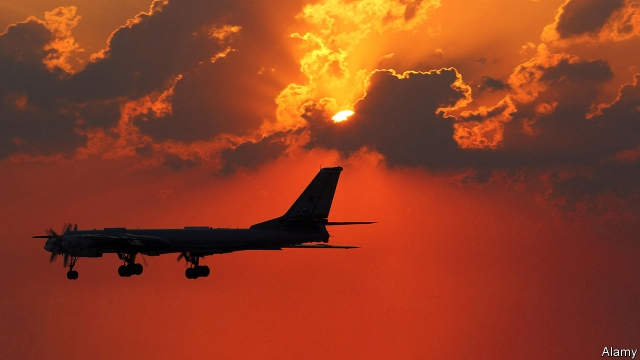
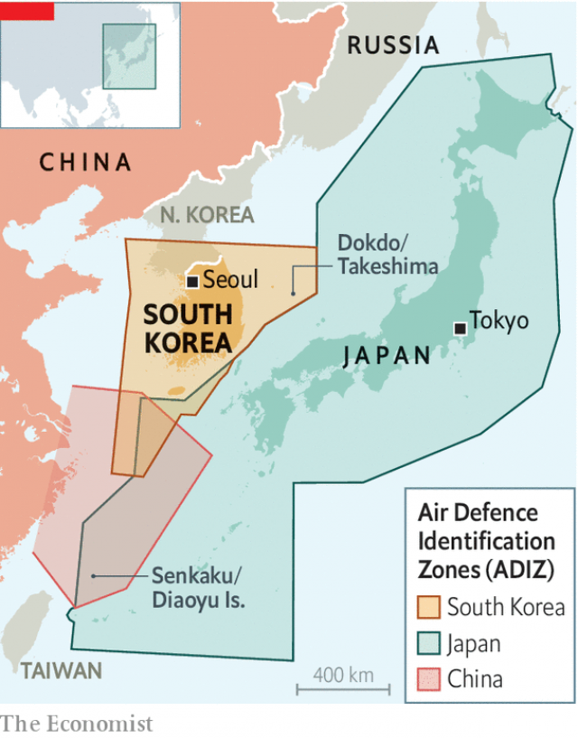

###### Warning shots

# South Korea and Russia face off in the skies 

 

> print-edition iconPrint edition | Asia | Jul 25th 2019 

ONE HOPE behind the visit by John Bolton, President Donald Trump’s national security adviser, to Seoul this week was that it might help patch up a row between South Korea and another close American ally, Japan. The rift, with its roots in colonial history and wartime animosity, has brought trade sanctions from Japan. It is also jeopardising military co-operation and the renewal next month of an intelligence-sharing agreement—especially important in face of the threat from North Korea, which on July 25th was reported to have made its latest missile test. As Mr Bolton arrived two days earlier, his arguments for the importance of the agreement had already been bolstered by a vivid demonstration of the fragility of regional peace. South Korea’s fighter jets had fired 360 warning shots at a Russian military aircraft that it said had intruded into its airspace. 

The details are disputed. South Korea said that Russian and Chinese planes had penetrated its self-declared Korean Air Defence Identification Zone (KADIZ), an area around its borders where it requires foreign planes to notify it of entry. A Russian spy plane then twice intruded into South Korean airspace, prompting the air force to scramble jets. Russia denied the incursion, and that shots had been fired. But it accused South Korea of “hooliganism in the air” for harassing its aircraft. The next day South Korea reported that Russia had changed tack, expressing “deep regret” and blaming the incident on a technical glitch. 

Russia soon denied having issued any apology. But whatever the origin of the confrontation, it highlights three reasons for America to worry about north-east Asia. The first is growing military co-operation between China and Russia, which appear to have been conducting a joint patrol around South Korea. A second is the patchwork of unsettled territorial disputes. The alleged incursion took place over the waters around islands known as Dokdo by South Korea, which controls them, and Takeshima by Japan, which also claims them. Japan also scrambled jets and has protested to both Russia (for violating its airspace) and South Korea (for firing in it). To the south, Japan and China contest the Senkaku or Diaoyu islands. The disputes werefurther complicated when China in 2013 announced its own ADIZ, over these islands. South Korea then expanded the KADIZ. The three countries’ zones overlap. 

 

The third worry is of an accident or misunderstanding. For two countries that have long been at peace, Japan and South Korea keep their fighter pilots busy. In the 12 months that ended this March Japan scrambled its jets 999 times in response to aerial incursions—two-thirds of them by China over the Senkakus, the rest by Russia over yet more disputed islands to the north of Japan. South Korean pilots, too, frequently respond to Chinese forays into the KADIZ. With so much muscle-flexing in the skies, it is easy to imagine a disastrous miscalculation—especially if, as this week, shots are fired. 

America must hope the incident will remind South Korea and Japan that the security threat to each comes not from the other but from North Korea and an assertive China, further encouraged by its ever closer ties with Russia; and that in response South Korea and Japan should be shoulder to shoulder, not eyeball to eyeball. ■ 

