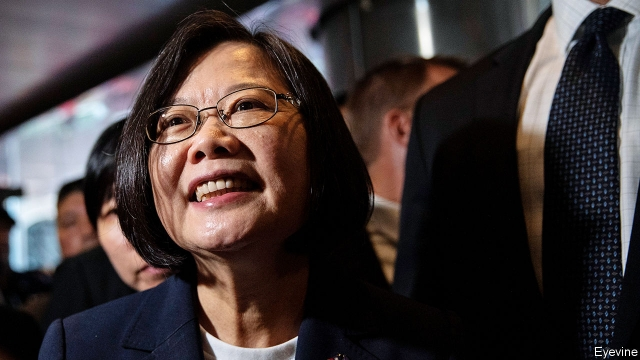

###### Taiwan’s president

# Tsai Ing-wen’s prospects for re-election have improved 

 

> print-edition iconPrint edition | Asia | Jul 27th 2019 

FOLLOWING A DISMAL winter you can’t count on a good summer, yet Tsai Ing-wen is making hay. Early in the year, Taiwan’s president had appeared mired in gloom. Ordinary Taiwanese were disillusioned with her stewardship of the economy. Her Democratic Progressive Party (DPP) had fared so badly in municipal elections that she felt compelled to step down as party leader. To compound it all, Xi Jinping, China’s ruler, had made it clear that China, which claims Taiwan as its own and which has ostracised Ms Tsai and her independence-leaning party, was in no mind to make life easier for her or for Taiwan. 

What a difference a few months make. First, Ms Tsai emerged surprisingly strongly from a primary contest in which she beat off William Lai Ching-te, the former mayor of Tainan, who challenged her to be the DPP candidate to contest the next presidential election. The primary, curiously, is decided by taking opinion polls of voters. Some experts suspect Ms Tsai’s camp of massaging the outcome. But there is no doubt that Ms Tsai’s firm support for pro-democracy protests currently roiling Hong Kong (see article) boosted her standing at home. She has since welcomed several dozen Hong Kong protesters who reportedly intend to seek political asylum in Taiwan. By contrast, the protests have thrown the opposition Kuomintang (KMT), which is conciliatory towards China, off balance. 

With a fair wind at her back, Ms Tsai breezed off to America on July 11th. Her two-day stay in New York, complete with a ferry ride near the Statue of Liberty, was intended to ooze normality, but visits by presidents of Taiwan are unusual and heavily circumscribed. The country has no formal diplomatic relations with America, along with the many other nations that acknowledge the “one-China principle” insisted upon in Beijing. Officially, Ms Tsai was en route to a handful of diplomatic allies in the Caribbean. But her stay was one of the longest that America has granted to a leader of the robustly democratic island. 

China thundered in vain that America should cancel her visit, during which she met members of Congress and delivered a speech at Columbia University in defence of liberal, democratic values. “Taiwan is not, and will not be, intimidated,” she said at a reception in New York with representatives of Taiwan’s 17 remaining diplomatic allies. Her Caribbean visit was book-ended by a further two days in Colorado. 

It all signals an unusual degree of approval by champions of democracy in Congress and by China hawks in Donald Trump’s administration. They have seen tensions with China rise over trade and cyber-security. Taiwan, too, faces increasing military and diplomatic pressure over Ms Tsai’s refusal to accept that her island is part of the Chinese motherland. A Chinese defence white paper this week repeated China’s threat of the use of force to prevent Taiwan’s independence. Yet Ms Tsai has been at pains not wantonly to rile China, unhinge relations across the Taiwan Strait and so risk dragging America into a dangerous conflict. 

Marks of strengthening relations with Taiwan have mostly been small yet symbolic. On a previous transit in Houston, Ms Tsai visited NASA, becoming the first Taiwanese leader to set foot in an American federal agency since 1979, when America broke off diplomatic relations in favour of China. In May Mr Trump’s national security adviser, John Bolton, met his Taiwanese counterpart, David Lee, another first. 

Senior members of Ms Tsai’s government joke that having no formal relations with America is an advantage, since Mr Trump, who sometimes seems to prefer autocracies to democracies and who seeks an elusive trade deal with China, is less likely to notice the thickening of ties. The president has signed off on a more tangible measure of assistance for Taiwan: approval for a long-planned sale of arms, worth $2.2bn, that includes tanks and Stinger anti-aircraft missiles. The sale of more than 60 F-16 fighter jets looks likely soon, too. 

China claims to be outraged by the recent sales and has threatened to impose sanctions on the American companies involved. Yet they are all of a piece with long-standing bipartisan support for Taiwan’s defence. On July 24th a US warship made what America called a routine transit of the Taiwan Strait. In truth, much American-supplied equipment is old and vulnerable to China’s new precision-guided weapons. But the sales remain a powerful signal of America’s backing. 

They also do no harm to Ms Tsai’s standing at home—the F-16s had been requested as far back as 2006. Campaigning for Taiwan’s presidential and legislative elections next January is heating up. On July 15th, in a similar primary process to the DPP’s, the KMT named Han Kuo-yu, mayor of the city of Kaohsiung, as its presidential candidate. Voters thus face a stark choice. Mr Han, whose family hails from the mainland, is a voluble proponent of appeasing China. He says binding Taiwan more closely to China’s vast markets will bring prosperity. But it may also imperil Taiwan’s autonomy. 

In contrast to the mousy Ms Tsai, Mr Han is a natural orator with a common touch. He drives crowds of older, working-class and rural followers wild. With 45% support in the primary, he blew past the runner-up, Terry Gou, a billionaire maker of iPhones, with 28%. 

Mr Han calls Taiwanese independence “more scary” than syphilis. He refers to Taiwan as a region (that is, of China) rather than the country it is. Yet the Hong Kong protests have forced Mr Han to tack away from China. The Communist Party wants its formula of supposed autonomy for Hong Kong—“one country, two systems”—to apply one day to Taiwan. “Over my dead body”, Mr Han had to declare. 

While Ms Tsai may be seen as the better defender of Taiwanese sovereignty, her chances of re-election may be further boosted if Ko Wen-je, the pro-China mayor of Taipei, runs as an independent presidential candidate. Mr Gou has not ruled out doing the same. This would split the opposition vote. In a poll published on June 22nd, TVBS, a KMT-leaning network, found Ms Tsai ahead with support of 37%, compared with 29% for Mr Han and 20% for Mr Ko. For now Ms Tsai’s sun is shining. ■ 
<<<<<<< HEAD

-- 

 单词注释:

1.tsai[]:n. 蔡（姓氏） 

2.Jul[]:七月 

3.dismal['dizmәl]:a. 阴沉的, 凄凉的, 令人忧郁的 n. 低落的情绪, 沼泽 

4.mire[maiә]:n. 泥沼, 泥泞 vt. 使陷于泥泞, 使陷入困境 vi. 掉进泥坑 

5.gloom[glu:m]:n. 忧郁, 暗处, 幽暗 vi. 变忧沉, 变黑暗 vt. 使忧郁, 使黑暗 

6.taiwanese[,taiwɑ:'ni:z, -'ni:s]:a. 台湾人的；台湾的 

7.disillusion[.disi'lu:ʒәn]:n. 觉醒, 幻灭 vt. 使醒悟, 使幻想破灭 

8.stewardship['stju:wәdʃip]:n. steward的职务, 管理工作 

9.DPP[]:[计] 数字并行处理机 [化] 微分脉冲极谱法 

10.municipal[mju:'nisipl]:a. 市政的, 自治区的, 内政的 [经] 市政的, 市的 

11.taiwan['tai'wɑ:n]:n. 台湾 

12.ostracise['ɔstrәsaiz]:vt. 流放, 与...绝交, 隔离, 孤立, 排斥 

13.william['wiljәm]:n. 威廉（男子名）；[常作W-][美俚]钞票, 纸币 

14.lai[lai]:abbr. 意大利航空公司（Linee Aeree Italiane） 

15.Tainan['tai'næn,-'nɑ:n]:台南[台湾省] 

16.presidential[.prezi'denʃәl]:a. 总统制的, 总统的, 首长的, 统辖的 [法] 总统的, 议长的, 总经理的 

17.curiously['kjuәriәsli]:adv. 好奇地 

18.voter['vәutә]:n. 选民, 投票人 [法] 选民, 选举人, 投票人 

19.massage['mæsɑ:ʒ]:n. 按摩, 揉 vt. 按摩, 揉 

20.currently['kʌrәntli]:adv. 现在, 当前, 一般, 普通 [计] 当前 

21.roil[rɒil]:vt. 搅浑, 使焦急 

22.hong[hɔŋ]:n. （中国、日本的）行, 商行 

23.kong[kɔŋ]:n. 含锡砾石下的无矿基岩；钢 

24.protester[]:n. 抗议者, 持异议者, 拒付者 [经] 反对者 

25.reportedly[ri'pɒ:tidli]:adv. 根据传说, 根据传闻, 据报道 

26.asylum[ә'sailәm]:n. 庇护, 收容所 [医] 养育院 

27.opposition[.ɒpә'ziʃәn]:n. 反对, 敌对, 相反, 在野党 [医] 对生, 对向, 反抗, 反对症 

28.kuomintang['kwәumin'tæŋ]:n. (中国)国民党 

29.kmt[]:abbr. 中国国民党（Kuo Min Tang） 

30.conciliatory[kәn'siliәtәri]:a. 安抚的, 和好的, 调和的 

31.york[jɔ:k]:n. 约克郡；约克王朝 

32.ooze[u:z]:n. 渗流, 分泌物 v. 渗出, 泄漏 

33.normality[nɒ:'mæliti]:n. 常态 [化] 规定浓度; 当量浓度 

34.circumscribe['sә:kәmskraib]:vt. 在...周围画线, 限制 

35.diplomatic[.diplә'mætik]:a. 外交的, 老练的 [法] 外交的, 外交上的, 文献上的 

36.officially[ә'fiʃәli]:adv. 作为公务员, 职务上, 官方地 

37.en[en]:n. 字母N, (铅字)半方 prep. 在...中, 作为 

38.ally['ælai. ә'lai]:n. 同盟者, 同盟国, 助手 vt. 使联盟, 使联合, 使有关系 vi. 结盟 

39.Caribbean[.kæri'bi:әn]:n. 加勒比海 a. 加勒比海的, 加勒比人的 

40.robustly[rəʊ'bʌstlɪ]:adv. 要用体力地, 粗鲁地 

41.Columbia[kә'lʌmbiә]:n. 哥伦比亚 

42.Colorado[,kɔlә'rɑ:dәu]:n. 科罗拉多, 科罗拉多河 

43.wantonly[]:adv. 嬉闹地；放纵地；繁茂地 

44.rile[rail]:vt. 搅浑, 惹怒, 使焦急 

45.unhinge[.ʌn'hindʒ]:vt. 取下...的绞链, 拉开, 搅乱, 使分开 

46.symbolic[sim'bɒlik]:a. 象征的, 符号的 [电] 符号化 

47.transit['trænsit]:n. 经过, 通行, 运输, 运输线, 转变 vt. 运送, 使通过, 经过 vi. 通过 

48.Houston['hju:stәn]:n. 休斯敦 

49.NASA['næsә]:国家航空和宇宙航行局(美国) [电] 国际航空和太空总署的同义字 

50.adviser[әd'vaizә]:n. 顾问, 劝告者, 指导教师 [法] 顾问, 劝告者 

51.john[dʒɔn]:n. 盥洗室, 厕所, 嫖客 

52.bolton['bәultәn]:a. 可用螺栓固定的 

53.counterpart['kauntәpɑ:t]:n. 副本, 复本, 配对物, 相应物 [经] 副本, 正副二份中之一 

54.david['deivid]:n. 大卫；戴维（男子名） 

55.lee[li:]:n. 背风处, 避风处, 下风处, 保护, 庇护 a. 避风的, 背风的, 下风的, 保护的 

56.autocracy[ɒ:'tɒkrәsi]:n. 独裁统治, 独裁统治的国家 [法] 独裁政治, 专制政治, 独裁政府 

57.elusive[i'lu:siv]:a. 难懂的, 易忘的, 难以捉摸的 

58.les[lei]:abbr. 发射脱离系统（Launch Escape System） 

59.thicken['θikәn]:vi. 变浓, 变厚, 变得模糊, 变为复杂 vt. 使变厚, 加强, 使模糊 

60.tangible['tændʒәbl]:n. 可触知的东西, 有形资产 a. 可触摸的, 有实体的, 非相像的, 有形的, 明确的 

61.stinger['stiŋә]:n. 刺激者, 讽刺者 

62.outrage['autreidʒ]:n. 暴行, 侮辱, 愤怒 vt. 凌辱, 虐待, 触犯 

63.sanction['sæŋkʃәn]:n. 核准, 制裁, 处罚, 约束力 vt. 制定制裁规则, 认可, 核准, 同意 

64.bipartisan[bai,pɑ:ti'zæn]:a. 两党连立的 

65.warship['wɒ:ʃip]:n. 军舰, 战船 

66.vulnerable['vʌlnәrәbl]:a. 易受伤害的, 有弱点的, 易受影响的, 脆弱的, 成局的 [医] 易损的 

67.legislative['ledʒislәtiv]:n. 立法机构 a. 立法的, 有立法权的 

68.han[hæn]:n. 汉朝；汉民族 

69.kaohsiung[]:n. 高雄 

70.stark[stɑ:k]:a. 僵硬的, 完全的, 刻板的, 明显的, 荒凉的, 结实的 adv. 突出地, 简直, 全然 

71.hail[heil]:n. 冰雹, 致敬, 欢呼, 招呼 vt. 向...欢呼, 致敬, 招呼, 使象下雹样落下 vi. 招呼, 下雹 interj. 万岁, 欢迎 

72.voluble['vɒljubl]:a. 流利的, 健谈的, 易旋转的, 缠绕的 

73.proponent[prә'pәunәnt]:n. 建议者, 支持者 [法] 提议者, 辩护者, 支持者 

74.appease[ә'pi:z]:vt. 抚慰, 缓解, 平息, 姑息 [法] 使和缓, 使满足, 姑息 

75.imperil[im'peril]:vt. 使处于危险, 危害 

76.autonomy[ɒ:'tɒnәmi]:n. 自治, 自治权 [医] 自主性 

77.mousy['mausi]:a. 象老鼠的, 多老鼠的, 胆小的 

78.orator['ɒ:rәtә]:n. 演说者, 演讲者, 雄辩家, 原告, 请愿人 [法] 请愿人, 原告, 雄辩者 

79.follower['fɒlәuә]:n. 从者, 属下, 追补者 [电] 随动机 

80.terry['teri]:n. 毛圈, 毛圈织物 

81.gou[]:abbr. gourde (Haitian currency) 古德（海地货币和硬币名） 

82.billionaire[.biljә'nєә]:n. 亿万富翁 

83.maker['meikә]:n. 制造者, 上帝 [经] 制造者, 出票人 

84.iphone[]:n. 苹果手机 

85.scary['skєәri]:a. 容易受惊的, 胆小的, 提心吊胆的 

86.syphilis['sifilis]:n. 梅毒 [医] 梅毒 

87.tack[tæk]:n. 平头钉, 大头钉, 粗缝针脚, 行动方针, 食物 vt. 以大头针钉住, 附加 

88.defender[di'fendә]:n. 防卫者, 防护者, 辩护者 [法] 辩护人, 保护人 

89.sovereignty['sɒvrәnti]:n. 主权, 独立国 [法] 主权, 主权国家, 统治权 

90.KO['kei'әu]:vt. 击倒, 打倒 n. 击倒, 打倒 

91.taipei['tai'pei, -'bei]:n. 台北 

92.TVBS[]:abbr. Television Broadcast Satellite 电视广播卫星 
=======
>>>>>>> 50f1fbac684ef65c788c2c3b1cb359dd2a904378

