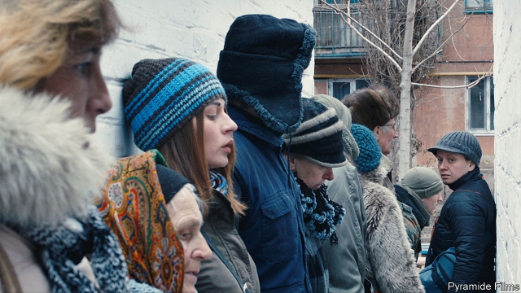

###### The director’s cut

# A bold Ukrainian film-maker charts the line between fiction and truth 

 

> print-edition iconPrint edition | Books and arts | Jul 27th 2019 

IN THE OPENING scene of “Donbass”, the latest feature film by Sergei Loznitsa, a hotch-potch group of extras gather in a makeup trailer. The shaky footage follows them as they are escorted to the site of a staged mortar attack in Russian-controlled territory in eastern Ukraine (see picture). There, for the benefit of a separatist news crew, they bemoan the depredations of the Ukrainian army. In the film, the explosion is a stunt, but the damage is genuine—much like the real-life conflict. 

With its vertiginous spiral of fakery, the invented but plausible scene captures the essence of Russia’s hybrid onslaught against Ukraine. After the revolution of 2013-14 Kremlin-controlled television stations spewed poisonous lies into the disaffected, Russian-speaking Donbass; next, militants and army units rolled in to “defend” the region from phantom Ukrainian fascists. Like a mirror, Mr Loznitsa’s film reflects and inverts that process, using fiction to expose the wounds inflicted by the annihilation of truth. Not surprisingly, “Donbass” has been banned in Russia. 

The boundary between reality and lies, fiction and history, is one of the world’s most contested borders. It runs squarely through the propaganda-warped badlands of eastern Ukraine—and through Mr Loznitsa’s powerful oeuvre. In both his feature films and documentaries, his aim is the opposite of the propagandists’: to present the essential truth of what happened, and—an even harder task—diligently to make clear what did not happen, too. 

Often his uncompromising films lack linear narratives, even protagonists. He is not interested in heroes, but in the crowd; in the audience on the square, not the politicians on the stage. In his documentaries, his impersonal camera does not probe inner lives but simply records: the space, the movements, the soundscape (snatches of pop and folk songs, anthems, tolling bells), the flow of time and ultimately of history. There is no voiceover or catharsis. Instead, Mr Loznitsa allows the absurdity and tragedy of life to speak for themselves. “He is not a hunter,” says Mikhail Iampolski, a critic and historian of Russian culture at New York University. “He is a trap, patiently waiting for whatever gets caught in it.” 

The camera, for Mr Loznitsa, is more than a piece of kit—it is a way of seeing. “When we look in front of us, there are things we don’t see,” but which can become visible afterwards, he says. The result may be “something that I could never have imagined, let alone invented”. He cites an aphorism of Alfred Hitchcock’s: “In feature films, the director is God. In documentaries, God is the director.” 

Now 52, Mr Loznitsa was born in Soviet Belarus and brought up in Ukraine. He learned his craft in Russia and now lives in Germany. Like many others, his life has been shaped by the fracturing of the Soviet Union and the Russian empire before it; his work chronicles the political—and moral—disintegrations that followed. His subjects have included the failed coup of 1991 that preceded the Soviet collapse (“The Event”, 2015) and Ukraine’s revolution (“Maidan”, 2014). Today’s world, he says, provides “no firm ground under your feet”. Just as fact and fiction have bled together, it can seem that “there is no good or bad.” 

This moral predicament is captured in a scene in “Donbass” in which thugs tie a Ukrainian soldier to a telegraph pole and entice the crowd to lynch him. “I wanted to show the mechanism for working people into a state of ecstasy,” Mr Loznitsa says. The scene reconstructs a real video posted on YouTube, and is more effective for the absence of a narratorial voice. He could never film such an event directly, Mr Loznitsa avers: not only would that “make you an accomplice”, the presence of a camera would “draw in the audience to participate”. Often he conveys a sense that he is telling one story among many. Elsewhere in “Donbass”, for example, a businessman whom the militia are extorting is transferred to a holding room—where he finds a legion of other detainees pleading for help on their phones. The sequence, like many in Mr Loznitsa’s films, seems at once hyperreal and mythic. 

The interplay between audience and spectacle, and the use of news footage to validate lies, are at the heart of “The Trial”, which he made just after “Donbass”. One is a feature, the other is shaped entirely from archive material, but in their preoccupations, the films are twins. “The Trial” reconstructs a tribunal that took place in Moscow in 1930. A group of Soviet engineers and economists were accused of forming the “Industrial Party”, which in collusion with France had supposedly plotted against the Bolshevik government. 

In reality, like the Ukrainian “fascists”, the Industrial Party never existed; the entire case was fabricated. The trial was held—or performed—not in a court but in the House of the Unions, a grand hall used for state ceremonies, illuminated for the cameras and complete with a 1,000-strong audience. “The Trial” intercuts passages from the resulting propaganda film with shots of crowds demanding the death of the culprits. In this instance, says Mr Loznitsa, “Stalin was the real director of the show. I merely helped make it into a film.” 

Strikingly, none of the accused—the main actors in the drama—protested or tried to clear their names; instead they helpfully implicated themselves in fantastical crimes. Some were rewarded for their convincing performances. Leonid Ramzin, a professor of engineering, was cast as a leader of the imaginary conspiracy, but his death sentence was commuted to ten years in prison. He was amnestied in 1936 and later showered with awards. Meanwhile, the prosecutor, Nikolai Krylenko, was himself arrested in 1937 during the Great Terror. He falsely confessed, too—and was executed soon afterwards. By then, the era of co-productions with Stalin’s prisoners was over. 

Russia and separatist Ukraine are not the Soviet Union, but justice is still suborned to theatre, and facts to interests. Mr Iampolski argues that in this nihilistic climate, “inscription”—the act of committing things to paper or the screen—becomes the main form of legitimacy. In this way propaganda, including Russia’s demonisation of Ukraine, makes falsehoods credible. Yet even (or especially) now, scrupulous film-makers can expose lies instead of spreading them, as Mr Loznitsa shows. 

At the end of “Donbass” the grumbling extras prepare for another stunt. A soldier enters the trailer and ruthlessly shoots them all dead. A TV crew soon arrives to report on this latest confected-but-real atrocity. Mr Loznitsa’s camera dispassionately surveys the scene from above. ■ 

